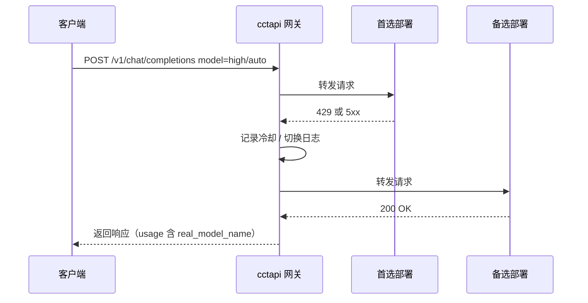
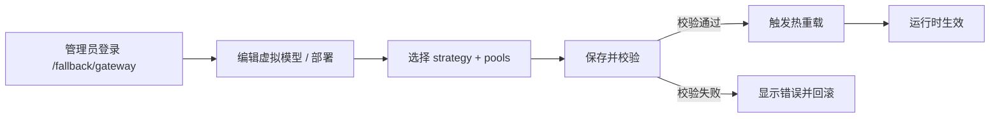
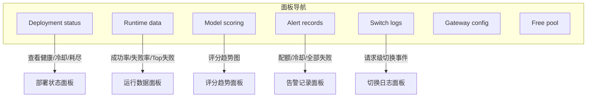
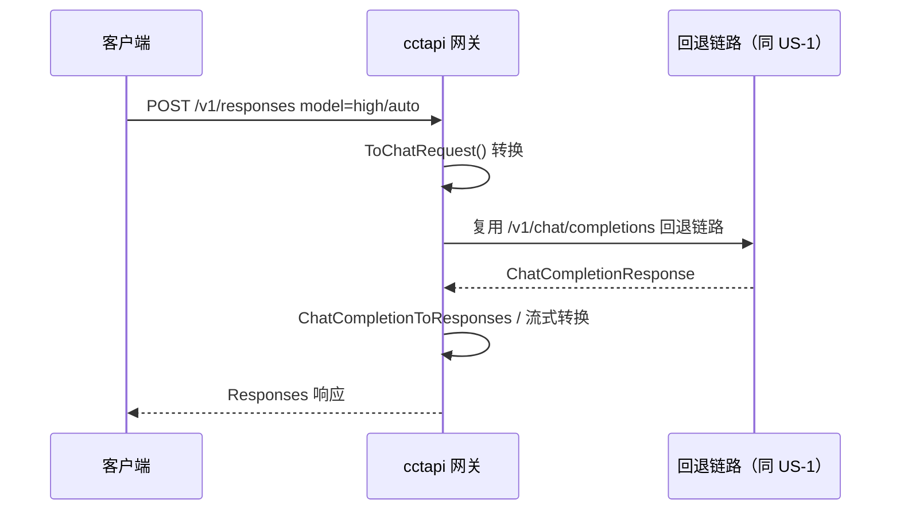
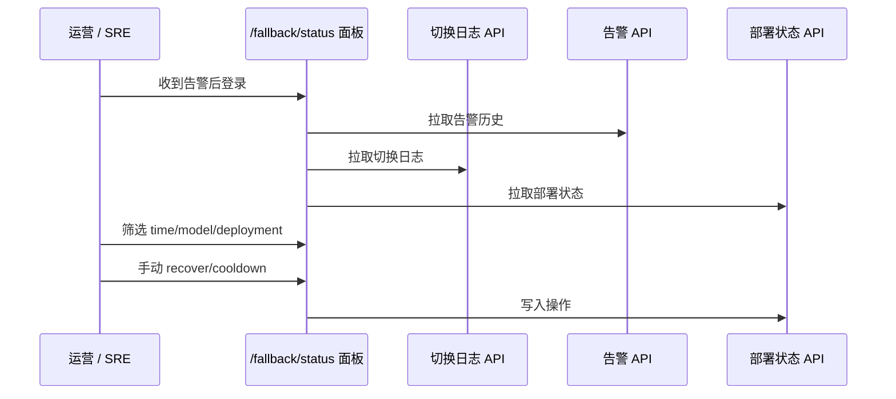
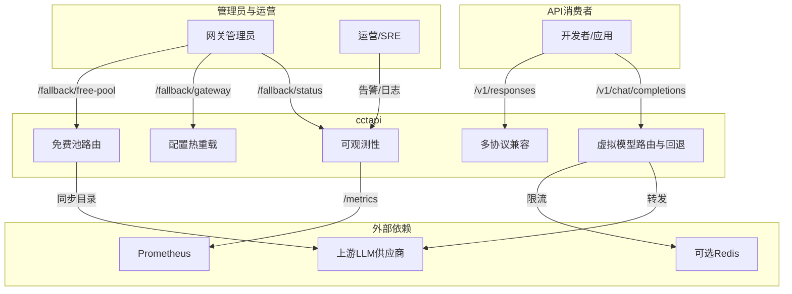
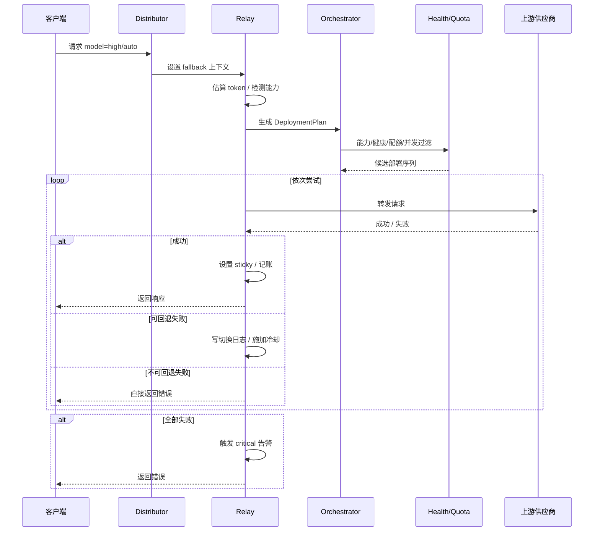

# AICoding 架构设计 · UserStory

> 本文档为《AICoding 架构设计》核心产物之一，定位为**产品需求与用户故事（UserStory）**文档。
> 上游输入：《高层架构设计》（G3 通过）中的需求概要、业务架构、产品模块、功能清单与产品原型；
> 下游输出：驱动《系统设计》《部署设计》《安全设计》的具体功能实现与验收依据。
> 系统：cctapi（One API CCT 分支 · 虚拟模型回退 LLM 网关）。
> 部署形态：单实例自托管（U-01 已裁决）。

---

## 1. 业务背景与价值

### 1.1 业务背景

- **行业 / 产品**：cctapi 是 `songquanpeng/one-api` 的 CCT 分支，定位为单实例自托管的虚拟模型回退 LLM 网关。它向上游 LLM 供应商（OpenRouter / Kilo / OVH / Pollinations 等）转发请求，并向下游 API 消费者暴露统一的 OpenAI 兼容端点。
- **用户规模**：当前为单实例自托管场景，面向个人开发者、小团队或企业内部网关管理员；下游客户端应用通过单一 API token 接入。
- **触发事件**：系统已在 `main` 分支完成生产验证，但缺乏一份面向产品与研发的完整需求与用户故事基线。本次需求由「为 cctapi 生成完整架构方案」驱动，目标是将现有运行系统固化为可指导下游系统、部署、安全与产品设计的边界基线。
- **产品矩阵位置**：本系统在个人 / 团队 LLM 接入矩阵中承担**统一网关与供应商抽象层**，与上游 LLM 供应商、下游客户端应用共同形成完整请求 - 回退 - 观测闭环。

### 1.2 行业方案

| 标杆系统 | 厂商 / 来源 | 与 cctapi 的对照关系 | 借鉴方式 |
| --- | --- | --- | --- |
| New-API | QuantumNous 社区 | one-api 生态私有化 AI API 网关，渠道级负载均衡与故障切换 | 机制对照，不引入代码（AGPL 约束） |
| LiteLLM | BerriAI | 100+ 供应商统一 OpenAI 代理，三层回退、`allowed_fails` + `cooldown_time` | 回退语义与冷却策略参考 |
| OpenRouter | OpenRouter Inc. | 统一 LLM 路由市场，双层 failover、免费层限速语义 | 上游约束事实与免费层配额参考 |
| Cloudflare AI Gateway | Cloudflare | 边缘 AI 治理网关，Spend Limits、缓存、Guardrails | 治理面与预算维度建模参考 |

### 1.3 方案收益与价值

| 项 | 说明 |
| --- | --- |
| 功能模块 | 虚拟模型路由与回退、免费池动态目录、多协议兼容（Chat / Responses / Anthropic Messages）、可观测面板、配置热重载 |
| 预期价值收益 | 降低多供应商接入与故障切换的运维人工成本；为 API 消费者提供高可用统一端点；关键回退与用量事件 100% 留痕 |
| 量化标准 | 虚拟模型请求端到端成功率 ≥ 99%（排除上游免费层限额）；免费层调用失败率 ≤ 5%；每新增供应商人工配置耗时从 30+ 分钟降至 ≤ 5 分钟；切换日志完整率 / 告警覆盖率 100% |

### 1.4 术语清单

> 统一文档中专有名词的中英文对照与含义。

| 术语 | 英文 | 含义 |
| --- | --- | --- |
| 虚拟模型 | Virtual Model | 一个用户可见的模型名（如 `high/auto`、`cct/free`），映射到多个真实部署及回退策略 |
| 部署 | Deployment | 虚拟模型下的一个真实上游实例，含 channel_id、real_model、权重、配额、并发等参数 |
| 策略 / 池 | Strategy / Pool | 路由策略（`quality_first` / `cost_first` / `free_first`）与部署池（`paid_high` / `cheap` / `local` / `free`） |
| 回退 | Fallback | 当前部署失败时按候选序列切换至下一个部署 |
| 冷却 | Cooldown | 某部署因错误被暂时或长期禁止参与路由 |
| 免费池 | Free Pool | 自动管理上游免费供应商的 channel 与 deployment 的动态目录 |
|  sticky | Sticky Routing | 同一上下文（或会话）复用最近成功的部署，减少回退抖动 |
| 四维限额 | RPM / RPD / TPM / TPD | 每分钟请求数、每日请求数、每分钟 Token 数、每日 Token 数 |

---

## 2. 范围与边界

### 2.1 系统内模块及功能

系统内覆盖以下一级功能：

- 虚拟模型路由与回退：模型拦截、部署计划、能力/健康过滤、策略排序、顺序回退、sticky 与 warm-up。
- 冷却与配额：错误分类冷却、配额预检（RPM / RPD / TPM / TPD）、并发槽。
- 免费池：注册表同步、动态目录、用量台账。
- 协议兼容：Chat Completions、Responses、Anthropic Messages。
- 可观测性：Prometheus 指标、`/fallback/status` 面板、切换日志、告警历史。
- 配置管理：热重载、`strategy + pools` 基线格式、legacy 兼容迁移。

### 2.2 系统外模块及功能

| 编号 | 不做的事 | 原因 | 后续计划 |
| --- | --- | --- | --- |
| O1 | 跨供应商美元预算治理 | 当前按部署 token 配额已覆盖单机场景；需先有成本数据模型 | 完整版演进 |
| O2 | 响应缓存 / 语义缓存 | 与免费池按量记账存在计费口径冲突；需先明确缓存命中语义 | 演进方向 |
| O3 | 多实例分布式状态 / leader 选举 / CAS | 用户已裁决单实例自托管；目录存储为单进程 SQLite 设计 | 演进附录 |

### 2.3 外部依赖

| 依赖系统 | 提供方 | 依赖能力 | 接入方式 | 接口人 |
| --- | --- | --- | --- | --- |
| OpenRouter / Kilo / OVH / Pollinations | 外部 LLM 供应商 | LLM 推理 | HTTPS / OpenAI 兼容 REST | 供应商官方文档 / 运营负责人 |
| Redis（可选） | 基础设施 | 分布式限流 | Redis + Lua 脚本 | 平台 / SRE |
| SQLite / MySQL / PostgreSQL | cctapi 既有 | 持久化 | SQL 驱动 | 后端团队 |
| Prometheus | cctapi 既有 | 可观测指标拉取 | HTTP `/metrics` | SRE |
| one-api 用户 / 令牌 / 渠道 | cctapi 既有 | 认证、权限、模型映射 | 函数调用 | 后端团队 |

---

## 3. 功能清单

> **定位**：全景骨架表，进入“角色 / 场景 / US”之前先看到完整功能版图。

### 3.1 功能清单结构

| 一级模块 | 二级模块 | 功能项 | 优先级（P0/P1/P2） | MVP 范围 | 完整版范围 | 备注 |
| --- | --- | --- | --- | --- | --- | --- |
| 虚拟模型路由 | 模型拦截 | 按虚拟模型名从 distributor 路由到 fallback | P0 | ✅ | ✅ | 核心入口 |
| 虚拟模型路由 | 部署计划 | 能力过滤、健康过滤、策略排序 | P0 | ✅ | ✅ | 含 preferred/sticky 提升 |
| 虚拟模型路由 | 顺序回退 | 按候选序列依次尝试，失败则切换 | P0 | ✅ | ✅ | 不可回退错误直接返回 |
| 冷却与配额 | 错误分类冷却 | 429 / 5xx / 401 / 403 / 配额类差异化冷却 | P0 | ✅ | ✅ | 含 exhausted / invalid 状态 |
| 冷却与配额 | 配额预检 | RPM / RPD / TPM / TPD 四维限额预检 | P0 | ✅ | ✅ | 0 表示跳过检查 |
| 免费池 | 注册表同步 | 18 个 provider 注册表，动态刷新 | P0 | ✅ | ✅ | 6h 模型 + 15m 额度 |
| 免费池 | 台账记录 | 免费 provider 用量原子 upsert | P0 | ✅ | ✅ | 按 provider / key_hash / model / period |
| 协议兼容 | Chat Completions | OpenAI 兼容 chat completions | P0 | ✅ | ✅ | 主链路 |
| 协议兼容 | Responses | Responses → Chat 转换 | P0 | ✅ | ✅ | 非流式 + 流式 |
| 协议兼容 | Anthropic Messages | Claude 兼容路径复用 Chat | P0 | ✅ | ✅ | 非流式 + 流式 |
| 可观测性 | Prometheus 指标 | `/metrics` 暴露请求 / 回退 / 用量指标 | P0 | ✅ | ✅ | 文本格式 |
| 可观测性 | 面板与日志 | `/fallback/status` 面板、切换日志、告警历史 | P0 | ✅ | ✅ | 含 7 个导航区 |
| 配置管理 | 热重载 | `POST /api/fallback/config/reload` | P0 | ✅ | ✅ | 不重启生效 |
| 配置管理 | strategy + pools 基线 | 统一配置格式，拒绝 legacy 写入 | P1 | ✅ | ✅ | 加载期兼容旧格式 |
| 预算治理 | 美元预算 | 跨供应商 / 团队预算 | P2 | ❌ | ✅ | 完整版演进 |
| 缓存 | 响应缓存 | 边缘 / 语义缓存 | P2 | ❌ | ✅ | 演进方向 |

> **MVP 范围**：F1 ~ F13（所有 P0 与 P1 功能）。
> **完整版范围**：+ F14 ~ F15（P2 功能）。

---

## 4. 角色与场景

### 4.1 角色清单

| 角色 | 业务身份 | 主要操作 | 核心关注点 |
| --- | --- | --- | --- |
| API 消费者（开发者 / 应用） | 调用 LLM API 的客户端 | 调用 `/v1/chat/completions`、`/v1/responses`、`/v1/messages` | 请求成功率高、延迟稳定、协议兼容 |
| 网关管理员 / 运维 | 系统所有者 / 运维负责人 | 配置虚拟模型、查看管理面板、处理告警、冷却/恢复部署 | 多供应商故障能否自动切换、是否可观测、配置不报错 |
| 运营 / SRE | 日常监控与应急响应 | 查看 Prometheus 指标、切换日志、告警 | 异常定位快、不误伤生产流量 |
| 上游 LLM 供应商（外部系统） | 真实模型提供方 | 接收转发请求 | 密钥合规使用、请求不被滥用 |
| 合规 / 审计 | 内部合规角色 | 审计日志、用量台账 | 回退原因与用量 100% 留痕 |

### 4.2 关键场景清单

| 编号 | 角色 | 触发条件 | 期望结果 | 频率（日均 / QPS） |
| --- | --- | --- | --- | --- |
| S1 | API 消费者 | 发起 Chat Completions 请求，携带虚拟模型名 | 成功返回响应；若首选部署失败则自动回退 | 高频（核心链路） |
| S2 | 网关管理员 | 新增/修改虚拟模型配置后需要生效 | 配置热重载成功，不重启服务 | 中频（变更日） |
| S3 | 网关管理员 | 查看 `/fallback/status` 面板 | 看到部署健康、冷却、评分、告警、日志 | 中频（每日） |
| S4 | 运营 / SRE | 收到配额耗尽或冷却告警 | 快速定位部署，手动恢复或调整配置 | 低频（异常时） |
| S5 | 网关管理员 | 维护免费池供应商（新增 key / 启用 provider） | 动态同步后新 deployment 可用 | 中频（每周） |
| S6 | API 消费者 | 发起 Responses 或 Anthropic Messages 请求 | 经协议转换后走同一回退链路并成功返回 | 中频（视客户端） |

---

## 5. 用户旅程（UserStory）

### 5.1 US-1：API 消费者通过 Chat Completions 调用虚拟模型

#### 5.1.1 业务场景

- **视角**：API 消费者（开发者 / 应用）。
- **描述**：开发者在应用中使用统一的 OpenAI 兼容端点，模型名填写虚拟模型（如 `high/auto` 或 `cct/free`）。当首选真实部署因上游限额、故障或网络问题失败时，系统应在不暴露故障细节的前提下自动回退到下一个可用部署，保证请求成功率。

#### 5.1.2 业务流程

- **Given** 开发者已持有有效 API token，并知道虚拟模型名。
- **When** 开发者向 `POST /v1/chat/completions` 发送请求，请求体 `model` 字段为虚拟模型名。
- **Then** 系统返回包含最终上游真实模型结果的响应；若首次部署失败，则自动切换至下一个部署，直到成功或全部失败；流式请求保持 SSE 流不中断。

#### 5.1.3 UE 原型

#### 5.1.4 业务逻辑

1. `middleware/distributor.go` 的 `Distribute()` 中间件识别虚拟模型名，设置 fallback 上下文。
2. `controller/relay.go` 的 `relayWithFallback` 读取请求体并估算 token，检测请求能力（vision / stream / tools / JSON / max_tokens）。
3. `fallback/orchestrator.go` 生成 `DeploymentPlan`：能力过滤 → 健康过滤 → 策略排序 → 提升 preferred / sticky 部署。
4. 按候选序列循环尝试：
   - 检查部署可用性（是否冷却、配额是否耗尽）。
   - 四维配额预检 `PassQuotaCheck`。
   - 并发槽 `TryAcquireDeploymentSlot`。
   - 非首次尝试写入切换日志，递增 `fallback_switch_total`。
   - 执行 `relayHelper`，按 relay mode 分发到对应 adaptor。
5. 成功：设置 sticky、记录用量、返回响应。
6. 失败：按 `ClassifyRelayError` 分类，施加差异化冷却；不可回退错误（如 400、已开始流式写响应）直接返回。
7. 全部失败：递增 `fallback_failed_total`、触发 critical 告警、返回错误响应。

#### 5.1.5 数据描述

- **输入**：请求体（OpenAI ChatCompletionRequest）、请求头（Authorization、Content-Type、Idempotency-Key）。
- **中间数据**：`DeploymentPlan`（候选列表、preferred/sticky ID）、`RequestCapabilities`、并发槽 token、切换日志记录。
- **输出**：响应体（ChatCompletionResponse 或 SSE 流）；`usage log` 含 `model_name`（虚拟模型名）与 `real_model_name`；`free_provider_usage_ledger` 原子 upsert（免费池路径）。
- **指标**：`fallback_requests_total`、`fallback_switches_total`、`fallback_failed_total`、各部署延迟分桶。

#### 5.1.6 验收标准 AC

- **AC-1 正常路径：首次部署成功** — Given 虚拟模型 `high/auto` 已配置且首选部署 healthy、未超额、并发槽可用；When 客户端发送非流式 `/v1/chat/completions` 请求；Then 返回 200，响应 `model` 字段为真实模型名，`fallback_switches_total` 不增加，sticky 状态被设置。
- **AC-2 正常路径：回退后成功** — Given 首选部署返回 429，备选部署 healthy；When 客户端发送请求；Then 返回 200，`fallback_switches_total` 增加 1，切换日志包含原部署 ID、目标部署 ID、原因、状态码、耗时。
- **AC-3 异常路径：全部部署失败** — Given 所有候选部署均不可用或均返回错误；When 客户端发送请求；Then 返回 503 / 502 等错误响应，`fallback_failed_total` 增加 1，critical 告警被触发，不返回上游密钥或内部堆栈。
- **AC-4 异常路径：不可回退错误** — Given 上游返回 400 Bad Request（请求参数错误）；When 客户端发送请求；Then 直接返回 400，不再尝试后续部署，避免错误请求污染多个上游。
- **AC-5 流式路径** — Given 请求 `stream=true`；When 首选部署在流式开始后失败；Then 已建立的 SSE 流不得中断回退，若失败前已开始写流，则直接返回上游错误，不再切换。

#### 5.1.7 外部集成接口

- **上游 LLM 供应商**：通过 OpenAI 兼容 REST 转发；请求头中替换或注入供应商密钥；流式响应通过 SSE 透传。
- **依赖能力**：供应商必须提供与 OpenAI 兼容的 Chat Completions 端点；认证方式由渠道类型决定（bearer / x-api-key / account_id:token 等）。

---

### 5.2 US-2：网关管理员配置虚拟模型并热重载

#### 5.2.1 业务场景

- **视角**：网关管理员。
- **描述**：管理员需要新增或修改虚拟模型及其部署链，调整路由策略（quality_first / cost_first / free_first）、权重、配额、并发等参数。配置保存后需在不重启服务的情况下生效，以减少运维中断。

#### 5.2.2 业务流程

- **Given** 管理员已登录管理端，并拥有管理员权限。
- **When** 管理员在 `/channel` 虚拟模型编辑器或 `/fallback/gateway` 中修改 `strategy + pools` 配置并保存，然后触发 `POST /api/fallback/config/reload`。
- **Then** 配置验证通过、持久化到 `data/fallback.json`、运行时回退系统重新加载、新请求按新策略路由；若验证失败则回滚并提示具体错误。

#### 5.2.3 UE 原型

#### 5.2.4 业务逻辑

1. 前端调用 `PUT /api/fallback/manual-config`（v2 网关 API）写入非免费池配置。
2. 后端拒绝 legacy 字段（如 `fixed_deployment`）；校验 `free_providers` 配置；深拷贝合并 map 字段避免并发读者看到半合并状态。
3. 写入 `data/fallback.json` 前自动备份旧配置。
4. 管理员调用 `POST /api/fallback/config/reload`。
5. `fallback/config.go` 重新加载并归一化：旧格式 `routing_mode / fallback_order` 被转换为合成池（`_legacy_*`），新格式 `strategy + pools` 直接使用。
6. `SyncFreePoolRuntime()` 重新同步免费池渠道与部署。
7. 运行时 `DeploymentRegistry` 与 `VirtualModelRegistry` 原子更新；新请求使用新计划。

#### 5.2.5 数据描述

- **输入**：虚拟模型配置（strategy、pools、deployments 列表、能力位、配额、并发、冷却策略）。
- **中间数据**：配置校验错误集合、自动备份文件、合成池名称。
- **输出**：持久化后的 `data/fallback.json`、运行时注册表更新、热重载响应（success / message）。
- **事件**：配置重载事件写入系统日志。

#### 5.2.6 验收标准 AC

- **AC-1 正常路径：新配置热重载成功** — Given 管理员保存合法的新虚拟模型配置；When 调用 `POST /api/fallback/config/reload`；Then 返回 `success=true`，新请求按新策略路由，`data/fallback.json` 已更新，旧配置备份存在。
- **AC-2 异常路径：非法 legacy 字段被拒绝** — Given 管理员在 v2 网关配置中写入 `fixed_deployment` 等 legacy 字段；When 调用保存接口；Then 返回 400，`success=false`，提示“旧格式字段请使用 strategy + pools 表达”，配置不生效。
- **AC-3 异常路径：配置校验失败回滚** — Given 管理员配置了不存在的 channel_id 或 real_model；When 保存或热重载；Then 返回具体校验错误，运行时继续沿用旧配置，不产生无效部署。

#### 5.2.7 外部集成接口

- 无外部系统依赖；配置文件存于本地 `data/fallback.json`，持久化由 SQLite + 文件系统完成。

---

### 5.3 US-3：网关管理员查看可观测面板与处理告警

#### 5.3.1 业务场景

- **视角**：网关管理员 / 运营 / SRE。
- **描述**：管理员每日登录 `/fallback/status` 面板，查看部署健康、运行数据、评分趋势、告警记录、切换日志。当收到配额耗尽或冷却告警时，需快速定位问题部署并手动恢复或冷却。

#### 5.3.2 业务流程

- **Given** 管理员已登录并具有管理权限。
- **When** 管理员打开 `/fallback/status` 并切换面板，或收到告警通知。
- **Then** 面板展示实时数据；管理员可手动冷却/恢复部署、标记告警已读、触发配置热重载；核心操作需二次确认。

#### 5.3.3 UE 原型

> 注：D1 §8 与 D2 §5 对导航卡片数量口径存在差异；实际代码渲染 7 个导航区（status、metrics、scores、alerts、logs、gateway、free-pool），以运行时代码为准。

#### 5.3.4 业务逻辑

1. 面板入口 `pages/Fallback/index.js` 通过 `useFallbackPage()` 拉取各面板数据。
2. 部署状态面板调用 `GET /api/fallback/states` 或 `GET /api/fallback/deployments/runtime-status`。
3. 运行数据面板调用 `GET /api/fallback/summary` 获取聚合指标。
4. 评分趋势面板调用 `GET /api/fallback/sort/scores` 与 `GET /api/fallback/sort/history`。
5. 告警记录面板调用 `GET /api/fallback/alert/history` 与 `GET /api/fallback/alert/status`。
6. 切换日志面板调用 `GET /api/fallback/logs`。
7. 手动操作（冷却/恢复）调用 `POST /api/fallback/deployments/:id/cooldown` 或 `POST /api/fallback/deployments/:id/recover`；操作需二次确认。
8. 告警管理器根据用量、冷却、全部失败等事件生成告警历史；支持告警静默与已读。

#### 5.3.5 数据描述

- **输入**：管理员身份会话、面板筛选参数（时间窗、模型名、部署 ID）。
- **中间数据**：运行时状态聚合（health / cooling / exhausted / last_error）、评分历史、告警记录、切换日志。
- **输出**：面板渲染数据、冷却/恢复操作结果、告警已读/静默状态。
- **指标**：面板加载延迟、告警覆盖率、告警处理耗时。

#### 5.3.6 验收标准 AC

- **AC-1 正常路径：面板数据刷新** — Given 系统已有运行数据；When 管理员打开 `/fallback/status` 并点击手动刷新；Then 所有面板在 P99 ≤ 2s 内加载完成，数据与 `/api/fallback/*` 接口一致。
- **AC-2 正常路径：手动恢复部署** — Given 某部署处于冷却状态；When 管理员在面板点击“恢复”并二次确认；Then 调用 `POST /api/fallback/deployments/:id/recover` 成功，该部署重新参与路由，切换日志记录恢复事件。
- **AC-3 异常路径：无权限访问面板** — Given 普通用户（非管理员）访问 `/fallback/status`；When 页面加载；Then 显示权限警告，API 接口返回 403，不暴露管理数据。
- **AC-4 异常路径：告警风暴抑制** — Given 同一部署短时间内多次触发告警；When 告警管理器处理；Then 相同根因告警聚合或静默，避免重复通知，告警历史保留完整记录。

#### 5.3.7 外部集成接口

- **Prometheus**：通过 `/metrics` 拉取指标；面板本身从内部 API 读取数据，不直接依赖外部监控系统。

---

### 5.4 US-4：网关管理员管理免费池供应商与同步

#### 5.4.1 业务场景

- **视角**：网关管理员。
- **描述**：管理员需要启用/禁用免费池供应商、配置 API key、查看动态同步的模型目录与用量台账。免费池自动为启用的 provider 创建 channel 与 deployment，无需手动维护每个模型。

#### 5.4.2 业务流程

- **Given** 管理员已登录并访问 `/fallback/free-pool`。
- **When** 管理员启用 provider、填写 key、保存并触发同步（或配置热重载）。
- **Then** 系统生成 `[CCT Auto] {provider}-{hash}` 渠道与 `free:{provider}-{hash}` 部署；模型目录刷新；新请求可使用该免费池。

#### 5.4.3 UE 原型

#### 5.4.4 业务逻辑

1. 管理员在 `/fallback/free-pool` 的供应商列表中启用 provider、填写 keys。
2. 调用 `POST /api/fallback/free-pool/sync` 或 `POST /api/fallback/config/reload`。
3. `SyncFreePoolRuntime()` 扫描现有 `[CCT Auto]%` 渠道，计算期望资源：
   - 每个 key 生成 `SafeKeyHash`（SHA256 前 4 字节 hex）。
   - 创建/更新 channel 与 deployment；未知 provider 警告跳过；disabled provider 跳过。
4. 已删除的 auto channel 只 disable 不删除，保留审计线索。
5. 移除 stale auto deployment；保留手动创建的 `free:*` deployment。
6. `StartFreeSync(nil)` 启动模型目录刷新（6h）与额度刷新（15m）。
7. `cct/free` 请求通过 pools:["free"] 筛选，进入统一排序与回退链路。

#### 5.4.5 数据描述

- **输入**：`free_providers` 配置（enabled、keys、models、default_rpm/rpd/tpm/tpd、limits_override）。
- **中间数据**：`SafeKeyHash`、期望 channel/deployment 集合、目录快照（8 MiB 上限、15s 超时）。
- **输出**：`channels` 表、`deployments` 配置、`free_provider_usage_ledger` 台账、同步状态日志。
- **约束**：`limits_override` 为 `*int`：缺省/null 不覆盖、0 无限制、正数覆盖、负数校验拒绝。

#### 5.4.6 验收标准 AC

- **AC-1 正常路径：新增 key 后同步成功** — Given 管理员为 OpenRouter 新增一个 key 并启用；When 触发 `POST /api/fallback/free-pool/sync`；Then 返回成功，生成新的 `[CCT Auto] openrouter-{hash}` 渠道，`runtime-status` 中出现对应部署，模型目录可用。
- **AC-2 正常路径：禁用 provider** — Given 管理员禁用某 provider；When 保存并触发同步；Then 对应 auto channel 被 disable（不删除），该 provider 的 deployment 不再参与路由，历史用量台账保留。
- **AC-3 异常路径：未知 provider** — Given 管理员配置了未在内置注册表中的 provider；When 同步执行；Then 系统记录警告并跳过该 provider，不生成无效 channel，返回的同步报告中包含跳过项。
- **AC-4 异常路径：同步超时** — Given 某 provider 目录接口响应超时（> 15s）；When 目录刷新任务触发；Then 该 provider 本次刷新失败，不影响其他 provider，返回失败原因，下次定时任务继续尝试。

#### 5.4.7 外部集成接口

- **上游免费供应商**：通过 `fetchModels` 动态拉取模型目录；部分 provider 为静态模型列表；目录请求受 15s 超时与 8 MiB 响应上限约束。

---

### 5.5 US-5：API 消费者通过 Responses 协议调用虚拟模型

#### 5.5.1 业务场景

- **视角**：API 消费者（使用 OpenAI Responses API 的客户端）。
- **描述**：部分客户端使用 OpenAI 的 `/v1/responses` 协议。网关需将其转换为 Chat Completions 请求，走同一虚拟模型回退链路，成功后再将响应转换回 Responses 格式，保证流式与非流式行为一致。

#### 5.5.2 业务流程

- **Given** 客户端已持有有效 token，并知道虚拟模型名。
- **When** 客户端向 `POST /v1/responses` 发送请求，模型名为虚拟模型。
- **Then** 网关将 Responses 请求转换为 Chat Completions 请求，经回退链路获取结果后，再转换回 Responses 响应；不支持的输入返回 422。

#### 5.5.3 UE 原型

#### 5.5.4 业务逻辑

1. `relay/relaymode/helper.go` 将 `/v1/responses` 映射为 Responses relay mode。
2. `controller/responses.go` 的 `RelayResponses` 解析 `ResponsesRequest`。
3. `ToChatRequest()` 转换为 Chat Completions 请求；不支持的输入返回 422。
4. 临时改写 URL path 为 `/v1/chat/completions`，复用 `relayWithFallback` 主回退链路。
5. `responsesCaptureWriter` 捕获内部响应，不直接写客户端。
6. 非流式：调用 `ChatCompletionToResponses` 转换后输出。
7. 流式：调用 `ChatCompletionStreamToResponsesEvents` 将 SSE 事件流转换为 Responses 事件流；上游流无有效数据帧时输出 Responses 失败事件。

#### 5.5.5 数据描述

- **输入**：`ResponsesRequest`（含 model、input、tools、stream 等）。
- **中间数据**：转换后的 `GeneralOpenAIRequest`、内部捕获的 Chat Completions 响应。
- **输出**：`ResponsesResponse` 或 Responses SSE 事件流；fallback usage 记账。
- **约束**：仅 ChatCompletions / Completions / Embeddings / Moderations / Edits 等模式记录 fallback usage。

#### 5.5.6 验收标准 AC

- **AC-1 正常路径：非流式 Responses 成功** — Given 虚拟模型 `high/auto` 已配置且可成功回退；When 客户端发送非流式 `/v1/responses` 请求；Then 返回 200，响应格式符合 OpenAI Responses 规范，`usage` 字段正确，`fallback_switches_total` 按实际回退次数增加。
- **AC-2 正常路径：流式 Responses 成功** — Given 请求 `stream=true`；When 客户端发送流式 `/v1/responses` 请求；Then 返回 SSE 流，事件类型与字段符合 Responses 规范，上游切换对客户端不可见。
- **AC-3 异常路径：不支持的输入** — Given 请求包含当前转换不支持的输入字段（如特定 tool 调用结构）；When 转换；Then 返回 422，说明不支持的输入，不进入回退链路。
- **AC-4 异常路径：上游流无有效数据** — Given 上游流式响应未产生任何有效数据帧；When 转换；Then 输出 Responses 失败事件，不返回空 SSE 流，不泄露上游内部错误。

#### 5.5.7 外部集成接口

- **上游 LLM 供应商**：通过 Chat Completions 接口实际转发；Responses 协议转换由网关内部完成。

---

### 5.6 US-6：运营 / SRE 进行故障排查与冷却恢复

#### 5.6.1 业务场景

- **视角**：运营 / SRE。
- **描述**：当监控告警提示某部署冷却或配额耗尽时，运营人员需要快速查看切换日志、确认根因、手动恢复部署或调整策略，确保生产流量尽快恢复。

#### 5.6.2 业务流程

- **Given** 运营 / SRE 收到告警或发现指标异常。
- **When** 运营人员登录 `/fallback/status`，查看切换日志、告警历史、部署状态。
- **Then** 定位到具体部署与错误原因；运营人员手动恢复部署或联系管理员调整配置；操作留痕。

#### 5.6.3 UE 原型

#### 5.6.4 业务逻辑

1. 告警管理器根据事件触发告警（配额耗尽、冷却、全部失败）。
2. 运营人员通过 `/fallback/status` 的 Alerts Panel 查看告警历史。
3. 在 Logs Panel 中按时间窗、虚拟模型、部署 ID 筛选切换日志。
4. 在 Status Panel 查看目标部署健康状态、last_error、last_error_at。
5. 根据根因选择操作：
   - 临时冷却：阻止某部署继续接收流量。
   - 手动恢复：清除冷却或 exhausted 状态。
   - 调整配置：修改配额、权重、策略后热重载。
6. 所有操作写入切换日志或系统日志，确保审计可追溯。

#### 5.6.5 数据描述

- **输入**：告警事件、切换日志、部署运行时状态、运营人员操作指令。
- **中间数据**：筛选条件、聚合结果（Top 失败模型、失败率、冷却数）。
- **输出**：操作结果、更新后的部署状态、告警已读/静默状态。
- **约束**：手动操作需二次确认；删除 provider 仅 disable 不删除历史 channel。

#### 5.6.6 验收标准 AC

- **AC-1 正常路径：快速定位故障部署** — Given 某虚拟模型最近 10 分钟失败率上升；When 运营人员在 Logs Panel 按时间窗筛选；Then 10s 内展示该时段切换日志，包含每次失败的状态码、原因、目标部署、耗时。
- **AC-2 正常路径：手动恢复后请求恢复** — Given 某部署因 429 被冷却 60s；When 运营人员手动恢复并发送新的请求；Then 该部署重新参与路由，新请求成功，日志记录 recover 事件。
- **AC-3 异常路径：误操作冷却需确认** — Given 运营人员点击“冷却”按钮；When 未确认；Then 不执行冷却，提示需二次确认。
- **AC-4 异常路径：无权限操作** — Given 普通用户尝试调用冷却/恢复 API；When 发送请求；Then 返回 403，操作不执行，日志记录越权尝试。

#### 5.6.7 外部集成接口

- 无外部系统依赖；所有操作通过内部管理 API 完成。

---

## 6. 非功能性需求

### 6.1 易用性需求

- **操作便利性**：管理端 `/fallback/status` 与 `/fallback/free-pool` 提供统一的导航卡片与面板切换；核心操作（冷却、恢复、热重载）需二次确认，避免误触生产。
- **UI 一致性**：默认主题优先使用现有 Semantic UI React 模式；Free Pool 页面文案保持中文，保留品牌名与技术缩写（RPM、RPD、TPM、TPD、JSON、API key、token）。
- **引导提示**：面板首次加载时展示可折叠快速说明卡片（`GUIDE_SECTIONS`）；配置保存失败时返回具体字段级错误提示。
- **错误反馈**：所有错误返回统一 JSON 格式 `{success: false, message: "..."}`；429/500/503 等错误不得直接返回上游原始错误体或内部堆栈。
- **无障碍支持**：管理端表单需具备可聚焦的输入标签与按钮语义；关键状态（冷却、耗尽、健康）使用颜色 + 文字/图标双重编码。

### 6.2 性能响应需求

| 指标 | 目标值 | 说明 |
| --- | --- | --- |
| 虚拟模型请求端到端成功率 | ≥ 99%（排除上游免费层限额） | 核心链路，对齐高层架构 V1 |
| 免费层调用失败率 | ≤ 5% | 免费层受上游限额影响 |
| 管理端面板首次加载 | P99 ≤ 2s | `/fallback/status` 与 `/fallback/free-pool` |
| 管理端面板自动刷新 | 默认 30s / 60s 多档可配 | 见 `PANEL_REFRESH_INTERVALS` |
| 核心 API 接口响应 | P50 ≤ 200ms，P90 ≤ 500ms，P99 ≤ 1s | 非流式状态查询类接口 |
| 回退链路单次尝试额外延迟 | ≤ 100ms（不含上游网络） | 过滤、排序、配额预检、并发槽 |
| 上游请求超时 | 60s | 含流式长连接 |
| 健康检查间隔 | 默认 300s，可配置 | 轻量探测 `max_tokens=1` |
| 并发数 | 单实例支撑生产流量；并发槽按部署配置 | 无硬性全局上限，依赖部署级 `max_concurrent_requests` |
| 数据规模上限 | 切换日志 / 告警历史自动清理；SQLite 数据库大小受磁盘限制 | 历史清理防止膨胀 |

### 6.3 操作与环境需求

- **浏览器兼容性**：管理端需支持现代 Chromium、Firefox、Safari 最新两个主版本；移动端适配管理端基础查看（见 Playwright 桌面 + 移动 E2E）。
- **网络环境**：客户端通过 HTTPS 访问；上游供应商接口通过 HTTPS；可选 Redis 用于限流，无 Redis 时内存限流兜底。
- **设备规格**：单实例自托管，可运行在个人笔记本 / 小型服务器 / 容器；推荐至少 2 vCPU、2 GB 内存、充足磁盘用于日志与 SQLite。
- **运行环境约束**：
  - Go 1.20+（实际构建工具链为 go1.22.12）。
  - 前端构建依赖 Node.js 18+ 与 npm/yarn。
  - Windows 构建需要 w64devkit 提供 CGO（SQLite 依赖）。
  - Docker Compose 部署需挂载 `./data` 与 `./logs`。
  - 环境变量：`TZ=Asia/Shanghai`、`SESSION_SECRET`、`FALLBACK_CONFIG_PATH`、`SQL_DSN`、`LOG_SQL_DSN`、`REDIS_CONN_STRING`（可选）。
- **数据库兼容**：SQLite 为主存；MySQL / PostgreSQL 可选，通过 `SQL_DSN` 切换。
- **日志约束**：不得在生产代码中使用 `fmt.Println` 输出错误；统一使用 `common.SysLog` / `common.SysError` 或结构化 JSON 日志。

### 6.4 安全性需求

#### 6.4.1 安全密码设置

- 系统初始 root 账号密码为 `123456`（部署后必须首次登录强制修改）。
- 若新增账号密码设置功能，需支持 **8 位以上大小写字母 + 数字 + 特殊字符**。
- 用户令牌、API key 等敏感信息存储需加密或哈希，不得明文落库。

#### 6.4.2 安全软件架构

- 各模块间通信（如控制器与 fallback 包）通过函数调用与上下文传递，避免未授权访问。
- 组件、用户、资源的认证与访问控制沿用 one-api `TokenAuth` + `AdminAuth` 模型；管理端接口必须挂载 `AdminAuth()`。
- 与外部上游供应商交互时：
  - 限制未经许可的接口访问（仅暴露 `/v1/*` 与 `/api/fallback/*` 等必要端点）。
  - 使用 HTTPS 与供应商认证头（bearer / x-api-key / account_id:token）。
  - 不向上游暴露下游 API token 或内部密钥。
  - 不向上游泄露系统内部错误堆栈或配置信息。

#### 6.4.3 安全设计

- 提供认证授权功能：所有 API 请求必须携带有效 token；管理端需登录会话。
- 支持渠道级密钥隔离：每个部署使用独立的供应商密钥，避免单密钥泄露影响全部上游。
- 支持限流：全局、API、关键、下载、上传五档限流，防止滥用与资源耗尽。

#### 6.4.4 安全开发

- 所有函数入口参数需检查合法性和准确性；禁止信任上游返回的任意内容直接透传。
- 输入边界检查：限制请求体大小、模型名字长度、JSON 字段长度与格式。
- 不因代码编写导致可被直接利用的高危漏洞（如 SQL 注入、命令注入、路径遍历）。
- 在输入输出模块进行过滤：禁止向上游或下游传递恶意指令；避免内部信息泄露。
- 禁止使用未经授权和验证的代码；应用程序不存在可绕行安全机制的行为或遗留后门。
- 并发共享可变状态使用 `sync.Mutex` / `RWMutex` / `atomic`；数据库数值累加优先原子 `UPDATE ... SET col = col + ?`；多步 Redis 操作合并为 Lua 脚本消除 TOCTOU。
- 改 `fallback/state.go` 后本地必须执行 `go test -race ./fallback -count=5` 并通过。

#### 6.4.5 安全测试和部署

- 上线前进行安全扫描测试（依赖扫描、静态代码扫描）。
- 进行安全配置基线检查：环境变量、默认密码、会话密钥、文件权限。
- 进行安全功能测试：认证绕过、越权访问、密钥泄露、错误信息泄露。
- 系统上线前不存在高危风险；高危漏洞修复后方可上线。
- CI 需包含：前端 lint/test/build/E2E、Go 测试与 race 检测、空白/冲突检查。

#### 6.4.6 数据安全

- **数据存储和传输加密**：
  - 用户密码、身份鉴别信息、API token、供应商密钥在存储过程中加密或哈希。
  - 所有外部通信使用 HTTPS。
- **SQLite 数据库安全**：
  - 数据库文件与备份文件应设置适当文件权限，避免未授权读取。
  - 运行中的 `one-api.db` 与日志文件不得被非授权进程删除或篡改。
- **审计日志**：
  - 切换日志、告警历史、配置重载事件 100% 持久化。
  - 用量台账按 provider / key_hash / model / period 原子 upsert，确保不可抵赖。
- **密钥管理**：
  - 供应商 API key 通过 `SafeKeyHash` 生成部署 ID，避免明文 key 出现在日志或配置中。
  - 配置文件中避免硬编码真实 token；密钥通过 UI 或环境变量注入。

---

## 附录 A：中间确认自检报告

> 按 `skills/aicoding-team-bootstrap/protocols/intermediate_confirmation.md`，在 §3 / §4 / §5 / §6 完成后分别执行自检：先判定 §2.1 方案分歧型，再回答 §2.3 反向验证 3 问。命中 §2.1 或 §2.2 任一标准即必须发起 `[中间确认]`；未命中亦须将答案与证据写入本附录。

### A.1 §3 功能清单完成后自检

| 自检项 | 结论 | 证据 |
| --- | --- | --- |
| §2.1 方案分歧型 | 未命中 | 功能清单直接复用高层架构 §6.3 的 16 项功能，优先级与 MVP/完整版标记完全一致，无新增或删减功能项。 |
| Q1 返工成本可控吗？ | 可控 | 若功能范围调整，返工范围为 §3 功能清单表 + §5 对应 US，切换成本不超过 1 人日。 |
| Q2 用户/客户/监管能感知吗？ | 不能感知 | 功能清单是内部全景骨架，不直接改变用户可见交互或对外 SLA。 |
| Q3 与用户原始诉求一致吗？ | 一致 | 用户诉求为“为 cctapi 生成完整架构方案”，§3 功能清单来自高层架构 §2.5 功能缺口与 §6.3，未引入用户未提及的新功能。 |

**判定结果**：未命中，无需发起 `[中间确认]`。

### A.2 §4 角色与场景完成后自检

| 自检项 | 结论 | 证据 |
| --- | --- | --- |
| §2.1 方案分歧型 | 未命中 | 角色与场景直接来自高层架构 §2.1 核心角色关注点与 §5.3 业务闭环，无新增角色或场景拆分。 |
| Q1 返工成本可控吗？ | 可控 | 若角色或场景调整，返工范围为 §4 与 §5 的相关 US，切换成本不超过 0.5 人日。 |
| Q2 用户/客户/监管能感知吗？ | 不能感知 | 角色与场景清单是分析层产物，不改变用户可见功能或交互路径。 |
| Q3 与用户原始诉求一致吗？ | 一致 | 高层架构 §2.1 已明确核心角色为甲方决策者 / 最终用户 / 受影响方；§4 与之对齐。 |

**判定结果**：未命中，无需发起 `[中间确认]`。

### A.3 §5 全部 US 七段式展开后自检

| 自检项 | 结论 | 证据 |
| --- | --- | --- |
| §2.1 方案分歧型 | 未命中 | 每条 US 的边界均来自高层架构 §6.3 功能清单与 §6.4/§6.5 产品原型；US 拆分粒度（按角色 + 核心场景）为专业唯一合理选择。 |
| Q1 返工成本可控吗？ | 可控 | 若 US 粒度调整，返工范围为 §5 全部 US，切换成本不超过 2 人日；不影响 §3/§4 已确认内容。 |
| Q2 用户/客户/监管能感知吗？ | 能感知（范围可控） | US 描述的是用户可见旅程与交互路径，但内容全部来自已验证的现有功能与高层架构冻结原型，不改变产品形态。 |
| Q3 与用户原始诉求一致吗？ | 一致 | 用户诉求为“为 cctapi 生成完整架构方案”；§5 将高层架构能力翻译为产品/研发可直接消费的 UserStory，符合角色定位。 |

**判定结果**：未命中，无需发起 `[中间确认]`。

### A.4 §6 非功能性需求完成后自检

| 自检项 | 结论 | 证据 |
| --- | --- | --- |
| §2.1 方案分歧型 | 未命中 | 非功能性需求覆盖 §6.1~§6.4 全部子节；性能指标来自高层架构 §1.3 价值主张与 §6.4 原型约束；安全需求来自模板固定要求。 |
| Q1 返工成本可控吗？ | 可控 | 若性能目标调整，返工范围为 §6.2 性能表与 §5 相关 AC；切换成本不超过 0.5 人日。 |
| Q2 用户/客户/监管能感知吗？ | 能感知（范围可控） | 性能指标（如 P99 ≤ 2s）与可用性承诺属于对外感知项，但数值来自高层架构已冻结目标，非本阶段新增。 |
| Q3 与用户原始诉求一致吗？ | 一致 | 高层架构 §1.3 已明确价值目标（成功率 ≥ 99%、免费层失败率 ≤ 5% 等）；§6.2 直接引用。 |

**判定结果**：未命中，无需发起 `[中间确认]`。

---

## 附录 B：流程图与交互说明

### B.1 角色交互图

### B.2 回退链路泳道图

---

> **最终决策**：`decision: "UserStory 冻结，可进入部署与安全设计"` — 待主理人人工审核通过 G4。
