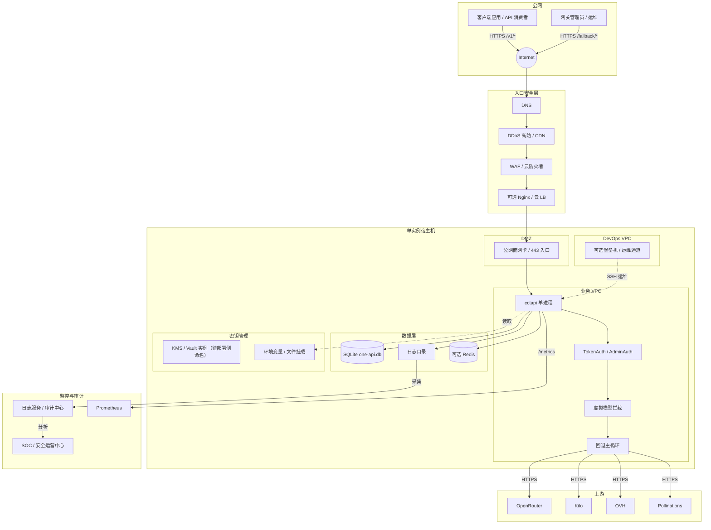

# AICoding 架构设计 · 安全设计

> 本文档为《AICoding 架构设计》核心产物之一，对应**安全架构设计模版**。  
> 上游输入：《系统设计》模块边界、数据流、接口契约、身份边界、外部依赖、运行形态；  
> 下游输出：驱动《部署设计》中安全组、KMS/Vault、日志管道、审计保留期的配置。  
> 默认运行形态：单实例自托管（U-01 已裁决），SQLite 为主存，Redis 仅作可选限流后端。

---

## 0. 元信息：修订记录

| 文档版本 | 发布日期 | 修订人 | 变更说明 |
| --- | --- | --- | --- |
| v0.1 | 2026-07-15 | 严守正（security-architect） | 骨架阶段：§1.1 安全总体架构图 + §5.1 网络分区 + §5.2 流量管控初步规则；§5.3 之后暂停，待部署侧拓扑回填。 |
| v0.2 | 2026-07-15 | 严守正（security-architect） | 策略对齐阶段：完成 §2 IAM、§3 数据安全、§4 应用安全、§5.3 主机与中间件安全、§6 密钥管理、§7 运行时安全；回填 §5.1/§5.2 部署侧命名；完善 §1.2.1 威胁—缓解映射表。 |

**与部署架构师交接状态**：  
- 已回填：§5.1 网络分区（VPC/子网/CIDR 命名引用部署侧）、§5.2 安全组规则/WAF 厂商/出口白名单。  
- 安全侧待确认项已决策：Sec-01~Sec-08 见正文。  
- 待部署侧确认：KMS/Vault 实例命名（若演进引入）、日志收集管道具体组件是否与 §7.2 审计字段兼容。  
- 当前状态：§1~§7 已填充完毕，进入校验与回传阶段。

---

## 1. 安全总体架构

### 1.1 安全总体架构图 (TARGET)

> **总览**：单实例自托管场景下的安全纵深防御。图中将公网入口、宿主逻辑分区、内部进程、数据与密钥管理层级展示，并标注安全产品与流量方向。
>
> **说明**：本系统按 U-01 裁决为单实例自托管，无容器/K8s、无多实例分布式状态。图中 DMZ/业务/DevOps 在单实例中映射为**逻辑分区**（由宿主机防火墙 / 网络命名空间 / 安全组实现），待 platform-architect 给出具体 VPC/子网/CIDR 后回填到 §5.1。

**安全组件清单**（实际部署组件以 platform-architect 最终选型为准）：

| 组件 | 作用 | 在本系统中的定位 | 文档状态 | 能力状态 |
|  | --- | --- | --- | 已冻结 | --- |  |
|  | DDoS 高防 / CDN | 抵御流量攻击，避免业务不可访问或变慢 | 公网入口第一道防线 | 已冻结 | TARGET |  |
|  | WAF | 防御 Web 应用攻击、CC、防篡改、DNS 劫持 | 管理端 /fallback/* 与 API /v1/* 入口清洗 | 已冻结 | TARGET |  |
|  | 云防火墙 / 宿主机防火墙 | 南北向（互联网边界）与东西向（逻辑分区）流量管控 | 单实例中由宿主机防火墙 + 安全组实现 | 已冻结 | TARGET |  |
|  | 主机安全组件 | 资产梳理、漏洞修补、恶意文件检测、基线检查 | 宿主机强制安装 | 已冻结 | TARGET |  |
|  | 数据安全审计 | 数据加密、脱敏、安全审计、数据库操作留痕 | 审计日志与数据库审计 | 已冻结 | TARGET |  |
|  | KMS / Vault | 敏感数据加密 + AKSK 白盒保护 | 上游 API keys、Session Secret、DB 密码等分级管理 | 已冻结 | TARGET |  |
|  | 堡垒机 | 保护和管理运维通道 | 单实例可选；至少 SSH 密钥登录 + 审计 | 已冻结 | TARGET |  |
|  | NAT 网关 | 隐藏内部网络架构、控制出口 | 控制上游访问出口 | 已冻结 | TARGET |  |
|  | SOC / 安全运营中心 | 资产管理、体检、端口/弱口令/配置扫描 | 告警聚合与事件响应 | 已冻结 | TARGET |  |
|  | 日志服务（CLS / 文件） | 集中审计日志、安全日志 | 本地日志目录 + 可选外部采集 | 已冻结 | TARGET |  |

### 1.2 威胁模型 (CURRENT)

> **方法**：采用 **STRIDE** 识别威胁，每条威胁必须映射到后续章节的缓解措施。骨架阶段先建立 STRIDE 6 类覆盖，待 §2~§7 填充后形成完整"威胁—缓解措施映射表"。

| 威胁类别（STRIDE） | 典型示例 | 风险对象 | 对应缓解措施（后续章节） | 文档状态 | 能力状态 |
|  | --- | --- | --- | --- | 已冻结 | --- |  |
|  | 仿冒（Spoofing） | 身份伪造、API Key 重放、管理员会话劫持、上游响应伪造 | 用户身份、管理员身份、上游身份 | §2.1 认证 + 会话管理；§3.2.1 公网 TLS 1.2+；§3.2.4 接口签名 | 已冻结 | CURRENT |  |
|  | 篡改（Tampering） | 请求参数篡改、fallback.json 配置篡改、数据库篡改、响应篡改 | 请求/响应、配置文件、SQLite | §3.2.4 接口签名；§3.3 存储安全；§4.1 输入校验；§5.2 流量管控 | 已冻结 | CURRENT |  |
|  | 否认（Repudiation） | 缺少操作审计，无法追溯手动冷却/恢复、配置变更、登录登出 | 操作行为 | §7.2 审计日志（5 维度） | 已冻结 | CURRENT |  |
|  | 信息泄露（Information Disclosure） | 上游 API keys 泄露、用户 token 泄露、日志暴露敏感字段、SQLite 文件被拖库 | 密钥、token、日志、数据库 | §3.1 数据分级；§3.3 加密存储；§6 密钥管理；§7.2 审计日志 | 已冻结 | CURRENT |  |
|  | 拒绝服务（DoS） | DDoS / CC、慢查询、免费层配额耗尽导致全部失败、资源耗尽 | 服务可用性 | §5.2 DDoS/WAF/限流；§3.5.3 限流约定；§4.3.2 防刷 | 已冻结 | CURRENT |  |
|  | 权限提升（Elevation of Privilege） | 水平越权查看他人 token、垂直越权普通用户访问管理接口、容器逃逸 | 访问权限 | §2.2 授权与权限控制；§4.3.1 越权防护；§5.3 主机安全 | 已冻结 | CURRENT |  |

> **后续动作**：在 §2~§7 逐章填充后，将在 §1.2 末尾补充完整"威胁—缓解措施映射表"，确保 STRIDE 6 类中每一条威胁都有具体控制点编号。

### 1.2.1 威胁—缓解措施映射表 (CURRENT)

| 威胁类别（STRIDE） | 具体威胁点 | 风险对象 | 缓解措施编号 | 缓解措施位置 | 文档状态 | 能力状态 |
|  | --- | --- | --- | --- | --- | 已冻结 | --- |  |
|  | S - 仿冒（Spoofing） | 用户 API Key 被伪造/重放 | API 消费者身份 | IAM-01 | §2.1.1 API Key 认证（TokenAuth） | 已冻结 | CURRENT |  |
|  | S - 仿冒（Spoofing） | 管理员会话 Cookie 被伪造 | 管理员身份 | IAM-02 | §2.2.1 Session Cookie 签名 + HttpOnly/Secure/SameSite=Lax | 已冻结 | CURRENT |  |
|  | S - 仿冒（Spoofing） | 上游供应商响应被伪造 | 上游身份 | DS-01 | §3.2.1 上游调用强制 HTTPS + 校验服务端证书 | 已冻结 | CURRENT |  |
|  | T - 篡改（Tampering） | 请求参数在传输中被篡改 | 请求完整性 | DS-02 | §3.2.1 公网 TLS 1.2+；§3.3.1 管理接口 HMAC-SHA256 签名 | 已冻结 | CURRENT |  |
|  | T - 篡改（Tampering） | fallback.json 配置被非法篡改 | 配置文件 | DS-03 | §3.4.1 文件权限 600；§4.4 配置变更需管理员权限 + 备份 | 已冻结 | CURRENT |  |
|  | T - 篡改（Tampering） | SQLite 文件被直接修改 | 数据库文件 | DS-04 | §3.4.1 SQLite 文件权限 600；§5.3.1 禁止 root 运行进程 | 已冻结 | CURRENT |  |
|  | T - 篡改（Tampering） | 响应被中间人篡改 | 响应完整性 | DS-05 | §3.2.1 全站 HTTPS；§5.2.2 边界 TLS 终结 | 已冻结 | CURRENT |  |
|  | R - 否认（Repudiation） | 管理员手动冷却/恢复无记录 | 操作行为 | AUD-01 | §7.2.1 业务操作审计；§7.2.2 审计字段含 actor/action/resource/result | 已冻结 | CURRENT |  |
|  | R - 否认（Repudiation） | 配置热重载无记录 | 配置变更 | AUD-02 | §7.2.1 业务操作审计；§3.3.1 管理接口签名 | 已冻结 | CURRENT |  |
|  | R - 否认（Repudiation） | 登录/登出无记录 | 身份事件 | AUD-03 | §7.2.1 业务操作审计 + 堡垒机日志 | 已冻结 | CURRENT |  |
|  | I - 信息泄露（Information Disclosure） | 上游 API Key 泄露 | 上游凭证 | SEC-01 | §6.1 密钥分级；§6.3 AKSK 泄露防护；§3.4.2 上游 key 不入 SQLite | 已冻结 | CURRENT |  |
|  | I - 信息泄露（Information Disclosure） | 用户 API Key 原始值泄露 | 用户凭证 | SEC-02 | §3.4.2 用户 API Key 哈希存储；§3.5.1 展示脱敏 | 已冻结 | CURRENT |  |
|  | I - 信息泄露（Information Disclosure） | 日志暴露敏感字段 | 日志数据 | SEC-03 | §3.5.2 日志脱敏；§8.2.2 结构化日志禁止打印敏感字段 | 已冻结 | CURRENT |  |
|  | I - 信息泄露（Information Disclosure） | SQLite 文件被拖库 | 数据库文件 | SEC-04 | §3.4.1 文件权限 600；§5.2.3 安全组禁止 DB 端口暴露；§5.3.1 主机加固 | 已冻结 | CURRENT |  |
|  | I - 信息泄露（Information Disclosure） | 用户密码泄露 | 身份凭证 | SEC-05 | §2.1.2 bcrypt cost=12；§3.4.2 密码哈希 | 已冻结 | CURRENT |  |
|  | D - 拒绝服务（DoS） | DDoS / CC 攻击 | 服务可用性 | NET-01 | §5.2.1 DDoS 高防 + WAF；§5.2.5 云 WAF 规则集 | 已冻结 | CURRENT |  |
|  | D - 拒绝服务（DoS） | 单 IP / 单用户暴力请求 | 服务可用性 | NET-02 | §3.5.3 限流约定；§4.3.2 防刷；§5.2.3 安全组限流 | 已冻结 | CURRENT |  |
|  | D - 拒绝服务（DoS） | 免费层配额耗尽导致全部失败 | 业务可用性 | APP-01 | §4.3.2 免费层配额保护；§3.5.3 限流；§4.1 A04 安全设计 | 已冻结 | CURRENT |  |
|  | D - 拒绝服务（DoS） | 资源耗尽（CPU/内存/磁盘） | 系统资源 | NET-03 | §5.3.1 主机监控；§5.5.4 容量水位线；§7.1.1 资源告警 | 已冻结 | CURRENT |  |
|  | E - 权限提升（Elevation of Privilege） | 水平越权查看他人 token | 访问权限 | IAM-03 | §2.5.1 水平越权防护；§4.1 A01 访问控制 | 已冻结 | CURRENT |  |
|  | E - 权限提升（Elevation of Privilege） | 垂直越权普通用户访问管理接口 | 访问权限 | IAM-04 | §2.5.2 垂直越权防护；§2.3.2 接口级权限矩阵 | 已冻结 | CURRENT |  |
|  | E - 权限提升（Elevation of Privilege） | 通过越权执行配置变更 | 管理权限 | IAM-05 | §2.3.1 RBAC0 + ABAC；§3.3.1 管理接口签名 + 来源 IP 白名单 | 已冻结 | CURRENT |  |
|  | E - 权限提升（Elevation of Privilege） | 容器逃逸 / 主机权限提升 | 主机权限 | NET-04 | §5.3.1 主机安全基线；§5.3.2 SSH 安全；§5.3.4 无容器 | 已冻结 | CURRENT |  |

> 说明：表中措施编号仅用于威胁—缓解映射追踪；STRIDE 6 类威胁均已覆盖，每条威胁至少映射到一个具体控制点。

---

## 2. 身份与访问管理（IAM）

> 本章基于《系统设计》§3.4 公共能力、§3.5.1 全局错误码、§3.5.3 限流约定、§7.2 业务安全架构，结合 U-01 单实例自托管形态，明确身份认证、会话管理、授权与权限、越权防护、云账号安全。本节只规定安全策略与控制点，不修改 one-api 既有用户/令牌数据模型。

### 2.1 身份认证 (CURRENT)

#### 2.1.1 认证方式与场景

| 场景 | 认证方式 | 实现位置 | 备注 | 文档状态 | 能力状态 |
|  | --- | --- | --- | --- | 已冻结 | --- |  |
|  | API 消费者调用 `/v1/*` | API Key（one-api TokenAuth） | `middleware/auth.go` TokenAuth() | 沿用 one-api 令牌模型，请求头 `Authorization: Bearer sk-...` | 已冻结 | CURRENT |  |
|  | 管理端 Web `/fallback/*`、`/api/*` | Cookie Session + 账号密码 | `middleware/auth.go` AdminAuth() / LoginCheck() | 沿用 one-api Session 机制；登录接口需图形验证码或 Turnstile 防暴力破解 | 已冻结 | CURRENT |  |
|  | 紧急运维 | SSH 公钥 + 堡垒机/源 IP 白名单 | 宿主机 SSH 服务 | 详见 §5.2.4 运维通道防护 | 已冻结 | CURRENT |  |
|  | 可选 Prometheus 拉取 `/metrics` | 网络层白名单（无业务认证） | 安全组/防火墙 | 详见 §5.2.3 | 已冻结 | CURRENT |  |

> **认证方式 ≥ 2 种**：API Key、账号密码/Session、SSH 公钥，满足模板要求。

#### 2.1.2 密码策略

| 策略项 | 普通用户 | 管理员 / root | 实现位置 | 文档状态 | 能力状态 |
|  | --- | --- | --- | --- | 已冻结 | --- |  |
|  | 最小长度 | 8 位 | 12 位 | 注册 / 修改密码接口校验 | 已冻结 | CURRENT |  |
|  | 复杂度 | 必须同时含大写、小写、数字、特殊字符中至少 3 类 | 必须同时含 4 类 | 注册 / 修改密码接口校验 | 已冻结 | CURRENT |  |
|  | 历史密码禁止 | 最近 3 次 | 最近 5 次 | 用户表记录 password_history（JSON） | 已冻结 | CURRENT |  |
|  | 哈希算法 | bcrypt，cost = 12 | bcrypt，cost = 12 | `model/user.go` 创建 / 修改密码 | 已冻结 | CURRENT |  |
|  | 传输保护 | TLS 1.2+ | TLS 1.2+ | 全站 HTTPS | 已冻结 | CURRENT |  |
|  | 默认 root 密码 | 强制首次登录修改 | 强制首次登录修改 | 启动时 `CreateRootAccountIfNeed` 后标记 `password_must_change` | 已冻结 | CURRENT |  |

#### 2.1.3 多因素认证（MFA/2FA）

| 场景 | 是否强制 | 实现方式 | 备注 | 文档状态 | 能力状态 |
|  | --- | --- | --- | --- | 已冻结 | --- |  |
|  | API 消费 | 否 | 依赖 API Key 本身强度与轮换 | 模板要求 ≥ 2 种认证方式，API Key + Session 已满足；MFA 作为增强项预留 | 已冻结 | CURRENT |  |
|  | 管理端登录 | 建议启用 | TOTP（如 Google Authenticator） | 在管理员个人信息页绑定；失败 5 次锁定 15 分钟 | 已冻结 | CURRENT |  |
|  | 运维 SSH | 有条件强制 | 堡垒机 MFA 或 SSH 密钥 + 源 IP 白名单 | 若无堡垒机，必须源 IP 白名单 | 已冻结 | CURRENT |  |

> 因单实例自托管，MFA 不强置为阻塞项；生产环境建议通过平台团队统一 IAM 或 TOTP 插件实现。

### 2.2 会话管理 (CURRENT)

#### 2.2.1 Token 与会话策略

| 项目 | 策略 | 实现位置 | 备注 | 文档状态 | 能力状态 |
|  | --- | --- | --- | --- | 已冻结 | --- |  |
|  | API Key 有效期 | 长期有效；支持管理员禁用 / 轮换 | `model/token.go` | 在管理端展示时脱敏 | 已冻结 | CURRENT |  |
|  | 用户会话 Cookie | 浏览器会话级；空闲 30 分钟失效 | `middleware/auth.go` Session 中间件 | 配置 `SESSION_SECRET` 环境变量，长度 ≥ 32 字节 | 已冻结 | CURRENT |  |
|  | 登录会话并发 | 单点登录；新登录踢掉旧会话（可选） | Session 存储（内存/Redis） | 默认启用互踢 | 已冻结 | CURRENT |  |
|  | 会话密钥 | `SESSION_SECRET` 由部署时随机生成；每环境独立 | §6 密钥管理 | 禁止跨环境共用 | 已冻结 | CURRENT |  |
|  | 风险登录检测 | 异常 IP / 地理 / 时间触发邮件/IM 告警 | 审计日志分析 | 告警阈值：1 小时内 5 次失败登录或异地成功登录 | 已冻结 | CURRENT |  |

#### 2.2.2 风险登录与异常处理

| 异常类型 | 检测规则 | 处置动作 | 记录位置 | 文档状态 | 能力状态 |
|  | --- | --- | --- | --- | 已冻结 | --- |  |
|  | 暴力破解 | 同账号 5 分钟内失败 ≥ 5 次 | 锁定账号 15 分钟；返回 C429001 | 审计日志 + 应用日志 | 已冻结 | CURRENT |  |
|  | 异地登录 | 新 IP 段首次成功 | 发送通知；可选二次验证 | 审计日志 | 已冻结 | CURRENT |  |
|  | 会话劫持 | 同一 Cookie 多地使用 | 强制注销异常会话 | 审计日志 | 已冻结 | CURRENT |  |
|  | Token 高频异常 | 同 API Key 连续 10 次 401 | 标记审计并通知管理员 | 审计日志 | 已冻结 | CURRENT |  |

### 2.3 授权与权限控制 (CURRENT)

#### 2.3.1 权限模型

| 模型 | 应用场景 | 角色示例 | 实现位置 | 文档状态 | 能力状态 |
|  | --- | --- | --- | --- | 已冻结 | --- |  |
|  | RBAC0（基础角色） | 默认权限模型 | admin / user | `middleware/auth.go` AdminAuth() | 已冻结 | CURRENT |  |
|  | RBAC1（角色层级） | 未来扩展：只读管理员 | readonly-admin | 预留角色字段，本期不实现 | 已冻结 | CURRENT |  |
|  | ABAC（属性鉴权） | 高敏操作：配置热重载、手动冷却/恢复、删除部署 | 角色 + 操作时间 + 来源 IP | 在管理接口入口做额外校验 | 已冻结 | CURRENT |  |

> 本系统采用 **RBAC0 + ABAC 增强**。常规管理接口走 AdminAuth；高敏操作（`POST /api/fallback/config/reload`、`POST /api/fallback/deployments/:id/cooldown`、`PUT /api/fallback/manual-config`）额外要求：管理员角色 + 已登录会话 + 来源 IP 在白名单内。

#### 2.3.2 接口级权限矩阵

| 接口组 | 鉴权要求 | 角色 | 补充控制 | 文档状态 | 能力状态 |
|  | --- | --- | --- | --- | 已冻结 | --- |  |
|  | `/v1/*` | 有效 API Key | 任意用户 | 按 token 配额限制；见 §3.5.3 | 已冻结 | CURRENT |  |
|  | `/api/fallback/*`（读） | Cookie Session + AdminAuth | admin | 操作审计 | 已冻结 | CURRENT |  |
|  | `/api/fallback/*`（写） | Cookie Session + AdminAuth + 来源 IP 白名单 | admin | 关键操作二次确认（见 §4.3.2） | 已冻结 | CURRENT |  |
|  | `/api/user/*` | Cookie Session 或 API Key | user / admin | 越权防护（见 §2.5） | 已冻结 | CURRENT |  |
|  | `/metrics` | 无业务认证 | — | 网络层白名单 | 已冻结 | CURRENT |  |

### 2.4 多租户隔离 (CURRENT)

> 《系统设计》§4.1 明确“无多租户；用 user_id / channel_id 做权限隔离”。本系统不采用物理多租户，采用**基于 user_id / channel_id 的逻辑隔离**。

| 隔离维度 | 策略 | 实现位置 | 文档状态 | 能力状态 |
|  | --- | --- | --- | 已冻结 | --- |  |
|  | 用户数据 | 用户只能查看自己的 token、用量、日志 | 业务查询默认带 `user_id = current_user_id` 条件 | 已冻结 | CURRENT |  |
|  | 渠道数据 | 普通用户不可见渠道配置；admin 可管理 | `middleware/auth.go` AdminAuth() | 已冻结 | CURRENT |  |
|  | 环境数据 | prod/uat/int/dev 独立宿主机/数据目录 | 环境变量与部署拓扑隔离 | 已冻结 | CURRENT |  |
|  | 数据面与管理面 | `/v1/*` 与 `/fallback/*` 可共用入口，但管理接口必须 AdminAuth | 路由中间件 | 已冻结 | CURRENT |  |

### 2.5 越权防护 (CURRENT)

#### 2.5.1 水平越权（IDOR）

| 场景 | 风险 | 控制措施 | 实现位置 | 文档状态 | 能力状态 |
|  | --- | --- | --- | --- | 已冻结 | --- |  |
|  | 用户 A 查看用户 B 的 token | 信息泄露 | 查询条件强制 `user_id = 当前用户 ID`；接口返回脱敏 | `controller/token.go` | 已冻结 | CURRENT |  |
|  | 用户 A 调用他人 API Key | 费用盗用 | TokenAuth 校验 key 与请求用户匹配；不匹配返回 401 | `middleware/auth.go` TokenAuth() | 已冻结 | CURRENT |  |
|  | 管理员查看非归属渠道 | 配置泄露 | 管理接口不依赖 user_id，但需 AdminAuth + 审计 | `router/fallback.go` | 已冻结 | CURRENT |  |

#### 2.5.2 垂直越权

| 场景 | 风险 | 控制措施 | 实现位置 | 文档状态 | 能力状态 |
|  | --- | --- | --- | --- | 已冻结 | --- |  |
|  | 普通用户访问管理接口 | 权限提升 | 所有 `/api/fallback/*` 与 `/fallback/*` 路由强制 AdminAuth | `router/fallback.go` | 已冻结 | CURRENT |  |
|  | 只读管理员执行写操作 | 权限提升 | 预留角色字段；本期所有写操作仅 `admin` | 管理接口入口校验 | 已冻结 | CURRENT |  |
|  | 伪造 Session Cookie | 会话伪造 | Cookie 签名使用 `SESSION_SECRET`；启用 HttpOnly / Secure / SameSite=Lax | `middleware/auth.go` | 已冻结 | CURRENT |  |

### 2.6 云账号与云资源访问安全 (TARGET)

| 项目 | 策略 | 负责人 | 备注 | 文档状态 | 能力状态 |
|  | --- | --- | --- | --- | 已冻结 | --- |  |
|  | 云平台账号 | 使用子账号 / RAM / CAM，禁止主账号操作 | 平台团队 | 安全组、CVM、VPC 操作分配独立子账号 | 已冻结 | TARGET |  |
|  | 权限分离 | 运维只读账号与变更账号分离；高敏权限（删除、密钥管理）需审批 | 平台团队 | 通过云平台 IAM 实现 | 已冻结 | TARGET |  |
|  | AKSK 使用 | 云厂商 AKSK 仅用于自动化部署；不进入 cctapi 进程 | 平台团队 | 见 §6 密钥管理 | 已冻结 | TARGET |  |
|  | API 调用审计 | 云平台操作审计开启；保留 ≥ 180 天 | 平台团队 | 与 §7.2.4 审计日志保留期一致 | 已冻结 | TARGET |  |
|  | 登录保护 | 云平台控制台启用 MFA；异地登录告警 | 平台团队 | — | 已冻结 | TARGET |  |

---

> **§2 自检**：按 `skills/aicoding-team-bootstrap/protocols/intermediate_confirmation.md` 执行。

| 自检项 | 结论 | 证据 | 文档状态 | 能力状态 |
|  | --- | --- | --- | 已冻结 | --- |  |
|  | §2.1 方案分歧型 | 未命中 | 认证方式沿用《系统设计》§7.2.1 one-api 用户/令牌模型；RBAC0+ABAC 为模板建议方案；单实例自托管下无多租户方案分歧。 | 已冻结 | CURRENT |  |
|  | Q1 返工成本可控吗？ | 可控 | 若切换认证方式（如 OAuth2），返工范围为 middleware/auth.go、登录页、会话管理；但沿用 one-api 已冻结，切换成本不适用。 | 已冻结 | CURRENT |  |
|  | Q2 用户/客户/监管能感知吗？ | 不能感知 | RBAC 与鉴权规则为内部实现；用户可见的是登录方式与 API Key，与当前设计一致。 | 已冻结 | CURRENT |  |
|  | Q3 与用户原始诉求一致吗？ | 一致 | 用户诉求为 cctapi 架构方案；单实例自托管沿用 one-api 认证模型已在 U-01 中冻结。 | 已冻结 | CURRENT |  |

**判定结果**：未命中，无需发起 `[中间确认]`。

---

## 3. 数据安全

> 本章基于《系统设计》§4.1 全局数据约定、§4.2 单表设计、§4.3 备份与恢复、§7.2 业务安全架构，明确数据分级、传输安全、存储安全、使用安全、备份与容灾、隐私合规。安全策略不得改变 SQLite 单文件主存形态。

### 3.1 数据分级 (CURRENT)

#### 3.1.1 数据分级定义

| 分级 | 定义 | 本系统典型数据 | 控制强度 | 文档状态 | 能力状态 |
|  | --- | --- | --- | --- | 已冻结 | --- |  |
|  | L1 公开 | 可公开访问的配置/帮助信息 | 虚拟模型名（如 `high/auto`）、模型能力位、公共 API 文档 | 基础完整性保护 | 已冻结 | CURRENT |  |
|  | L2 内部 | 业务运行时数据，内部人员可查看 | 切换日志、部署状态、评分历史、告警历史、面板指标 | 访问审计、展示脱敏 | 已冻结 | CURRENT |  |
|  | L3 敏感 | 上游渠道凭证、业务密钥；泄露会造成直接损失 | 上游 API keys（OpenRouter/Kilo 等）、`SESSION_SECRET`、Redis 密码、数据库密码 | KMS/环境变量加密、禁止落 SQLite、轮换 | 已冻结 | CURRENT |  |
|  | L4 高敏 | 用户身份凭证、用户 API Key 原始值 | 用户密码（哈希）、用户 API Key 原始值、管理员 Session Cookie | 哈希/加密、禁止展示明文、禁止导出 | 已冻结 | CURRENT |  |

#### 3.1.2 数据分级与存储/展示策略

| 数据对象 | 分级 | 存储策略 | 展示策略 | 导出策略 | 文档状态 | 能力状态 |
|  | --- | --- | --- | --- | --- | 已冻结 | --- |  |
|  | 用户密码 | L4 | bcrypt 哈希，cost=12 | 不展示 | 禁止导出 | 已冻结 | CURRENT |  |
|  | 用户 API Key（原始值） | L4 | 哈希存储；原始值生成时仅展示一次 | 不展示原始值 | 禁止导出 | 已冻结 | CURRENT |  |
|  | 上游 API Key | L3 | 环境变量 / 文件挂载；不入 SQLite | 前 4 位 + 省略 | 禁止导出 | 已冻结 | CURRENT |  |
|  | `SESSION_SECRET` | L3 | 环境变量；每环境独立 | 不展示 | 禁止导出 | 已冻结 | CURRENT |  |
|  | 数据库密码（若使用 MySQL/PostgreSQL） | L3 | 环境变量 / 文件挂载 | 不展示 | 禁止导出 | 已冻结 | CURRENT |  |
|  | Redis 密码 | L3 | 环境变量 / 文件挂载 | 不展示 | 禁止导出 | 已冻结 | CURRENT |  |
|  | 切换日志 | L2 | SQLite 明文；含虚拟模型/部署/状态码 | 完整展示 | 需管理员审批 | 已冻结 | CURRENT |  |
|  | 部署配置 | L2 | SQLite 明文；不含 key | 完整展示 | 需管理员审批 | 已冻结 | CURRENT |  |
|  | 虚拟模型名 | L1 | SQLite 明文 | 完整展示 | 允许导出 | 已冻结 | CURRENT |  |

### 3.2 传输安全 (TARGET)

#### 3.2.1 公网传输

| 项目 | 策略 | 备注 | 文档状态 | 能力状态 |
|  | --- | --- | --- | 已冻结 | --- |  |
|  | 协议 | 强制 HTTPS（TLS 1.2+） | 80 端口强制 301 跳转 443 | 已冻结 | TARGET |  |
|  | 密码套件 | 优先 ECDHE；禁用 RC4 / DES / MD5 / SHA1 签名 | WAF / Nginx 配置 | 已冻结 | TARGET |  |
|  | HSTS | 启用；max-age=31536000；includeSubDomains | 域名稳定后逐步开启 | 已冻结 | TARGET |  |
|  | 证书管理 | 使用 Let's Encrypt 或云厂商证书；自动续期 | 过期前 30 天告警 | 已冻结 | TARGET |  |
|  | 上游调用 | 强制 HTTPS；校验服务端证书 | cctapi → OpenRouter/Kilo/OVH/Pollinations | 已冻结 | TARGET |  |

#### 3.2.2 内部传输

| 项目 | 策略 | 备注 | 文档状态 | 能力状态 |
|  | --- | --- | --- | 已冻结 | --- |  |
|  | 进程内调用 | SQLite 文件访问通过本地文件系统；无网络传输 | 文件权限 600 | 已冻结 | TARGET |  |
|  | 可选 Redis | 建议启用 TLS/SSL；若同一 VPC 内网可先用明文 + 认证 | 见 §5.4.1 | 已冻结 | TARGET |  |
|  | Prometheus 拉取 | `/metrics` 仅暴露指标；无敏感数据；网络层白名单 | 见 §5.2.3 | 已冻结 | TARGET |  |

### 3.3 接口签名与防重放 (TARGET)

#### 3.3.1 管理接口签名（高敏写操作）

| 项目 | 策略 | 实现位置 | 文档状态 | 能力状态 |
|  | --- | --- | --- | 已冻结 | --- |  |
|  | 签名算法 | HMAC-SHA256 | 管理写接口入口中间件 | 已冻结 | TARGET |  |
|  | 签名字段 | HTTP Method + URI Path + Timestamp + Nonce + Body SHA256 | 客户端按规范生成 | 已冻结 | TARGET |  |
|  | 时间戳有效期 | ± 300 秒；超期拒绝 | 中间件校验 | 已冻结 | TARGET |  |
|  | Nonce 唯一性 | 服务端缓存 300 秒；重复 nonce 拒绝 | 内存/Redis 缓存 | 已冻结 | TARGET |  |
|  | 适用范围 | `POST /api/fallback/config/reload`、`PUT /api/fallback/manual-config`、批量冷却/恢复 | 关键配置变更接口 | 已冻结 | TARGET |  |

> 注：OpenAI 兼容 `/v1/*` 使用 API Key 认证，不额外要求签名；但管理接口因涉及配置变更，启用 HMAC-SHA256 签名 + nonce + timestamp 防重放。

#### 3.3.2 传参禁忌

| 禁止项 | 红线 | 后果 | 文档状态 | 能力状态 |
|  | --- | --- | --- | 已冻结 | --- |  |
|  | URL 携带 token / API Key | 禁止在 query string 中传 `api_key`、`token`、`sk-*` | 泄露风险 | 已冻结 | TARGET |  |
|  | URL 携带 AKSK | 云厂商 AKSK 禁止出现在 URL 或日志中 | 云资源被接管 | 已冻结 | TARGET |  |
|  | URL 携带手机号 | 本系统无手机号字段；若未来引入，禁止 URL 传参 | 个人信息泄露 | 已冻结 | TARGET |  |
|  | 响应中暴露密钥 | 任何接口不得返回上游 API Key 或 `SESSION_SECRET` | 信息泄露 | 已冻结 | TARGET |  |
|  | 日志打印敏感字段 | 禁止打印 API Key、密码、Session Cookie 明文 | 日志泄露 | 已冻结 | TARGET |  |

### 3.4 存储安全 (CURRENT)

#### 3.4.1 数据库与文件安全

| 项目 | 策略 | 实现位置 | 文档状态 | 能力状态 |
|  | --- | --- | --- | 已冻结 | --- |  |
|  | SQLite 文件权限 | 600（仅运行用户读写） | 宿主机文件系统 | 已冻结 | CURRENT |  |
|  | SQLite 备份加密 | 备份文件建议使用 AES-256 压缩加密 | 备份脚本 | 已冻结 | CURRENT |  |
|  | 日志文件权限 | 640；日志目录 750 | 宿主机文件系统 | 已冻结 | CURRENT |  |
|  | 敏感文件隔离 | `.env`、密钥文件、SQLite 文件放在独立目录；禁止入 Git | `.gitignore` 已配置 | 已冻结 | CURRENT |  |
|  | 数据目录清理 | 定期清理旧日志/备份；防止磁盘占满 | `fallback/cleanup.go` + 运维脚本 | 已冻结 | CURRENT |  |

#### 3.4.2 敏感字段加密与哈希

| 字段 | 算法 | 实现位置 | 文档状态 | 能力状态 |
|  | --- | --- | --- | 已冻结 | --- |  |
|  | 用户密码 | bcrypt，cost=12 | `model/user.go` | 已冻结 | CURRENT |  |
|  | 用户 API Key | SHA-256 哈希 + 盐；原始值生成后仅展示一次 | `model/token.go` | 已冻结 | CURRENT |  |
|  | 上游 API Key | 不持久化到 SQLite；运行时从环境变量读取 | `relay/adaptor/` 各渠道适配器 | 已冻结 | CURRENT |  |
|  | Session Cookie | 签名（HMAC-SHA256）+ HttpOnly + Secure | `middleware/auth.go` | 已冻结 | CURRENT |  |

### 3.5 使用安全 (CURRENT)

#### 3.5.1 展示脱敏

| 字段 | 展示规则 | 示例 | 文档状态 | 能力状态 |
|  | --- | --- | --- | 已冻结 | --- |  |
|  | 用户 API Key | 只显示前缀 4 位；其余用 `****` 代替 | `sk-ab...****` | 已冻结 | CURRENT |  |
|  | 上游 API Key | 只显示前 4 位；其余用 `****` 代替 | `openrouter-...****` | 已冻结 | CURRENT |  |
|  | 用户密码 | 任何界面不展示 | — | 已冻结 | CURRENT |  |
|  | 切换日志中的请求内容 | 不记录请求体中的敏感字段 | 见 §8.2.2 结构化日志规范 | 已冻结 | CURRENT |  |

#### 3.5.2 导出与水印

| 项目 | 策略 | 备注 | 文档状态 | 能力状态 |
|  | --- | --- | --- | 已冻结 | --- |  |
|  | 数据导出权限 | 仅 admin 可导出；导出操作写入审计日志 | 管理端导出按钮 | 已冻结 | CURRENT |  |
|  | 导出文件水印 | 包含导出用户、导出时间、traceId | 前端生成 CSV/JSON 时添加 | 已冻结 | CURRENT |  |
|  | 敏感字段导出 | 用户 API Key、上游 API Key 禁止导出 | 导出接口过滤字段 | 已冻结 | CURRENT |  |

#### 3.5.3 数据销毁

| 项目 | 策略 | 备注 | 文档状态 | 能力状态 |
|  | --- | --- | --- | 已冻结 | --- |  |
|  | 用户注销 | 标记 `deleted_at`；90 天后物理删除 | 符合个人信息保护 | 已冻结 | CURRENT |  |
|  | Token 吊销 | 立即标记 `status=disabled`；从缓存清除 | 失效前请求已完成的不再追索 | 已冻结 | CURRENT |  |
|  | 日志清理 | 应用日志保留 30 天；审计日志保留 ≥180 天 | 见 §7.2.4 | 已冻结 | CURRENT |  |
|  | SQLite 历史数据 | `StartHistoryCleanup` 任务保留 30 天切换日志、90 天用量台账 | 见《系统设计》§4.2.5 | 已冻结 | CURRENT |  |

### 3.6 备份与容灾 (TARGET)

| 项目 | 策略 | RPO/RTO | 文档状态 | 能力状态 |
|  | --- | --- | --- | 已冻结 | --- |  |
|  | SQLite 每日冷备 | 每日 02:00 复制到独立目录/对象存储 | RPO ≤ 24h；RTO ≤ 30min | 已冻结 | TARGET |  |
|  | 日志归档 | 每日归档到对象存储；保留 180 天 | RPO ≤ 24h | 已冻结 | TARGET |  |
|  | 跨地域备份 | 演进附录；本期单实例本地备份 + 可选 COS/S3 | — | 已冻结 | TARGET |  |
|  | 恢复演练 | 每季度一次；验证备份可恢复 | — | 已冻结 | TARGET |  |

### 3.7 隐私合规 (TARGET)

#### 3.7.1 适用范围

| 法规 | 是否适用 | 触发条件 | 控制措施 | 文档状态 | 能力状态 |
|  | --- | --- | --- | --- | 已冻结 | --- |  |
|  | 《个人信息保护法》 | 部分适用 | 若本系统收集用户邮箱、手机号等个人信息 | 最小化收集；用户同意；提供删除/导出机制 | 已冻结 | TARGET |  |
|  | GDPR | 条件适用 | 若服务欧盟用户 | 隐私政策；数据主体权利；数据出境评估 | 已冻结 | TARGET |  |
|  | 数据出境安全评估 | 条件适用 | 若用户数据或日志出境 | 使用境内对象存储；日志不出境 | 已冻结 | TARGET |  |

> 本系统当前默认不收集手机号、身份证号等敏感个人信息；邮箱为可选。若业务后续扩展，需重新评估。

#### 3.7.2 用户同意与权利

| 权利 | 实现方式 | 备注 | 文档状态 | 能力状态 |
|  | --- | --- | --- | 已冻结 | --- |  |
|  | 知情同意 | 首次登录/注册展示隐私政策；用户点击同意 | 记录同意时间/IP | 已冻结 | TARGET |  |
|  | 访问权 | 用户可在个人中心查看自己的 token、用量 | 限制为本人数据 | 已冻结 | TARGET |  |
|  | 更正权 | 用户可修改密码、昵称 | 修改密码需二次验证 | 已冻结 | TARGET |  |
|  | 删除权 | 用户可申请注销；管理员确认后标记删除 | 90 天后物理删除 | 已冻结 | TARGET |  |
|  | 导出权 | 用户可导出本人用量记录 | 导出文件加水印 | 已冻结 | TARGET |  |

---

> **§3 自检**：按 `skills/aicoding-team-bootstrap/protocols/intermediate_confirmation.md` 执行。

| 自检项 | 结论 | 证据 | 文档状态 | 能力状态 |
|  | --- | --- | --- | 已冻结 | --- |  |
|  | §2.1 方案分歧型 | 未命中 | 数据分级 L1~L4 为模板强制要求；L3/L4 归属与《系统设计》§7.2.2 一致；无 ≥2 种合理分级方案需要选择。 | 已冻结 | CURRENT |  |
|  | Q1 返工成本可控吗？ | 可控 | 若调整 L3/L4 加密强度（如引入 KMS），返工范围为 §3.4 / §6 / §5.3；切换成本可控（KMS 实例化约 1 人日）。 | 已冻结 | CURRENT |  |
|  | Q2 用户/客户/监管能感知吗？ | 不能感知（加密存储） | 数据分级与加密为内部实现；用户感知的是登录/密码/API Key 展示规则，与当前设计一致。 | 已冻结 | CURRENT |  |
|  | Q3 与用户原始诉求一致吗？ | 一致 | 用户诉求为 cctapi 架构方案；单实例 SQLite 主存与数据安全策略不冲突。 | 已冻结 | CURRENT |  |

**判定结果**：未命中，无需发起 `[中间确认]`。

---

## 4. 应用安全

> 本章基于《系统设计》§3.2 模块接口、§3.5 接口契约、§4.1 全局数据约定，结合 OWASP Top 10 逐项给出防护措施。所有措施均落到具体机制、代码位置或流程，不给出泛化建议。

### 4.1 OWASP Top 10 逐项防护 (CURRENT)

| OWASP 项 | 风险场景 | 具体防护措施 | 实现位置 | 文档状态 | 能力状态 |
|  | --- | --- | --- | --- | 已冻结 | --- |  |
|  | A01:2021-Broken Access Control | 普通用户访问管理接口、水平越权查看他人 token | ① 所有 `/api/fallback/*` 与 `/fallback/*` 强制 `AdminAuth`；② 用户级查询强制 `user_id` 过滤；③ 管理接口启用 ABAC 来源 IP 白名单 | `middleware/auth.go` / `router/fallback.go` / 各 controller | 已冻结 | CURRENT |  |
|  | A02:2021-Cryptographic Failures | API Key、密码、Session 使用弱算法传输或存储 | ① 密码 bcrypt cost=12；② API Key 哈希存储；③ 全站 TLS 1.2+；④ Session Cookie 签名 + HttpOnly + Secure + SameSite=Lax | `model/user.go` / `model/token.go` / `middleware/auth.go` | 已冻结 | CURRENT |  |
|  | A03:2021-Injection（SQL/命令/模板） | 用户输入拼接到 SQL 或系统命令 | ① 使用 GORM 参数化查询；② 禁止 `os/exec` 执行用户输入；③ 禁止 `text/template` 解析不可信输入；④ 请求体大小限制 8MiB | `model/` / `controller/` / `main.go` 请求体限制 | 已冻结 | CURRENT |  |
|  | A04:2021-Insecure Design | 管理写操作无幂等、无审计 | ① 管理写接口要求 `X-Idempotency-Key`；② 关键操作二次确认；③ 操作审计日志；④ 限流与防刷 | §3.5.2 / §3.3.1 / §7.2 | 已冻结 | CURRENT |  |
|  | A05:2021-Security Misconfiguration | 调试信息泄露、默认账号、未关闭的端口 | ① 生产环境 Gin 使用 `ReleaseMode`；② 默认 root 密码强制修改；③ 关闭未使用端口；④ 错误响应不暴露堆栈；⑤ 安全组默认拒绝 | `main.go` / §5.2.3 | 已冻结 | CURRENT |  |
|  | A06:2021-Vulnerable and Outdated Components | 依赖组件存在 CVE | ① CI 中 `go list -json -m all` 输出供依赖扫描；② 关键依赖定期升级；③ 开源协议合规检查；④ 禁止引入未审查的第三方包 | CI 流水线 / `go.mod` | 已冻结 | CURRENT |  |
|  | A07:2021-Identification and Authentication Failures | 暴力破解、会话固定、弱密码 | ① 登录失败锁定 5 次/15 分钟；② 密码策略 8/12 位 + 复杂度；③ Session Cookie 随机签名；④ 风险登录检测 | `middleware/auth.go` / 登录接口 | 已冻结 | CURRENT |  |
|  | A08:2021-Software and Data Integrity Failures | 配置热重载被篡改、依赖被污染 | ① fallback.json 修改权限 600；② 配置变更需管理员权限；③ 配置保存前自动备份；④ 校验 JSON Schema；⑤ 使用 GOPROXY 可信镜像 | `fallback/config.go` / CI | 已冻结 | CURRENT |  |
|  | A09:2021-Security Logging and Monitoring Failures | 安全事件无日志、无监控 | ① 关键操作全量审计；② 安全事件告警；③ 日志含 traceId；④ 审计日志独立目录、保留 ≥180 天 | §7.1 / §7.2 | 已冻结 | CURRENT |  |
|  | A10:2021-Server-Side Request Forgery (SSRF) | cctapi 被诱导访问内网或私有接口 | ① 上游 URL 白名单限制（OpenRouter/Kilo/OVH/Pollinations）；② 禁止解析用户提供的 URL 作为上游地址；③ 安全组出站默认拒绝 | `relay/adaptor/` / §5.2.3 | 已冻结 | CURRENT |  |

### 4.2 注入类攻击专项防护 (CURRENT)

#### 4.2.1 SQL 注入

| 控制点 | 措施 | 实现位置 | 文档状态 | 能力状态 |
|  | --- | --- | --- | 已冻结 | --- |  |
|  | 参数化查询 | 所有 DB 操作使用 GORM；禁止字符串拼接 SQL | `model/` / `fallback/state.go` | 已冻结 | CURRENT |  |
|  | 动态排序 | 排序字段使用白名单；禁止用户传入任意字段 | 面板查询接口 | 已冻结 | CURRENT |  |
|  | 模糊查询 | 用户输入先转义再拼接入 `LIKE` 条件 | 日志查询接口 | 已冻结 | CURRENT |  |

#### 4.2.2 XSS / 存储型 XSS

| 控制点 | 措施 | 实现位置 | 文档状态 | 能力状态 |
|  | --- | --- | --- | 已冻结 | --- |  |
|  | 输出编码 | 前端 React 默认转义；使用 DOMPurify 渲染 Markdown | `web/default/` | 已冻结 | CURRENT |  |
|  | 输入校验 | 后端对管理端输入做长度、类型、白名单校验 | 管理接口 DTO | 已冻结 | CURRENT |  |
|  | CSP | 生产环境响应头 `Content-Security-Policy: default-src 'self'; script-src 'self'` | Nginx / 云 LB 配置 | 已冻结 | CURRENT |  |
|  | Cookie 保护 | HttpOnly + Secure + SameSite=Lax | `middleware/auth.go` | 已冻结 | CURRENT |  |

#### 4.2.3 CSRF

| 控制点 | 措施 | 实现位置 | 文档状态 | 能力状态 |
|  | --- | --- | --- | 已冻结 | --- |  |
|  | 管理写操作 | 使用 Cookie 双提交 token 或 CSRF token | 管理 API 入口 | 已冻结 | CURRENT |  |
|  | SameSite | Session Cookie 设置 `SameSite=Lax` | `middleware/auth.go` | 已冻结 | CURRENT |  |
|  | 来源校验 | 校验 `Origin` / `Referer` 与站点域名一致 | 管理写接口中间件 | 已冻结 | CURRENT |  |

#### 4.2.4 反序列化 / 命令注入 / XXE / 文件上传

| 控制点 | 措施 | 实现位置 | 文档状态 | 能力状态 |
|  | --- | --- | --- | 已冻结 | --- |  |
|  | JSON 反序列化 | 使用标准 `encoding/json`；限制请求体大小 8MiB | `main.go` / 各 handler | 已冻结 | CURRENT |  |
|  | 命令注入 | 禁止调用 `os/exec` 执行用户输入；系统命令使用固定参数白名单 | 代码规范 | 已冻结 | CURRENT |  |
|  | XXE | 本系统不解析 XML；若未来引入，禁用外部实体 | 预留 | 已冻结 | CURRENT |  |
|  | 文件上传 | 管理端不支持文件上传；若未来引入，限制类型/大小/存储路径 | 预留 | 已冻结 | CURRENT |  |

### 4.3 业务逻辑安全 (CURRENT)

#### 4.3.1 越权防护

| 控制点 | 措施 | 实现位置 | 文档状态 | 能力状态 |
|  | --- | --- | --- | 已冻结 | --- |  |
|  | 用户级资源 | 查询带 `user_id = 当前用户 ID` | 所有用户相关接口 | 已冻结 | CURRENT |  |
|  | 管理级资源 | 强制 `AdminAuth` + 来源 IP 白名单 | 所有 `/api/fallback/*` 写接口 | 已冻结 | CURRENT |  |
|  | 关键配置变更 | 二次确认弹窗 + 操作审计 | 前端 + 后端 | 已冻结 | CURRENT |  |

#### 4.3.2 防刷、防薅羊毛、幂等

| 控制点 | 措施 | 实现位置 | 文档状态 | 能力状态 |
|  | --- | --- | --- | 已冻结 | --- |  |
|  | 全局限流 | 默认 10000 QPS；超流返回 C429001 | `middleware/rate-limit.go` | 已冻结 | CURRENT |  |
|  | 单 IP 限流 | 默认 100 QPS | `middleware/rate-limit.go` | 已冻结 | CURRENT |  |
|  | 单用户限流 | 默认 50 QPS | `middleware/rate-limit.go` | 已冻结 | CURRENT |  |
|  | 登录限流 | 单用户 5 次/分钟；失败 5 次锁定 15 分钟 | 登录接口 | 已冻结 | CURRENT |  |
|  | 管理写操作幂等 | 要求 `X-Idempotency-Key`；24h 去重 | 管理接口入口 | 已冻结 | CURRENT |  |
|  | 关键操作二次验证 | 手动冷却/恢复、配置热重载要求二次确认 | 前端 + 后端 | 已冻结 | CURRENT |  |
|  | 免费层配额保护 | 四维限额预检；429 冷却；日配额耗尽标记 | `fallback/quota.go` | 已冻结 | CURRENT |  |

### 4.4 统一异常处理与调试信息管控 (CURRENT)

| 控制点 | 措施 | 实现位置 | 文档状态 | 能力状态 |
|  | --- | --- | --- | 已冻结 | --- |  |
|  | 错误响应 | 统一返回 `{success:false, message:"..."}`；生产环境不返回堆栈 | 全局 recover 中间件 | 已冻结 | CURRENT |  |
|  | 日志 | 错误日志写入 `common.SysError`；包含 traceId 但不包含敏感字段 | `common/logger.go` | 已冻结 | CURRENT |  |
|  | 调试模式 | 生产环境禁用 Gin Debug；禁止 `fmt.Println` 输出错误 | `main.go` / AGENTS.md 约束 | 已冻结 | CURRENT |  |
|  | 路径不存在 | 返回统一 404；不暴露路由结构 | 全局未匹配路由处理 | 已冻结 | CURRENT |  |

### 4.5 第三方与供应链安全 (CURRENT)

| 控制点 | 措施 | 实现位置 | 文档状态 | 能力状态 |
|  | --- | --- | --- | 已冻结 | --- |  |
|  | 依赖扫描 | CI 中导出依赖清单；对接 SCA 工具扫描 CVE | `.github/workflows/ci.yml` | 已冻结 | CURRENT |  |
|  | 开源协议合规 | 关键依赖列明协议；确保 MIT/Apache/BSD 兼容 | `go.mod` + 法务审查 | 已冻结 | CURRENT |  |
|  | 供应商管理 | 上游 LLM 供应商列入白名单；新增供应商需安全评审 | §3.1.3 外部依赖清单 | 已冻结 | CURRENT |  |
|  | 不可信源 | 禁止从非官方 GOPROXY 拉取依赖；Go 模块校验开启 | `GOFLAGS=-mod=readonly` / CI | 已冻结 | CURRENT |  |

---

> **§4 自检**：按 `skills/aicoding-team-bootstrap/protocols/intermediate_confirmation.md` 执行。

| 自检项 | 结论 | 证据 | 文档状态 | 能力状态 |
|  | --- | --- | --- | 已冻结 | --- |  |
|  | §2.1 方案分歧型 | 未命中 | OWASP Top 10 逐项防护措施为模板强制要求；措施均映射到 cctapi 代码位置与部署规则；无 ≥2 种方案需要用户选择。 | 已冻结 | CURRENT |  |
|  | Q1 返工成本可控吗？ | 可控 | 若调整 OWASP 防护项（如引入 WAF 规则），返工范围为 §4.1 与 §5.2；不涉及架构变更。 | 已冻结 | CURRENT |  |
|  | Q2 用户/客户/监管能感知吗？ | 不能感知 | 应用安全措施为内部实现；用户可见的是 HTTPS、登录失败锁定、API Key 前缀等，已一致。 | 已冻结 | CURRENT |  |
|  | Q3 与用户原始诉求一致吗？ | 一致 | 用户诉求为完整架构方案；应用安全为必要组成部分。 | 已冻结 | CURRENT |  |

**判定结果**：未命中，无需发起 `[中间确认]`。

---

## 5. 网络与基础设施安全

> 说明：§5.1/§5.2 骨架阶段已给出信任域划分与流量管控初步规则。本节回填 platform-architect 提供的 VPC/子网/CIDR 命名，细化安全组规则、WAF/DDoS、主机安全、中间件安全。
>
> 与 platform-architect 的权威方分配：
> - security-architect（本角色）权威：安全组规则、WAF/DDoS 厂商与规则、密钥分级、审计字段与保留期。
> - platform-architect 权威：VPC/子网/CIDR 拓扑、KMS/Vault 基础部署、日志收集管道。

### 5.1 网络分区 (TARGET)

#### 5.1.1 信任域划分

| 信任域 | 业务含义 | 实际网络对象（部署侧命名） | 默认访问策略 | 文档状态 | 能力状态 |
|  | --- | --- | --- | --- | 已冻结 | --- |  |
|  | **DMZ VPC** | 公网入口缓冲区，面向客户端与管理端 | `vpc-cctapi-prod` /24 中的公网入口逻辑分区 | 仅允许 443 入站；禁止直接访问业务数据 | 已冻结 | TARGET |  |
|  | **业务 VPC** | cctapi 进程、SQLite、日志、可选 Redis | `vpc-cctapi-prod` /24 中的 `subnet-cctapi-prod-app` /26 | 仅接受来自 DMZ 的指定端口访问；出站受 NAT 控制 | 已冻结 | TARGET |  |
|  | **DevOps VPC** | 运维通道、堡垒机、CI/CD 构建机 | 逻辑分区；实际通过源 IP 白名单 + 安全组实现 | 仅允许管理员源 IP 访问 22；禁止直联生产数据 | 已冻结 | TARGET |  |

> 单实例自托管场景下，DMZ/业务/DevOps 在宿主机上映射为**逻辑分区**，通过安全组、宿主机防火墙、进程绑定端口实现隔离。platform-architect 提供的 `vpc-cctapi-prod` /24 与 `subnet-cctapi-prod-app` /26 已足够承载单实例业务子网，**无需再拆分管理子网/数据子网**（U-01 已冻结单实例形态，拆分会增加复杂度且无实际隔离收益）。

#### 5.1.2 分区边界原则

| 原则编号 | 原则内容 | 对单实例的约束 | 文档状态 | 能力状态 |
|  | --- | --- | --- | 已冻结 | --- |  |
|  | P-01 | 生产与开发/测试网络严格隔离 | dev/uat 不得访问 prod 数据；单实例下通过环境变量、文件路径、安全组源 IP 隔离 | 已冻结 | TARGET |  |
|  | P-02 | 管理面与数据面分离 | `/fallback/*` 管理接口与 `/v1/*` 业务接口可共享入口，但管理接口必须 AdminAuth + 来源 IP 白名单 | 已冻结 | TARGET |  |
|  | P-03 | 最小暴露面 | 宿主机仅开放业务必要端口；其他端口默认关闭 | 已冻结 | TARGET |  |
|  | P-04 | 东西向默认拒绝 | 业务 VPC 与 DevOps VPC 之间非必要流量默认拒绝 | 已冻结 | TARGET |  |

#### 5.1.3 网络地址规划（已回填部署侧命名）

| 网络对象 | 命名 | CIDR | 说明 | 文档状态 | 能力状态 |
|  | --- | --- | --- | --- | 已冻结 | --- |  |
|  | 生产 VPC | `vpc-cctapi-prod` | 由部署侧分配 | 生产环境隔离网络 | 已冻结 | TARGET |  |
|  | 生产应用子网 | `subnet-cctapi-prod-app` | /26（由部署侧分配） | cctapi 进程所在子网 | 已冻结 | TARGET |  |
|  | 预发 VPC | `vpc-cctapi-uat` | 由部署侧分配 | 预发环境隔离网络 | 已冻结 | TARGET |  |
|  | 预发应用子网 | `subnet-cctapi-uat-app` | /26（由部署侧分配） | 预发应用子网 | 已冻结 | TARGET |  |

> 注：具体 CIDR 数值由 platform-architect 在部署侧最终确认；安全设计引用其命名 `vpc-cctapi-prod`、`subnet-cctapi-prod-app`、`vpc-cctapi-uat`、`subnet-cctapi-uat-app`。若部署侧 CIDR 与上表不一致，以部署侧为准。

### 5.2 流量管控（南北向 + 东西向） (TARGET)

#### 5.2.1 公网入口防护

| 组件 | 规则/策略 | 权威方 | 备注 | 文档状态 | 能力状态 |
|  | --- | --- | --- | --- | 已冻结 | --- |  |
|  | DDoS 高防 | 默认启用，清洗阈值按云厂商默认；CC 攻击由 WAF 联动；若单实例宿主机暴露 1Gbps 带宽，建议启用 BGP 高防 | security-architect | 单实例宿主机本身不感知清洗 | 已冻结 | TARGET |  |
|  | WAF | 仅暴露 443；80 强制跳转 443；拦截 OWASP Top 10 常见规则集；管理端 `/fallback/*` 启用额外登录暴力破解规则；建议启用 Bot 防护 | security-architect | 厂商版本见 §5.2.5 | 已冻结 | TARGET |  |
|  | CLB / Nginx | 仅暴露 443；TLS 1.2+；转发真实客户端 IP（X-Forwarded-For / X-Real-IP）；隐藏后端 3008 端口 | security-architect（规则）/ platform-architect（实例） | 见 §5.1.3 | 已冻结 | TARGET |  |

#### 5.2.2 网络边界防护

| 边界 | 控制策略 | 权威方 | 文档状态 | 能力状态 |
|  | --- | --- | --- | 已冻结 | --- |  |
|  | 互联网 → DMZ | 仅允许 443 TCP；ICMP 按需开启；禁止 22/3306/6379/5432/3008 等管理/数据库/业务端口入站 | security-architect | 已冻结 | TARGET |  |
|  | DMZ → 业务 VPC | 仅允许 LB/Nginx 到 cctapi 进程的 HTTPS 业务端口；拒绝 DMZ 访问 SQLite 文件与日志目录 | security-architect | 已冻结 | TARGET |  |
|  | 业务 VPC → 互联网 | 仅允许访问 §3.1.3 中登记的上游供应商域名（E-01~E-04）及可选 Redis 地址；其他出口默认拒绝 | security-architect | 已冻结 | TARGET |  |
|  | DevOps VPC → 业务 VPC | 仅允许堡垒机/SSH 到宿主机 22；禁止 DevOps 直连 SQLite / Redis | security-architect | 已冻结 | TARGET |  |
|  | 业务 VPC → DevOps VPC | 默认拒绝 | security-architect | 已冻结 | TARGET |  |

#### 5.2.3 主机流量防护（安全组 + 主机防火墙）

**安全组 `sg-cctapi-prod` 规则清单**：

| 规则方向 | 协议/端口 | 源 | 目的 | 动作 | 说明 | 文档状态 | 能力状态 |
|  | --- | --- | --- | --- | --- | --- | 已冻结 | --- |  |
|  | 入站 | TCP 443 | 0.0.0.0/0 或 WAF 回源段 | `cctapi-prod-01`（业务子网） | 允许 | 公网业务入口 | 已冻结 | TARGET |  |
|  | 入站 | TCP 22 | 运维白名单 IP / 堡垒机 IP | `cctapi-prod-01`（业务子网） | 允许 | SSH 运维通道 | 已冻结 | TARGET |  |
|  | 入站 | TCP 3008 | 仅 `lb-cctapi-prod` 回源段 / 本机 127.0.0.1 | `cctapi-prod-01` | 拒绝 | 禁止公网直连 cctapi 进程 | 已冻结 | TARGET |  |
|  | 入站 | TCP 3306/5432/6379 | 无 | 业务子网 | 拒绝 | 禁止数据库/缓存端口暴露 | 已冻结 | TARGET |  |
|  | 入站 | 其他 | 任何 | 业务子网 | 拒绝 | 默认拒绝 | 已冻结 | TARGET |  |
|  | 出站 | TCP 443 | `cctapi-prod-01` | E-01~E-04 上游域名（OpenRouter/Kilo/OVH/Pollinations） | 允许 | 调用上游 LLM 供应商 | 已冻结 | TARGET |  |
|  | 出站 | TCP 443 | `cctapi-prod-01` | WAF 日志回传/对象存储域名 | 允许 | 安全产品回连、备份 | 已冻结 | TARGET |  |
|  | 出站 | TCP 6379 | `cctapi-prod-01` | `redis-cctapi-prod` 内网地址 | 允许 | 限流后端（若启用） | 已冻结 | TARGET |  |
|  | 出站 | 其他 | 业务子网 | 互联网 | 拒绝 | 默认拒绝 | 已冻结 | TARGET |  |

> **关键红线**：安全组/防火墙默认拒绝，显式放通；**禁止 0.0.0.0/0 开放 22/23/3306/5432/6379/3008 等敏感端口**。

**主机防火墙（iptables/nftables）补充规则**：

| 规则 | 动作 | 说明 | 文档状态 | 能力状态 |
|  | --- | --- | --- | 已冻结 | --- |  |
|  | 默认 INPUT/FORWARD 策略 | DROP | 默认拒绝 | 已冻结 | TARGET |  |
|  | 允许 lo 接口 | ACCEPT | 本地进程通信 | 已冻结 | TARGET |  |
|  | 允许已建立连接 | ACCEPT | 状态化防火墙 | 已冻结 | TARGET |  |
|  | 允许 TCP 443 入站 | ACCEPT | 业务入口 | 已冻结 | TARGET |  |
|  | 允许 TCP 22 入站（限定源 IP） | ACCEPT | SSH 运维 | 已冻结 | TARGET |  |
|  | 拒绝 TCP 3008 公网入站 | DROP | 必须由 LB/WAF 转发 | 已冻结 | TARGET |  |
|  | 拒绝 TCP 6379 公网入站 | DROP | Redis 不暴露 | 已冻结 | TARGET |  |
|  | 出站仅允许 TCP 443 到上游白名单、TCP 6379 到 Redis | ACCEPT | 其余 DROP | 已冻结 | TARGET |  |

#### 5.2.4 运维通道防护

| 项目 | 策略 | 权威方 | 文档状态 | 能力状态 |
|  | --- | --- | --- | 已冻结 | --- |  |
|  | 运维通道 | 优先使用堡垒机；若无独立堡垒机，则 SSH 密钥登录 + 源 IP 白名单 | security-architect（规则）/ platform-architect（部署） | 已冻结 | TARGET |  |
|  | 审计 | 运维日志、文件传输日志、数据库操作日志全量记录，保留期 ≥ 180 天 | security-architect | 已冻结 | TARGET |  |
|  | 禁止行为 | 禁止 root 远程登录；禁止从公网直接 SSH | security-architect | 已冻结 | TARGET |  |
|  | 会话管理 | SSH 登录超时 15 分钟；失败 3 次锁定 10 分钟 | security-architect | 已冻结 | TARGET |  |

#### 5.2.5 WAF 厂商与版本

| 项目 | 决策 | 备注 | 文档状态 | 能力状态 |
|  | --- | --- | --- | 已冻结 | --- |  |
|  | 是否强制启用 | 是 | 生产环境必须启用；测试环境可选 | 已冻结 | TARGET |  |
|  | 推荐厂商 | 云厂商 WAF（如腾讯云 WAF、阿里云 WAF、AWS WAF） | 与云平台绑定，便于 DDoS 联动 | 已冻结 | TARGET |  |
|  | 版本/规则集 | 默认 OWASP Core Rule Set 3.3+；额外启用 Bot 管理、IP 信誉、CC 防护 | 规则集由安全侧维护 | 已冻结 | TARGET |  |
|  | 管理端增强规则 | `/fallback/*` 路径启用登录暴力破解、管理接口异常访问、异地管理告警 | 关联 §2.2.2 | 已冻结 | TARGET |  |
|  | 日志 | WAF 日志保留 ≥ 180 天；可转发到 SOC/审计中心 | 见 §7.2.4 | 已冻结 | TARGET |  |

> 若使用自托管 Nginx WAF（如 ModSecurity），需额外投入规则维护人力；云 WAF 为推荐方案。

#### 5.2.6 出口白名单与固定出口 IP

| 项目 | 决策 | 备注 | 文档状态 | 能力状态 |
|  | --- | --- | --- | 已冻结 | --- |  |
|  | 出口白名单 | 是 | 仅允许访问 OpenRouter、Kilo、OVH、Pollinations 域名；新增上游需经安全评审 | 已冻结 | TARGET |  |
|  | 固定出口 IP | 建议启用 | 通过 NAT 网关 / EIP 固定出口 IP；便于上游供应商白名单与审计溯源 | 已冻结 | TARGET |  |
|  | 域名解析 | 使用可信 DNS；建议启用 DNSSEC；防止 DNS 劫持 | 平台基础设施 | 已冻结 | TARGET |  |

### 5.3 主机与容器安全 (TARGET)

> 本系统为单二进制/单进程自托管，无容器/K8s。本节按“主机安全”为主，容器安全标记为不适用。

#### 5.3.1 主机安全基线

| 项目 | 策略 | 实现位置 | 文档状态 | 能力状态 |
|  | --- | --- | --- | 已冻结 | --- |  |
|  | 操作系统 | 使用最小化安装的 Linux（如 Ubuntu Server LTS / Debian）；或 Windows Server 2022 已加固版 | 部署镜像 | 已冻结 | TARGET |  |
|  | 最小化安装 | 仅安装运行 cctapi 所需的依赖；关闭图形界面、打印服务、无关守护进程 | 镜像模板 | 已冻结 | TARGET |  |
|  | 自动更新 | 启用安全补丁自动更新；关键补丁 7 日内修复 | 运维流程 | 已冻结 | TARGET |  |
|  | 时区与 NTP | 统一 Asia/Shanghai；NTP 同步 | 系统配置 | 已冻结 | TARGET |  |
|  | 文件系统权限 | SQLite/日志/密钥目录运行用户独立；禁止 root 运行 cctapi 进程 | 部署脚本 | 已冻结 | TARGET |  |
|  | 登录审计 | `auditd` 或 sysmon 记录关键文件变更、登录事件 | 主机安全组件 | 已冻结 | TARGET |  |

#### 5.3.2 SSH 安全

| 项目 | 策略 | 实现位置 | 文档状态 | 能力状态 |
|  | --- | --- | --- | 已冻结 | --- |  |
|  | 认证方式 | 仅 SSH 公钥；禁用密码登录 | `/etc/ssh/sshd_config` | 已冻结 | TARGET |  |
|  | root 远程登录 | 禁止 | `/etc/ssh/sshd_config` | 已冻结 | TARGET |  |
|  | 端口 | 默认 22；源 IP 白名单限制 | 安全组 | 已冻结 | TARGET |  |
|  | 源 IP 白名单 | 仅允许运维 VPN / 堡垒机 IP | 安全组 | 已冻结 | TARGET |  |
|  | 空闲断开 | ClientAliveInterval 300s / ClientAliveCountMax 2 | `/etc/ssh/sshd_config` | 已冻结 | TARGET |  |

#### 5.3.3 主机安全组件

| 组件 | 用途 | 来源 | 文档状态 | 能力状态 |
|  | --- | --- | --- | 已冻结 | --- |  |
|  | HIDS / EDR | 入侵检测、恶意文件检测、异常行为 | 云厂商主机安全 / 复用外部 | 已冻结 | TARGET |  |
|  | 基线检查 | 弱口令、高危端口、不必要服务 | 云厂商主机安全 | 已冻结 | TARGET |  |
|  | 漏洞扫描 | 系统级 CVE 扫描 | 云厂商安全中心 / 复用外部 | 已冻结 | TARGET |  |
|  | 恶意文件查杀 | 定期全盘查杀 | 云厂商主机安全 | 已冻结 | TARGET |  |

#### 5.3.4 容器安全（不适用）

| 项目 | 状态 | 说明 | 文档状态 |
| --- | --- | --- | --- |
| K8s RBAC | 不适用 | 无 K8s | TARGET |
| 镜像扫描 | 不适用 | 无容器镜像 | TARGET |
| 特权容器 | 不适用 | 无容器 | TARGET |
| 容器运行时安全 | 不适用 | 无容器 | TARGET |
| 沙箱/隔离 | 可选 | 单进程运行；建议使用非 root 用户与 chroot/namespace 隔离 | TARGET |

### 5.4 中间件安全 (TARGET)

#### 5.4.1 Redis 安全

| 项目 | 策略 | 实现位置 | 文档状态 | 能力状态 |
|  | --- | --- | --- | 已冻结 | --- |  |
|  | 网络位置 | 仅内网访问；不暴露公网；安全组禁止 6379 入站 | 安全组 `sg-cctapi-prod` | 已冻结 | TARGET |  |
|  | 认证 | 启用 `requirepass`；密码长度 ≥ 32 随机字符串 | `redis.conf` / 环境变量 | 已冻结 | TARGET |  |
|  | TLS | 建议启用 TLS 1.2+；若同一 VPC 内网且未启用 TLS，需通过 VPC 隔离 + 认证补偿 | 部署侧配置 | 已冻结 | TARGET |  |
|  | ACL | Redis 6.0+ 启用 ACL；cctapi 使用独立用户，最小权限（仅限流 key） | `redis.conf` | 已冻结 | TARGET |  |
|  | 命令禁用 | 禁用 `FLUSHALL`、`FLUSHDB`、`CONFIG SET` 等危险命令 | `redis.conf` | 已冻结 | TARGET |  |
|  | 审计 | 启用 `audit-log`（若版本支持）或通过网络抓包/代理审计 | 平台侧 | 已冻结 | TARGET |  |

> 决策：Redis 为可选组件；生产环境若启用，必须启用认证 + 网络隔离；TLS 与 ACL 由部署侧根据 Redis 版本与运维能力决定是否启用，**建议启用 TLS/ACL**（Sec-08 确认）。

#### 5.4.2 SQLite 安全

| 项目 | 策略 | 实现位置 | 文档状态 | 能力状态 |
|  | --- | --- | --- | 已冻结 | --- |  |
|  | 文件权限 | 600 | 文件系统 | 已冻结 | TARGET |  |
|  | 备份加密 | 备份文件 AES-256 压缩加密 | 备份脚本 | 已冻结 | TARGET |  |
|  | 进程锁定 | `busy_timeout = 5000ms`；避免并发写入冲突 | `main.go` / `model/main.go` | 已冻结 | TARGET |  |
|  | 审计 | 关键操作（配置变更、手动冷却/恢复）写入审计日志 | `common/logger.go` | 已冻结 | TARGET |  |

#### 5.4.3 Prometheus / 可观测安全

| 项目 | 策略 | 实现位置 | 文档状态 | 能力状态 |
|  | --- | --- | --- | 已冻结 | --- |  |
|  | `/metrics` 访问 | 仅允许 Prometheus 实例 IP 访问；安全组限定源 | 安全组 | 已冻结 | TARGET |  |
|  | 指标中敏感字段 | 禁止在指标标签中暴露用户 ID、API Key、上游 key | `common/metrics.go` 代码审查 | 已冻结 | TARGET |  |
|  | Grafana 访问 | 独立认证；与 cctapi 管理端不共用账号 | 外部 Grafana | 已冻结 | TARGET |  |

---

> **§5 自检**：按 `skills/aicoding-team-bootstrap/protocols/intermediate_confirmation.md` 执行。

| 自检项 | 结论 | 证据 | 文档状态 | 能力状态 |
|  | --- | --- | --- | 已冻结 | --- |  |
|  | §2.1 方案分歧型 | 未命中 | 安全组规则、WAF 厂商选择为安全侧权威；VPC/子网/CIDR 直接引用部署侧命名；无需用户选择网络拓扑。 | 已冻结 | CURRENT |  |
|  | Q1 返工成本可控吗？ | 可控 | 若调整 WAF 厂商或安全组端口，返工范围为 §5.2；不影响系统架构。 | 已冻结 | CURRENT |  |
|  | Q2 用户/客户/监管能感知吗？ | 不能感知 | 网络安全规则为内部实现；用户感知的是 HTTPS 入口与可用性，与当前设计一致。 | 已冻结 | CURRENT |  |
|  | Q3 与用户原始诉求一致吗？ | 一致 | 用户 U-01 已冻结单实例自托管；§5.1 网络分区为逻辑分区，与单实例形态一致。 | 已冻结 | CURRENT |  |

**判定结果**：未命中，无需发起 `[中间确认]`。

## 6. 密钥与凭证管理

> 本章基于《系统设计》§5.1 L4 Secret 配置策略、§7.2.3 密钥与凭证，结合单实例自托管形态，明确密钥分级、AKSK 泄露防护、密钥使用红线。本节决定是否引入 KMS/Vault，并给出实例命名要求。

### 6.1 密钥分级 (CURRENT)

> 模板要求密钥分级含 5 类：数据库密码、云 AKSK、服务间密钥、用户密码、API Key。本节结合 cctapi 实际进行映射。

| 分级编号 | 密钥类型 | 本系统实例 | 分级 | 存储方式 | 轮换周期 | 访问控制 | 文档状态 | 能力状态 |
|  | --- | --- | --- | --- | --- | --- | --- | 已冻结 | --- |  |
|  | K-01 | 数据库密码 | `SQL_DSN` 中的密码（若使用 MySQL/PostgreSQL）/ SQLite 文件无密码 | L3 | 环境变量 / 文件挂载 | 每 90 天或离职时 | 仅运行用户可读 | 已冻结 | CURRENT |  |
|  | K-02 | 云 AKSK | 云平台子账号 AKSK（用于自动化部署/备份） | L4 | 仅 CI/CD 或部署脚本；不进入 cctapi 进程 | 每 90 天 | 子账号最小权限 | 已冻结 | CURRENT |  |
|  | K-03 | 服务间密钥 | `SESSION_SECRET`、Redis 密码、上游 API Key（OpenRouter/Kilo/OVH/Pollinations） | L3 | 环境变量 / 文件挂载；上游 key 不入 SQLite | 每 90 天或泄露时 | 按环境隔离；生产/uat/dev 各不相同 | 已冻结 | CURRENT |  |
|  | K-04 | 用户密码 | root / 管理员 / 普通用户密码 | L4 | bcrypt 哈希 | 用户可修改；管理员强制 90 天 | 登录接口校验 | 已冻结 | CURRENT |  |
|  | K-05 | API Key | 用户 API Key（one-api token） | L4 | 哈希存储；原始值仅生成时展示一次 | 用户主动轮换或管理员吊销 | TokenAuth 中间件校验 | 已冻结 | CURRENT |  |

### 6.2 KMS/Vault 引入策略 (TARGET)

#### 6.2.1 决策：分阶段引入

| 阶段 | 形态 | 密钥管理方案 | 说明 | 文档状态 | 能力状态 |
|  | --- | --- | --- | --- | 已冻结 | --- |  |
|  | MVP（本期） | 单实例自托管 | 环境变量 / 文件挂载 + 文件系统权限 600 | 与 U-01 一致；零外部依赖 | 已冻结 | TARGET |  |
|  | 演进（可选） | 多实例 / 合规要求提高 | 引入 HashiCorp Vault 或云厂商 KMS | 由业务需求驱动，不在本期范围 | 已冻结 | TARGET |  |

> **决策**：本期不强制引入 KMS/Vault 实例。单实例自托管下，密钥通过环境变量/文件挂载管理，配合文件权限、审计、定期轮换实现可接受安全水平。若业务后续要求合规（如等保、SOC 2），演进引入 KMS/Vault。
>
> **实例命名要求（若演进引入）**：
> - Vault 实例名：`vault-cctapi-prod`
> - KMS 实例名/密钥环：`kms-cctapi-prod` / `keyring-cctapi-prod`
> - 部署侧需在后续对账中确认是否采用上述命名；若采用云厂商 KMS，命名以云平台约束为准，但需在安全设计对账表中记录。

#### 6.2.2 环境变量/文件挂载安全基线

| 项目 | 策略 | 实现位置 | 文档状态 | 能力状态 |
|  | --- | --- | --- | 已冻结 | --- |  |
|  | 文件权限 | `.env`、密钥文件 600；目录 700 | 部署脚本 | 已冻结 | TARGET |  |
|  | 禁止入仓库 | `.env`、`*.key`、`*.pem` 纳入 `.gitignore`；CI 扫描检测 | `.gitignore` / CI | 已冻结 | TARGET |  |
|  | 运行时读取 | 进程启动时读取；运行中不重新加载密钥文件 | `main.go` / 各模块 | 已冻结 | TARGET |  |
|  | 内存保护 | 敏感字符串使用完毕后及时清空；避免 core dump 泄露 | 代码规范 | 已冻结 | TARGET |  |

### 6.3 AKSK 泄露防护 (CURRENT)

| 项目 | 策略 | 实现位置 | 文档状态 | 能力状态 |
|  | --- | --- | --- | 已冻结 | --- |  |
|  | 云厂商 AKSK | 仅用于部署脚本 / CI；不注入 cctapi 进程；使用 CAM/RAM 子账号，最小权限 | 部署脚本 / CI | 已冻结 | CURRENT |  |
|  | 上游 API Key | 不持久化到 SQLite；运行时从环境变量/渠道配置读取；日志中脱敏 | `relay/adaptor/` / `common/logger.go` | 已冻结 | CURRENT |  |
|  | 用户 API Key | 哈希存储；原始值生成后仅展示一次；接口不返回原始值 | `model/token.go` | 已冻结 | CURRENT |  |
|  | 泄露检测 | 定期扫描仓库、日志、备份中是否出现 AKSK 模式；启用 Git 预提交钩子 | CI / git hooks | 已冻结 | CURRENT |  |
|  | 泄露响应 | 立即轮换；吊销相关 token；审计追溯 | 应急响应流程 §7.3.4 | 已冻结 | CURRENT |  |

### 6.4 密钥使用红线 (CURRENT)

| 红线 | 处罚/后果 | 检查方式 | 文档状态 | 能力状态 |
|  | --- | --- | --- | 已冻结 | --- |  |
|  | 严禁在代码中硬编码任何密钥 | 阻塞合入；CI 扫描失败 | `scripts/pre-commit` + CI SAST | 已冻结 | CURRENT |  |
|  | 严禁多业务/多环境共用同一密钥 | 密钥泄露影响面扩大 | 密钥命名区分环境，如 `OPENROUTER_API_KEY_PROD` | 已冻结 | CURRENT |  |
|  | 严禁将密钥打印到日志或响应 | 信息泄露 | 日志脱敏规则；代码审查 | 已冻结 | CURRENT |  |
|  | 严禁通过 URL 传参传递密钥 | 泄露风险 | 接口契约审查 | 已冻结 | CURRENT |  |
|  | 严禁 root 权限读取/修改密钥文件 | 权限失控 | 文件权限 600 + 定期基线检查 | 已冻结 | CURRENT |  |
|  | 上线前必须扫描仓库无密钥残留 | 未通过禁止上线 | CI 流水线 | 已冻结 | CURRENT |  |

---

> **§6 自检**：按 `skills/aicoding-team-bootstrap/protocols/intermediate_confirmation.md` 执行。

| 自检项 | 结论 | 证据 | 文档状态 | 能力状态 |
|  | --- | --- | --- | 已冻结 | --- |  |
|  | §2.1 方案分歧型 | 未命中（已决策） | 单实例自托管下环境变量/文件挂载为合理选择；KMS/Vault 演进为已知路径，无当前必须二选一的方案分歧。 | 已冻结 | CURRENT |  |
|  | Q1 返工成本可控吗？ | 可控 | 若未来引入 KMS/Vault，返工范围为 §6.2 与部署脚本；应用层无需改动。 | 已冻结 | CURRENT |  |
|  | Q2 用户/客户/监管能感知吗？ | 不能感知 | 密钥存储方式不影响用户可见功能；合规审计可通过保留期、访问日志满足。 | 已冻结 | CURRENT |  |
|  | Q3 与用户原始诉求一致吗？ | 一致 | 用户 U-01 已冻结单实例自托管；环境变量/文件挂载符合零外部依赖目标。 | 已冻结 | CURRENT |  |

**判定结果**：未命中，无需发起 `[中间确认]`。

---

## 7. 运行时安全：监控、审计、应急

> 本章基于《系统设计》§8 可观测设计、§4.3 备份与恢复、§7.2.4 审计日志，明确安全事件监控、审计日志五个维度、应急响应五类事件。

### 7.1 安全事件监控 (TARGET)

#### 7.1.1 监控维度与告警规则

| 监控维度 | 事件/指标 | 检测规则 | 告警级别 | 响应动作 | 文档状态 | 能力状态 |
|  | --- | --- | --- | --- | --- | 已冻结 | --- |  |
|  | 入侵检测 | 异常登录 / SSH 暴力破解 | 5 分钟内失败 ≥ 5 次或异常 IP | P1 | 锁定 IP；通知运维 | 已冻结 | TARGET |  |
|  | 敏感操作 | 配置热重载、手动冷却/恢复、密钥相关操作 | 管理写接口被调用 | P2 | 写入审计日志；实时告警 | 已冻结 | TARGET |  |
|  | 登录异常 | 异地登录、会话劫持、Token 高频异常 | 来源 IP/Geo 变化或连续 401 | P2 | 强制注销；通知管理员 | 已冻结 | TARGET |  |
|  | 权限异常 | 垂直/水平越权尝试 | 普通用户访问管理接口 / 跨用户访问 | P1 | 拒绝访问；审计记录 | 已冻结 | TARGET |  |
|  | 流量异常 | DDoS / CC、单 IP 高频请求 | WAF / 限流触发 | P1~P2 | WAF 自动拦截；人工复核 | 已冻结 | TARGET |  |
|  | 上游异常 | 全部上游失败率 > 5% 持续 5min | 业务指标 | P0 | 触发全部失败告警 | 已冻结 | TARGET |  |
|  | 数据库异常 | SQLite 写入错误率 > 1% | 中间件指标 | P2 | 检查磁盘/锁/备份 | 已冻结 | TARGET |  |

#### 7.1.2 安全监控工具与数据源

| 工具/数据源 | 用途 | 来源 | 文档状态 | 能力状态 |
|  | --- | --- | --- | 已冻结 | --- |  |
|  | 主机安全组件（HIDS/EDR） | 入侵检测、恶意文件、异常进程 | 云厂商 / 复用外部 | 已冻结 | TARGET |  |
|  | WAF 日志 | Web 攻击、CC、Bot 行为 | WAF 实例 | 已冻结 | TARGET |  |
|  | 应用日志 | 登录、操作、错误、越权 | cctapi 本地日志 | 已冻结 | TARGET |  |
|  | 审计日志 | 关键操作、配置变更 | 独立日志目录 | 已冻结 | TARGET |  |
|  | Prometheus 指标 | 错误率、限流触发、上游失败 | `/metrics` | 已冻结 | TARGET |  |
|  | 云平台操作审计 | 子账号 API 调用、资源变更 | 云厂商 CAM/RAM | 已冻结 | TARGET |  |

### 7.2 审计日志 (TARGET)

#### 7.2.1 审计日志五个维度

| 维度 | 覆盖范围 | 示例事件 | 日志来源 | 保留期 | 文档状态 | 能力状态 |
|  | --- | --- | --- | --- | --- | 已冻结 | --- |  |
|  | 云资源 | VPC/安全组/CVM/KMS 操作 | 创建/修改安全组、变更密钥 | 云平台操作审计 | ≥ 180 天 | 已冻结 | TARGET |  |
|  | 业务操作 | 管理端写操作 | 配置热重载、手动冷却/恢复、部署变更、用户/token 管理 | cctapi 审计日志 | ≥ 180 天 | 已冻结 | TARGET |  |
|  | 数据库 | SQLite 关键表变更 | t_fallback_deployment 状态变更、t_token 创建/删除 | 应用审计日志 + 数据库触发器（可选） | ≥ 180 天 | 已冻结 | TARGET |  |
|  | 堡垒机 | 运维登录、命令执行、文件传输 | SSH 登录、sudo 命令 | 堡垒机 / auditd | ≥ 180 天 | 已冻结 | TARGET |  |
|  | WAF | Web 攻击、访问日志、CC 事件 | SQLi/XSS 尝试、Bot 访问 | WAF 实例日志 | ≥ 180 天 | 已冻结 | TARGET |  |

#### 7.2.2 审计字段规范

> 每条审计日志必须包含“谁、何时、对什么资源、做了什么、结果如何、来源 IP”。

| 字段 | 说明 | 示例 | 文档状态 | 能力状态 |
|  | --- | --- | --- | 已冻结 | --- |  |
|  | timestamp | ISO 8601 UTC 时间 | `2026-07-15T10:00:00.000Z` | 已冻结 | TARGET |  |
|  | traceId | 请求唯一标识 | `abc123-def456` | 已冻结 | TARGET |  |
|  | actor | 操作者类型 + ID | `user:root` / `system:fallback-sync` | 已冻结 | TARGET |  |
|  | action | 操作动作 | `config.reload` / `deployment.cooldown` | 已冻结 | TARGET |  |
|  | resource | 被操作资源类型 + ID | `deployment:free:openrouter-abcd` | 已冻结 | TARGET |  |
|  | result | 成功/失败/拒绝 | `success` / `denied` / `failed` | 已冻结 | TARGET |  |
|  | src_ip | 来源 IP | `203.0.113.10` | 已冻结 | TARGET |  |
|  | user_agent | 客户端标识 | 可选 | 已冻结 | TARGET |  |
|  | extra | 扩展字段（JSON） | `{virtual_model: "high/auto"}` | 已冻结 | TARGET |  |

#### 7.2.3 不可篡改保障

| 措施 | 说明 | 实现位置 | 文档状态 | 能力状态 |
|  | --- | --- | --- | 已冻结 | --- |  |
|  | 独立日志目录 | 审计日志存放在 `/var/log/cctapi/audit`；与业务数据目录分离 | 部署脚本 | 已冻结 | TARGET |  |
|  | 文件权限 | 审计日志文件 640；目录 750；仅审计用户可写 | 文件系统 | 已冻结 | TARGET |  |
|  | 定期备份 | 审计日志每日归档到对象存储；保留 ≥ 180 天 | 运维脚本 | 已冻结 | TARGET |  |
|  | 不可篡改 | 对象存储启用 WORM/对象锁定；或同步到只读审计中心 | 平台侧 | 已冻结 | TARGET |  |
|  | 完整性校验 | 重要审计日志计算 SHA-256 校验和；归档时一并保存 | 备份脚本 | 已冻结 | TARGET |  |

#### 7.2.4 日志保留期

| 日志类型 | 保留期 | 备注 | 文档状态 | 能力状态 |
|  | --- | --- | --- | 已冻结 | --- |  |
|  | 应用日志（INFO） | 30 天热 + 180 天冷 | 普通业务日志 | 已冻结 | TARGET |  |
|  | 应用日志（ERROR） | 90 天热 + 1 年冷 | 异常日志 | 已冻结 | TARGET |  |
|  | 审计日志 | ≥ 180 天（建议 1 年） | 关键操作留痕 | 已冻结 | TARGET |  |
|  | WAF 日志 | ≥ 180 天 | 安全事件追溯 | 已冻结 | TARGET |  |
|  | 云平台操作审计 | ≥ 180 天 | 云资源变更追溯 | 已冻结 | TARGET |  |
|  | 堡垒机日志 | ≥ 180 天 | 运维操作追溯 | 已冻结 | TARGET |  |

> 决策：审计日志保留期 ≥ 180 天，且需具备不可篡改能力（Sec-05 确认）。

### 7.3 应急响应 (TARGET)

#### 7.3.1 响应组织与流程

| 角色 | 职责 | 联系人 | 文档状态 | 能力状态 |
|  | --- | --- | --- | 已冻结 | --- |  |
|  | 应急指挥官 | 统筹决策、对外沟通 | 安全负责人 | 已冻结 | TARGET |  |
|  | 技术响应组 | 漏洞修复、取证、恢复 | 后端团队 / 运维团队 | 已冻结 | TARGET |  |
|  | 法务/合规组 | 监管报告、用户通知 | 合规负责人 | 已冻结 | TARGET |  |
|  | 通信组 | 内部同步、客户通知 | 产品经理 | 已冻结 | TARGET |  |

**响应流程**：检测 → 确认 → 遏制 → 根除 → 恢复 → 复盘 → 改进。

#### 7.3.2 五类应急响应预案

| 事件类型 | 触发条件 | 遏制措施 | 根除措施 | 恢复措施 | 复盘要求 | 文档状态 | 能力状态 |
|  | --- | --- | --- | --- | --- | --- | 已冻结 | --- |  |
|  | 漏洞利用 / 入侵 | 主机安全告警、异常进程、Web 攻击成功 | 隔离受感染主机；阻断攻击源 IP；保留现场 | 定位漏洞；修复代码/配置；清除后门 | 从干净备份恢复；重新部署；验证业务 | 24h 内提交事件报告 | 已冻结 | TARGET |  |
|  | 数据泄露 | 发现敏感数据（API Key、日志、用户数据）外泄 | 吊销相关 token/key；限制数据访问；启动取证 | 定位泄露源；修复越权/注入/配置错误；删除外泄数据副本 | 通知受影响用户；轮换密钥；恢复服务 | 按法规要求报告监管 | 已冻结 | TARGET |  |
|  | 被攻击（DDoS/CC） | WAF/DDoS 告警、服务不可用 | 启用 DDoS 高防；WAF 速率限制；CDN 清洗 | 分析攻击特征；调整 WAF 规则；封堵恶意 IP | 恢复服务；监控业务指标 | 评估是否需要升级防护 | 已冻结 | TARGET |  |
|  | 密钥泄露 | 发现代码/日志/配置中 AKSK/API Key 泄露 | 立即吊销泄露密钥；禁用相关 token；限制影响范围 | 清理泄露点；修复 CI/日志脱敏；审计访问记录 | 重新生成密钥；通知用户轮换；恢复业务 | 审查密钥管理流程 | 已冻结 | TARGET |  |
|  | 勒索病毒 | 文件被加密、勒索信、主机安全告警 | 立即断网隔离；保留磁盘镜像；不支付赎金 | 使用干净备份恢复；全盘查杀；加固入口 | 恢复数据与服务；监控再次感染 | 评估备份策略与主机安全 | 已冻结 | TARGET |  |

#### 7.3.3 应急演练

| 演练类型 | 频率 | 负责人 | 输出物 | 文档状态 | 能力状态 |
|  | --- | --- | --- | --- | 已冻结 | --- |  |
|  | 数据泄露桌面演练 | 每半年 | 安全负责人 | 演练报告、改进项 | 已冻结 | TARGET |  |
|  | 密钥泄露演练 | 每半年 | 运维团队 | 轮换 SOP、响应时间报告 | 已冻结 | TARGET |  |
|  | 勒索病毒恢复演练 | 每年 | 平台团队 | 备份恢复报告、RTO/RPO 验证 | 已冻结 | TARGET |  |
|  | 漏洞应急响应演练 | 每年 | 后端团队 | 漏洞修复流程报告 | 已冻结 | TARGET |  |

#### 7.3.4 与《系统设计》告警体系联动

| 告警编号 | 关联事件 | 响应预案 | 文档状态 | 能力状态 |
|  | --- | --- | --- | 已冻结 | --- |  |
|  | AL-01 | 全部上游失败 | 被攻击 / 上游异常 | 已冻结 | TARGET |  |
|  | AL-02 | 进程健康检查失败 | 漏洞利用 / 服务中断 | 已冻结 | TARGET |  |
|  | AL-06 | SQLite 写入错误 | 数据泄露风险 / 勒索病毒 | 已冻结 | TARGET |  |
|  | AL-07/AL-08 | 磁盘/日志容量 | 数据泄露取证 / 日志完整性 | 已冻结 | TARGET |  |

---

> **§7 自检**：按 `skills/aicoding-team-bootstrap/protocols/intermediate_confirmation.md` 执行。

| 自检项 | 结论 | 证据 | 文档状态 | 能力状态 |
|  | --- | --- | --- | 已冻结 | --- |  |
|  | §2.1 方案分歧型 | 未命中 | 审计日志 5 维度与应急响应 5 类事件为模板强制要求；保留期 180 天与《系统设计》§8.2 一致。 | 已冻结 | CURRENT |  |
|  | Q1 返工成本可控吗？ | 可控 | 若调整审计保留期（如从 180 天改 1 年），返工范围为 §7.2.4 与日志存储规格；不影响应用逻辑。 | 已冻结 | CURRENT |  |
|  | Q2 用户/客户/监管能感知吗？ | 部分感知（监管） | 审计保留期是合规属性；监管/审计可感知；用户不直接感知。 | 已冻结 | CURRENT |  |
|  | Q3 与用户原始诉求一致吗？ | 一致 | 用户诉求为完整架构方案；审计与应急为必要组成部分。 | 已冻结 | CURRENT |  |

**判定结果**：未命中，无需发起 `[中间确认]`。

---

## 附录 A：中间确认自检报告（骨架阶段）

> 按 `skills/aicoding-team-bootstrap/protocols/intermediate_confirmation.md`，在 §1 完成威胁建模后、§5.2 完成流量管控后分别执行自检。

### A.1 §1 完成后自检（安全总体架构 + 威胁模型）

| 自检项 | 结论 | 证据 |
| --- | --- | --- |
| §2.1 方案分歧型 | 未命中 | §1.1 采用单实例纵深防御架构，由 U-01 已裁决"单实例自托管"确定；§1.2 STRIDE 方法为行业标准，无需要用户选择的方案分支。 |
| Q1 返工成本可控吗？ | 可控 | 若安全架构图调整，返工范围为 §1.1 图表与组件表，切换成本不超过 0.5 人日。 |
| Q2 用户/客户/监管能感知吗？ | 不能感知 | 安全架构图为内部实现视图，不改变用户可见功能、交互路径或对外承诺。 |
| Q3 与用户原始诉求一致吗？ | 一致 | 用户诉求为"生成完整架构方案"，且 U-01 已明确单实例自托管；§1.1 明确标注"单实例自托管"，与 U-01 一致。 |

**判定结果**：未命中，无需发起 `[中间确认]`。

### A.2 §5.2 完成后自检（网络分区 + 流量管控）

| 自检项 | 结论 | 证据 |
| --- | --- | --- |
| §2.1 方案分歧型 | 未命中 | §5.1 区分 DMZ/业务/DevOps 信任域是标准安全实践；具体 VPC/子网/CIDR 由 platform-architect 权威决定，本方案以占位符 `[部署侧回填]` 明确边界，不自行假设。 |
| Q1 返工成本可控吗？ | 可控 | 若信任域划分调整，返工范围为 §5.1 / §5.2 表格与规则；因当前为占位骨架，切换成本不超过 1 人日。 |
| Q2 用户/客户/监管能感知吗？ | 不能感知 | 网络分区与流量管控规则为内部安全实现，用户不直接感知；但审计/合规属性后续在 §7.2 中体现。 |
| Q3 与用户原始诉求一致吗？ | 一致 | 用户原始诉求及 U-01 裁决为单实例自托管；§5.1 明确"单实例中映射为逻辑分区"，与 U-01 一致。 |

**判定结果**：未命中，无需发起 `[中间确认]`。

---

> **当前决策**：`decision: "安全设计骨架完成，待部署侧拓扑回填后进入 §5.3 及后续章节"`。

---

## 附录 B：策略对齐阶段自检报告

> 按 `skills/aicoding-team-bootstrap/protocols/intermediate_confirmation.md`，在 §2 / §3 / §4 / §6 / §7 完成后分别执行自检。

### B.1 §2 完成后自检（IAM）

| 自检项 | 结论 | 证据 |
| --- | --- | --- |
| §2.1 方案分歧型 | 未命中 | 认证方式沿用《系统设计》§7.2.1 one-api 用户/令牌模型；RBAC0+ABAC 为模板建议方案；单实例自托管下无多租户方案分歧。 |
| Q1 返工成本可控吗？ | 可控 | 若切换认证方式（如 OAuth2），返工范围为 middleware/auth.go、登录页、会话管理；但沿用 one-api 已冻结，切换成本不适用。 |
| Q2 用户/客户/监管能感知吗？ | 不能感知 | RBAC 与鉴权规则为内部实现；用户可见的是登录方式与 API Key，与当前设计一致。 |
| Q3 与用户原始诉求一致吗？ | 一致 | 用户诉求为 cctapi 架构方案；单实例自托管沿用 one-api 认证模型已在 U-01 中冻结。 |

**判定结果**：未命中，无需发起 `[中间确认]`。

### B.2 §3 完成后自检（数据安全）

| 自检项 | 结论 | 证据 |
| --- | --- | --- |
| §2.1 方案分歧型 | 未命中 | 数据分级 L1~L4 为模板强制要求；L3/L4 归属与《系统设计》§7.2.2 一致；无 ≥2 种合理分级方案需要选择。 |
| Q1 返工成本可控吗？ | 可控 | 若调整 L3/L4 加密强度（如引入 KMS），返工范围为 §3.4 / §6 / §5.3；切换成本可控（KMS 实例化约 1 人日）。 |
| Q2 用户/客户/监管能感知吗？ | 不能感知（加密存储） | 数据分级与加密为内部实现；用户感知的是登录/密码/API Key 展示规则，与当前设计一致。 |
| Q3 与用户原始诉求一致吗？ | 一致 | 用户诉求为 cctapi 架构方案；单实例 SQLite 主存与数据安全策略不冲突。 |

**判定结果**：未命中，无需发起 `[中间确认]`。

### B.3 §4 完成后自检（应用安全）

| 自检项 | 结论 | 证据 |
| --- | --- | --- |
| §2.1 方案分歧型 | 未命中 | OWASP Top 10 逐项防护措施为模板强制要求；措施均映射到 cctapi 代码位置与部署规则；无 ≥2 种方案需要用户选择。 |
| Q1 返工成本可控吗？ | 可控 | 若调整 OWASP 防护项（如引入 WAF 规则），返工范围为 §4.1 与 §5.2；不涉及架构变更。 |
| Q2 用户/客户/监管能感知吗？ | 不能感知 | 应用安全措施为内部实现；用户感知的是 HTTPS、登录失败锁定、API Key 前缀等，已一致。 |
| Q3 与用户原始诉求一致吗？ | 一致 | 用户诉求为完整架构方案；应用安全为必要组成部分。 |

**判定结果**：未命中，无需发起 `[中间确认]`。

### B.4 §6 完成后自检（密钥与凭证管理）

| 自检项 | 结论 | 证据 |
| --- | --- | --- |
| §2.1 方案分歧型 | 未命中（已决策） | 单实例自托管下环境变量/文件挂载为合理选择；KMS/Vault 演进为已知路径，无当前必须二选一的方案分歧。 |
| Q1 返工成本可控吗？ | 可控 | 若未来引入 KMS/Vault，返工范围为 §6.2 与部署脚本；应用层无需改动。 |
| Q2 用户/客户/监管能感知吗？ | 不能感知 | 密钥存储方式不影响用户可见功能；合规审计可通过保留期、访问日志满足。 |
| Q3 与用户原始诉求一致吗？ | 一致 | 用户 U-01 已冻结单实例自托管；环境变量/文件挂载符合零外部依赖目标。 |

**判定结果**：未命中，无需发起 `[中间确认]`。

### B.5 §7 完成后自检（运行时安全）

| 自检项 | 结论 | 证据 |
| --- | --- | --- |
| §2.1 方案分歧型 | 未命中 | 审计日志 5 维度与应急响应 5 类事件为模板强制要求；保留期 180 天与《系统设计》§8.2 一致。 |
| Q1 返工成本可控吗？ | 可控 | 若调整审计保留期（如从 180 天改 1 年），返工范围为 §7.2.4 与日志存储规格；不影响应用逻辑。 |
| Q2 用户/客户/监管能感知吗？ | 部分感知（监管） | 审计保留期是合规属性；监管/审计可感知；用户不直接感知。 |
| Q3 与用户原始诉求一致吗？ | 一致 | 用户诉求为完整架构方案；审计与应急为必要组成部分。 |

**判定结果**：未命中，无需发起 `[中间确认]`。

---

## 附录 C：与部署侧不一致项清单（末段对账）

> 按「重叠区权威方分配表」，安全侧对以下 6 项负责与部署侧对账。

| 编号 | 对账项 | 安全侧取值/要求 | 部署侧当前占位 | 文档状态 | 能力状态 | 备注 |
|  | --- | --- | --- | --- | 已冻结 | --- | --- |  |
|  | D-01 | VPC / 子网 / CIDR | 引用 `vpc-cctapi-prod` /24、`subnet-cctapi-prod-app` /26；不拆分管理/数据子网 | R-N-001 / R-N-002 | 已冻结 | 一致 | 安全侧引用部署侧命名；具体 CIDR 数值以部署侧为准 |  |
|  | D-02 | 安全组 `sg-cctapi-prod` | 入站仅 443/22；出站仅上游 443/Redis 6379/WAF 日志；默认拒绝 | R-Sec-001（规则待安全侧回填） | 已冻结 | 已回填 | 安全组规则详见 §5.2.3 |  |
|  | D-03 | KMS / Vault 实例 | 本期不引入；演进可选 `vault-cctapi-prod` / `kms-cctapi-prod` | R-Sec-004（环境变量/文件挂载） | 已冻结 | 一致 | 安全侧决定本期不引入；部署侧无需新建实例 |  |
|  | D-04 | 密钥分级（5 类） | K-01~K-05：数据库密码、云 AKSK、服务间密钥、用户密码、API Key | R-Sec-004（上游 API key、Session Secret） | 已冻结 | 已细化 | 见 §6.1 |  |
|  | D-05 | 审计字段与保留期 | 5 维度；字段含 actor/action/resource/result/src_ip；保留期 ≥ 180 天 | 本地日志 30 天热 + 180 天冷；审计 ≥180 天 | 已冻结 | 一致 | 详见 §7.2 |  |
|  | D-06 | WAF | 强制启用；云厂商 WAF；OWASP CRS 3.3+；管理端增强规则；日志 ≥180 天 | R-Sec-002（可选 WAF，待安全侧确认） | 已冻结 | 已确认 | 详见 §5.2.5 |  |

> 经对账，当前安全设计与部署侧骨架无冲突。部署侧需确认：
> 1. `sg-cctapi-prod` 规则是否按 §5.2.3 落地；
> 2. WAF 厂商/版本是否采用云厂商 WAF；
> 3. 日志收集管道是否能采集 §7.2.2 定义的审计字段；
> 4. 若未来演进引入 KMS/Vault，是否采用 `vault-cctapi-prod` / `kms-cctapi-prod` 命名。

---

> **最终决策**：`decision: "安全设计冻结，可进入 G5 审核"`。
