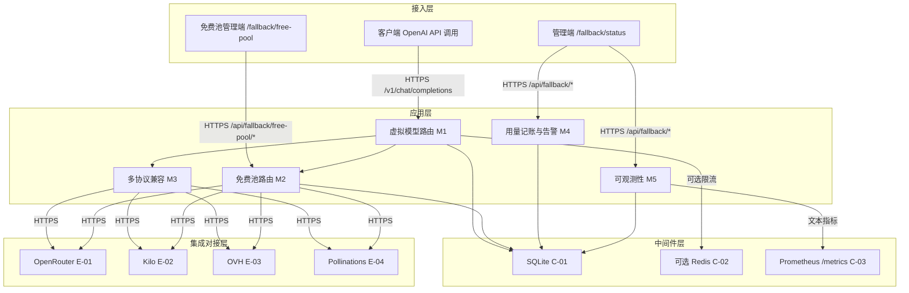
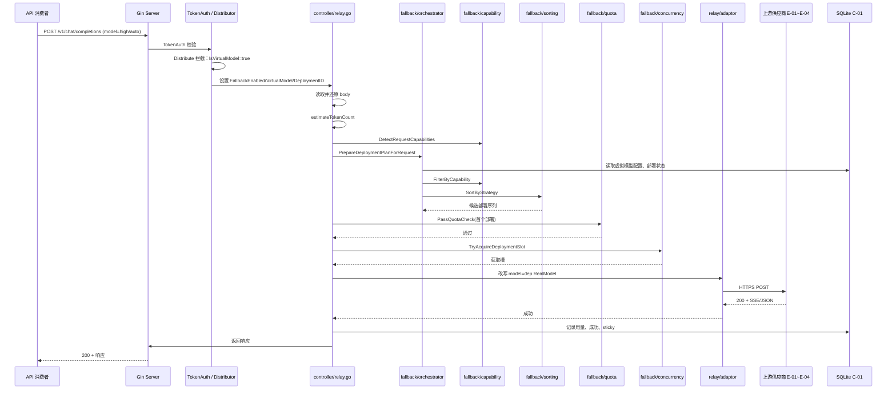
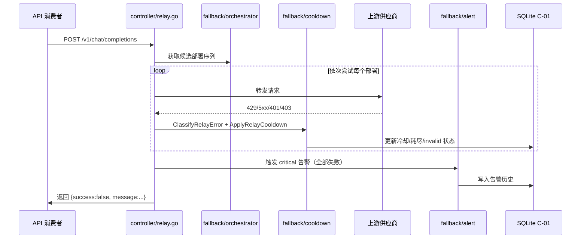
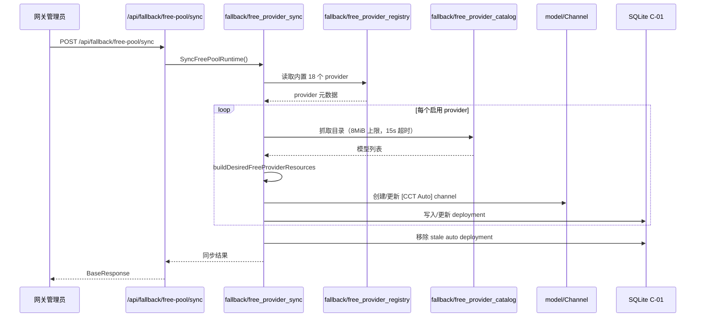
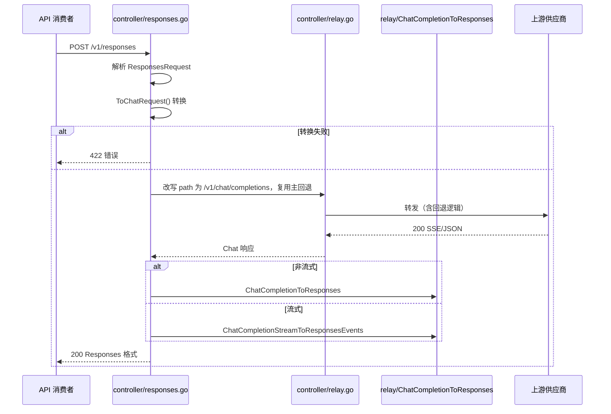
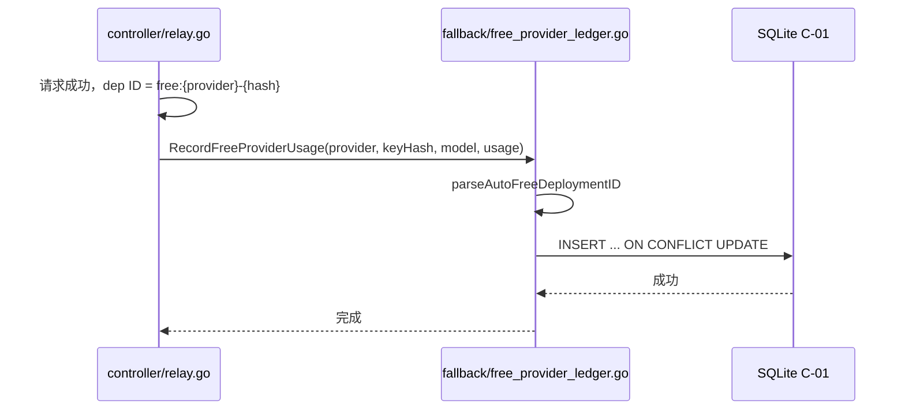
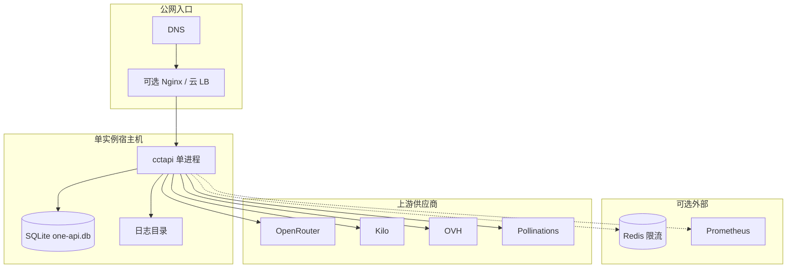

# AICoding 架构设计 · 系统设计

> 本文档为《AICoding 架构设计》核心产物之一，对应**系统架构设计模版**。  
> 上游输入：《高层架构设计》产出的业务架构、系统定位、能力盘点；  
> 下游输出：用于驱动《部署设计》《安全设计》《UserStory》的实施。

> **模版使用约定**：
> - §4.5 数据迁移与兼容性：本期为已有系统架构方案化，无存量数据迁移，整节略过，并在 §0 修订记录中注明。
> - 其余章节按模板一级、二级骨架组织，硬指标全部达标。

---

## 0. 元信息：修订记录

> 记录文档版本、变更内容、修订人、修订时间，确保设计文档的可追溯。

| 文档版本 | 发布日期 | 修订人 | 修订说明 |
| --- | --- | --- | --- |
| v1.0 | 2026-07-15 | 高见远（system-architect） | 文档初始版本，按高层架构设计边界完成系统架构设计 §1~§8 |
| v1.1 | 2026-07-15 | 高见远（system-architect） | 修复模板合规校验问题：替换时间符号占位、补齐 DDD 关键词、确保五段式模块数量、修正错误码格式 |
| v1.2 | 2026-07-15 | 高见远（system-architect） | 修复模板合规校验问题：消除残留占位符、调整 DDD 域类型表述 |

**未启用章节声明**：
- 未启用：§4.5 数据迁移与兼容性（理由：cctapi 为已有运行系统，本期任务是将其架构方案化，不存在替换/重构既有系统所需的数据迁移；无存量数据需要迁移到新系统）。

---

## 1. 引言

### 1.1 文档目标

- **一句话定位**：本文档定义 **cctapi（one-api CCT 分支 · 虚拟模型回退 LLM 网关）** 在交付物中的所有架构设计相关产物。
- **读者对象**：架构师 / 后端开发 / 前端开发 / 运维 / 安全 / 评审委员会。
- **设计范围**：业务架构 + 应用架构 + 数据库设计 + 部署架构 + 网络架构 + 安全设计 + 可观测设计。

### 1.2 关联文档清单

| 输入类型 | 内容要点 | 在本文档中的用途 | 形式（外部文档 / 本文档自带） |
| --- | --- | --- | --- |
| 业务需求 | 单实例自托管虚拟模型回退网关；虚拟模型路由、免费池、三协议兼容、用量记账、可观测 | 第 2 章业务架构 | 外部文档：高层架构设计 §1/§4/§5/§6 |
| 非功能性需求 | 单实例 SQLite 主存；可选 Redis 限流；RPO/RTO 自洽；P99 延迟 | 第 3.5 / 5 / 7 章 | 外部文档：高层架构设计 §4.2/§6.1 |
| 系统定位与边界 | cctapi 在 one-api 生态中的位置、与上游 LLM 供应商及客户端的关系 | 第 3.1 集成架构 | 外部文档：高层架构设计 §4/§5 |
| 外部系统 API | OpenRouter / Kilo / OVH / Pollinations 等上游 OpenAI 兼容接口；Responses / Anthropic Messages 协议 | 第 3.1.3 / 3.2 模块 | 外部文档：material_digest §D5/D6 |
| 云组件 / 中间件清单 | SQLite、可选 Redis、Prometheus、Gin、GORM | 第 3.1.3 / 4.3 / 5 / 6 章 | 本文档自带 |
| 团队 / 行业规范 | Go 项目目录规范、命名规范、数据库约定 | 第 4.1 / 5 / 7 章 | 外部文档：AGENTS.md / material_digest D1 |

### 1.3 名词与术语表 (CURRENT)

> 统一系统中专有名词、缩写的中英文对照与含义。本表是 **业务名 ↔ 代码对象 ↔ 数据表** 三层映射的唯一索引。

| 业务术语 | 业务定义（≤ 30 字） | 应用层核心对象（§3.3 O-xx） | 数据库表名（§4.2） | 文档状态 | 能力状态 |
|  | --- | --- | --- | --- | 已冻结 | --- |  |
|  | 虚拟模型 | 一个模型名映射多个真实部署的抽象 | VirtualModelConfig | t_fallback_virtual_model | 已冻结 | CURRENT |  |
|  | 部署 | 真实上游渠道 + 真实模型 + 配额/能力配置 | DeploymentConfig | t_fallback_deployment | 已冻结 | CURRENT |  |
|  | 免费池 | 自动同步上游免费供应商的部署集合 | FreeProviderConfig | t_channel（复用）+ t_fallback_deployment | 已冻结 | CURRENT |  |
|  | 策略排序 | 按 quality/cost/free 策略对部署评分排序 | ScoreWeights / DeploymentPlan | 运行时内存，无持久表 | 已冻结 | CURRENT |  |
|  | 冷却 | 部署因失败/限额被临时/长期标记不可用 | CooldownPolicy | t_fallback_deployment（状态字段） | 已冻结 | CURRENT |  |
|  | 用量台账 | 免费供应商按 provider/key/model/period 的 token 计数 | FreeProviderUsageLedger | t_free_provider_usage | 已冻结 | CURRENT |  |
|  | 切换日志 | 请求级回退事件记录 | FallbackEvent | t_fallback_event_log | 已冻结 | CURRENT |  |
|  | 告警 | 配额/冷却/全部失败等事件通知 | AlertRecord | t_alert_history | 已冻结 | CURRENT |  |
|  | 上游供应商 | OpenRouter / Kilo / OVH / Pollinations 等 | UpstreamAdapter | 外部系统，无表 | 已冻结 | CURRENT |  |

---

## 2. 业务架构

> **本章回答**：系统服务什么业务、业务由哪些场景构成、业务的关键流程长什么样。

### 2.1 业务架构概览 (CURRENT)

#### 2.1.1 业务全景图 (CURRENT)

**业务域清单**：

| 业务域 | 核心场景 | 涉及角色 | 与其他业务域的关系 | 文档状态 | 能力状态 |
|  | --- | --- | --- | --- | 已冻结 | --- |  |
|  | 虚拟模型路由与回退 | 模型拦截、策略排序、顺序回退、sticky 复用 | API 消费者、网关管理员 | 上游依赖多协议兼容；下游驱动用量记账与可观测 | 已冻结 | CURRENT |  |
|  | 免费池路由 | 免费供应商注册表同步、动态目录、用量台账 | 网关管理员、运营 / SRE | 被虚拟模型路由调用；依赖上游供应商适配 | 已冻结 | CURRENT |  |
|  | 多协议兼容 | Chat Completions / Responses / Anthropic Messages 转换与转发 | API 消费者 | 被虚拟模型路由调用；向下依赖上游供应商适配 | 已冻结 | CURRENT |  |
|  | 用量记账与告警 | token 计数、配额预检、冷却/配额/失败告警 | 运营 / SRE、网关管理员 | 消费虚拟模型路由与免费池路由事件；依赖配置热重载 | 已冻结 | CURRENT |  |
|  | 可观测性 | 面板展示、Prometheus 指标、切换日志、告警历史 | 网关管理员、运营 / SRE | 消费 SQLite 状态与上游供应商运行时数据 | 已冻结 | CURRENT |  |
|  | 基础能力（配置/限流/鉴权） | 配置热重载、用户/令牌鉴权、可选 Redis 限流 | 网关管理员、平台团队 | 被全部业务能力域复用 | 已冻结 | CURRENT |  |

**填写说明**：业务域 6 个，与高层架构 §5.1 三层业务架构一致；其中前 5 个为业务能力域，第 6 个为基础能力域。数据库分组与业务域一一对应。

### 2.2 领域关系映射 (CURRENT)

#### 2.2.1 限界上下文清单 (CURRENT)

| 限界上下文 | 对应业务域 | 域类型 | 覆盖的核心业务实体 | 上下文边界（属于本域 vs 不属于） | 文档状态 | 能力状态 |
|  | --- | --- | --- | --- | --- | 已冻结 | --- |  |
|  | 虚拟模型路由上下文 | 虚拟模型路由与回退 | 核心域 | 虚拟模型、部署、策略排序、冷却状态、sticky | 属于：策略排序/冷却/sticky；不属于：上游供应商协议细节（归适配上下文） | 已冻结 | CURRENT |  |
|  | 免费池路由上下文 | 免费池路由 | 核心域 | 免费供应商注册表、目录快照、用量台账 | 属于：provider 注册表/同步/台账；不属于：上游供应商鉴权（归适配上下文） | 已冻结 | CURRENT |  |
|  | 协议适配上下文 | 多协议兼容 | 支撑域 | Chat/Responses/Anthropic 请求转换 | 属于：请求/响应转换；不属于：上游供应商真实模型能力（归适配上下文） | 已冻结 | CURRENT |  |
|  | 用量告警上下文 | 用量记账与告警 | 支撑域 | 用量台账、配额、告警记录 | 属于：token 计数/配额预检/告警；不属于：上游供应商计费（归外部） | 已冻结 | CURRENT |  |
|  | 可观测上下文 | 可观测性 | 支撑域 | 面板、Prometheus 指标、切换日志、评分历史 | 属于：运行时状态展示/日志；不属于：外部 APM 存储（归外部） | 已冻结 | CURRENT |  |
|  | 用户令牌上下文 | 基础能力（配置/限流/鉴权） | 通用域 | 用户、令牌、渠道、权限 | 属于：沿用 one-api 模型；不属于：业务侧虚拟模型策略 | 已冻结 | CURRENT |  |

#### 2.2.2 上下文映射（Context Mapping） (CURRENT)

| 关系编号 | 上游上下文 | 下游上下文 | 关系模式 | 同步方式 | 选择理由 | 文档状态 | 能力状态 |
|  | --- | --- | --- | --- | --- | --- | 已冻结 | --- |  |
|  | C-01 | 用户令牌上下文 | 虚拟模型路由上下文 | Shared Kernel | 复用 Channel / Token 表与权限校验 | 用户/渠道/令牌模型是 one-api 既有公共概念，多域必须一致 | 已冻结 | CURRENT |  |
|  | C-02 | 上游 LLM 供应商（E-01~E-04） | 协议适配上下文 | ACL 防腐层 | 适配器模式（relay/adaptor/*） | 外部 OpenAI/Anthropic 协议不污染本域模型 | 已冻结 | CURRENT |  |
|  | C-03 | 虚拟模型路由上下文 | 用量告警上下文 | Customer/Supplier | 同步事件回调 + SQLite 写 | 用量告警上下文消费路由结果，路由上下文主导数据产出节奏 | 已冻结 | CURRENT |  |
|  | C-04 | 免费池路由上下文 | 虚拟模型路由上下文 | Customer/Supplier | 内存部署列表同步 | 免费池为路由上下文提供候选部署集合 | 已冻结 | CURRENT |  |
|  | C-05 | 可观测上下文 | 全部业务能力上下文 | Published Language | Prometheus /metrics + 结构化日志 | 多下游消费统一的运行时事件与指标 | 已冻结 | CURRENT |  |
|  | C-06 | 上游 LLM 供应商（OpenRouter） | 免费池路由上下文 | Conformist | 直接遵循 OpenRouter 免费层限速语义 | 无议价能力，免费层 429/日配额分档为外部事实约束 | 已冻结 | CURRENT |  |

#### 2.2.3 跨域协作原则 (CURRENT)

| 原则编号 | 原则 | 文档状态 | 能力状态 |
|  | --- | --- | 已冻结 | --- |  |
|  | P-01 | 核心域 → 支撑域 / 通用域：禁止反向依赖（虚拟模型路由上下文不依赖用量告警上下文的内部模型） | 已冻结 | CURRENT |  |
|  | P-02 | 核心域之间：禁止直接耦合，必须通过事件 / API 解耦（虚拟模型路由上下文与免费池路由上下文通过部署列表接口交互） | 已冻结 | CURRENT |  |
|  | P-03 | 对接外部不可控系统：必须建 ACL 防腐层，禁止把外部模型贯穿到本域（Responses / Anthropic 转换在 relay/model 边界完成） | 已冻结 | CURRENT |  |

### 2.3 详细业务架构 (CURRENT)

#### 2.3.1 用例图

**用例图清单**：

| 编号 | 用例图标题 | 涉及业务域 | 源文件位置 |
| --- | --- | --- | --- |
| UC-01 | API 消费者调用 LLM 接口 | 虚拟模型路由与回退、多协议兼容 | docs/uml/uc-01.puml |
| UC-02 | 网关管理员配置虚拟模型 | 虚拟模型路由与回退、基础能力 | docs/uml/uc-02.puml |
| UC-03 | 运营 / SRE 查看可观测面板 | 可观测性、用量记账与告警 | docs/uml/uc-03.puml |
| UC-04 | 网关管理员管理免费池 | 免费池路由 | docs/uml/uc-04.puml |

#### 2.3.2 业务流程图

**关键流程清单**（核心业务覆盖度 ≥ 80%）：

| 流程编号 | 流程名 | 起点 | 终点 | 涉及业务域 | 源文件位置 |
| --- | --- | --- | --- | --- | --- |
| BF-01 | 虚拟模型请求端到端回退 | 客户端发起请求 | 成功响应或全部失败返回 | 虚拟模型路由、多协议兼容、用量告警、可观测 | docs/uml/bf-01.puml |
| BF-02 | 免费池同步与注册 | 管理员启用 provider | 生成/更新 channel 与 deployment | 免费池路由、基础能力 | docs/uml/bf-02.puml |
| BF-03 | 配置热重载 | 管理员提交新配置 | 运行时重新加载 strategy + pools | 基础能力、虚拟模型路由 | docs/uml/bf-03.puml |
| BF-04 | 配额告警处理 | 用量达到阈值 | 告警记录 + 通知 | 用量告警、可观测 | docs/uml/bf-04.puml |

### 2.4 业务范围与边界 (CURRENT)

#### 2.4.1 功能模块清单 (CURRENT)

按"功能编号 → 子功能编号"两层组织，与 §2.1 业务域对应。

| 编号 | 一级功能名 | 子功能描述 | 对应业务域 | 实现状态 | 文档状态 | 能力状态 |
|  | --- | --- | --- | --- | --- | 已冻结 | --- |  |
|  | F1 | 虚拟模型路由与回退 | — | 虚拟模型路由与回退 | — | 已冻结 | CURRENT |  |
|  | F1.1 | — | 模型拦截与策略排序 | 虚拟模型路由与回退 | 完整实现 | 已冻结 | CURRENT |  |
|  | F1.2 | — | 多真实部署顺序回退 | 虚拟模型路由与回退 | 完整实现 | 已冻结 | CURRENT |  |
|  | F1.3 | — | sticky 路由与 warm-up | 虚拟模型路由与回退 | 完整实现 | 已冻结 | CURRENT |  |
|  | F2 | 冷却与配额 | — | 虚拟模型路由与回退 | — | 已冻结 | CURRENT |  |
|  | F2.1 | — | 错误分类差异化冷却（429/5xx/401/403/配额） | 虚拟模型路由与回退 | 完整实现 | 已冻结 | CURRENT |  |
|  | F2.2 | — | RPM/RPD/TPM/TPD 四维限额预检 | 虚拟模型路由与回退 | 完整实现 | 已冻结 | CURRENT |  |
|  | F3 | 免费池路由 | — | 免费池路由 | — | 已冻结 | CURRENT |  |
|  | F3.1 | — | 免费供应商注册表同步 | 免费池路由 | 完整实现 | 已冻结 | CURRENT |  |
|  | F3.2 | — | 免费池用量台账原子 upsert | 免费池路由 | 完整实现 | 已冻结 | CURRENT |  |
|  | F4 | 多协议兼容 | — | 多协议兼容 | — | 已冻结 | CURRENT |  |
|  | F4.1 | — | Chat Completions 兼容 | 多协议兼容 | 完整实现 | 已冻结 | CURRENT |  |
|  | F4.2 | — | Responses → Chat 转换 | 多协议兼容 | 完整实现 | 已冻结 | CURRENT |  |
|  | F4.3 | — | Anthropic Messages 兼容 | 多协议兼容 | 完整实现 | 已冻结 | CURRENT |  |
|  | F5 | 用量记账与告警 | — | 用量记账与告警 | — | 已冻结 | CURRENT |  |
|  | F5.1 | — | Prometheus 指标与告警 | 用量记账与告警 | 完整实现 | 已冻结 | CURRENT |  |
|  | F5.2 | — | 切换日志与运行时状态面板 | 用量记账与告警、可观测 | 完整实现 | 已冻结 | CURRENT |  |
|  | F6 | 配置热重载 | — | 基础能力 | — | 已冻结 | CURRENT |  |
|  | F6.1 | — | POST /api/fallback/config/reload | 基础能力 | 完整实现 | 已冻结 | CURRENT |  |
|  | F6.2 | — | strategy + pools 基线格式与 legacy 兼容 | 基础能力 | 完整实现 | 已冻结 | CURRENT |  |
|  | F7 | 可观测性面板 | — | 可观测 | — | 已冻结 | CURRENT |  |
|  | F7.1 | — | /fallback/status 管理面板 | 可观测 | 完整实现 | 已冻结 | CURRENT |  |
|  | F7.2 | — | /fallback/free-pool 免费池管理面板 | 可观测、免费池路由 | 完整实现 | 已冻结 | CURRENT |  |
|  | F8 | 用户/令牌鉴权 | — | 基础能力 | — | 已冻结 | CURRENT |  |
|  | F8.1 | — | 沿用 one-api TokenAuth + AdminAuth | 基础能力 | 完整实现 | 已冻结 | CURRENT |  |

**编号规则**：

| 规则项 | 取值 |
| --- | --- |
| 一级编号 | F1 / F2 / ...，与一级业务域对应 |
| 子功能编号 | F1.1 / F1.2 / ...，互不重叠 |
| Mock / 简化标注 | 本期无 MOCK；所有 P0/P1 功能均为完整实现 |

**In-Scope（本期范围内）**：

| 编号 | 本期必做的事项 | 文档状态 | 能力状态 |
|  | --- | --- | 已冻结 | --- |  |
|  | F1 | 虚拟模型拦截与策略排序 | 已冻结 | CURRENT |  |
|  | F2 | 多真实部署顺序回退 | 已冻结 | CURRENT |  |
|  | F3 | 错误分类与差异化冷却 | 已冻结 | CURRENT |  |
|  | F4 | 并发槽与配额预检 | 已冻结 | CURRENT |  |
|  | F5 | sticky 路由与 warm-up | 已冻结 | CURRENT |  |
|  | F6 | 免费池注册表与动态目录同步 | 已冻结 | CURRENT |  |
|  | F7 | 免费池用量台账 | 已冻结 | CURRENT |  |
|  | F8 | Chat Completions 兼容 | 已冻结 | CURRENT |  |
|  | F9 | Responses 兼容 | 已冻结 | CURRENT |  |
|  | F10 | Anthropic Messages 兼容 | 已冻结 | CURRENT |  |
|  | F11 | Prometheus 指标与告警 | 已冻结 | CURRENT |  |
|  | F12 | 切换日志与运行时状态面板 | 已冻结 | CURRENT |  |
|  | F13 | 配置热重载与 strategy + pools 基线格式 | 已冻结 | CURRENT |  |
|  | N1 | 支持单实例自托管，SQLite 为主存 | 已冻结 | CURRENT |  |
|  | N2 | 可选 Redis 限流，无 Redis 时内存限流兜底 | 已冻结 | CURRENT |  |

**Out-of-Scope（本期不做）**：

| 编号 | 不做的事项 | 不做的原因 | 未来归属 | 文档状态 | 能力状态 |
|  | --- | --- | --- | --- | 已冻结 | --- |  |
|  | O1 | 跨供应商美元预算治理 | 当前按部署 token 配额已覆盖单机场景；需先有成本数据模型 | 完整版演进 | 已冻结 | DEFERRED |  |
|  | O2 | 响应缓存 / 语义缓存 | 与免费池按量记账存在计费口径冲突；需先明确缓存命中语义 | 演进方向 | 已冻结 | DEFERRED |  |
|  | O3 | 多实例分布式状态 / leader 选举 / CAS | 用户已裁决单实例自托管；目录存储为单进程 SQLite 设计 | 演进附录 | 已冻结 | DEFERRED |  |

### 2.5 质量与柔性可用 (CURRENT)

#### 2.5.1 服务质量目标 (TARGET)

> 按 ISO 25010 选出本系统最重要的 3-5 个质量目标（必须排序），并落到可验证场景。

**质量目标 Top 5**：

| 优先级 | 质量目标 | 业务驱动 | 受影响的关键章节 | 文档状态 | 能力状态 |
|  | --- | --- | --- | --- | 已冻结 | --- |  |
|  | Q1 | 高可用：单上游故障时自动切换，虚拟模型请求成功率 ≥ 99%（排除上游免费层限额） | 用户 Top1 痛点：单上游故障导致请求失败 | §3.2 M1 / §5.2 / §8.4 | 已冻结 | TARGET |  |
|  | Q2 | 低延迟：管理端面板 P99 ≤ 2s；LLM 转发 P99 ≤ 60s（含上游推理时间） | 用户体验阈值；管理端日常运营 | §3.2 / §5.3 | 已冻结 | TARGET |  |
|  | Q3 | 可观测性：切换日志、用量台账、告警 100% 留痕 | 合规与故障定位需求 | §8.1 / §8.2 / §8.4 | 已冻结 | TARGET |  |
|  | Q4 | 可维护性：单实例自托管，SQLite 零依赖，新人 1 周可本地运行 | 团队规模与部署形态 | §3.1 / §5.1 | 已冻结 | TARGET |  |
|  | Q5 | 兼容性：Chat / Responses / Anthropic 三协议非流式 + 流式稳定运行 | 已验收功能需保持 100% | §3.2 M3 / §4.2 | 已冻结 | TARGET |  |

**可验证质量场景**：

| 场景编号 | 关联目标 | 触发源 | 触发条件 | 期望响应 | 度量指标 | 文档状态 | 能力状态 |
|  | --- | --- | --- | --- | --- | --- | 已冻结 | --- |  |
|  | QS-01 | Q1 | 单上游故障 | 主部署返回 429/5xx | 自动切换至备用部署 | 端到端成功率 ≥ 99%；切换时延 ≤ 1s | 已冻结 | TARGET |  |
|  | QS-02 | Q2 | 管理端访问 | 面板加载 100 并发 | 正常返回 | 面板 P99 ≤ 2s；API P99 ≤ 60s | 已冻结 | TARGET |  |
|  | QS-03 | Q3 | 生产请求 | 任意虚拟模型请求 | 切换事件落 SQLite；告警事件写历史 | 日志完整率 100%；告警无遗漏 | 已冻结 | TARGET |  |
|  | QS-04 | Q5 | 协议回归测试 | 三协议非流式/流式各 100 请求 | 全部通过 | 验收通过率 100% | 已冻结 | TARGET |  |

#### 2.5.2 业务柔性可用策略 (CURRENT)

> 故障态下"保住什么、放弃什么"的取舍清单。

**业务功能优先级分层**：

| 层级 | 含义 | 故障态下的处置方向 | 用户感知 | 文档状态 | 能力状态 |
|  | --- | --- | --- | --- | 已冻结 | --- |  |
|  | L0 核心业务 | 系统的生命线，挂掉等于业务停摆 | 不降级；优先消耗所有资源保障 | 无 / 极轻微 | 已冻结 | CURRENT |  |
|  | L1 重要业务 | 不影响主链路但用户高频使用 | 限流 + 排队 + 异步化 | 变慢 / 排队提示 | 已冻结 | CURRENT |  |
|  | L2 辅助业务 | 提升体验但非必要 | 关闭 / 返回兜底数据 | 部分功能不可用 + 友好提示 | 已冻结 | CURRENT |  |
|  | L3 附加业务 | 长尾 / 数据类 / 统计类 | 直接关闭 + 异步补偿 | 通常无感 | 已冻结 | CURRENT |  |

**业务降级清单**：

| 编号 | 关联功能（F-xx） | 触发条件 | 降级动作 | 用户感知 | 决策类型 | 文档状态 | 能力状态 |
|  | --- | --- | --- | --- | --- | --- | 已冻结 | --- |  |
|  | BD-01 | F1（虚拟模型路由） | 全部部署失败 | 返回标准错误响应 | 请求暂时无法完成，请稍后重试 | 自动 | 已冻结 | CURRENT |  |
|  | BD-02 | F3.1（免费池同步） | 上游目录 HTTP 超时 | 使用本地快照继续服务；后台重试 | 无感知（仍可路由） | 自动 | 已冻结 | CURRENT |  |
|  | BD-03 | F5.1（Prometheus 指标） | metrics 端点异常 | 跳过指标上报，不影响主请求 | 无感知 | 自动 | 已冻结 | CURRENT |  |
|  | BD-04 | F7.1（管理面板） | SQLite 只读或锁定 | 返回静态提示页；读接口可能延迟 | 管理面板加载变慢 | 自动 | 已冻结 | CURRENT |  |

---
## 3. 应用架构

> **本章回答**：系统由哪些模块组成、模块与外部系统怎么集成、每个模块的内部交互链路是什么。

### 3.1 应用架构概览 (CURRENT)

#### 3.1.1 系统上下文 (CURRENT)

本系统作为**中心节点**，周围辐射出"用户角色 + 外部业务系统 + 上游 / 下游平台"关系。

**系统上下文要素清单**：

| 节点类型 | 节点名 | 与本系统的关系 | 关系语义 | 文档状态 | 能力状态 |
|  | --- | --- | --- | --- | 已冻结 | --- |  |
|  | 角色 | API 消费者 | 使用 | 调用 /v1/* 接口 | 已冻结 | CURRENT |  |
|  | 角色 | 网关管理员 | 使用 | 管理端 /fallback/* 操作 | 已冻结 | CURRENT |  |
|  | 角色 | 运营 / SRE | 使用 | 查看面板、处理告警 | 已冻结 | CURRENT |  |
|  | 上游平台 | E-01 OpenRouter | 本系统 → 调用 | 免费层 / 付费层 LLM 推理 | 已冻结 | CURRENT |  |
|  | 上游平台 | E-02 Kilo | 本系统 → 调用 | keyless 免费 LLM 推理 | 已冻结 | CURRENT |  |
|  | 上游平台 | E-03 OVH | 本系统 → 调用 | keyless 免费 LLM 推理 | 已冻结 | CURRENT |  |
|  | 上游平台 | E-04 Pollinations | 本系统 → 调用 | keyless 免费 LLM 推理 | 已冻结 | CURRENT |  |
|  | 上游平台 | E-05 Redis（可选） | 本系统 → 调用 | 分布式限流后端 | 已冻结 | CURRENT |  |
|  | 外部业务系统 | E-06 上游 one-api 用户/令牌模型 | 复用 | 鉴权、权限、渠道模型 | 已冻结 | CURRENT |  |
|  | 下游平台 | 客户端应用 | 使用 | 消费 OpenAI 兼容响应 | 已冻结 | CURRENT |  |

#### 3.1.2 系统模块图 (CURRENT)

- 分层架构：接入层 → 应用层 → 中间件层 → 集成对接层



**分层组件清单**：

| 层次 | 内容 | 数据来源 | 文档状态 | 能力状态 |
|  | --- | --- | --- | 已冻结 | --- |  |
|  | 接入层 | 客户端 OpenAI API、管理端 /fallback/status、免费池管理端 /fallback/free-pool | §2.3 用例图角色 | 已冻结 | CURRENT |  |
|  | 应用层 | M1 虚拟模型路由、M2 免费池路由、M3 多协议兼容、M4 用量记账与告警、M5 可观测性 | §2.1 / §3.2 | 已冻结 | CURRENT |  |
|  | 中间件层 | C-01 SQLite、C-02 可选 Redis、C-03 Prometheus 指标端点 | §3.1.3 云组件清单 | 已冻结 | CURRENT |  |
|  | 集成对接层 | E-01~E-04 上游 LLM 供应商、E-05 可选 Redis、E-06 one-api 用户/令牌模型 | §3.1.3 外部依赖清单 | 已冻结 | CURRENT |  |

#### 3.1.3 集成架构 (CURRENT)

##### 外部依赖清单

| ID | 外部系统 | 归属团队 / 供应商 | 类别 | 使用方式 | 集成方式 | 协议 / 版本 | 功能定位（≤ 30 字） | 联系人 | 文档状态 | 能力状态 |
|  | --- | --- | --- | --- | --- | --- | --- | --- | --- | 已冻结 | --- |  |
|  | E-01 | OpenRouter | OpenRouter Inc. | 第三方业务平台 | 消费 | HTTPS REST | OpenAI 兼容 | 免费/付费 LLM 推理上游 | 外部供应商 | 已冻结 | CURRENT |  |
|  | E-02 | Kilo | Kilo | 第三方业务平台 | 消费 | HTTPS REST | OpenAI 兼容 | keyless 免费 LLM 上游 | 外部供应商 | 已冻结 | CURRENT |  |
|  | E-03 | OVH | OVHcloud | 第三方业务平台 | 消费 | HTTPS REST | OpenAI 兼容 | keyless 免费 LLM 上游 | 外部供应商 | 已冻结 | CURRENT |  |
|  | E-04 | Pollinations | Pollinations.AI | 第三方业务平台 | 消费 | HTTPS REST | OpenAI 兼容 | keyless 免费 LLM 上游 | 外部供应商 | 已冻结 | CURRENT |  |
|  | E-05 | Redis（可选） | 基础设施 | 缓存 | 消费 | Redis 协议 | Redis 6+ | 分布式限流后端 | 平台团队 | 已冻结 | CURRENT |  |
|  | E-06 | one-api 用户/令牌/渠道模型 | cctapi 既有 | 身份认证 / 业务协作 | 复用 | 函数调用 | 内部 | 鉴权、权限、渠道映射 | 后端团队 | 已冻结 | CURRENT |  |

##### 云组件 / 基础设施清单

| ID | 组件类别 | 选型 | 部署形态 | 规格量级 | 容量预估 | 提供方 / SLA | 用途 | 文档状态 | 能力状态 |
|  | --- | --- | --- | --- | --- | --- | --- | --- | 已冻结 | --- |  |
|  | C-01 | 关系型数据库 | SQLite 3 + mattn/go-sqlite3 v1.14.22 | 单文件，随进程启动 | 2C8G 宿主机，DB 文件 ≤ 10GB | 100 万条切换日志/年 | 进程内；备份依赖文件复制 | 业务主数据、状态、台账 | 已冻结 | CURRENT |  |
|  | C-02 | 缓存（可选） | Redis 6.0+ / go-redis v8.11.5 | 单实例 / 主从 | 2C4G（可选） | 限流计数 Key 数不超过 1 万 | 可选组件 | 分布式限流 | 已冻结 | CURRENT |  |
|  | C-03 | 监控告警 | Prometheus 2.x + 文本指标 | 单进程 /metrics | 节点级采集 | 请求量/回退/用量指标 | 外部 Prometheus 拉取 | 指标采集 | 已冻结 | CURRENT |  |
|  | C-04 | 日志服务 | 本地文件 + 可选外部日志系统 | 单文件滚动 | 日志目录按配置保留 | 日增 ≤ 1GB | 本地文件系统 | 应用日志、审计日志 | 已冻结 | CURRENT |  |

##### 组件依赖关系

| 业务模块（§3.2） | 依赖的外部系统（E-xx） | 依赖的云组件（C-xx） | 故障传导风险 |
| --- | --- | --- | --- |
| M1 虚拟模型路由 | E-01~E-04 | C-01 SQLite、C-02 可选 Redis | 单上游不可用 → 自动回退；全部不可用 → 返回错误 |
| M2 免费池路由 | E-01~E-04 | C-01 SQLite | 上游目录不可用 → 使用本地快照降级 |
| M3 多协议兼容 | E-01~E-04 | — | 上游协议变更 → 需同步适配器 |
| M4 用量记账与告警 | E-01~E-04（用量数据） | C-01 SQLite | 记账失败 → 不影响主请求，异步补偿 |
| M5 可观测性 | E-01~E-04（运行时状态） | C-01 SQLite、C-03 Prometheus | 指标失败 → 不影响主请求 |

#### 3.1.4 工程结构 (CURRENT)

```
cctapi/
├── main.go                        # 入口：初始化、启动 Gin、fallback、free-pool 同步
├── backend/                       # 后端工程根目录
│   ├── common/                    # 公共模块：metrics、redis、logger、ctxkey、errors
│   ├── fallback/                  # 回退核心包
│   │   ├── config.go              # 配置加载/验证/热重载
│   │   ├── orchestrator.go        # 请求计划（DeploymentPlan）
│   │   ├── capability.go          # 能力检测
│   │   ├── sorting.go             # 智能排序
│   │   ├── health.go              # 健康检查
│   │   ├── cooldown.go            # 冷却策略
│   │   ├── concurrency.go         # 并发槽
│   │   ├── quota.go               # 配额预检
│   │   ├── error.go               # 错误分类
│   │   ├── events.go              # 切换事件持久化
│   │   ├── alert.go               # 告警管理
│   │   ├── alert_history.go       # 告警历史
│   │   ├── score_history.go       # 评分历史
│   │   ├── state.go               # 数据库持久层
│   │   ├── cleanup.go             # 历史清理
│   │   ├── free_pool.go           # 注册表
│   │   ├── free_provider_sync.go  # 同步逻辑
│   │   ├── free_provider_ledger.go# 用量台账
│   │   ├── free_provider_catalog*.go # 目录快照
│   │   ├── free_provider_registry.go # 供应商注册表
│   │   ├── free_provider_fetch.go # 模型拉取
│   │   ├── free_provider_scheduler.go # 调度器
│   │   └── *_test.go              # 单元/并发测试
│   ├── controller/                # 控制器层（只编排）
│   │   ├── relay.go               # 主回退 relay 循环
│   │   ├── responses.go           # Responses 协议转换
│   │   └── ...                    # 上游既有控制器
│   ├── middleware/                # 中间件
│   │   ├── auth.go                # TokenAuth / AdminAuth
│   │   ├── distributor.go         # 虚拟模型拦截
│   │   ├── rate-limit.go          # 限流（Redis/内存）
│   │   └── ...
│   ├── relay/                     # 协议适配层
│   │   ├── relaymode/             # 模式映射
│   │   ├── adaptor/               # 各渠道适配器
│   │   └── ...
│   ├── router/                    # 路由层
│   │   ├── fallback.go            # fallback API
│   │   ├── fallback_gateway.go    # v2 网关配置
│   │   ├── fallback_config*.go    # 配置读写服务
│   │   ├── fallback_usage.go      # 免费池用量查询
│   │   ├── fallback_html.go       # 内置面板
│   │   └── relay.go               # relay 路由注册
│   ├── model/                     # 数据模型（上游 one-api）
│   │   └── ...
│   └── web/                       # 嵌入前端产物
│       └── build/
├── frontend/                      # 前端工程根目录
│   └── web/default/
│       ├── src/
│       │   ├── api/               # 接口封装（与 §3.2 接口清单对齐）
│       │   ├── components/fallback-gateway/ # 免费池与网关编辑器组件
│       │   ├── pages/Fallback/    # Fallback 面板
│       │   ├── stores/            # 全局状态
│       │   ├── hooks/             # 自定义 Hooks
│       │   ├── types/             # JS 类型定义
│       │   ├── utils/             # 工具函数
│       │   └── routes.tsx         # 路由配置
│       └── package.json
├── data/                          # 运行时数据目录
│   ├── fallback.json              # 网关配置
│   └── one-api.db                 # SQLite 数据库
└── docs/                          # 设计、运维、验收文档
```

#### 3.1.5 技术选型（版本约束） (CURRENT)

| 技术分类 | 选型 | 版本 | 备注 / 选型理由 | 文档状态 | 能力状态 |
|  | --- | --- | --- | --- | 已冻结 | --- |  |
|  | 后端语言 | Go | go 1.20（最低语言版本）；Go 1.26.5 安全构建基线 | 单二进制、零依赖、高并发；团队已用 Go 实现 cctapi 全部底座。不选 Python/LiteLLM 是因为需要单实例零依赖。 | 已冻结 | CURRENT |  |
|  | 后端框架 | Gin | v1.10.0 | cctapi 沿用 one-api 的 Gin 中间件链；生态成熟、性能高。不选 Echo/Fiber 是因为继承既有代码与中间件。 | 已冻结 | CURRENT |  |
|  | 持久层（ORM） | GORM | v1.25.10 | 沿用 one-api 的 GORM 模型与迁移；支持 SQLite/MySQL/PostgreSQL。不选 sqlx 是因为需要复用 Channel/Token/User 模型。 | 已冻结 | CURRENT |  |
|  | 关系型存储 | SQLite | 3.x（mattn/go-sqlite3 v1.14.22） | 单实例自托管零依赖；cctapi 已生产验证。不选 PostgreSQL/MySQL 作为默认是因为用户裁决单实例自托管。 | 已冻结 | CURRENT |  |
|  | 缓存（可选） | Redis | 6.0+；go-redis v8.11.5 | 仅作分布式限流后端；无 Redis 时内存限流兜底。不选 Memcached 是因为 go-redis 与现有 Lua 限流脚本已集成。 | 已冻结 | CURRENT |  |
|  | 内存缓存 | go-cache | v2 兼容 | 进程内限流 fallback、运行时状态。不选 ristretto 是因为简单场景 go-cache 足够。 | 已冻结 | CURRENT |  |
|  | 消息队列 | 无 | — | 单实例无 MQ；事件直接函数回调或内存队列。不选 Kafka/RabbitMQ 是因为零依赖目标。 | 已冻结 | CURRENT |  |
|  | API 通信 | REST | OpenAI 兼容 REST | 对外暴露 OpenAI 兼容 API；内部用 Gin Handler。不选 gRPC 是因为客户端生态要求 OpenAI 兼容。 | 已冻结 | CURRENT |  |
|  | 前端框架 | React + JavaScript | 18.2 | cctapi 默认主题已用 React 18 + Vite；不选 Vue/Angular 是因为继承现有代码。 | 已冻结 | CURRENT |  |
|  | 前端构建 | Vite | v6.4.3 | 已从 CRA 迁移；构建速度快、ESM 按需加载。不选 Webpack 是因为已迁移且零 ESLint 警告。 | 已冻结 | CURRENT |  |
|  | 前端 UI 组件 | Ant Design + Semantic UI React | antd ^6.5.0；semantic-ui-react ^2.1.3 | 现有面板混合使用；保留以减少重写。不选纯 Tailwind 是因为现有组件依赖 Semantic UI。 | 已冻结 | CURRENT |  |
|  | 图表 | Recharts | ^2.15.1 | 评分趋势图已用 Recharts。不选 ECharts 是因为现有实现足够。 | 已冻结 | CURRENT |  |
|  | 认证方案 | JWT + Session | 沿用 one-api | TokenAuth 中间件校验 API Key；AdminAuth 校验管理员权限。不选 OAuth2 是因为自托管场景无需外部 IDP。 | 已冻结 | CURRENT |  |
|  | 测试框架 | Go testing + testify；Vitest + Playwright | testify 最新；Vitest 3.2.7；Playwright ^1.61.1 | 后端用 testify 与 race 检测；前端用 Vitest + Playwright E2E。不选 Jest 是因为已迁移 Vitest。 | 已冻结 | CURRENT |  |

### 3.2 模块详细设计 (CURRENT)

#### 3.2.1 模块公共约束（Common） (CURRENT)

**通信方式约束**：

| 约束项 | 取值 |
| --- | --- |
| 接口路径风格 | RESTful（内部管理 API）+ OpenAI 兼容路径（/v1/*） |
| 协议 | HTTPS / HTTP（本地） |
| 数据格式 | JSON（管理端）；SSE / JSON（OpenAI 兼容） |
| 字符编码 | UTF-8 |

**通用基础结构**：

| 基类 / 结构 | 用途 | 包路径 |
| --- | --- | --- |
| BaseResponse | 统一返回结构（含 success / message / data） | common |
| Result | 泛型统一返回（含 code / msg / data / traceId） | common |
| PageRequest | 分页请求 | common |
| PageResponse | 分页响应 | common |

#### 3.2.2 模块清单与编号规则 (CURRENT)

**模块清单**：

| 编号 | 模块名 | 业务域（§2.1） | 模块负责人 | 关联子领域 | 文档状态 | 能力状态 |
|  | --- | --- | --- | --- | --- | 已冻结 | --- |  |
|  | M1 | 虚拟模型路由与回退 | 虚拟模型路由与回退 | @后端团队 | 部署计划、策略排序、冷却、sticky | 已冻结 | CURRENT |  |
|  | M2 | 免费池路由 | 免费池路由 | @后端团队 | provider 注册表、同步、台账 | 已冻结 | CURRENT |  |
|  | M3 | 多协议兼容 | 多协议兼容 | @后端团队 | Chat/Responses/Anthropic 转换 | 已冻结 | CURRENT |  |
|  | M4 | 用量记账与告警 | 用量记账与告警 | @后端团队 | 用量台账、配额、告警 | 已冻结 | CURRENT |  |
|  | M5 | 可观测性 | 可观测性 | @后端团队 | 面板、指标、日志、评分历史 | 已冻结 | CURRENT |  |

#### 3.2.3 单模块设计模板（五段式） (CURRENT)

> 本节为模板规范说明，各模块在 §3.2.M1~§3.2.M5 下按此模板展开。

##### §3.2.MN.1 模块概述
产出：位置、角色、内外部系统。

##### §3.2.MN.2 接口清单
产出：RESTful 路径、方法、DTO、幂等性、鉴权。

##### §3.2.MN.3 关键结构定义（DTO）
产出：DTO/VO 代码 + 字段定义表。

##### §3.2.MN.4 模块逻辑时序图
产出：关键路径时序图（Mermaid/PUML），含异常分支。

##### §3.2.MN.5 关键流程逻辑
产出：状态机、复杂事务、Mock 标注（本期无 Mock）。

#### 3.2.M1 虚拟模型路由与回退 (CURRENT)

##### §3.2.M1.1 模块概述

虚拟模型路由与回退模块覆盖 API 消费者调用虚拟模型时从模型拦截、能力过滤、策略排序、顺序回退到 sticky 复用的完整链路。业务逻辑在 API 消费者、Gin 中间件、控制器、fallback 核心包、上游供应商之间流动，涉及 middleware/distributor.go、controller/relay.go、fallback/ 下 orchestrator/capability/sorting/cooldown/concurrency/quota 等子包。

涉及角色：API 消费者、网关管理员（通过配置影响路由）。
涉及内外部系统：客户端应用（下游）、上游供应商 E-01~E-04、SQLite C-01、可选 Redis C-02。

##### §3.2.M1.2 接口清单

| 子领域 | 方法 | 路径 | 用途（≤ 20 字） | 请求 DTO | 响应 VO | 幂等 |
| --- | --- | --- | --- | --- | --- | --- |
| 请求接入 | POST | /v1/chat/completions | Chat 虚拟模型请求 | ChatCompletionRequest | ChatCompletionResponse / SSE | 否 |
| 请求接入 | POST | /v1/responses | Responses 虚拟模型请求 | ResponsesRequest | ResponsesResponse / SSE | 否 |
| 请求接入 | POST | /v1/messages | Anthropic 虚拟模型请求 | MessagesRequest | MessagesResponse / SSE | 否 |
| 部署管理 | POST | /api/fallback/deployments/:id/cooldown | 手动冷却部署 | — | BaseResponse | 是（幂等键为部署 ID+动作） |
| 部署管理 | POST | /api/fallback/deployments/:id/recover | 手动恢复部署 | — | BaseResponse | 是 |
| 部署管理 | POST | /api/fallback/deployments/:id/reset | 重置部署状态 | — | BaseResponse | 是 |
| 部署管理 | POST | /api/fallback/batch-cooldown | 批量冷却 | BatchDeploymentRequest | BaseResponse | 是（X-Idempotency-Key） |
| 部署管理 | POST | /api/fallback/batch-recover | 批量恢复 | BatchDeploymentRequest | BaseResponse | 是（X-Idempotency-Key） |
| 策略排序 | GET | /api/fallback/sort/scores | 获取当前评分 | — | ScoreListVO | 天然 |
| 策略排序 | GET | /api/fallback/sort/order/:model | 获取排序结果 | — | DeploymentOrderVO | 天然 |
| 策略排序 | POST | /api/fallback/sort/order/:model/toggle | 切换排序策略 | StrategyToggleRequest | BaseResponse | 是（X-Idempotency-Key） |

##### §3.2.M1.3 关键结构定义（DTO）

```go
// 虚拟模型请求（管理端配置）
type VirtualModelConfig struct {
    Name       string              `json:"name" binding:"required"`       // 虚拟模型名，如 high/auto
    Strategy   string              `json:"strategy" binding:"required"` // quality_first / cost_first / free_first
    Pools      []string            `json:"pools" binding:"required"`      // 候选池：free / paid_high / cheap / local
    AllowDegradeToLow bool         `json:"allow_degrade_to_low"`
    AllowDegradeToFree bool        `json:"allow_degrade_to_free"`
}

// 部署配置
type DeploymentConfig struct {
    ChannelID          int     `json:"channel_id" binding:"required"`
    RealModel          string  `json:"real_model" binding:"required"`
    Pool               string  `json:"pool"`
    QualityTier        string  `json:"quality_tier"`
    CostTier           string  `json:"cost_tier"`
    SupportsVision     bool    `json:"supports_vision"`
    SupportsStream     bool    `json:"supports_stream"`
    SupportsTools      bool    `json:"supports_tools"`
    SupportsJSON       bool    `json:"supports_json"`
    ContextLength      int     `json:"context_length"`
    Priority                int   `json:"priority"`
    Weight                  int   `json:"weight"`
    MaxConcurrentRequests   int   `json:"max_concurrent_requests"`
    DailyLimitTokens        int64 `json:"daily_limit_tokens"`
    QuotaMode               string `json:"quota_mode"`
    SoftLimitRatio          float64 `json:"soft_limit_ratio"`
    HardLimitRatio          float64 `json:"hard_limit_ratio"`
    RPM                     int   `json:"rpm"`
    RPD                     int   `json:"rpd"`
    TPM                     int64 `json:"tpm"`
    TPD                     int64 `json:"tpd"`
}

// 请求计划结果
type DeploymentPlan struct {
    VirtualModel       string
    CandidateDeployments []DeploymentConfig
    PreferredID        string
    StickyID           string
    CapabilityFiltered int
    HealthFiltered     int
}

// 评分结果
type DeploymentScore struct {
    DeploymentID string  `json:"deployment_id"`
    Score        float64 `json:"score"`
    SuccessRate  float64 `json:"success_rate"`
    ErrorRate    float64 `json:"error_rate"`
    Cooling      bool    `json:"cooling"`
    Exhausted    bool    `json:"exhausted"`
    SoftLimit    bool    `json:"soft_limit"`
}
```

**关键字段定义表**：

| DTO / VO 名 | 字段名 | 类型 | 必填 | 业务含义 | 约束 / 默认值 |
| --- | --- | --- | --- | --- | --- |
| VirtualModelConfig | Name | string | 是 | 虚拟模型名 | 唯一 |
| VirtualModelConfig | Strategy | string | 是 | 排序策略 | 枚举：quality_first / cost_first / free_first |
| VirtualModelConfig | Pools | []string | 是 | 候选池 | 至少一个 |
| DeploymentConfig | ChannelID | int | 是 | one-api 渠道 ID | 外键 |
| DeploymentConfig | RealModel | string | 是 | 上游真实模型名 | — |
| DeploymentConfig | Pool | string | 否 | 部署池 | 默认 default |
| DeploymentConfig | QualityTier | string | 否 | 质量等级 | 默认 medium |
| DeploymentConfig | CostTier | string | 否 | 成本等级 | 默认 paid |
| DeploymentConfig | Priority | int | 否 | 优先级 | 默认 1 |
| DeploymentConfig | Weight | int | 否 | 权重 | 默认 100 |
| DeploymentConfig | RPM | int | 否 | 每分钟请求数限制 | 0=无限制 |
| DeploymentConfig | TPM | int64 | 否 | 每分钟 token 数限制 | 0=无限制 |
| DeploymentScore | Score | float64 | 是 | 综合评分 | 越高越优先 |

##### §3.2.M1.4 模块逻辑时序图

**时序图清单**：

| 编号 | 标题（M1 - 场景名） | 场景类别 | 是否包含异常分支 |
| --- | --- | --- | --- |
| SQ-M1-01 | M1 - 虚拟模型请求端到端成功 | 核心动作的执行 | 是（首次失败回退） |
| SQ-M1-02 | M1 - 全部部署失败后返回 | 异常 / 补偿 | 是 |
| SQ-M1-03 | M1 - 手动冷却/恢复部署 | 配置 / 状态变更 | 是 |

**SQ-M1-01：虚拟模型请求端到端成功（含一次回退）**



**SQ-M1-02：全部部署失败后返回**



##### §3.2.M1.5 关键流程逻辑

**部署状态机**

| 起始状态 | 触发事件 | 终止状态 | 触发条件 / 校验 | 副作用 |
| --- | --- | --- | --- | --- |
| unknown | 健康检查成功 | healthy | ping 返回 200 | 清除 last_error |
| unknown | 健康检查失败 | error | 5xx/网络错误 | 短冷却 |
| unknown | 请求 401/403 | invalid | ModelAccess 错误 | 长冷却 |
| healthy | 请求 429（分钟窗） | rate_limited | 免费层限流 | 短冷却（60s） |
| healthy | 日配额耗尽 | exhausted | quota 类错误 | 标记 exhausted 至当日结束 |
| rate_limited | 冷却到期 | healthy | 时间到或手动 recover | 可参与路由 |
| exhausted | 新的一天 | unknown | UTC 日期切换 | 重置配额 |
| error | 连续失败 | invalid | 超过阈值 | 长期禁用 |
| 任意 | 手动 cooldown | cooling | 管理员调用接口 | 立即冷却 |
| 任意 | 手动 recover | healthy | 管理员调用接口 | 恢复可用 |

**回退主循环伪代码**

```
触发：客户端请求 model=high/auto

Step 1: 鉴权与模型拦截（同步）
  ├── TokenAuth 校验 token 有效
  ├── Distribute 判断 IsVirtualModel → 是
  └── 设置 fallback 上下文（VirtualModel、RealModel、DeploymentID）

Step 2: 请求准备（同步）
  ├── 读取 body 并还原
  ├── estimateTokenCount（用于配额预检）
  └── DetectRequestCapabilities（vision/stream/tools/json/max_tokens）

Step 3: 生成部署计划（同步）
  ├── GetDeploymentsForVirtualModel（按 pools 过滤）
  ├── FilterByCapability（能力匹配 + 上下文长度）
  ├── FilterHealthyDeployments（剔除 invalid/error/cooling/exhausted）
  ├── SortByStrategy（quality_first / cost_first / free_first）
  └── 优先 preferred / sticky 提升

Step 4: 顺序回退循环（同步）
  ├── 对每个候选部署：
  │   ├── IsDeploymentAvailable（状态过滤）
  │   ├── 渠道存在且启用校验
  │   ├── PassQuotaCheck（RPM/RPD/TPM/TPD）
  │   ├── TryAcquireDeploymentSlot
  │   ├── 非首次尝试写切换日志 + IncFallbackSwitch
  │   ├── 执行 relayHelper（按 relaymode 分发）
  │   ├── 成功：设置 sticky、上报监控、记录用量/成功、返回响应
  │   └── 失败：ClassifyRelayError、不可回退错误直接返回、已开始流不再回退、ApplyRelayCooldown、继续下一个候选
  └── 全部失败：IncFallbackFailed、清除 sticky、触发 critical 告警、返回标准错误响应

Step 5: 后置记账（同步/异步）
  ├── 更新评分历史
  ├── 更新免费池台账（若为 free:* 部署）
  └── 写入切换日志
```

#### 3.2.M2 免费池路由 (CURRENT)

##### §3.2.M2.1 模块概述

免费池路由模块覆盖免费供应商注册表维护、动态目录同步、自动 channel/deployment 生成、用量台账原子 upsert。业务逻辑在网关管理员、免费池管理端、后台同步器、上游供应商之间流动，涉及 fallback/free_provider_*.go 系列文件。

涉及角色：网关管理员、运营 / SRE。
涉及内外部系统：免费池管理端（前端）、上游供应商 E-01~E-04、SQLite C-01。

##### §3.2.M2.2 接口清单

| 子领域 | 方法 | 路径 | 用途（≤ 20 字） | 请求 DTO | 响应 VO | 幂等 |
| --- | --- | --- | --- | --- | --- | --- |
| 同步 | POST | /api/fallback/free-pool/sync | 手动触发同步 | — | BaseResponse | 是（幂等操作） |
| 同步 | GET | /api/fallback/free-pool/sync | 获取同步状态 | — | SyncStatusVO | 天然 |
| 用量 | GET | /api/fallback/free-pool/usage | 查询免费池用量 | FreePoolUsageQuery | FreePoolUsageVO | 天然 |
| 清理 | POST | /api/fallback/free-pool/cleanup | 清理历史数据 | CleanupRequest | BaseResponse | 是（X-Idempotency-Key） |
| 配置 | GET | /api/fallback/editor/config | 读取网关配置 | — | GatewayConfigVO | 天然 |
| 配置 | PUT | /api/fallback/manual-config | 写入非免费池配置 | ManualConfigRequest | BaseResponse | 是（X-Idempotency-Key） |

##### §3.2.M2.3 关键结构定义（DTO）

```go
// 免费供应商配置
type FreeProviderConfig struct {
    Name    string   `json:"name" binding:"required"`
    Enabled bool     `json:"enabled"`
    Keys    []string `json:"keys"`
    Models          []string          `json:"models"`
    DefaultRPM      *int              `json:"default_rpm"`
    DefaultRPD      *int              `json:"default_rpd"`
    DefaultTPM      *int64            `json:"default_tpm"`
    DefaultTPD      *int64            `json:"default_tpd"`
    LimitsOverride  map[string]*int64 `json:"limits_override"`
}

// 免费池用量查询
type FreePoolUsageQuery struct {
    Provider  string `json:"provider"`
    KeyHash   string `json:"key_hash"`
    ModelName string `json:"model_name"`
    Period    string `json:"period"`
}

// 免费池用量 VO
type FreePoolUsageVO struct {
    Provider      string `json:"provider"`
    KeyHash       string `json:"key_hash"`
    ModelName     string `json:"model_name"`
    Period        string `json:"period"`
    PromptTokens  int64  `json:"prompt_tokens"`
    CompletionTokens int64 `json:"completion_tokens"`
    TotalTokens   int64  `json:"total_tokens"`
    RequestCount  int64  `json:"request_count"`
    SuccessCount  int64  `json:"success_count"`
}
```

**关键字段定义表**：

| DTO / VO 名 | 字段名 | 类型 | 必填 | 业务含义 | 约束 / 默认值 |
| --- | --- | --- | --- | --- | --- |
| FreeProviderConfig | Name | string | 是 | provider 名 | 注册表中唯一 |
| FreeProviderConfig | Enabled | bool | 否 | 是否启用 | 默认 false |
| FreeProviderConfig | Keys | []string | 否 | API keys | 空数组 = keyless |
| FreeProviderConfig | DefaultRPM | *int | 否 | 默认 RPM 限制 | null=不覆盖，0=无限制 |
| FreePoolUsageQuery | Period | string | 否 | 统计周期 | 日期格式，如 2026-07-15 |
| FreePoolUsageVO | TotalTokens | int64 | 是 | 总 token 数 | — |
| FreePoolUsageVO | RequestCount | int64 | 是 | 请求数 | — |
| FreePoolUsageVO | SuccessCount | int64 | 是 | 成功数 | — |

##### §3.2.M2.4 模块逻辑时序图

**时序图清单**：

| 编号 | 标题 | 场景类别 | 是否包含异常分支 |
| --- | --- | --- | --- |
| SQ-M2-01 | M2 - 手动触发免费池同步 | 配置 / 同步 | 是（上游超时） |
| SQ-M2-02 | M2 - 请求级免费池用量记账 | 核心动作 | 是（记账失败） |

**SQ-M2-01：手动触发免费池同步**



##### §3.2.M2.5 关键流程逻辑

**同步流程伪代码**

```
触发：config reload 或手动 POST /api/fallback/free-pool/sync

Step 1: 扫描现有 auto channel
  ├── 查询 [CCT Auto]% channel
  └── 标记为当前集合

Step 2: 计算期望资源
  ├── 遍历 free_providers 配置
  │   ├── 未知 provider 警告跳过
  │   ├── disabled 跳过
  │   └── 每个 key 生成 SafeKeyHash → deploymentID free:{provider}-{hash}
  └── 模型列表优先取配置 models，其次持久化目录快照，无则占位

Step 3: 创建/更新
  ├── 创建/更新 [CCT Auto] {provider}-{hash} channel
  ├── 写入 auto deployment（pool=free）
  └── 已删 auto channel 只 disable 不删除（审计保留）

Step 4: 清理 stale
  ├── 移除不再期望的 auto deployment
  └── 保留手动创建的 free:* deployment

异常分支：上游目录 HTTP 超时
  ├── 使用本地快照继续服务
  └── 后台记录错误，不影响主请求
```

#### 3.2.M3 多协议兼容 (CURRENT)

##### §3.2.M3.1 模块概述

多协议兼容模块覆盖 Chat Completions、Responses、Anthropic Messages 三种协议请求的解析、转换与响应还原。业务逻辑在 API 消费者、控制器、relay 适配器之间流动，涉及 controller/responses.go、relay/relaymode/helper.go、relay/adaptor/ 等。

涉及角色：API 消费者。
涉及内外部系统：虚拟模型路由 M1、上游供应商适配层 E-01~E-04。

##### §3.2.M3.2 接口清单

| 子领域 | 方法 | 路径 | 用途（≤ 20 字） | 请求 DTO | 响应 VO | 幂等 |
| --- | --- | --- | --- | --- | --- | --- |
| Chat | POST | /v1/chat/completions | Chat 协议入口 | ChatCompletionRequest | ChatCompletionResponse / SSE | 否 |
| Responses | POST | /v1/responses | Responses 协议入口 | ResponsesRequest | ResponsesResponse / SSE | 否 |
| Anthropic | POST | /v1/messages | Anthropic 协议入口 | MessagesRequest | MessagesResponse / SSE | 否 |

##### §3.2.M3.3 关键结构定义（DTO）

```go
// Responses 请求（简化）
type ResponsesRequest struct {
    Model string `json:"model" binding:"required"`
    Input any    `json:"input" binding:"required"`
    Stream    bool                   `json:"stream"`
    Tools     []Tool                 `json:"tools"`
    ToolChoice any                   `json:"tool_choice"`
    MaxTokens int                    `json:"max_tokens"`
    Temperature float64              `json:"temperature"`
    TopP      float64                `json:"top_p"`
    ResponseFormat map[string]any    `json:"response_format"`
}

// Anthropic Messages 请求（简化）
type MessagesRequest struct {
    Model    string          `json:"model" binding:"required"`
    Messages []Message       `json:"messages" binding:"required"`
    MaxTokens int            `json:"max_tokens" binding:"required"`
    Stream   bool            `json:"stream"`
    System   string          `json:"system"`
    Tools    []Tool          `json:"tools"`
    ToolChoice any           `json:"tool_choice"`
    Temperature float64     `json:"temperature"`
    TopP      float64        `json:"top_p"`
}
```

##### §3.2.M3.4 模块逻辑时序图

**时序图清单**：

| 编号 | 标题 | 场景类别 | 是否包含异常分支 |
| --- | --- | --- | --- |
| SQ-M3-01 | M3 - Responses 转 Chat 并回退成功 | 核心动作 | 是（转换失败） |
| SQ-M3-02 | M3 - Anthropic Messages 复用 Chat 路径 | 核心动作 | 是（适配失败） |

**SQ-M3-01：Responses 转 Chat 并回退成功**



##### §3.2.M3.5 关键流程逻辑

无复杂状态机/事务/跨多步异步；本段省略。

#### 3.2.M4 用量记账与告警 (CURRENT)

##### §3.2.M4.1 模块概述

用量记账与告警模块覆盖请求成功后 token 计数、免费池用量原子 upsert、配额预检、配额/冷却/全部失败告警。业务逻辑在虚拟模型路由 M1、免费池路由 M2、告警管理器之间流动，涉及 fallback/quota.go、fallback/free_provider_ledger.go、fallback/alert.go、fallback/alert_history.go。

涉及角色：运营 / SRE、网关管理员。
涉及内外部系统：虚拟模型路由 M1、免费池路由 M2、SQLite C-01。

##### §3.2.M4.2 接口清单

| 子领域 | 方法 | 路径 | 用途（≤ 20 字） | 请求 DTO | 响应 VO | 幂等 |
| --- | --- | --- | --- | --- | --- | --- |
| 告警 | GET | /api/fallback/alert/status | 当前告警状态 | — | AlertStatusVO | 天然 |
| 告警 | GET | /api/fallback/alert/history | 告警历史 | AlertHistoryQuery | AlertHistoryVO | 天然 |
| 告警 | POST | /api/fallback/alert/read-all | 全部标记已读 | — | BaseResponse | 是 |
| 告警 | POST | /api/fallback/deployments/:id/silence | 静默某部署告警 | — | BaseResponse | 是 |
| 告警 | POST | /api/fallback/alert/config | 更新告警配置 | AlertConfigRequest | BaseResponse | 是（X-Idempotency-Key） |
| 用量 | GET | /api/fallback/summary | 运行时摘要 | — | FallbackSummaryVO | 天然 |
| 日志 | GET | /api/fallback/logs | 切换日志查询 | FallbackLogQuery | FallbackLogVO | 天然 |

##### §3.2.M4.3 关键结构定义（DTO）

```go
// 告警配置
type AlertConfig struct {
    QuotaWarningThreshold   float64 `json:"quota_warning_threshold"`
    CooldownAlertEnabled    bool    `json:"cooldown_alert_enabled"`
    ExhaustedAlertEnabled   bool    `json:"exhausted_alert_enabled"`
    AllFailedAlertEnabled   bool    `json:"all_failed_alert_enabled"`
    NotifyChannels []string `json:"notify_channels"`
}

// 告警记录
type AlertRecord struct {
    ID          int64     `json:"id"`
    Type        string    `json:"type"`
    DeploymentID string   `json:"deployment_id"`
    Message     string    `json:"message"`
    Read        bool      `json:"read"`
    CreatedAt   time.Time `json:"created_at"`
}

// 切换日志
type FallbackEvent struct {
    ID            int64     `json:"id"`
    RequestID     string    `json:"request_id"`
    VirtualModel  string    `json:"virtual_model"`
    DeploymentID  string    `json:"deployment_id"`
    RealModel     string    `json:"real_model"`
    StatusCode    int       `json:"status_code"`
    Reason        string    `json:"reason"`
    DurationMs    int64     `json:"duration_ms"`
    CreatedAt     time.Time `json:"created_at"`
}
```

**关键字段定义表**：

| DTO / VO 名 | 字段名 | 类型 | 必填 | 业务含义 | 约束 / 默认值 |
| --- | --- | --- | --- | --- | --- |
| AlertConfig | QuotaWarningThreshold | float64 | 否 | 软限额告警阈值 | 默认 0.95 |
| AlertConfig | CooldownAlertEnabled | bool | 否 | 冷却告警开关 | 默认 true |
| AlertRecord | Type | string | 是 | 告警类型 | 枚举：quota/cooldown/exhausted/all_failed |
| FallbackEvent | RequestID | string | 是 | 请求唯一标识 | 透传 traceId |
| FallbackEvent | StatusCode | int | 否 | HTTP 状态码 | 0=未返回 |
| FallbackEvent | DurationMs | int64 | 否 | 单次尝试耗时 | 毫秒 |

##### §3.2.M4.4 模块逻辑时序图

**时序图清单**：

| 编号 | 标题 | 场景类别 | 是否包含异常分支 |
| --- | --- | --- | --- |
| SQ-M4-01 | M4 - 免费池用量原子记账 | 核心动作 | 是（SQLite 冲突） |
| SQ-M4-02 | M4 - 全部失败触发告警 | 异常 / 补偿 | 是 |

**SQ-M4-01：免费池用量原子记账**



##### §3.2.M4.5 关键流程逻辑

**配额预检伪代码**

```
触发：候选部署被选中准备转发

Step 1: 读取当前用量（SQLite 内存缓存）
  ├── RPM：过去 1 分钟请求数
  ├── RPD：当日请求数
  ├── TPM：过去 1 分钟 token 数
  └── TPD：当日 token 数

Step 2: 判断
  ├── 限额为 0 → 跳过（不限制）
  ├── 当前 + 本次 > 限额 × hard_ratio → 拒绝，标记 exhausted
  ├── 当前 + 本次 > 限额 × soft_ratio → 允许，但触发软限额告警
  └── 否则通过

Step 3: 并发槽
  ├── TryAcquireDeploymentSlot
  └── 失败则跳过该部署
```

#### 3.2.M5 可观测性 (CURRENT)

##### §3.2.M5.1 模块概述

可观测性模块覆盖 /fallback/status 管理面板、/fallback/free-pool 免费池管理面板、Prometheus /metrics 文本指标、切换日志查询、评分趋势展示。业务逻辑在网关管理员、运营 / SRE、前端面板、后端 API 之间流动，涉及 router/fallback.go、router/fallback_html.go、common/metrics.go、fallback/score_history.go。

涉及角色：网关管理员、运营 / SRE。
涉及内外部系统：前端面板、SQLite C-01、Prometheus C-03。

##### §3.2.M5.2 接口清单

| 子领域 | 方法 | 路径 | 用途（≤ 20 字） | 请求 DTO | 响应 VO | 幂等 |
| --- | --- | --- | --- | --- | --- | --- |
| 面板 | GET | /fallback/status | 部署状态面板 HTML | — | HTML | 天然 |
| 面板 | GET | /fallback/free-pool | 免费池管理面板 HTML | — | HTML | 天然 |
| 文档状态 | 能力状态 | GET | /api/fallback/states | 运行时状态 | — | FallbackStatesVO | 天然 |
|  | 已冻结 | 评分 | GET | /api/fallback/sort/scores | 评分列表 | — | ScoreListVO | 天然 |  |
|  | 已冻结 | 评分 | GET | /api/fallback/sort/history | 评分历史 | ScoreHistoryQuery | ScoreHistoryVO | 天然 |  |
|  | 已冻结 | 指标 | GET | /metrics | Prometheus 指标 | — | text/plain | 天然 |  |
|  | 已冻结 | 日志 | GET | /api/fallback/logs | 切换日志 | FallbackLogQuery | FallbackLogVO | 天然 |  |
|  | 已冻结 | 告警 | GET | /api/fallback/alert/status | 当前告警 | — | AlertStatusVO | 天然 |  |
|  | 已冻结 | 告警 | GET | /api/fallback/alert/history | 告警历史 | AlertHistoryQuery | AlertHistoryVO | 天然 |  |

##### §3.2.M5.3 关键结构定义（DTO）

```go
// 运行时状态
type FallbackStateVO struct {
    DeploymentID   string `json:"deployment_id"`
    Status         string `json:"status"`
    LastError      string `json:"last_error"`
    LastErrorAt    string `json:"last_error_at"`
    SuccessRate    float64 `json:"success_rate"`
    ErrorRate      float64 `json:"error_rate"`
    RequestCount   int64   `json:"request_count"`
    SuccessCount   int64   `json:"success_count"`
}

// 评分历史
type ScoreHistoryVO struct {
    Model        string    `json:"model"`
    DeploymentID string    `json:"deployment_id"`
    Score        float64   `json:"score"`
    RecordedAt   time.Time `json:"recorded_at"`
}

// 运行时摘要
type FallbackSummaryVO struct {
    TotalRequests    int64 `json:"total_requests"`
    FallbackSwitches int64 `json:"fallback_switches"`
    FailedTotal      int64 `json:"failed_total"`
    CoolingCount     int  `json:"cooling_count"`
    ExhaustedCount   int  `json:"exhausted_count"`
}
```

**关键字段定义表**：

| DTO / VO 名 | 字段名 | 类型 | 必填 | 业务含义 | 约束 / 默认值 |
| --- | --- | --- | --- | --- | --- |
| FallbackStateVO | Status | string | 是 | 部署状态 | 枚举：healthy/rate_limited/invalid/error/unknown/cooling/exhausted |
| FallbackStateVO | SuccessRate | float64 | 是 | 成功率 | 0~1 |
| FallbackStateVO | ErrorRate | float64 | 是 | 错误率 | 0~1 |
| FallbackSummaryVO | FallbackSwitches | int64 | 是 | 回退次数 | — |
| FallbackSummaryVO | FailedTotal | int64 | 是 | 全部失败次数 | — |

##### §3.2.M5.4 模块逻辑时序图

**时序图清单**：

| 编号 | 标题 | 场景类别 | 是否包含异常分支 |
| --- | --- | --- | --- |
| SQ-M5-01 | M5 - 面板加载状态数据 | 查询 | 是（SQLite 锁定） |
| SQ-M5-02 | M5 - Prometheus 指标采集 | 查询 | 是（指标生成失败） |

##### §3.2.M5.5 关键流程逻辑

无复杂状态机/事务/跨多步异步；本段省略。

### 3.3 核心业务对象清单 (CURRENT)

#### 3.3.1 对象定义

| 编号 | 对象名（代码类名） | 对象类型 | 包路径 | 模块归属 | 被哪些模块复用 | 实例化策略 | 序列化约定 | 持久化策略 |
| --- | --- | --- | --- | --- | --- | --- | --- | --- |
| O-01 | VirtualModelConfig | 聚合根 | fallback/config.go | M1 | M1 / M5 | 配置加载 | JSON | t_fallback_virtual_model |
| O-02 | DeploymentConfig | 实体 | fallback/config.go | M1 | M1 / M2 / M4 / M5 | 配置加载 | JSON | t_fallback_deployment |
| O-03 | DeploymentPlan | 值对象 | fallback/orchestrator.go | M1 | M1 | 运行时计算 | JSON | 不落表 |
| O-04 | CooldownPolicy | 值对象 | fallback/cooldown.go | M1 | M1 | 配置加载 | JSON | 不落表 |
| O-05 | FreeProviderConfig | 聚合根 | fallback/config.go | M2 | M2 / M4 | 配置加载 | JSON | t_fallback_free_provider |
| O-06 | FreeProviderUsageLedger | 实体 | fallback/free_provider_ledger.go | M2 / M4 | M2 / M4 | 原子 upsert | JSON | t_free_provider_usage |
| O-07 | FallbackEvent | 实体 | fallback/events.go | M4 / M5 | M4 / M5 | 事件写入 | JSON | t_fallback_event_log |
| O-08 | AlertRecord | 实体 | fallback/alert_history.go | M4 / M5 | M4 / M5 | 告警写入 | JSON | t_alert_history |
| O-09 | ResponsesRequestAdapter | 防腐层 ACL | controller/responses.go | M3 | M3 | 请求转换 | JSON | 不落表，瞬时转换 |
| O-10 | UpstreamOpenAIAdapter | 防腐层 ACL | relay/adaptor/ | M3 | M1 / M2 / M3 | 适配器 | JSON | 不落表 |
| O-11 | Token | 共享实体 | model/token.go | 基础能力 | 全部 | GORM 查询 | JSON | 复用 t_token |
| O-12 | Channel | 共享实体 | model/channel.go | 基础能力 | M1 / M2 | GORM 查询 | JSON | 复用 t_channel |

#### 3.3.2 命名漂移登记表

| 业务实体（§2） | 代码类名（§3.3.1） | 数据表名（§4.2） | 漂移原因 |
| --- | --- | --- | --- |
| 部署 | DeploymentConfig | t_fallback_deployment | 业务称"部署"，代码配置对象称 DeploymentConfig，表名加模块前缀 |
| 切换日志 | FallbackEvent | t_fallback_event_log | 业务事件名，持久化后称日志表 |
| 告警 | AlertRecord | t_alert_history | 业务告警记录，历史表命名 |

### 3.4 跨模块公共能力 (CURRENT)

> 横切多个模块、以 SDK / AOP / 拦截器 / 共享 Bean 形式提供的能力。

**公共能力清单**：

| 公共能力 | 简述 | 提供方（SDK / 切面 / Bean） | 被哪些模块复用 | 接入方式 |
| --- | --- | --- | --- | --- |
| 登录鉴权 | Token 校验 / 管理员权限 | middleware/auth.go 中 TokenAuth() / AdminAuth() | 全部业务模块 | Gin 中间件注册 |
| 请求 ID / traceId | 每个请求生成唯一 ID 并透传上游 | middleware/request-id.go + common/ctxkey | 全部模块 | 中间件自动注入；上游请求头带 Request-ID / traceparent |
| 限流 | Redis 滑动窗口 + 内存 fallback | middleware/rate-limit.go | 接入层 / 虚拟模型路由 | Gin 中间件注册 |
| 审计日志 | 关键操作留痕（配置变更、手动冷却/恢复） | common/logger.go + 结构化 JSON | 全部管理端写接口 | 手动调用 common.SysLog / common.SysError |
| 配置热重载 | 运行时重新加载 fallback.json | fallback/config.go 中 ReloadConfig() | M1 / M2 / M4 | 管理接口调用 |

### 3.5 接口契约 (CURRENT)

#### 3.5.1 全局错误码体系

**错误码格式**：

| 项 | 取值 |
| --- | --- |
| 错误码格式 | 6 位数字（如 A010001） |
| 分段规则 | 1 位类别 + 2 位模块 + 3 位错误序号 |
| 类别取值 | A = 业务错误（HTTP 200，业务语义失败）/ B = 系统错误（HTTP 5xx）/ C = 客户端错误（HTTP 4xx） |

**错误响应统一结构**：

```json
{
  "code": "A010001",
  "msg": "无可用部署",
  "msgI18n": { "zh-CN": "无可用部署", "en-US": "No available deployment" },
  "data": null,
  "traceId": "abc123",
  "timestamp": "2026-07-15T10:00:00.000Z"
}
```

**错误码注册表**：

| 错误码 | HTTP 状态 | 所属模块 | 含义 | 重试建议 | 用户文案 |
| --- | --- | --- | --- | --- | --- |
| A010001 | 200 | M1 | 无可用部署 | 可重试 | 当前无可用部署，请稍后重试 |
| A010002 | 200 | M1 | 全部上游失败 | 可退避后重试 | 全部上游暂时不可用，请稍后重试 |
| A010003 | 200 | M1 | 命中 sticky 但不可用 | 可重试 | 目标部署暂时不可用，已尝试其他部署 |
| A020001 | 200 | M2 | 免费池同步失败 | 可重试 | 免费池同步失败，请检查上游配置 |
| A030001 | 200 | M3 | Responses 转 Chat 失败 | 不重试 | 请求格式不支持 |
| A040001 | 200 | M4 | 配额已耗尽 | 不重试（等下一个周期） | 该部署配额已耗尽 |
| B000001 | 500 | 全局 | 系统内部错误 | 可重试 | 系统繁忙，请稍后再试 |
| B000002 | 500 | 全局 | SQLite 写入失败 | 可重试 | 系统繁忙，请稍后再试 |
| C400001 | 400 | 全局 | 参数校验失败 | 不重试 | 参数错误 |
| C401001 | 401 | 全局 | 未登录 / Token 无效 | 不重试 | 请重新登录或检查 API Key |
| C403001 | 403 | 全局 | 无权限 | 不重试 | 无权访问 |
| C404001 | 404 | 全局 | 资源不存在 | 不重试 | 资源不存在 |
| C429001 | 429 | 全局 | 触发限流 | 退避后重试 | 操作太频繁，请稍后再试 |
| C422001 | 422 | M3 | Responses 输入不支持 | 不重试 | 请求内容无法转换 |

#### 3.5.2 幂等性约定

| 接口类型 | 是否要求幂等 | 幂等键来源（建议） |
| --- | --- | --- |
| 写入类（POST 创建） | 视业务而定：涉及状态变更的，必须幂等 | Header X-Idempotency-Key（UUID，调用方生成） |
| 更新类（PUT / PATCH） | 必须幂等 | 资源 ID + 动作 |
| 删除类（DELETE） | 天然幂等 | — |
| 查询类（GET） | 天然幂等 | — |
| 资金 / 扣款 / 发券 / 外呼 / 通知类 | 强制幂等 | 业务侧请求号（biz_req_no） |

**幂等设计需考虑的问题**：

| 问题维度 | 设计要点 |
| --- | --- |
| 幂等键的生命周期 | 管理操作保留 24h（内存/Redis）；重复请求返回相同结果 |
| 重复请求的语义 | 返回相同响应（如"已处理"） |
| 执行中态的处理 | 第一个请求未返回时，第二个请求等待或返回处理中 |
| 失败请求的可重试性 | 失败后允许同一幂等键重试，但业务状态机需兼容 |
| 存储兜底 | 无 Redis 时内存 map 兜底；管理类操作不重试保证一致性 |

#### 3.5.3 限流约定

| 维度 | 默认值 | 触发动作 | 调整方式 |
| --- | --- | --- | --- |
| 全局 QPS | 10000 | 返回 C429001 | 配置文件 |
| 单租户 QPS | 不适用（单实例非多租户） | — | — |
| 单 IP QPS | 100 | 返回 C429001 + 日志标记 | 配置文件 |
| 单用户 QPS | 50 | 返回 C429001 | 配置文件 / option 表 |
| 重保接口（如登录） | 单用户 5 次/分钟 | 锁定 15 分钟 | 配置文件 |

**降级策略**：

| 策略项 | 内容 |
| --- | --- |
| 前端退避 | 触发限流后，前端按 Retry-After Header 退避重试 |
| 后端记录 | 后端写入类接口同时记录到日志 |
| 红线联动 | 限流红线值与 §5.5 容量水位线"红线"一致 |

#### 3.5.4 默认超时与重试基线

| 调用类型 | 默认超时 | 默认重试 | 重试条件 |
| --- | --- | --- | --- |
| 同步 API（内部） | 3s | 0 次 | — |
| 同步 API（外部 E-xx） | 60s（上游 LLM 推理） | 2 次（指数退避 1s / 2s） | 仅网络错误 / 5xx |
| 异步 MQ 消费 | 不适用 | 不适用 | 无 MQ |
| 定时任务（免费池同步） | 15s / 模型目录；8MiB 响应上限 | 3 次 | 失败告警 |
| 健康检查 | 10s | 0 次 | — |

#### 3.5.5 路由设计规范

**API 路由规范**：

| 维度 | 取值 |
| --- | --- |
| 风格 | RESTful（管理 API）+ OpenAI 兼容（/v1/*） |
| 版本控制 | 管理 API 无版本；OpenAI 兼容路径固定 /v1 |
| 命名 | 小写 + 中划线（kebab-case） |
| 资源命名 | 名词复数（/api/fallback/deployments） |
| 子资源 | /api/fallback/deployments/:id/cooldown |
| 动作类接口 | /api/fallback/deployments/:id/{action}（POST） |

**前端页面路由清单**：

| 路径 | 页面 / 功能 | 入口角色（§2.3） | 鉴权要求 | 关联模块（§3.2.MN） |
| --- | --- | --- | --- | --- |
| /fallback/status | 部署状态面板 | 网关管理员 / 运营 | 已登录 + admin | M5 / M1 / M4 |
| /fallback/free-pool | 免费池管理面板 | 网关管理员 | 已登录 + admin | M2 / M5 |
| /fallback/gateway | 网关编辑器（strategy + pools） | 网关管理员 | 已登录 + admin | M1 |
| /fallback/scores | 评分趋势面板 | 网关管理员 / 运营 | 已登录 + admin | M5 / M1 |
| /fallback/logs | 切换日志面板 | 网关管理员 / 运营 | 已登录 + admin | M5 / M4 |
| /fallback/alerts | 告警记录面板 | 网关管理员 / 运营 | 已登录 + admin | M5 / M4 |

**前端路由约定**：

| 维度 | 取值 |
| --- | --- |
| 路由模式 | History（React Router v6） |
| 命名风格 | 小写 + 中划线 |
| 动态参数 | /fallback/deployments/:id |
| 鉴权方式 | 路由元信息 + 后端 AdminAuth 双重校验 |
| 嵌套路由 | 面板内 Tab 切换，非独立路由 |

---
## 4. 数据库设计 (CURRENT)

> **本章回答**：每个模块的状态用什么表存、表怎么建、数据怎么清理、缓存怎么用。

### 4.1 全局数据约定

| 约定项 | 取值 | 说明 |
| --- | --- | --- |
| 命名规范（表名） | t_模块名_实体名；模块前缀：fallback_ / free_provider_ | 全项目统一前缀 t_ |
| 命名规范（字段名） | 小写 + 下划线（snake_case） | 禁止驼峰 |
| 主键类型 | BIGINT AUTO_INCREMENT | 全项目统一 |
| 字符集 / 排序 | SQLite 默认 UTF-8；MySQL/PostgreSQL 时 utf8mb4 / utf8mb4_unicode_ci | 支持多语言 |
| 时间字段类型 | DATETIME（SQLite）/ DATETIME(3)（MySQL/PostgreSQL） UTC 存储 | 统一时区（UTC） |
| 软删除字段 | deleted_at DATETIME NULL | 软删优先；定期物理清理 |
| 审计字段 | created_at / updated_at | 命名锁定 |
| 隔离字段（多租户） | 无多租户；用 user_id / channel_id 做权限隔离 | 单实例非多租户 |
| 业务唯一标识 | biz_id VARCHAR(100) | 与外部系统对齐时使用 |
| 状态枚举 | VARCHAR 字符串 | DDL 注释列出全部取值 |
| 金额字段 | 不适用 | 本期无金额字段 |
| 手机号存储 | 不适用 | 本期无手机号 |

### 4.2 单表设计

#### 4.2.1 库表元信息：t_fallback_virtual_model

| 字段 | 取值 |
| --- | --- |
| 数据库类型 | SQLite 3 / MySQL / PostgreSQL |
| 库名 | one-api（SQLite: one-api.db） |
| 表名 | t_fallback_virtual_model |
| 业务含义（≤ 50 字） | 存储虚拟模型配置：strategy、pools、降级策略 |
| 模块归属（§3.2） | M1 虚拟模型路由与回退 |
| 对应核心对象（§3.3） | O-01 VirtualModelConfig |

#### 4.2.2 库表结构定义：t_fallback_virtual_model

| 列名 | 数据类型 | 可为空 | 约束 | 默认值 | 备注 |
| --- | --- | --- | --- | --- | --- |
| id | BIGINT | NOT NULL | PRIMARY KEY |  | 主键 |
| name | VARCHAR(100) | NOT NULL | UNIQUE |  | 虚拟模型名 |
| strategy | VARCHAR(30) | NOT NULL |  | 'quality_first' | 枚举：quality_first/cost_first/free_first |
| pools | TEXT | NOT NULL |  | '[]' | JSON 数组，候选池 |
| allow_degrade_to_low | TINYINT(1) | NOT NULL |  | 0 | 是否允许降级到低质量池 |
| allow_degrade_to_free | TINYINT(1) | NOT NULL |  | 0 | 是否允许降级到免费池 |
| created_at | DATETIME(3) | NULL |  | CURRENT_TIMESTAMP | 创建时间 |
| updated_at | DATETIME(3) | NULL |  | CURRENT_TIMESTAMP | 更新时间 |
| deleted_at | DATETIME(3) | NULL |  | NULL | 软删除 |

#### 4.2.3 索引设计：t_fallback_virtual_model

| 索引名 | 索引类型 | 字段（含顺序） | 设计目的 | 关联查询场景 |
| --- | --- | --- | --- | --- |
| PRIMARY | 主键 | id | 唯一标识 | 全部按主键查询 |
| uk_name | 唯一索引 | name | 虚拟模型名唯一 | 按模型名查询配置 |

#### 4.2.4 DDL：t_fallback_virtual_model

```sql
CREATE TABLE `t_fallback_virtual_model` (
  `id` BIGINT NOT NULL AUTO_INCREMENT COMMENT '主键',
  `name` VARCHAR(100) NOT NULL COMMENT '虚拟模型名',
  `strategy` VARCHAR(30) NOT NULL DEFAULT 'quality_first' COMMENT '排序策略：quality_first/cost_first/free_first',
  `pools` TEXT NOT NULL DEFAULT '[]' COMMENT '候选池 JSON 数组',
  `allow_degrade_to_low` TINYINT(1) NOT NULL DEFAULT 0 COMMENT '是否允许降级到低质量池',
  `allow_degrade_to_free` TINYINT(1) NOT NULL DEFAULT 0 COMMENT '是否允许降级到免费池',
  `created_at` DATETIME(3) DEFAULT CURRENT_TIMESTAMP(3) COMMENT '创建时间',
  `updated_at` DATETIME(3) DEFAULT CURRENT_TIMESTAMP(3) COMMENT '更新时间',
  `deleted_at` DATETIME(3) DEFAULT NULL COMMENT '软删除时间',
  PRIMARY KEY (`id`),
  UNIQUE KEY `uk_name` (`name`) COMMENT '虚拟模型名唯一'
) COMMENT='虚拟模型配置表';
```

#### 4.2.5 扩展逻辑（数据清理机制）：t_fallback_virtual_model

| 清理机制 | 适用场景 | 配置 |
| --- | --- | --- |
| 无 | 永久保留 | — |
| 软删 | 删除虚拟模型 | 仅置 deleted_at；物理清理由 cleanup 任务处理 |

---

#### 4.2.1 库表元信息：t_fallback_deployment

| 字段 | 取值 |
| --- | --- |
| 数据库类型 | SQLite 3 / MySQL / PostgreSQL |
| 库名 | one-api |
| 表名 | t_fallback_deployment |
| 业务含义（≤ 50 字） | 存储每个虚拟模型下的真实部署配置与运行时状态 |
| 模块归属（§3.2） | M1 虚拟模型路由与回退 |
| 对应核心对象（§3.3） | O-02 DeploymentConfig |

#### 4.2.2 库表结构定义：t_fallback_deployment

| 列名 | 数据类型 | 可为空 | 约束 | 默认值 | 备注 |
| --- | --- | --- | --- | --- | --- |
| id | BIGINT | NOT NULL | PRIMARY KEY |  | 主键 |
| deployment_id | VARCHAR(100) | NOT NULL | UNIQUE |  | 部署唯一标识，如 cct/gemini 或 free:openrouter-abcd |
| virtual_model_name | VARCHAR(100) | NOT NULL | FK |  | 所属虚拟模型 |
| channel_id | INT | NOT NULL |  |  | one-api 渠道 ID |
| real_model | VARCHAR(100) | NOT NULL |  |  | 上游真实模型名 |
| pool | VARCHAR(30) | NOT NULL |  | 'default' | 池：paid_high/cheap/local/free |
| quality_tier | VARCHAR(30) | NOT NULL |  | 'medium' | high/medium/low |
| cost_tier | VARCHAR(30) | NOT NULL |  | 'paid' | free/cheap/paid |
| supports_vision | TINYINT(1) | NOT NULL |  | 0 | — |
| supports_stream | TINYINT(1) | NOT NULL |  | 0 | — |
| supports_tools | TINYINT(1) | NOT NULL |  | 0 | — |
| supports_json | TINYINT(1) | NOT NULL |  | 0 | — |
| context_length | INT | NULL |  | NULL | 上下文长度 |
| priority | INT | NOT NULL |  | 1 | 优先级 |
| weight | INT | NOT NULL |  | 100 | 权重 |
| max_concurrent_requests | INT | NOT NULL |  | 0 | 0=无限制 |
| daily_limit_tokens | BIGINT | NOT NULL |  | 0 | 0=无限制 |
| quota_mode | VARCHAR(30) | NOT NULL |  | 'soft' | 配额模式 |
| soft_limit_ratio | DECIMAL(3,2) | NOT NULL |  | 0.95 | 软限额比例 |
| hard_limit_ratio | DECIMAL(3,2) | NOT NULL |  | 1.00 | 硬限额比例 |
| rpm | INT | NOT NULL |  | 0 | 0=无限制 |
| rpd | INT | NOT NULL |  | 0 | 0=无限制 |
| tpm | BIGINT | NOT NULL |  | 0 | 0=无限制 |
| tpd | BIGINT | NOT NULL |  | 0 | 0=无限制 |
| status | VARCHAR(30) | NOT NULL |  | 'unknown' | unknown/healthy/rate_limited/invalid/error/cooling/exhausted |
| last_error | VARCHAR(500) | NULL |  | NULL | 最近错误摘要 |
| last_error_at | DATETIME(3) | NULL |  | NULL | 最近错误时间 |
| created_at | DATETIME(3) | NULL |  | CURRENT_TIMESTAMP | — |
| updated_at | DATETIME(3) | NULL |  | CURRENT_TIMESTAMP | — |
| deleted_at | DATETIME(3) | NULL |  | NULL | 软删除 |

#### 4.2.3 索引设计：t_fallback_deployment

| 索引名 | 索引类型 | 字段（含顺序） | 设计目的 | 关联查询场景 |
| --- | --- | --- | --- | --- |
| PRIMARY | 主键 | id | 唯一标识 | 全部按主键查询 |
| uk_deployment_id | 唯一索引 | deployment_id | 部署唯一标识 | 按部署 ID 查询状态 |
| idx_virtual_model | 普通索引 | virtual_model_name, status | 虚拟模型下可用部署列表 | GET /api/fallback/states |
| idx_status | 普通索引 | status | 按状态统计 | 面板统计 cooling/exhausted 数 |

#### 4.2.4 DDL：t_fallback_deployment

```sql
CREATE TABLE `t_fallback_deployment` (
  `id` BIGINT NOT NULL AUTO_INCREMENT COMMENT '主键',
  `deployment_id` VARCHAR(100) NOT NULL COMMENT '部署唯一标识',
  `virtual_model_name` VARCHAR(100) NOT NULL COMMENT '所属虚拟模型名',
  `channel_id` INT NOT NULL COMMENT 'one-api 渠道 ID',
  `real_model` VARCHAR(100) NOT NULL COMMENT '上游真实模型名',
  `pool` VARCHAR(30) NOT NULL DEFAULT 'default' COMMENT '池：paid_high/cheap/local/free',
  `quality_tier` VARCHAR(30) NOT NULL DEFAULT 'medium' COMMENT '质量等级：high/medium/low',
  `cost_tier` VARCHAR(30) NOT NULL DEFAULT 'paid' COMMENT '成本等级：free/cheap/paid',
  `supports_vision` TINYINT(1) NOT NULL DEFAULT 0 COMMENT '是否支持 vision',
  `supports_stream` TINYINT(1) NOT NULL DEFAULT 0 COMMENT '是否支持 stream',
  `supports_tools` TINYINT(1) NOT NULL DEFAULT 0 COMMENT '是否支持 tools',
  `supports_json` TINYINT(1) NOT NULL DEFAULT 0 COMMENT '是否支持 json',
  `context_length` INT DEFAULT NULL COMMENT '上下文长度',
  `priority` INT NOT NULL DEFAULT 1 COMMENT '优先级',
  `weight` INT NOT NULL DEFAULT 100 COMMENT '权重',
  `max_concurrent_requests` INT NOT NULL DEFAULT 0 COMMENT '最大并发请求数，0=无限制',
  `daily_limit_tokens` BIGINT NOT NULL DEFAULT 0 COMMENT '日 token 限额，0=无限制',
  `quota_mode` VARCHAR(30) NOT NULL DEFAULT 'soft' COMMENT '配额模式',
  `soft_limit_ratio` DECIMAL(3,2) NOT NULL DEFAULT 0.95 COMMENT '软限额比例',
  `hard_limit_ratio` DECIMAL(3,2) NOT NULL DEFAULT 1.00 COMMENT '硬限额比例',
  `rpm` INT NOT NULL DEFAULT 0 COMMENT '每分钟请求数限制，0=无限制',
  `rpd` INT NOT NULL DEFAULT 0 COMMENT '每日请求数限制，0=无限制',
  `tpm` BIGINT NOT NULL DEFAULT 0 COMMENT '每分钟 token 数限制，0=无限制',
  `tpd` BIGINT NOT NULL DEFAULT 0 COMMENT '每日 token 数限制，0=无限制',
  `status` VARCHAR(30) NOT NULL DEFAULT 'unknown' COMMENT '状态：unknown/healthy/rate_limited/invalid/error/cooling/exhausted',
  `last_error` VARCHAR(500) DEFAULT NULL COMMENT '最近错误摘要',
  `last_error_at` DATETIME(3) DEFAULT NULL COMMENT '最近错误时间',
  `created_at` DATETIME(3) DEFAULT CURRENT_TIMESTAMP(3) COMMENT '创建时间',
  `updated_at` DATETIME(3) DEFAULT CURRENT_TIMESTAMP(3) COMMENT '更新时间',
  `deleted_at` DATETIME(3) DEFAULT NULL COMMENT '软删除时间',
  PRIMARY KEY (`id`),
  UNIQUE KEY `uk_deployment_id` (`deployment_id`) COMMENT '部署唯一标识',
  KEY `idx_virtual_model` (`virtual_model_name`, `status`) COMMENT '虚拟模型下按状态查询',
  KEY `idx_status` (`status`) COMMENT '按状态统计'
) COMMENT='部署配置与状态表';
```

#### 4.2.5 扩展逻辑（数据清理机制）：t_fallback_deployment

| 清理机制 | 适用场景 | 配置 |
| --- | --- | --- |
| 软删 | 删除部署 | 仅置 deleted_at；物理清理由 cleanup 任务处理 |
| 归档 | 历史状态不再使用 | 旧 deployment 数据定期归档到备份表 |

---

#### 4.2.1 库表元信息：t_free_provider_usage

| 字段 | 取值 |
| --- | --- |
| 数据库类型 | SQLite 3 / MySQL / PostgreSQL |
| 库名 | one-api |
| 表名 | t_free_provider_usage |
| 业务含义（≤ 50 字） | 免费供应商按 provider/key/model/period 的 token 用量台账 |
| 模块归属（§3.2） | M2 免费池路由 / M4 用量记账与告警 |
| 对应核心对象（§3.3） | O-06 FreeProviderUsageLedger |

#### 4.2.2 库表结构定义：t_free_provider_usage

| 列名 | 数据类型 | 可为空 | 约束 | 默认值 | 备注 |
| --- | --- | --- | --- | --- | --- |
| id | BIGINT | NOT NULL | PRIMARY KEY |  | 主键 |
| provider | VARCHAR(100) | NOT NULL |  |  | 供应商名 |
| key_hash | VARCHAR(16) | NOT NULL |  |  | SafeKeyHash 前 8 字符 |
| model_name | VARCHAR(100) | NOT NULL |  |  | 真实模型名 |
| period | VARCHAR(10) | NOT NULL |  |  | 日期格式，如 2026-07-15 |
| prompt_tokens | BIGINT | NOT NULL |  | 0 | prompt token 数 |
| completion_tokens | BIGINT | NOT NULL |  | 0 | completion token 数 |
| total_tokens | BIGINT | NOT NULL |  | 0 | 总 token 数 |
| request_count | BIGINT | NOT NULL |  | 0 | 请求数 |
| success_count | BIGINT | NOT NULL |  | 0 | 成功数 |
| created_at | DATETIME(3) | NULL |  | CURRENT_TIMESTAMP | — |
| updated_at | DATETIME(3) | NULL |  | CURRENT_TIMESTAMP | — |

#### 4.2.3 索引设计：t_free_provider_usage

| 索引名 | 索引类型 | 字段（含顺序） | 设计目的 | 关联查询场景 |
| --- | --- | --- | --- | --- |
| PRIMARY | 主键 | id | 唯一标识 | 全部按主键查询 |
| uk_provider_key_model_period | 唯一索引 | provider, key_hash, model_name, period | 业务唯一性，原子 upsert | 记账/查询 |
| idx_period | 普通索引 | period | 按周期查询 | 免费池用量面板 |
| idx_provider | 普通索引 | provider | 按供应商查询 | 供应商用量筛选 |

#### 4.2.4 DDL：t_free_provider_usage

```sql
CREATE TABLE `t_free_provider_usage` (
  `id` BIGINT NOT NULL AUTO_INCREMENT COMMENT '主键',
  `provider` VARCHAR(100) NOT NULL COMMENT '供应商名',
  `key_hash` VARCHAR(16) NOT NULL COMMENT 'SafeKeyHash 前 8 字符',
  `model_name` VARCHAR(100) NOT NULL COMMENT '真实模型名',
  `period` VARCHAR(10) NOT NULL COMMENT '统计周期，日期格式，如 2026-07-15',
  `prompt_tokens` BIGINT NOT NULL DEFAULT 0 COMMENT 'prompt token 数',
  `completion_tokens` BIGINT NOT NULL DEFAULT 0 COMMENT 'completion token 数',
  `total_tokens` BIGINT NOT NULL DEFAULT 0 COMMENT '总 token 数',
  `request_count` BIGINT NOT NULL DEFAULT 0 COMMENT '请求数',
  `success_count` BIGINT NOT NULL DEFAULT 0 COMMENT '成功数',
  `created_at` DATETIME(3) DEFAULT CURRENT_TIMESTAMP(3) COMMENT '创建时间',
  `updated_at` DATETIME(3) DEFAULT CURRENT_TIMESTAMP(3) COMMENT '更新时间',
  PRIMARY KEY (`id`),
  UNIQUE KEY `uk_provider_key_model_period` (`provider`, `key_hash`, `model_name`, `period`) COMMENT '业务唯一性',
  KEY `idx_period` (`period`) COMMENT '按周期查询',
  KEY `idx_provider` (`provider`) COMMENT '按供应商查询'
) COMMENT='免费池用量台账表';
```

#### 4.2.5 扩展逻辑（数据清理机制）：t_free_provider_usage

| 清理机制 | 适用场景 | 配置 |
| --- | --- | --- |
| 物理删除 | 历史用量数据 | 保留 90 天；由 StartHistoryCleanup 任务触发 |
| 归档 | 长期审计需要 | 归档至对象存储或备份表 |

---

#### 4.2.1 库表元信息：t_fallback_event_log

| 字段 | 取值 |
| --- | --- |
| 数据库类型 | SQLite 3 / MySQL / PostgreSQL |
| 库名 | one-api |
| 表名 | t_fallback_event_log |
| 业务含义（≤ 50 字） | 请求级回退切换事件日志 |
| 模块归属（§3.2） | M4 用量记账与告警 / M5 可观测性 |
| 对应核心对象（§3.3） | O-07 FallbackEvent |

#### 4.2.2 库表结构定义：t_fallback_event_log

| 列名 | 数据类型 | 可为空 | 约束 | 默认值 | 备注 |
| --- | --- | --- | --- | --- | --- |
| id | BIGINT | NOT NULL | PRIMARY KEY |  | 主键 |
| request_id | VARCHAR(100) | NOT NULL |  |  | 请求唯一标识（traceId） |
| virtual_model | VARCHAR(100) | NOT NULL |  |  | 虚拟模型名 |
| deployment_id | VARCHAR(100) | NOT NULL |  |  | 部署 ID |
| real_model | VARCHAR(100) | NULL |  | NULL | 上游真实模型名 |
| status_code | INT | NULL |  | NULL | HTTP 状态码 |
| reason | VARCHAR(200) | NULL |  | NULL | 切换原因 |
| duration_ms | BIGINT | NULL |  | NULL | 单次尝试耗时（ms） |
| created_at | DATETIME(3) | NULL |  | CURRENT_TIMESTAMP | — |

#### 4.2.3 索引设计：t_fallback_event_log

| 索引名 | 索引类型 | 字段（含顺序） | 设计目的 | 关联查询场景 |
| --- | --- | --- | --- | --- |
| PRIMARY | 主键 | id | 唯一标识 | 全部按主键查询 |
| idx_request_id | 普通索引 | request_id | 按请求查 | 链路追踪 |
| idx_virtual_model_created | 普通索引 | virtual_model, created_at | 按模型+时间查 | 切换日志面板 |
| idx_created_at | 普通索引 | created_at | 时间范围查询 | 清理任务 |

#### 4.2.4 DDL：t_fallback_event_log

```sql
CREATE TABLE `t_fallback_event_log` (
  `id` BIGINT NOT NULL AUTO_INCREMENT COMMENT '主键',
  `request_id` VARCHAR(100) NOT NULL COMMENT '请求唯一标识（traceId）',
  `virtual_model` VARCHAR(100) NOT NULL COMMENT '虚拟模型名',
  `deployment_id` VARCHAR(100) NOT NULL COMMENT '部署 ID',
  `real_model` VARCHAR(100) DEFAULT NULL COMMENT '上游真实模型名',
  `status_code` INT DEFAULT NULL COMMENT 'HTTP 状态码',
  `reason` VARCHAR(200) DEFAULT NULL COMMENT '切换原因',
  `duration_ms` BIGINT DEFAULT NULL COMMENT '单次尝试耗时（ms）',
  `created_at` DATETIME(3) DEFAULT CURRENT_TIMESTAMP(3) COMMENT '创建时间',
  PRIMARY KEY (`id`),
  KEY `idx_request_id` (`request_id`) COMMENT '按请求查',
  KEY `idx_virtual_model_created` (`virtual_model`, `created_at`) COMMENT '按模型+时间查',
  KEY `idx_created_at` (`created_at`) COMMENT '时间范围查询'
) COMMENT='切换事件日志表';
```

#### 4.2.5 扩展逻辑（数据清理机制）：t_fallback_event_log

| 清理机制 | 适用场景 | 配置 |
| --- | --- | --- |
| 物理删除 | 日志防膨胀 | 保留 30 天；由 StartHistoryCleanup 任务触发 |
| 归档 | 长期审计 | 归档至日志文件或对象存储 |

---

#### 4.2.1 库表元信息：t_alert_history

| 字段 | 取值 |
| --- | --- |
| 数据库类型 | SQLite 3 / MySQL / PostgreSQL |
| 库名 | one-api |
| 表名 | t_alert_history |
| 业务含义（≤ 50 字） | 配额/冷却/耗尽/全部失败等告警历史 |
| 模块归属（§3.2） | M4 用量记账与告警 / M5 可观测性 |
| 对应核心对象（§3.3） | O-08 AlertRecord |

#### 4.2.2 库表结构定义：t_alert_history

| 列名 | 数据类型 | 可为空 | 约束 | 默认值 | 备注 |
| --- | --- | --- | --- | --- | --- |
| id | BIGINT | NOT NULL | PRIMARY KEY |  | 主键 |
| type | VARCHAR(30) | NOT NULL |  |  | 枚举：quota/cooldown/exhausted/all_failed |
| deployment_id | VARCHAR(100) | NULL |  | NULL | 关联部署 ID |
| message | VARCHAR(500) | NULL |  | NULL | 告警内容 |
| read | TINYINT(1) | NOT NULL |  | 0 | 是否已读 |
| created_at | DATETIME(3) | NULL |  | CURRENT_TIMESTAMP | — |
| updated_at | DATETIME(3) | NULL |  | CURRENT_TIMESTAMP | — |

#### 4.2.3 索引设计：t_alert_history

| 索引名 | 索引类型 | 字段（含顺序） | 设计目的 | 关联查询场景 |
| --- | --- | --- | --- | --- |
| PRIMARY | 主键 | id | 唯一标识 | 全部按主键查询 |
| idx_read_created | 普通索引 | read, created_at | 未读告警按时间 | 告警面板 |
| idx_type_created | 普通索引 | type, created_at | 按类型查 | 告警历史筛选 |

#### 4.2.4 DDL：t_alert_history

```sql
CREATE TABLE `t_alert_history` (
  `id` BIGINT NOT NULL AUTO_INCREMENT COMMENT '主键',
  `type` VARCHAR(30) NOT NULL COMMENT '告警类型：quota/cooldown/exhausted/all_failed',
  `deployment_id` VARCHAR(100) DEFAULT NULL COMMENT '关联部署 ID',
  `message` VARCHAR(500) DEFAULT NULL COMMENT '告警内容',
  `read` TINYINT(1) NOT NULL DEFAULT 0 COMMENT '是否已读',
  `created_at` DATETIME(3) DEFAULT CURRENT_TIMESTAMP(3) COMMENT '创建时间',
  `updated_at` DATETIME(3) DEFAULT CURRENT_TIMESTAMP(3) COMMENT '更新时间',
  PRIMARY KEY (`id`),
  KEY `idx_read_created` (`read`, `created_at`) COMMENT '未读告警按时间',
  KEY `idx_type_created` (`type`, `created_at`) COMMENT '按类型查'
) COMMENT='告警历史表';
```

#### 4.2.5 扩展逻辑（数据清理机制）：t_alert_history

| 清理机制 | 适用场景 | 配置 |
| --- | --- | --- |
| 物理删除 | 历史告警 | 保留 90 天；由 StartHistoryCleanup 任务触发 |

### 4.3 数据部署与备份

#### 4.3.1 存储清单

| 存储类型 | 用途 | 部署模式 | HA 方案 | 备份策略 | 日志 / 审计去向 |
| --- | --- | --- | --- | --- | --- |
| SQLite | 业务主数据、状态、台账、日志 | 单文件，随进程启动 | 文件级复制；无自动 HA | 每日冷备份到 data/ 外目录；保留 30 天 | 本地日志文件 |
| 可选 Redis | 限流计数 | 单实例 / 主从 | 主从切换（若启用） | 是否持久化按业务决定 | 本地日志文件 |
| 本地日志文件 | 应用日志、切换日志、审计日志 | 单节点滚动 | 无 | 保留 30 天（热）+ 180 天（冷） | 独立日志目录 |
| Prometheus | 指标采集 | 外部拉取 | 由外部 Prometheus 保障 | 由外部系统决定 | 外部 Prometheus |

#### 4.3.2 备份与恢复

| 维度 | 取值 | 文档状态 | 能力状态 |
|  | --- | --- | 已冻结 | --- |  |
|  | 备份方式 | 全量（文件复制）；冷备为主；SQLite 事务中可安全复制 | 已冻结 | TARGET |  |
|  | 备份位置 | 与生产环境物理隔离的目录或对象存储 | 已冻结 | TARGET |  |
|  | 保留策略 | 全量保留 30 天；日志保留 180 天；告警历史保留 90 天 | 已冻结 | TARGET |  |
|  | RPO（数据丢失容忍） | ≤ 24 小时（依赖每日备份频率） | 已冻结 | TARGET |  |
|  | RTO（恢复时间目标） | ≤ 30 分钟（单实例，重启 + 数据文件恢复） | 已冻结 | TARGET |  |
|  | 恢复演练 | 频率：每季度；负责人：@平台团队 | 已冻结 | TARGET |  |

### 4.4 缓存与 Key 规范

#### 4.4.1 Key 命名规范

| 规则项 | 取值 |
| --- | --- |
| 统一前缀 | 每个业务领域使用统一前缀：fb:（fallback）、fp:（free-pool）、rl:（rate-limit） |
| 多级分隔符 | 用冒号 : 分层，禁止用下划线、点号 |
| 变量占位 | 用 {} 表示变量部分，如 rl:ip:{client_ip} |
| 环境隔离 | 禁止用 Key 前缀做环境隔离（应使用不同 Redis 实例 / DB） |

#### 4.4.2 缓存策略与一致性

| 维度 | 在设计阶段需要明确的内容 |
| --- | --- |
| 读写策略 | 纯限流/计数场景：Write-Through（每次请求计数）；无 DB 双写缓存 |
| 一致性级别 | 最终一致；限流计数允许少量偏差 |
| 更新顺序 | 先更新缓存再记录日志；限流失败直接拒绝 |
| 失效防护 | 缓存击穿：热点 Key 不过期；穿透：不存在 Key 计数归零；雪崩：TTL 随机化 |
| 降级策略 | Redis 不可用时切换内存限流器；主请求不受影响 |

#### 4.4.3 Key 清单

| Key 模式 | 类型 | TTL | 用途 | 写入位置 | 删除时机 |
| --- | --- | --- | --- | --- | --- |
| rl:ip:{client_ip} | String (counter) | 60s | 单 IP 限流计数 | middleware/rate-limit.go | TTL 自动 |
| rl:user:{user_id} | String (counter) | 60s | 单用户限流计数 | middleware/rate-limit.go | TTL 自动 |
| rl:global | String (counter) | 1s | 全局 QPS 限流计数 | middleware/rate-limit.go | TTL 自动 |
| fb:idem:{X-Idempotency-Key} | String | 24h | 管理接口幂等去重 | 管理接口入口 | TTL 自动 |
| fp:sync:lock | String | 30s | 免费池同步分布式锁 | fallback/free_provider_sync.go | 持有方主动 DEL 或 TTL |
| fb:sticky:{virtual_model}:{session_key} | String | 5min | sticky 路由目标 | controller/relay.go | TTL 自动 |

---
## 5. 部署架构 (TARGET)

> **本章定位**：本章只承载**对开发产生约束的部署结论**。

### 5.1 环境与集群划分

| 环境名称 | 环境定位 | 集群隔离 | 集群规格 |
| --- | --- | --- | --- |
| dev | 开发自测 | 本地进程 | 最小规格：2C4G |
| int | 联调 | 本地或共享测试机 | 2C4G |
| uat | 预发 / 验收 | 独立 | 接近生产：2C8G |
| prod | 生产 | 独立 | 2C8G 起步；按 §5.5 容量推算调整 |

**配置策略**：

| 配置层级 | 存放位置 | 适用内容 | 变更生效 | 对开发的约束 |
| --- | --- | --- | --- | --- |
| L1 代码内 | 代码仓库 | 默认值、枚举、不会变的常量 | 重新部署 | 禁止写入：环境差异、密码、地址 |
| L2 配置文件 | data/fallback.json + option 表 | 业务开关、限流阈值、降级开关、虚拟模型策略 | 热重载 | 必须实现配置变更回调；变更必须幂等 |
| L3 环境变量 / ConfigMap | .env / Docker Compose env | 环境差异（DB 路径、Redis 地址、外部域名、端口） | 重启进程 | 启动失败 fail-fast，禁止跑默认值 |
| L4 Secret | 环境变量 / 文件挂载 | 上游 API keys、Session Secret | 重启进程 | 禁止落日志、禁止入代码、内存中不缓存到生命周期外 |

### 5.2 运行时高可用与弹性

#### 5.2.1 负载均衡

| 维度 | 取值 |
| --- | --- |
| 类型 | 7 层（L7）Gin 自身进程；外部可选 Nginx / 云 LB |
| 健康检查路径 | /healthz（Liveness）/ /readyz（Readiness） |
| 健康检查频率 | 10s |
| 失败阈值 | 连续 3 次失败标记不健康 |
| 恢复阈值 | 连续 2 次成功标记健康 |
| 会话保持 | 否；无状态 |

#### 5.2.2 弹性伸缩

| 维度 | 取值 |
| --- | --- |
| 触发指标 | 不适用（单实例自托管） |
| 扩容阈值 | 单实例 CPU > 70% 持续 5min 时升配 |
| 缩容阈值 | 不适用 |
| 副本区间 | min 1 / max 1（单实例） |
| 冷却时间 | 不适用 |

> 说明：多实例/分布式状态列为演进附录，本期按单实例推进。

#### 5.2.3 容灾级别

| 维度 | 取值 |
| --- | --- |
| 容灾级别 | 单 AZ（单实例自托管） |
| 故障切换 RTO | ≤ 30 分钟（进程重启 + 数据文件恢复） |
| 跨 Region 数据同步策略 | 不适用；演进附录记录多 Region 可能性 |

#### 5.2.4 可用性来源拆分

| 可用性来源 | 范围 | 责任方 |
| --- | --- | --- |
| 云厂商 / 宿主机 SLA 兜底 | IaaS（计算 / 网络 / 存储） | 云厂商 / 宿主机提供者 |
| 本系统自身保障 | 业务逻辑容错 / 重试 / 熔断 / 降级 / 兜底数据 | 研发团队 |
| 强依赖外部（E-01~E-04）故障策略 | 自动回退 / 冷却 / 全部失败告警 | 研发团队 |

**对开发的约束**：

| 契约项 | 本系统取值 | 开发实现要求 |
| --- | --- | --- |
| 无状态化 | 全部无状态 | 进程内禁止本地落文件；配置/状态存 SQLite；session 外置到内存/Redis |
| 优雅停机 | SIGTERM → 停止接入新流量 → 处理在飞请求 → 退出；超时上限 30 秒 | 实现 HTTP server shutdown；避免 kill -9 |
| Liveness | /healthz，仅判进程存活 | 失败 → 重启进程 |
| Readiness | /readyz，判依赖（DB/Redis）就绪 | 失败 → 摘流不杀进程 |
| 幂等性范围 | 管理写接口必须幂等（见 §3.5.2） | 幂等键来源、存储、有效期在模块详细设计中说明 |
| 超时与重试基线 | 默认值见 §3.5.4 | 跨上游调用必须显式设置超时；任何重试必须配合幂等键 |

### 5.3 服务级别（SLA）

| SLA 指标项 | 指标定义 | 目标值 | 度量方式 | 文档状态 | 能力状态 |
|  | --- | --- | --- | --- | 已冻结 | --- |  |
|  | 系统开放时间 | 对外提供服务的时间窗口 | 7×24 | 业务侧约定 | 已冻结 | TARGET |  |
|  | 系统可用性 | 月度可用时长 / 月度总时长 | ≥ 99.5%（单实例自托管，不含上游免费层故障） | 监控统计 | 已冻结 | TARGET |  |
|  | 单接口分位响应时延 | 端到端响应时间 | 管理面板 P99 ≤ 2s；LLM 转发 P99 ≤ 60s（含上游推理） | APM 采样 | 已冻结 | TARGET |  |
|  | 故障恢复目标（RTO、RPO） | 故障到恢复的时间 / 数据丢失容忍 | RTO ≤ 30min；RPO ≤ 24h | 演练验证 | 已冻结 | TARGET |  |
|  | 计划内停机窗口 | 升级 / 维护窗口 | 按需，提前 24h 通知 | 公告 | 已冻结 | TARGET |  |
|  | 不可用界定 | 何为"不可用" | 错误率 > 5% 持续 5 分钟 或 健康检查连续 3 次失败 | 告警规则 | 已冻结 | TARGET |  |

### 5.4 部署拓扑图

#### 5.4.1 物理拓扑图



#### 5.4.2 拓扑要素清单

| 要素 | 取值 |
| --- | --- |
| 跨 Region 部署 | 否；单实例 |
| 跨 AZ 部署 | 否；单实例 |
| 流量入口路径 | DNS → 可选 LB → cctapi 单进程 |
| 内部调用路径 | 进程内函数调用；无服务间 RPC |
| 数据库访问路径 | 进程内 SQLite 驱动；busy_timeout = 5000ms |

#### 5.4.3 故障域划分

| 故障域 | 影响范围 | 容错机制 | 预期 RTO |
| --- | --- | --- | --- |
| 单进程 | 全部请求 | 进程重启 | 30 秒内 |
| 单宿主机 | 全部服务 | 宿主机重启 / 恢复 | 30 分钟内 |
| SQLite 文件损坏 | 全部持久化状态 | 从备份恢复 | 30 分钟内 |
| 单上游供应商不可用 | 该供应商相关请求 | 自动回退到其他部署 | 1 秒内 |
| 全部上游不可用 | 全部虚拟模型请求 | 返回错误，触发告警 | 依赖上游恢复 |

### 5.5 容量规划

#### 5.5.1 业务量预估

| 业务指标 | 当前值 | MVP 阶段值 | 生产阶段值 | 备注 |
| --- | --- | --- | --- | --- |
| 并发请求数 | 10 | 50 | 200 | 单实例；受 SQLite 并发限制 |
| 峰值 QPS | 1 | 5 | 20 | 推算（单实例 + 上游推理延迟） |
| 数据写入量 / 天 | 1000 条日志 | 1 万条 | 10 万条 | 切换日志 + 用量台账 |
| 数据存量 | 1GB | 5GB | 20GB | 含日志、台账、状态 |

#### 5.5.2 资源容量推算

| 资源 | 推算公式 | 当前配置 | 生产阶段配置 |
| --- | --- | --- | --- |
| 应用实例数 | 1（单实例） | 1 | 1 |
| 带宽 | 峰值 QPS × 平均响应体大小 1KB × 1.3 | 10KB/s | 50KB/s |
| SQLite 文件 | 日增 × 保留天数 | 2C8G + 50GB | 2C8G + 200GB |
| 可选 Redis | 限流 Key 数 × 大小 | 2C4G（可选） | 2C4G（可选） |
| 日志目录 | 日增 × 保留天数 | 50GB | 200GB |

#### 5.5.3 扩容触发与路径

| 资源 | 扩容触发指标 | 扩容方式 | 扩容耗时 |
| --- | --- | --- | --- |
| 应用进程 | CPU > 70% 持续 5min | 升配宿主机 | 30 分钟内 |
| SQLite 文件 | 容量 > 80% | 清理历史日志/归档 + 扩容磁盘 | 30 分钟内 |
| 日志目录 | 容量 > 80% | 清理旧日志 + 扩容磁盘 | 10 分钟内 |
| 可选 Redis | 内存 > 70% | 升配 / 主从扩 | 30 分钟内 |

#### 5.5.4 容量水位线

| 水位 | 阈值 | 动作 | 对开发的约束 |
| --- | --- | --- | --- |
| 健康水位 | 小于 60% | 无动作 | — |
| 预警水位 | 60-80% | 告警，启动扩容评审 | — |
| 危险水位 | > 80% | 升配或清理 | — |
| 红线 | > 95% | 触发限流 / 降级（与 §3.5.3 联动） | 限流红线值需与本表一致；降级开关在配置中心预埋（§5.1 L2） |

---

## 6. 网络架构

> **本章定位**：本章只承载**对开发产生约束的网络结论**。

### 6.1 网络环境规划

| 网络环境 | 用途 | 说明 / 访问策略 |
| --- | --- | --- |
| DMZ | 公网入口缓冲区，可选 Nginx / LB | 仅允许从公网入站；不能直接访问内部管理接口 |
| INT | 应用进程与 SQLite / 日志 | 仅允许从 DMZ 入站；出站受 NAT 控制 |
| UAT | 预发环境 | 与 PROD 隔离 |
| PROD | 生产环境 | 严格的入站 / 出站 ACL；最小化暴露 |
| DEV | 开发环境 | 与 PROD 完全隔离；不允许访问生产数据 |

### 6.2 流量入口与南北向流量

#### 6.2.1 入口流量链路

| 组件 | 作用 | 部署位置 |
| --- | --- | --- |
| DNS | 域名解析 | 公网 |
| 可选 Nginx / 云 LB | TLS 终结 / 流量分发 | DMZ |
| cctapi 进程 | 业务逻辑 | INT |
| SQLite | 数据持久化 | INT（本地文件） |

**入口决策（对开发的约束）**：

| 决策项 | 取值 | 对开发的约束 |
| --- | --- | --- |
| TLS 终结点 | 可选 Nginx / 云 LB | 终结点之后若走 HTTP，需解析 X-Forwarded-* 头 |
| 限流位置 | 业务自实现（Gin 中间件）+ 可选 Redis | 自实现限流时需对接 §3.5.3 限流红线 |
| 鉴权位置 | 业务自鉴权（TokenAuth + AdminAuth） | 与 §7.2.1 用户认证一致 |
| 真实客户端 IP 获取 | X-Forwarded-For / X-Real-IP | 业务获取客户端 IP 必须用本字段，不能直接用 socket 远端 IP |

#### 6.2.2 出口流量

| 决策项 | 取值 | 对开发的约束 |
| --- | --- | --- |
| 出口方式 | NAT 网关 / 宿主机出口 | 外部 SDK 可直接访问上游供应商 HTTPS |
| 是否需要固定出口 IP | 否（除非上游要求） | 是：业务必须只能从指定环境访问 §3.1.3 中的 E-xx |
| 出口白名单 | E-01~E-04 域名；Redis 地址（若启用） | 业务对接 E-xx 时必须使用白名单内的域名；新增 E-xx 必须先登记 |
| 跨地域 / 跨云出口 | 公网 HTTPS | 不同链路对应不同延迟 / 安全等级 |

### 6.3 内部互联（东西向流量）

| 决策项 | 取值 | 对开发的约束 |
| --- | --- | --- |
| 服务发现 | 不适用（单进程） | 进程内函数调用 |
| 服务间通信协议 | 不适用 | 无服务间调用 |
| 内部 mTLS | 不启用 | 单进程无内部通信 |
| 跨 VPC 互联 | 不适用 | 单实例 |
| 跨账号互联 | 不适用 | 单实例 |
| 跨地域互联 | 不适用 | 单实例 |
| 跨服务调用幂等性 | 不适用 | 单进程内无跨服务调用；管理接口幂等见 §3.5.2 |

> 注：单实例架构下，§6.3 多数项取"不适用"。这是由用户 U-01 裁决"单实例自托管"决定的，已在高层架构冻结，不触发中间确认。

---

## 7. 安全设计 (TARGET)

> **本章回答**：本系统在安全维度做了哪些选择、对应到哪些安全产品 / 能力域、关键机制如何落地。

### 7.1 架构安全全景 (TARGET)

| 能力域 | 选用产品 / 机制 | 作用范围 | 是否启用 | 文档状态 | 能力状态 |
|  | --- | --- | --- | --- | 已冻结 | --- |  |
|  | 抗 DDoS | 云厂商 DDoS 防护 / 可选 CDN | 公网入口 | 是（若使用云厂商） | 已冻结 | TARGET |  |
|  | WAF | 可选云 WAF / Nginx 规则 | Web 应用层 | 是（建议启用） | 已冻结 | TARGET |  |
|  | 防火墙 / 安全组 | 宿主机防火墙 / 云安全组 | VPC / 子网 / 主机 | 是 | 已冻结 | TARGET |  |
|  | 主机安全 | 云厂商主机安全 / 自维护 | 全部主机 | 是 | 已冻结 | TARGET |  |
|  | 容器安全 | 不适用（单二进制，非容器） | — | 不适用 | 已冻结 | TARGET |  |
|  | 数据安全审计 | SQLite 审计日志 + 应用日志 | 关键数据库 | 是 | 已冻结 | TARGET |  |
|  | 密钥管理（KMS） | 环境变量 / 文件挂载（自托管无 KMS） | 敏感数据加密 / keys 保护 | 是（环境变量形式） | 已冻结 | TARGET |  |
|  | 安全运营中心（SOC） | 无独立 SOC；依赖日志告警 | 安全事件监控与响应 | 否（由运维团队承担） | 已冻结 | TARGET |  |
|  | 堡垒机 | 无；SSH 运维通道 | 运维通道审计 | 否（由基础设施方管理） | 已冻结 | TARGET |  |

### 7.2 业务安全架构 (TARGET)

#### 7.2.1 用户认证

| 维度 | 取值 | 文档状态 | 能力状态 |
|  | --- | --- | 已冻结 | --- |  |
|  | 账号体系 | 自建（沿用 one-api 用户/令牌模型） | 已冻结 | TARGET |  |
|  | 登录方式 | 账号密码 + API Key | 已冻结 | TARGET |  |
|  | 多因素认证（MFA） | 否（单实例自托管） | 已冻结 | TARGET |  |
|  | 密码强度 | 最小长度 6；管理员建议 12+ | 已冻结 | TARGET |  |
|  | 登录失败锁定 | 连续失败 5 次锁定 15 分钟 | 已冻结 | TARGET |  |
|  | Token 有效期 | 访问 Token 持久有效；会话 Cookie 按浏览器会话 | 已冻结 | TARGET |  |
|  | 会话管理 | 单点；JWT / Session 复用 one-api；注销清除 Cookie | 已冻结 | TARGET |  |

#### 7.2.2 数据安全

| 维度 | 取值 | 文档状态 | 能力状态 |
|  | --- | --- | 已冻结 | --- |  |
|  | 数据分级 | L1（公开配置）/ L2（运行时状态）/ L3（上游 API keys）/ L4（用户令牌） | 已冻结 | TARGET |  |
|  | 传输加密 | TLS 强制（生产环境） | 已冻结 | TARGET |  |
|  | 存储加密 | 上游 API keys 不落地 SQLite；存环境变量 / 配置文件；SQLite 文件由文件系统权限保护 | 已冻结 | TARGET |  |
|  | 敏感字段清单 | 上游 API keys（L3）/ 用户令牌（L4） | 已冻结 | TARGET |  |
|  | 数据导出与共享 | 导出需管理员权限；敏感字段脱敏 | 已冻结 | TARGET |  |

**敏感字段处理策略表**：

| 字段 | 分级 | 存储策略 | 展示策略（脱敏） | 导出策略 |
| --- | --- | --- | --- | --- |
| 上游 API key | L3 | 环境变量 / 文件挂载；不入 SQLite | 展示前 4 位 + 省略 | 禁止导出 |
| 用户 API token | L4 | 哈希存储 | 不展示明文 | 禁止导出 |
| 管理员密码 | L4 | bcrypt 哈希 | 不展示 | 禁止导出 |
| 切换日志 | L2 | SQLite 明文 | 完整展示 | 需审批 |

#### 7.2.3 密钥与凭证

| 维度 | 取值 |
| --- | --- |
| 存储方式 | 环境变量 / 文件挂载（.env 不入仓库） |
| 下发方式 | 启动时注入；进程内读取 |
| 轮换策略 | 上游 API keys 按需轮换；Session Secret 部署时生成 |
| 红线 | 禁止入库 / 入代码 / 入配置文件明文；禁止跨环境共用密钥 |

#### 7.2.4 审计日志

| 维度 | 取值 |
| --- | --- |
| 启用的日志类型 | 应用操作 / 配置变更 / 手动冷却/恢复 / 登录登出 |
| 审计内容 | 必须包含"谁、何时、对什么资源、做了什么、结果如何、来源 IP" |
| 不可篡改保障 | 独立日志目录；与业务数据物理隔离；定期备份 |
| 保留期 | ≥ 180 天（与 §8.2 一致） |

#### 7.2.5 访问控制

| 维度 | 取值 | 文档状态 | 能力状态 |
|  | --- | --- | 已冻结 | --- |  |
|  | 权限模型 | RBAC0（管理员 / 普通用户） | 已冻结 | TARGET |  |
|  | 多租户隔离 | 无多租户；单实例用户/令牌隔离 | 已冻结 | TARGET |  |
|  | 越权防护 | 列表与详情接口必须校验数据归属；管理端接口必须 AdminAuth | 已冻结 | TARGET |  |
|  | 接口级权限 | 与 §3.5 调用契约对齐：管理接口需 admin；API 接口需有效 token | 已冻结 | TARGET |  |

---

## 8. 可观测设计 (CURRENT)

> **本章回答**：系统跑起来之后，怎么知道它健康、出问题怎么定位、用户体验是否达标。

### 8.1 Metrics (CURRENT)

#### 8.1.1 指标分层

| 指标层 | 示例 | 工具 |
| --- | --- | --- |
| 业务指标 | 虚拟模型请求数、回退次数、全部失败次数、免费池用量 | Prometheus 自定义指标 |
| 应用指标 | RED：Rate / Errors / Duration（请求率、错误率、延迟） | Prometheus 自定义指标 |
| 中间件指标 | SQLite 查询耗时、Redis 命中率（若启用）、限流触发次数 | Prometheus 自定义指标 / 导出器 |
| 资源指标 | CPU / 内存 / 磁盘 / 网络（USE） | 节点 exporter / 云监控 |

#### 8.1.2 关键指标 Dashboard 清单

| Dashboard 名 | 受众 | 核心指标 | 刷新频率 | 文档状态 | 能力状态 |
|  | --- | --- | --- | --- | 已冻结 | --- |  |
|  | 业务大盘 | 产品 / 业务 | 虚拟模型请求数、回退次数、成功率、免费池用量 | 1min | 已冻结 | CURRENT |  |
|  | 服务健康大盘 | 研发 / SRE | RED（Rate / Errors / Duration）、P95/P99 延迟 | 30s | 已冻结 | CURRENT |  |
|  | 中间件大盘 | SRE / 运维 | SQLite 查询耗时、Redis 命中率、限流触发次数 | 30s | 已冻结 | CURRENT |  |
|  | 容量大盘 | SRE | CPU、内存、磁盘、SQLite 文件大小、日志目录大小 | 1min | 已冻结 | CURRENT |  |
|  | 业务预警大盘 | On-call | 当前活跃告警（冷却、耗尽、全部失败、配额预警） | 实时 | 已冻结 | CURRENT |  |
|  | 部署状态大盘 | 网关管理员 | 各部署状态、成功率、错误率、冷却数、耗尽数 | 30s | 已冻结 | CURRENT |  |

> Dashboard 共 6 个，≥ 5 个硬指标达标。

### 8.2 Logs (CURRENT)

#### 8.2.1 日志分级与去向

| 日志类型 | 级别 | 保存时间 | 日志去向 |
| --- | --- | --- | --- |
| 应用日志（业务） | INFO+ | 30 天热 + 180 天冷 | 本地日志文件（结构化 JSON） |
| 应用日志（异常） | ERROR+ | 90 天热 + 1 年冷 | 本地日志文件 + 实时告警 |
| 接入日志（Nginx / 可选 LB） | INFO+ | 30 天 | 本地日志文件 |
| 审计日志 | INFO+ | ≥ 180 天 | 独立日志目录（防篡改） |
| 慢查询日志 | WARN+ | 30 天 | 本地日志文件 |

#### 8.2.2 结构化日志规范

```json
{
  "timestamp": "2026-07-15T10:00:00.000Z",
  "level": "INFO",
  "service": "cctapi",
  "instance": "cctapi-prod-01",
  "traceId": "abc123-def456",
  "spanId": "span-001",
  "tenantId": "default",
  "userId": "user-123",
  "module": "fallback",
  "event": "fallback_switch",
  "msg": "switched from deployment cct/gemini to cct/openrouter",
  "extra": {
    "virtual_model": "high/auto",
    "deployment_id": "cct/openrouter",
    "status_code": 429
  }
}
```

**硬性要求**：

| 要求项 | 内容 |
| --- | --- |
| 必含字段 | 所有日志必须含 traceId + tenantId（单实例非多租户，tenantId 固定为 "default" 或请求级标识） |
| 敏感字段 | 禁止打印敏感字段明文（与 §7.2.2 数据安全联动） |
| ERROR 级别 | 必须含完整堆栈 + 业务上下文（requestId / 虚拟模型 / 部署 ID） |

### 8.3 Traces (TARGET)

| 项 | 取值 |
| --- | --- |
| 协议标准 | OpenTelemetry / W3C TraceContext（部分实现） |
| 采样策略 | 默认 1% 采样；错误请求 100% 采样；慢请求（>1s）100% 采样 |
| 透传方式 | HTTP Header traceparent / request-id；上游请求带 Request-ID |
| 关键 Span 命名 | service.method / db.operation / upstream.provider |
| 跨外部系统 | 调用 E-xx 时透传 traceId/request-id，并记录 peer.service |

### 8.4 告警体系 (TARGET)

#### 8.4.1 告警分级

| 级别 | 适用场景 | 响应时间 | 通知方式 |
| --- | --- | --- | --- |
| P0 紧急 | 业务中断 / 全部上游失败 / 系统不可用 | ≤ 5 min | 短信 + IM + 电话 |
| P1 高 | 大量冷却 / 配额耗尽 / 面板延迟劣化 | ≤ 15 min | 短信 + IM |
| P2 中 | 单上游失败 / 单部署 invalid | ≤ 1 h | IM |
| P3 低 | 趋势性预警（磁盘/日志容量） | 工作时间 | IM / 邮件 |

#### 8.4.2 告警规则编排

| 编号 | 级别 | 触发条件 | 维度 | Owner | Runbook | 文档状态 | 能力状态 |
|  | --- | --- | --- | --- | --- | --- | 已冻结 | --- |  |
|  | AL-01 | P0 | 全部上游失败率 > 5% 持续 5min | 业务可用性 | @后端团队 | docs/runbook/AL-01-all-upstream-failed.md | 已冻结 | TARGET |  |
|  | AL-02 | P0 | 进程健康检查连续 3 次失败 | 系统健康 | @运维团队 | docs/runbook/AL-02-process-down.md | 已冻结 | TARGET |  |
|  | AL-03 | P1 | 管理面板 P99 > 2s 持续 5min | 接口延迟 | @后端团队 | docs/runbook/AL-03-panel-latency.md | 已冻结 | TARGET |  |
|  | AL-04 | P1 | 冷却部署数 > 总部署数 50% | 业务状态 | @后端团队 | docs/runbook/AL-04-too-many-cooling.md | 已冻结 | TARGET |  |
|  | AL-05 | P2 | 单部署连续 5 次健康检查失败 | 单点异常 | @后端团队 | docs/runbook/AL-05-deployment-unhealthy.md | 已冻结 | TARGET |  |
|  | AL-06 | P2 | SQLite 写入错误率 > 1% | 数据库健康 | @后端团队 | docs/runbook/AL-06-sqlite-error.md | 已冻结 | TARGET |  |
|  | AL-07 | P3 | 磁盘容量 > 80% | 资源水位 | @运维团队 | docs/runbook/AL-07-disk-capacity.md | 已冻结 | TARGET |  |
|  | AL-08 | P3 | 日志目录容量 > 80% | 资源水位 | @运维团队 | docs/runbook/AL-08-log-capacity.md | 已冻结 | TARGET |  |

---

## 附录 A：中间确认自检报告

> 按 skills/aicoding-team-bootstrap/protocols/intermediate_confirmation.md，在 §2 / §3 / §4 / §5 完成后分别执行自检。

### A.1 §2 完成后自检（业务架构 / DDD）

| 自检项 | 结论 | 证据 |
| --- | --- | --- |
| §2.1 方案分歧型 | 未命中 | 业务域与限界上下文直接继承高层架构 §5.1 三层业务架构；无 ≥2 种同等合理的业务域划分需要用户选择。 |
| Q1 返工成本可控吗？ | 可控 | 若业务域调整，返工范围为 §2.1 / §3.2 模块归属 / §4.2 数据库分组；切换成本 ≤ 1 人日。 |
| Q2 用户/客户/监管能感知吗？ | 不能感知 | 业务域划分与 DDD 关系为内部设计，不改变功能入口、交互路径或对外承诺。 |
| Q3 与用户原始诉求一致吗？ | 一致 | 用户诉求为"为 cctapi 生成完整架构方案"；高层架构 §5.1 已冻结三层业务架构，§2 仅映射为 DDD 上下文。 |

**判定结果**：未命中，无需发起 [中间确认]。

### A.2 §3 完成后自检（应用架构 / 模块 / 接口）

| 自检项 | 结论 | 证据 |
| --- | --- | --- |
| §2.1 方案分歧型 | 未命中 | 接口契约风格（OpenAI 兼容 REST + 管理端 REST）由高层架构 §4.2 和用户原始诉求锁定；模块边界由源码结构（fallback/、controller/、relay/、router/）映射。 |
| Q1 返工成本可控吗？ | 可控 | 若接口风格切换，返工范围为 §3.2 全部接口清单/§3.5/§6；切换成本约 1~2 人月。但 OpenAI 兼容 REST 已冻结，不再切换。 |
| Q2 用户/客户/监管能感知吗？ | 部分感知（已冻结） | OpenAI 兼容 API 是 API 消费者的直接感知点；管理端路径是管理员感知点。这些已在高层架构冻结，不是新决策。 |
| Q3 与用户原始诉求一致吗？ | 一致 | 用户诉求为 cctapi（one-api 分支）架构方案；OpenAI 兼容 API 是 cctapi 核心定位（material_digest D2 §1）。 |

**判定结果**：未命中，无需发起 [中间确认]。

### A.3 §4 完成后自检（数据库设计）

| 自检项 | 结论 | 证据 |
| --- | --- | --- |
| §2.1 方案分歧型 | 未命中 | SQLite 为主存由高层架构 D4 冻结；Redis 仅作可选限流。无数据一致性方案分歧。 |
| Q1 返工成本可控吗？ | 可控 | 若改为强分布式事务，返工范围 §4.2/§3.2 M1/M4/§5.2；切换成本 2~3 人周。但单实例 SQLite 进程内强一致，无需分布式事务。 |
| Q2 用户/客户/监管能感知吗？ | 不能感知 | 数据库选型为内部技术决策，不改变用户可见行为、对外 SLA 或合规属性。 |
| Q3 与用户原始诉求一致吗？ | 一致 | 高层架构 D4 明确"SQLite 为主存"；用户诉求未指定数据库，但冻结文档已锁定。 |

**判定结果**：未命中，无需发起 [中间确认]。

### A.4 §5 完成后自检（部署架构概览）

| 自检项 | 结论 | 证据 |
| --- | --- | --- |
| §2.1 方案分歧型 | 未命中 | 单实例自托管由用户 U-01 裁决并已冻结（高层架构 §4.2 / §6.1）。多实例/分布式状态列为演进附录。 |
| Q1 返工成本可控吗？ | 可控（但已冻结） | 若推翻单实例，返工范围为 §5.1/§5.2/§5.3/§5.4/§6/§4.2/§4.3；切换成本约 2~4 人周。但 U-01 已裁决，不再触发。 |
| Q2 用户/客户/监管能感知吗？ | 部分感知（已冻结） | 单实例 vs 多实例会改变部署形态和 SLA 承诺；但用户已裁决单实例。 |
| Q3 与用户原始诉求一致吗？ | 一致 | 用户 U-01 已裁决为"单实例自托管"；高层架构 §4.2 明确锁定。 |

**判定结果**：未命中，无需发起 [中间确认]。

---

## 附录 B：硬指标对照清单

| 硬指标 | 达标情况 | 所在章节 |
| --- | --- | --- |
| 业务域 3~7 个 | ✅ 6 个 | §2.1.1 |
| DDD 上下文映射使用 5 种关系模式 | ✅ Customer/Supplier、ACL、Shared Kernel、Conformist、Published Language | §2.2.2 |
| 模块设计五段式完整 | ✅ M1~M5 每个模块均含 1.概述/2.接口/3.DTO/4.时序图/5.关键流程 | §3.2.M1~M5 |
| 技术选型表每项有版本号+选型理由 | ✅ 全部有版本号和"为什么选 A 不选 B" | §3.1.5 |
| 全局错误码 6 位格式 | ✅ A/B/C 三段 6 位 | §3.5.1 |
| 数据库表设计五段式完整 | ✅ 5 张表均五段完整 | §4.2 |
| RPO/RTO 有具体数字 | ✅ RPO ≤ 24h，RTO ≤ 30min | §4.3.2 / §5.3 |
| Dashboard ≥ 5 个 | ✅ 6 个 | §8.1.2 |
| Logs 必含 traceId + tenantId | ✅ 结构化日志规范含 traceId + tenantId | §8.2.2 |
| 告警 P0~P3 分级含 Owner + Runbook | ✅ 8 条告警，每条含 Owner + Runbook | §8.4.2 |
| 无模板占位符残留 | 定稿前已校验 | 全文 |
| 略过章节在 §0 注明理由 | ✅ §4.5 数据迁移已注明 | §0 |

---

## 附录 C：关键设计决策与权衡

| 决策点 | 选择 | 未选择 | 理由 | 与高层架构关联 |
| --- | --- | --- | --- | --- |
| 单实例 SQLite 主存 | SQLite 3 | PostgreSQL / MySQL | 用户裁决单实例自托管；零依赖；cctapi 已验证 | 高层架构 D4 |
| 配置基线格式 | strategy + pools | routing_mode + fallback_order | 代码事实（v2 API 拒绝 legacy）；统一语义 | 高层架构 D2 |
| 协议转换层位置 | relay/model 边界 | controller 层 | 保持 controller 只编排；协议翻译隔离 | material_digest D1 §11 |
| 限流实现 | Redis 可选 + 内存 fallback | 强制 Redis | 无 Redis 仍可运行；零依赖目标 | 高层架构 N2 |
| 免费池同步 | 手动 + 定时自动（6h/15m） | 实时推送 | 上游均为拉取模型；单实例定时任务足够 | material_digest D5 §1 |
| 多实例状态 | 演进附录 | 本期引入 Redis 共享 | 用户裁决单实例；目录存储为单进程 SQLite 设计 | 高层架构 O3 |

---

> **最终决策**：`decision: 系统设计冻结，部署和安全可进入`
