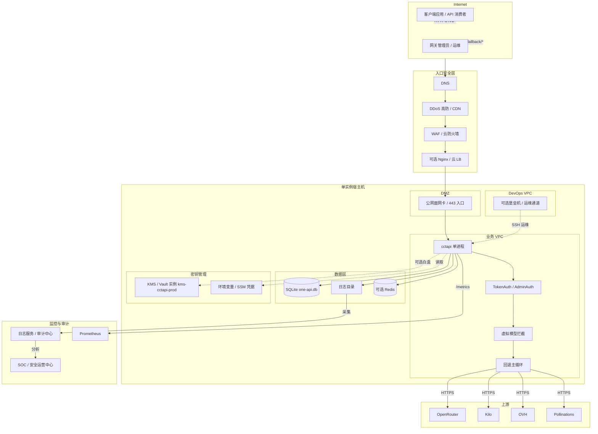
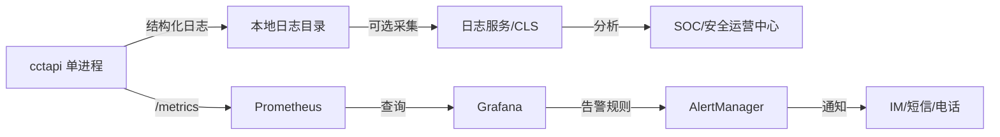

# AICoding 架构设计 · 部署设计

> 本文档为《AICoding 架构设计》核心产物之一，定位为**cctapi（one-api CCT 分支 · 虚拟模型回退 LLM 网关）部署设计**。  
> 上游输入：《系统设计》（G4 通过）中的模块拆分、运行形态、外部依赖、中间件需求、接口流向和可观测要求；  
> 下游输出：环境与资源清单、CI/CD 流水线、监控告警、应急回滚等可落地的运维交付物。  
> 关键裁决：U-01 已冻结为「单实例自托管」，默认形态为 **单实例宿主机 + SQLite + 可选 Redis / Prometheus**，多实例/分布式状态、多 AZ/多 Region、商业化分发列为演进附录，不占 MVP。

---

## 0. 元信息：修订记录

| 文档版本 | 发布日期 | 修订人 | 修订说明 |
| --- | --- | --- | --- |
| v0.1 | 2026-07-15 | 毕落地（platform-architect） | 骨架阶段：完成 §2 环境矩阵与资源清单、§3.1 物理拓扑、§3.2 流量与网络链路三表，暂停 §3.2 之后章节，等待安全侧骨架回注 |
| v1.0 | 2026-07-15 | 毕落地（platform-architect） | 定稿：按安全侧骨架回注完成 §3.3~§8、回填安全相关字段，通过自动校验后进入 G5 审核 |

---

## 1. 引言

### 1.1 适用范围与部署形态 (CURRENT)

| 项 | 取值 | 状态 |
| --- | --- | --- |
| 系统范围 | cctapi（one-api CCT 分支）——虚拟模型回退 LLM 网关 | CURRENT |
| 部署形态 | 单实例自托管（Docker Compose / 单二进制 + SQLite） | CURRENT |
| 默认运行环境 | 单台宿主机/云服务器（2C8G 起步） | CURRENT |
| 可选外部依赖 | Redis（限流）、Prometheus（指标拉取）、Nginx/云 LB（入口） | CURRENT |
| 不适用形态 | K8s 多 AZ/多 Region、容器编排、多实例分布式状态（U-01 已排除） | CURRENT |
| 云厂商绑定 | 不强制绑定；资源清单按通用云厂商规格描述，实际落地时可用等价 IaaS | CURRENT |

### 1.2 名词与缩写

| 名词/缩写 | 含义 |
| --- | --- |
| cctapi | one-api CCT 分支，虚拟模型回退 LLM 网关 |
| VM | Virtual Model，虚拟模型，一个模型名映射多个真实部署 |
| Deployment | 真实上游渠道 + 真实模型 + 配额/能力配置 |
| SQLite | 进程内文件型数据库，cctapi 主存 |
| Redis | 可选分布式限流后端 |
| Prometheus | 指标采集系统，拉取 `/metrics` |
| LB | Load Balancer，负载均衡（可选，生产环境建议启用） |
| WAF | Web Application Firewall（安全策略由 security-architect 权威） |
| KMS | Key Management Service（自托管场景用环境变量/文件挂载替代，或引入云 KMS/Vault） |
| Vault | 密钥保险柜（如 HashiCorp Vault / 云厂商 Secrets Manager） |
| SSM | 凭据管理系统（Secure Secret Manager） |
| RTO | Recovery Time Objective，恢复时间目标 |
| RPO | Recovery Point Objective，数据恢复点目标 |
| CI/CD | 持续集成 / 持续部署 |
| Runbook | 标准运维操作手册 |

---

## 2. 环境与资源清单

### 2.1 环境矩阵 (TARGET)

| 环境 | 用途 | 集群隔离 | 数据 | 网络访问 | 部署形态 | 状态 |
| --- | --- | --- | --- | --- | --- | --- |
| dev | 开发自测 | 本地进程 | 模拟数据 | 内网（localhost） | 单进程 + SQLite | TARGET |
| int | 联调 / 集成测试 | 共享测试机 | 模拟数据 | 内网 | 单进程 + SQLite | TARGET |
| uat | 预发 / 验收 | 独立 | 仿生产数据 | 内网 + 白名单 | 单进程 + SQLite | TARGET |
| prod | 生产 | 独立 | 真实数据 | 公网 / 内网 | 单进程 + SQLite + 可选 Redis + 可选 LB | TARGET |

> **隔离策略**：dev/int 可共享物理宿主机但使用不同进程端口/数据目录；uat/prod 必须独立宿主机；prod 数据目录禁止与低环境共享。

### 2.2 云资源清单

#### 2.2.1 计算资源 (TARGET)

| 资源编号 | 类型 | 产品 | 资源 ID | 名称 | 规格 | 数量 | 环境 | 复用 / 新建 | HA 方案 | 用途 | 状态 |
| --- | --- | --- | --- | --- | --- | --- | --- | --- | --- | --- | --- |
| R-C-001 | 计算 | 云服务器 CVM / 物理机 | 待创建 | cctapi-prod-01 | 2C8G | 1 | prod | 新建 | 单实例；进程重启 | 运行 cctapi 主进程 | TARGET |
| R-C-002 | 计算 | 云服务器 CVM / 物理机 | 待创建 | cctapi-uat-01 | 2C8G | 1 | uat | 新建 | 单实例 | 预发验证 | TARGET |
| R-C-003 | 计算 | 云服务器 CVM / 物理机 | 待创建 | cctapi-int-01 | 2C4G | 1 | int | 新建 | 单实例 | 集成测试 | TARGET |
| R-C-004 | 计算 | 开发机 / 本地 | 本地 | cctapi-dev-local | 2C4G | 1 | dev | 本地 | 单实例 | 开发自测 | TARGET |

> **注**：规格按《系统设计》§5.5 生产阶段 2C8G 起步；若峰值 QPS 超过 20 或并发超过 200，按 §8.1.3 升配。

#### 2.2.2 存储资源 (TARGET)

| 资源编号 | 类型 | 产品 | 资源 ID | 名称 | 规格 | 容量 | 环境 | 复用 / 新建 | HA 方案 | 备份策略 | 状态 |
| --- | --- | --- | --- | --- | --- | --- | --- | --- | --- | --- | --- |
| R-S-001 | 本地磁盘 | 云硬盘 / 本地 SSD | 随 R-C-001 | cctapi-prod-data | 普通云硬盘 | 200GB | prod | 新建 | 文件级复制 | 每日冷备到独立目录，保留 30 天 | TARGET |
| R-S-002 | 本地磁盘 | 云硬盘 / 本地 SSD | 随 R-C-002 | cctapi-uat-data | 普通云硬盘 | 100GB | uat | 新建 | 文件级复制 | 保留 7 天 | TARGET |
| R-S-003 | 日志存储 | 云硬盘 / 本地磁盘 | 随 R-C-001 | cctapi-prod-logs | 普通云硬盘 | 200GB | prod | 新建 | 文件级复制 | 保留 30 天热 + 180 天冷 | TARGET |
| R-S-004 | 对象存储（可选） | COS / S3 兼容 | 待创建 | cctapi-prod-backup | 标准存储 | 按需 | prod | 新建 | 多副本 | 每日 SQLite + 日志归档，保留 180 天 | TARGET |

#### 2.2.3 网络资源 (TARGET)

| 资源编号 | 类型 | 产品 | 资源 ID | 名称 | 规格 | 环境 | 复用 / 新建 | 用途 | 状态 |
| --- | --- | --- | --- | --- | --- | --- | --- | --- | --- |
| R-N-001 | VPC | 云 VPC | 待创建 | vpc-cctapi-prod | 172.16.0.0/24 | prod | 新建 | 生产环境隔离网络（业务 VPC） | TARGET |
| R-N-002 | 子网 | 云子网 | 待创建 | subnet-cctapi-prod-app | 172.16.1.0/26 | prod | 新建 | 应用进程所在子网 | TARGET |
| R-N-003 | 公网入口 | 弹性公网 IP / NAT | 待创建 | eip-cctapi-prod | 1Gbps | prod | 新建 | 公网入口 NAT | TARGET |
| R-N-004 | 负载均衡（可选） | 云 LB / Nginx | 待创建 | lb-cctapi-prod | 7 层 | prod | 新建 | TLS 终结、流量分发 | TARGET |
| R-N-005 | 安全组 | 云安全组 | 待创建 | sg-cctapi-prod | 最小权限 | prod | 新建 | 网络访问控制（规则见 §2.2.6） | TARGET |
| R-N-006 | VPC | 云 VPC | 待创建 | vpc-cctapi-uat | 172.16.10.0/24 | uat | 新建 | 预发环境隔离网络 | TARGET |
| R-N-007 | 子网 | 云子网 | 待创建 | subnet-cctapi-uat-app | 172.16.10.0/26 | uat | 新建 | 预发应用子网 | TARGET |

> **注**：VPC/子网 CIDR 由部署侧权威确定；安全组规则由 security-architect 权威给出，本表直接引用。

#### 2.2.4 中间件与平台服务 (TARGET / DEFERRED)

| 资源编号 | 类型 | 产品 | 资源 ID | 名称 | 规格 | 环境 | 复用 / 新建 | HA 方案 | 用途 | 状态 |
| --- | --- | --- | --- | --- | --- | --- | --- | --- | --- | --- |
| R-M-001 | 缓存（可选） | Redis 6.0+ | 待创建 | redis-cctapi-prod | 2C4G 主从 | prod | 新建 | 主从切换（若启用） | 分布式限流计数 | DEFERRED |
| R-M-002 | 缓存（可选） | Redis 6.0+ | 待创建 | redis-cctapi-uat | 1C2G 单实例 | uat | 新建 | 单实例 | 预发限流验证 | DEFERRED |
| R-M-003 | 密钥管理 | 云 SSM / 环境变量 | 待创建 | cctapi-secrets-prod | 凭据分级 | prod | 新建 | 无 | 存放上游 API keys、Session Secret、数据库密码（按安全侧密钥分级） | TARGET |
| R-M-004 | 密钥管理（可选） | 云 KMS / Vault 实例 | 待创建 | kms-cctapi-prod | 白盒密钥 | prod | 新建 | 多 AZ | 保护云 AKSK、服务间通信密钥（安全侧权威建议引入） | TARGET |

> **说明**：
> - Redis 为可选组件；无 Redis 时 cctapi 自动降级为内存限流（《系统设计》§3.1.3 / N2）。
> - 密钥管理默认使用 SSM 或环境变量/文件挂载；按安全侧骨架建议，云 AKSK 引入 KMS 白盒密钥保护，数据库密码、第三方 AppKey 存 SSM 凭据。
> - R-M-004（KMS/Vault 实例）是否启用由安全侧权威建议：建议引入，实例名 `kms-cctapi-prod`，用于保护云 AKSK 与服务间通信密钥。

#### 2.2.5 可观测资源 (TARGET)

| 资源编号 | 类型 | 产品 | 资源 ID | 名称 | 规格 | 环境 | 复用 / 新建 | 承载可观测维度 | 状态 |
| --- | --- | --- | --- | --- | --- | --- | --- | --- | --- |
| R-O-001 | 指标采集 | Prometheus（外部） | 外部系统 | prometheus-cctapi | 外部部署 | prod/uat | 复用 | 拉取 `/metrics`；RED 指标、业务指标 | TARGET |
| R-O-002 | 日志服务 | 本地日志文件 / 可选 CLS | 外部系统 | logs-cctapi | 本地 + 可选 | prod/uat | 复用/新建 | 应用日志、切换日志、审计日志 | TARGET |
| R-O-003 | 可视化 | Grafana（外部） | 外部系统 | grafana-cctapi | 外部部署 | prod/uat | 复用 | Dashboard 展示 | TARGET |
| R-O-004 | 告警通知 | 短信/IM/电话通道 | 外部系统 | alert-cctapi | 外部部署 | prod | 复用 | P0~P3 告警通知 | TARGET |

> **说明**：
> - Prometheus/Grafana 在自托管场景下可由运维团队已有基础设施复用；若无可复用实例，则按"待创建"处理。
> - 日志保留期：应用日志 30 天热 + 180 天冷；审计日志 ≥ 180 天（安全侧权威要求）。
> - 审计日志独立目录存储，满足不可篡改要求（文件系统权限 + 定期归档到对象存储）。

#### 2.2.6 安全资源 (TARGET)

| 资源编号 | 类型 | 产品 | 资源 ID | 名称 | 规格 | 环境 | 复用 / 新建 | HA 方案 | 用途 | 状态 |
| --- | --- | --- | --- | --- | --- | --- | --- | --- | --- | --- |
| R-Sec-001 | 防火墙 | 云安全组 / 主机防火墙 | 待创建 | sg-cctapi-prod | 最小权限 | prod | 新建 | 宿主机级 | 入站/出站访问控制 | TARGET |
| R-Sec-002 | WAF | 云 WAF | 待创建 | waf-cctapi-prod | 7 层防护 | prod | 新建 | 多节点 | Web 攻击、CC、防篡改防护 | TARGET |
| R-Sec-003 | 主机安全 | 云主机安全 / HIDS | 外部系统 | cwp-cctapi | 主机级 | prod | 复用 | 外部保障 | 入侵检测、基线检查 | TARGET |
| R-Sec-004 | 密钥管理 | 云 SSM / 环境变量 | 待创建 | cctapi-secrets-prod | 运行时注入 | prod/uat | 新建 | 无 | 上游 API keys、Session Secret | TARGET |
| R-Sec-005 | 密钥管理 | 云 KMS / Vault 实例 | 待创建 | kms-cctapi-prod | 白盒密钥 | prod | 新建 | 多 AZ | 云 AKSK、服务间通信密钥保护 | TARGET |
| R-Sec-006 | 堡垒机（可选） | 云堡垒机 / 运维通道 | 外部系统 | bastion-cctapi | 运维审计 | prod | 复用 | 外部保障 | 运维通道日志全量记录 | TARGET |

> **安全资源规则（直接引用 security-architect 权威决策）**：
> - WAF 厂商与版本：建议启用云厂商 WAF（如腾讯云 WAF / 阿里云 WAF / AWS WAF），版本按云厂商最新标准版；规则覆盖 OWASP Top 10，管理端 `/fallback/*` 启用额外登录暴力破解规则。
> - 安全组 `sg-cctapi-prod` 规则见 §3.2.1 与下表：
>   - 入站：TCP 443 允许（来源 0.0.0.0/0 或 WAF 回源段）；TCP 22 允许（来源 DevOps 管理员白名单）；TCP 3306/5432/6379 拒绝；其他默认拒绝。
>   - 出站：TCP 443 允许到上游供应商域名 / WAF/日志服务域名；TCP 6379 允许到可选 Redis 地址；其他默认拒绝。
> - 密钥分级：数据库密码、第三方 AppKey → SSM 凭据；云 AKSK → KMS 白盒密钥 + SSM 动态获取；服务间通信密钥 → KMS/Vault；用户密码 → bcrypt 加盐哈希；API Key/Token → 分级授权、可撤销、有限期。

### 2.3 复用资源清单 (TARGET)

| 复用资源 ID | 原业务方 | 余量评估 | 隔离方式 | 状态 |
| --- | --- | --- | --- | --- |
| R-O-001 / R-O-003（Prometheus / Grafana） | 运维团队 / 基础设施 | 待人工确认 | 按 job 或数据源隔离，独立 scrape target | TARGET |
| R-O-002（日志服务） | 运维团队 / 基础设施 | 待人工确认 | 按 index / 目录隔离，独立文件路径 | TARGET |
| R-Sec-003（主机安全） | 运维团队 / 基础设施 | 待人工确认 | 宿主机级共享，按实例标签区分 | TARGET |
| R-Sec-006（堡垒机/运维通道） | 基础设施团队 | 待人工确认 | 按实例/账号隔离，独立会话审计 | TARGET |

> **字段说明**：
> - 余量评估：因 need_cloud_baseline_check=false，未通过 CloudQ 抓取；标注"待人工确认"，上线前由平台团队核对。
> - 隔离方式：复用资源必须保证 cctapi 数据与原有业务在 scrape target / 日志路径 / 标签 / 会话上隔离。

---

## 3. 部署拓扑与高可用设计

### 3.1 物理拓扑 (TARGET)

#### 3.1.1 物理拓扑图

> 本系统为**单实例自托管**形态，无 K8s、无多 AZ/多 Region。拓扑图覆盖：公网入口 → DDoS → WAF → LB → 单实例宿主机（DMZ/业务/DevOps 逻辑分区；cctapi 进程 + SQLite + 日志） → 可选 Redis / Prometheus → 上游 LLM 供应商；监控审计 → SOC/CLS/Prometheus。  
> 安全总体架构图由 security-architect 给出，本图与之对齐：DMZ 为公网入口缓冲区，业务 VPC 运行 cctapi 进程与数据，DevOps VPC 为运维通道。

#### 3.1.2 拓扑要素清单 (TARGET)

| 要素 | 取值 | 状态 |
| --- | --- | --- |
| 跨 Region 部署 | 否；单实例自托管（U-01 已排除） | TARGET |
| 跨 AZ 部署 | 否；单实例自托管 | TARGET |
| Region 数量 | 1（默认单地域） | TARGET |
| AZ 数量 | 1（默认单可用区） | TARGET |
| 流量入口路径 | 客户端 → DNS → DDoS → WAF → 可选 LB → cctapi 进程（端口 3008） | TARGET |
| 内部调用路径 | 进程内函数调用；无服务间 RPC | TARGET |
| 数据库访问路径 | 进程内 SQLite 驱动；busy_timeout = 5000ms | TARGET |
| 缓存访问路径 | 可选 Redis；无 Redis 时内存限流 fallback | TARGET |
| 可观测访问路径 | Prometheus 外部拉取 `/metrics`；日志本地文件 + 可选外部日志系统 | TARGET |
| 上游访问路径 | 公网 HTTPS 直连 OpenRouter / Kilo / OVH / Pollinations | TARGET |
| 安全分区 | DMZ（公网入口）/ 业务 VPC（进程+数据）/ DevOps VPC（运维通道）/ 密钥管理 | TARGET |

### 3.2 流量与网络链路（连通视图） (TARGET)

#### 3.2.1 流量入口链路 (TARGET)

| 组件 (R-xx) | 协议 - 端口 | TLS 终结 | 作用 | 安全策略（security-architect 权威） | 状态 |
| --- | --- | --- | --- | --- | --- |
| DNS | UDP 53 / TCP 53 | 否 | 域名解析到 LB / 宿主机 | 域名由业务/基础设施提供；建议启用 DNS 解析日志 | TARGET |
| DDoS 高防 | TCP 443 | 否 | 流量清洗，抵御 DDoS/CC | 默认启用，清洗阈值按云厂商默认；CC 联动 WAF | TARGET |
| WAF（R-Sec-002） | TCP 443 | 是（若前置） | Web 攻击过滤、Bot 防护、CC 防护 | 启用；拦截 OWASP Top 10；管理端 `/fallback/*` 启用额外登录暴力破解规则；80 强制跳转 443 | TARGET |
| LB（R-N-004，可选） | TCP 443 → TCP 3008 | 是（建议） | TLS 终结、七层转发、真实客户端 IP | 仅暴露 443；TLS 1.2+；转发 X-Forwarded-For / X-Real-IP | TARGET |
| cctapi 进程（R-C-001） | TCP 3008 | 否（若 LB 终结）/ 是（若直接暴露） | 业务 HTTP/HTTPS 服务 | 安全组仅开放 3008 入站，来源限定为 LB/WAF 回源段；禁止直接 0.0.0.0/0 暴露 3008 | TARGET |

> **说明**：生产环境建议 WAF → LB → cctapi 进程；若直接暴露 cctapi 进程，需配置 TLS 证书并开启 HSTS。

#### 3.2.2 内部互联链路 (TARGET)

| 项 | 说明 | 状态 |
| --- | --- | --- |
| 服务发现 | 不适用（单进程） | TARGET |
| 服务间协议 | 不适用（进程内函数调用） | TARGET |
| mTLS | 不启用；单进程无内部通信 | TARGET |
| 数据库连接 | 应用 → SQLite 文件（`one-api.db`），通过 `mattn/go-sqlite3` 驱动；busy_timeout = 5000ms；文件权限 600 | TARGET |
| 缓存连接 | 应用 → Redis（可选），通过 `go-redis` v8.11.5；连接失败时降级为内存限流；若启用 Redis，建议配置 TLS + ACL + 强密码 | TARGET |
| 日志写入 | 应用 → 本地日志目录；审计日志写入独立目录；可选同步到 CLS/日志服务 | TARGET |
| 指标暴露 | 应用 → `/metrics` 端点；外部 Prometheus 拉取；建议通过 LB 或白名单控制访问 | TARGET |
| 密钥读取 | 启动时从 SSM / 环境变量 / 文件挂载读取；云 AKSK 从 KMS 白盒解密获取 | TARGET |

#### 3.2.3 跨网络互联 (TARGET)

| 互联类型 | 通道 | 带宽 | 加密 | 用途 | 安全规则 | 状态 |
| --- | --- | --- | --- | --- | --- | --- |
| 公网入站 | 公网 HTTPS / WAF / LB | 按需（建议 ≥ 1Gbps） | TLS 1.2+ | 客户端调用 /v1/*、管理端 /fallback/* | 仅 443 入站；80 强制跳转 443；禁止 22/3306/6379 入站 | TARGET |
| 公网出站（上游） | 宿主机 NAT / 公网 IP | 按需 | TLS 1.2+ | 调用 OpenRouter / Kilo / OVH / Pollinations | 出站安全组仅允许到 E-01~E-04 域名；禁止泛化互联网出站 | TARGET |
| 可选 Redis | 内网 TCP 6379 | 内网带宽 | 建议启用 TLS/SSL 或 VPC 内网 + ACL | 限流计数 | 安全组仅允许业务 VPC 访问 Redis 6379；Redis 启用密码/ACL | TARGET |
| 可选对象存储备份 | 公网 HTTPS / 内网 | 按需 | TLS 1.2+ | SQLite + 日志归档 | 通过 AKSK 从 KMS 白盒解密获取，按最小权限 Bucket 策略 | TARGET |
| 运维通道 | SSH 22 / 堡垒机 | 内网/管理网 | SSH | 运维登录、发布、排障 | 仅允许管理员源 IP 白名单；禁止 root 远程登录；运维日志全量记录 | TARGET |
| 跨 VPC | 不适用 | — | — | 单实例自托管，无跨 VPC | 东西向默认拒绝 | TARGET |
| 跨账号 | 不适用 | — | — | 单实例自托管，无跨账号 | — | TARGET |
| 跨 Region（灾备） | 不适用 | — | — | 单实例自托管，多 Region 为演进附录 | — | TARGET |

> **安全侧输入已确认**：
> - 入口强制 WAF 前置（建议启用）。
> - 出口限制访问指定上游域名（E-01~E-04）及可选 Redis/日志服务/WAF 域名。
> - 固定公网出口 IP：非必须，除非上游供应商要求；建议通过 NAT 网关保持一致性。
> - Redis 建议启用 TLS/ACL/密码策略。
> - 主机防火墙规则清单：默认拒绝，显式放通；禁止 0.0.0.0/0 开放 22/23/3306/6379/5432。
> - 密钥存储：建议引入 KMS/Vault 实例 `kms-cctapi-prod`。
> - 日志保留期：审计日志 ≥ 180 天，不可篡改；应用日志 30 天热 + 180 天冷。

### 3.3 高可用与故障容错 (TARGET)

#### 3.3.1 故障域划分 (TARGET)

| 故障域层级 | 故障域 | 影响范围 | 容错机制 | 预期 RTO | 责任方 | 状态 |
| --- | --- | --- | --- | --- | --- | --- |
| L1 进程 | 单进程崩溃 / OOM | 全部请求中断 | systemd/Docker 自动重启；健康检查失败触发告警 | ≤ 30 秒 | 平台团队 | TARGET |
| L2 宿主机 | 宿主机宕机 / 系统升级 | 全部服务中断 | 宿主机重启或整机恢复；启动后拉起容器/进程 | ≤ 30 分钟 | 平台团队 | TARGET |
| L3 数据 | SQLite 文件损坏 / 误删 | 全部持久化状态 | 从最近备份恢复；每日冷备 + 对象存储归档 | ≤ 30 分钟 | 平台团队 | TARGET |
| L4 上游 | 单上游供应商不可用 | 该供应商相关请求 | 自动回退到其他部署；冷却机制避免重复尝试 | ≤ 1 秒 | 研发团队（业务逻辑） | TARGET |
| L4 上游 | 全部上游不可用 | 全部虚拟模型请求 | 返回标准错误响应，触发 P0 告警 | 依赖上游恢复 | 研发团队 + 业务侧 | TARGET |
| L3 缓存 | Redis 不可用 | 限流计数丢失 | 降级为内存限流；主请求不受影响 | 即时 | 研发团队（业务逻辑） | TARGET |

#### 3.3.2 单实例高可用机制 (TARGET)

| 机制 | 说明 | 触发条件 | 责任人 | 状态 |
| --- | --- | --- | --- | --- |
| 进程守护 | systemd service 或 Docker restart=always 自动重启 cctapi 进程 | 进程退出 / OOM / 健康检查失败 | 平台团队 | TARGET |
| 健康检查 | `/healthz`（存活）+ `/readyz`（就绪）；LB 10s 探测一次，连续 3 次失败标记不健康 | 进程异常 / 依赖未就绪 | 平台团队 | TARGET |
| 数据备份 | 每日 02:00 文件级冷备 SQLite + 日志到独立目录 / 对象存储 | 定时任务 | 平台团队 | TARGET |
| 备份恢复 | 从最近备份复制数据文件，重启进程 | 数据文件损坏 / 误删 | 平台团队 | TARGET |
| 可选 Redis 主从 | 若启用 Redis，采用主从架构；主节点故障时手动或哨兵切换 | 主节点不可用 | 平台团队 | TARGET |
| 优雅停机 | SIGTERM → 停止接入新流量 → 等待在飞请求完成（最多 30s）→ 退出 | 发布升级 / 维护窗口 | 平台团队 | TARGET |

#### 3.3.3 负载均衡（单实例视角） (TARGET)

| 维度 | 取值 | 状态 |
| --- | --- | --- |
| 类型 | 7 层（L7）Gin 自身进程；外部可选 WAF → LB → cctapi | TARGET |
| 健康检查路径 | `/healthz`（Liveness）/ `/readyz`（Readiness） | TARGET |
| 健康检查频率 | 10s | TARGET |
| 失败阈值 | 连续 3 次失败标记不健康 | TARGET |
| 恢复阈值 | 连续 2 次成功标记健康 | TARGET |
| 会话保持 | 否；单进程无状态 | TARGET |
| 多实例负载均衡 | 不适用；单实例自托管 | TARGET |

### 3.4 弹性伸缩（单实例视角） (DEFERRED)

| 维度 | 取值 | 状态 |
| --- | --- | --- |
| 触发指标 | 不适用（单实例自托管） | DEFERRED |
| 扩容阈值 | 单实例 CPU > 70% 持续 5min 时升配；或峰值 QPS > 20 / 并发 > 200 | DEFERRED |
| 缩容阈值 | 不适用 | DEFERRED |
| 副本区间 | min 1 / max 1（单实例） | DEFERRED |
| 冷却时间 | 不适用 | DEFERRED |
| 升配方式 | 变更宿主机规格（2C8G → 4C16G）或更换实例；需维护窗口 | DEFERRED |

---

## 4. 部署流程

### 4.1 代码仓库与分支规范 (CURRENT)

| 项 | 说明 | 状态 |
| --- | --- | --- |
| 主仓库 | `cctapi`（one-api CCT 分支） | CURRENT |
| 默认分支 | `main` | CURRENT |
| 开发分支 | `feature/*`、`bugfix/*`、`hotfix/*` | CURRENT |
| 环境分支 | `uat`、`prod`（可选，按 Git Flow 或 trunk-based） | CURRENT |
| 保护规则 | `main` / `prod` 禁止 force push；必须通过 CI 才能合并 | CURRENT |
| 提交规范 | Conventional Commits；提交信息必须包含 issue/任务编号 | CURRENT |
| 版本标签 | `v{major}.{minor}.{patch}`，如 `v1.0.0`；镜像 tag 与 Git tag 一致 | CURRENT |

### 4.2 CI/CD 流水线（8 阶段） (CURRENT)

| 阶段 | 名称 | 关键动作 | 产物 | 失败处置 | 状态 |
| --- | --- | --- | --- | --- | --- |
| Stage 1 | 拉取/检出 | 拉取代码、校验分支、加载缓存 | 源码树 | 停止流水线 | CURRENT |
| Stage 2 | 构建 | `go build` / `docker build`；前端 `vite build` | 二进制 / 前端产物 | 停止流水线 | CURRENT |
| Stage 3 | 静态扫描 | `golangci-lint`、`gofmt`、`go vet`；前端 ESLint | 扫描报告 | 失败阻断 | CURRENT |
| Stage 4 | 安全扫描 | SAST（代码漏洞）、依赖扫描（`govulncheck` / `npm audit`）、Secret 检测 | 安全报告 | 高危失败阻断 | CURRENT |
| Stage 5 | 单元/集成测试 | `go test -race`、Vitest、Playwright E2E（可选） | 测试报告 | 失败阻断 | CURRENT |
| Stage 6 | 制品打包 | 构建 Docker 镜像 / 单二进制包；镜像签名（cosign） | 镜像 `cctapi:{tag}`、签名文件 | 停止流水线 | CURRENT |
| Stage 7 | 部署 | 按环境执行滚动/蓝绿/灰度发布；更新配置、重启进程 | 部署记录 | 失败触发回滚 | CURRENT |
| Stage 8 | 发布验证 | 健康检查、冒烟测试、金丝雀验证 | 验证报告 | 失败触发回滚 | CURRENT |

> **说明**：8 阶段为模板强制要求；单实例场景下 Stage 7 的"滚动/蓝绿/灰度"映射为：二进制替换/容器重启或进程热重启。

### 4.3 构建产物与制品管理 (CURRENT)

| 项 | 说明 | 状态 |
| --- | --- | --- |
| 镜像命名 | `cctapi:{env}-{git-tag}`，例如 `cctapi:prod-v1.0.0`、`cctapi:uat-v1.0.0-rc1` | CURRENT |
| 制品仓库 | 私有镜像仓库（Harbor / 云镜像仓库） | CURRENT |
| 镜像签名 | 使用 cosign 签名，公钥托管在 CI/CD 或 KMS；拉取时校验签名 | CURRENT |
| 制品保留策略 | 生产镜像保留最近 10 个版本；RC 镜像保留 30 天；过期自动清理 | CURRENT |
| 制品溯源 | 每个镜像标签关联 Git commit SHA、构建流水线 ID、构建时间、构建人 | CURRENT |
| 二进制包 | 单二进制 `cctapi-linux-amd64`；与镜像并存，用于非容器部署 | CURRENT |

### 4.4 配置管理（L1~L4） (CURRENT / TARGET)

| 层级 | 名称 | 存放位置 | 适用内容 | 变更生效 | 安全要求 | 状态 |
| --- | --- | --- | --- | --- | --- | --- |
| L1 | 代码内默认值 | 代码仓库 | 常量、枚举、不会变化的默认值 | 重新部署 | 禁止写入密码、地址、环境差异 | CURRENT |
| L2 | 配置文件 | `data/fallback.json` + option 表 | 业务开关、限流阈值、降级开关、虚拟模型策略 | 热重载 | 变更必须幂等；变更记录入审计日志 | CURRENT |
| L3 | 环境变量 / ConfigMap | `.env` / Docker Compose env / SSM | 环境差异（DB 路径、Redis 地址、外部域名、端口） | 重启进程 | 禁止在仓库明文存储；启动失败 fail-fast | TARGET |
| L4 | Secret | SSM 凭据 / 环境变量 / 文件挂载 / KMS 解密 | 上游 API keys、Session Secret、数据库密码、云 AKSK | 重启进程 | 禁止落日志、禁止入代码、禁止跨环境共用；KMS 保护云 AKSK | TARGET |

> **配置下发流程**：
> - L2 变更：管理员提交 → Git 合并 → 部署脚本推送 `data/fallback.json` → 调用 `/api/fallback/config/reload` 热重载。
> - L3/L4 变更：运维在 SSM/CI 变量中更新 → 触发部署 → 启动时注入；不允许运行时动态修改。

### 4.5 发布策略 (TARGET)

| 策略 | 适用场景 | 单实例映射 | 回滚路径 | 风险 | 状态 |
| --- | --- | --- | --- | --- | --- |
| 滚动发布 | 常规补丁、配置更新 | 停止旧进程 → 部署新二进制/容器 → 健康检查 → 接入流量 | 重新部署上一版本镜像 | 低 | TARGET |
| 蓝绿发布 | 大版本升级、数据库 Schema 变更 | 在同一宿主机准备新版本目录/容器；切换入口到新版；旧版保留 | 入口切回旧版 | 中 | TARGET |
| 金丝雀/灰度 | 新功能验证、风险发布 | 通过 WAF/LB 按 IP/Header 将部分流量导到新版 | 调整路由权重 | 中 | TARGET |
| 全量发布 | 紧急修复 | 直接替换并重启 | 回滚镜像/数据备份 | 高 | TARGET |

> **发布门禁**：
> - 必须完成 CI 全部阶段且测试通过。
> - 必须完成安全扫描且无高危漏洞。
> - 必须完成代码评审（至少 1 人 approve）。
> - 发布窗口：生产发布需提前 24h 通知；禁止业务高峰时段（如 9:00-21:00）发布高危变更。
> - 发布后 30 分钟内必须有人值守；P0/P1 告警触发时优先回滚。

### 4.6 灰度路径 (TARGET)

| 灰度阶段 | 流量比例 | 验证内容 | 通过标准 | 失败动作 | 状态 |
| --- | --- | --- | --- | --- | --- |
| 阶段 0：内测 | 0%（仅管理员白名单） | 功能、接口、面板 | 无 P0/P1 告警，核心接口成功率 ≥ 99% | 修复后重新发版 | TARGET |
| 阶段 1：小流量 | 5% | 虚拟模型回退、三协议转发 | 成功率 ≥ 99%，P99 ≤ 60s | 回滚或限流 | TARGET |
| 阶段 2：中流量 | 25% | 免费池同步、用量台账、告警 | 成功率 ≥ 99%，Redis/SQLite 健康 | 回滚或限流 | TARGET |
| 阶段 3：全量 | 100% | 全链路监控 | 成功率 ≥ 99%，无异常告警 | 回滚 | TARGET |

---

## 5. 监控告警接入

### 5.1 监控架构与数据流 (TARGET)

| 数据类型 | 来源 | 采集方式 | 存储/展示 | 保留期 | 状态 |
| --- | --- | --- | --- | --- | --- |
| 指标 | `/metrics` | Prometheus 拉取 | Prometheus + Grafana | 由外部 Prometheus 决定（建议 ≥ 15 天） | TARGET |
| 应用日志 | 本地日志文件 | 可选日志采集器 | 本地 + 可选 CLS | 30 天热 + 180 天冷 | TARGET |
| 审计日志 | 独立审计日志文件 | 文件采集 + 对象存储归档 | 本地 + 对象存储 | ≥ 180 天 | TARGET |
| 错误日志 | 本地日志文件 | 实时告警 + 归档 | 本地 + 可选 CLS | 90 天热 + 1 年冷 | TARGET |
| 主机指标 | 节点 exporter / 云监控 | 拉取/推送 | Prometheus / 云监控 | ≥ 15 天 | TARGET |

### 5.2 Dashboard 清单 (TARGET)

| Dashboard 名 | 受众 | 核心指标 | 刷新频率 | 数据源 | 状态 |
| --- | --- | --- | --- | --- | --- |
| 业务大盘 | 产品 / 业务 | 虚拟模型请求数、回退次数、成功率、免费池用量 | 1min | Prometheus | TARGET |
| 服务健康大盘 | 研发 / SRE | RED（Rate / Errors / Duration）、P95/P99 延迟 | 30s | Prometheus | TARGET |
| 中间件大盘 | SRE / 运维 | SQLite 查询耗时、Redis 命中率、限流触发次数 | 30s | Prometheus | TARGET |
| 容量大盘 | SRE | CPU、内存、磁盘、SQLite 文件大小、日志目录大小 | 1min | Prometheus + 节点 exporter | TARGET |
| 业务预警大盘 | On-call | 当前活跃告警（冷却、耗尽、全部失败、配额预警） | 实时 | Prometheus / SQLite | TARGET |
| 部署状态大盘 | 网关管理员 | 各部署状态、成功率、错误率、冷却数、耗尽数 | 30s | Prometheus + SQLite | TARGET |
| 安全审计大盘 | 安全 / 合规 | 登录登出、配置变更、运维操作、异常访问 | 5min | 审计日志/CLS | TARGET |

### 5.3 告警规则清单 (TARGET)

| 编号 | 级别 | 触发条件 | 维度 | Owner | Runbook | 通知方式 | 状态 |
| --- | --- | --- | --- | --- | --- | --- | --- |
| AL-01 | P0 | 全部上游失败率 > 5% 持续 5min | 业务可用性 | @后端团队 | docs/runbook/AL-01-all-upstream-failed.md | 短信 + IM + 电话 | TARGET |
| AL-02 | P0 | 进程健康检查连续 3 次失败 | 系统健康 | @运维团队 | docs/runbook/AL-02-process-down.md | 短信 + IM + 电话 | TARGET |
| AL-03 | P1 | 管理面板 P99 > 2s 持续 5min | 接口延迟 | @后端团队 | docs/runbook/AL-03-panel-latency.md | 短信 + IM | TARGET |
| AL-04 | P1 | 冷却部署数 > 总部署数 50% | 业务状态 | @后端团队 | docs/runbook/AL-04-too-many-cooling.md | 短信 + IM | TARGET |
| AL-05 | P2 | 单部署连续 5 次健康检查失败 | 单点异常 | @后端团队 | docs/runbook/AL-05-deployment-unhealthy.md | IM | TARGET |
| AL-06 | P2 | SQLite 写入错误率 > 1% | 数据库健康 | @后端团队 | docs/runbook/AL-06-sqlite-error.md | IM | TARGET |
| AL-07 | P3 | 磁盘容量 > 80% | 资源水位 | @运维团队 | docs/runbook/AL-07-disk-capacity.md | IM | TARGET |
| AL-08 | P3 | 日志目录容量 > 80% | 资源水位 | @运维团队 | docs/runbook/AL-08-log-capacity.md | IM | TARGET |
| AL-09 | P3 | 审计日志容量 > 80% | 资源水位/合规 | @运维团队 | docs/runbook/AL-09-audit-log-capacity.md | IM | TARGET |
| AL-10 | P2 | Redis 连接失败率 > 1% | 缓存健康 | @后端团队 | docs/runbook/AL-10-redis-error.md | IM | TARGET |

### 5.4 告警通道 (TARGET)

| 通道 | 用途 | 接收人 | P0 | P1 | P2 | P3 | 状态 |
| --- | --- | --- | --- | --- | --- | --- | --- |
| 短信 | 紧急业务中断 | On-call 值班人 | 是 | 是 | 否 | 否 | TARGET |
| IM（企业微信/钉钉/Slack） | 实时告警 | 后端团队、运维团队 | 是 | 是 | 是 | 是 | TARGET |
| 电话 | 业务完全不可用 | On-call 值班人 | 是 | 否 | 否 | 否 | TARGET |
| 邮件 | 趋势报告、日报 | 团队负责人 | 否 | 否 | 否 | 是 | TARGET |
| 工单系统 | 事件跟踪、复盘 | SRE / 安全 | 是 | 是 | 是 | 是 | TARGET |

---

## 6. 应急与回滚

### 6.1 回滚机制 (TARGET)

#### 6.1.1 触发条件 (TARGET)

| 触发条件 | 级别 | 自动/人工 | 决策人 | 响应时间 | 状态 |
| --- | --- | --- | --- | --- | --- |
| 发布验证阶段 P0/P1 告警 | 严重 | 自动（或人工确认） | 发布负责人 | ≤ 5 min | TARGET |
| 生产错误率 > 5% 持续 5min | 严重 | 自动 | On-call 值班人 | ≤ 5 min | TARGET |
| 健康检查连续 3 次失败 | 严重 | 自动 | On-call 值班人 | ≤ 3 min | TARGET |
| 单上游全部失败且无法自动回退 | 高 | 人工 | 后端团队 | ≤ 15 min | TARGET |
| 关键管理功能不可用 | 高 | 人工 | 后端团队 | ≤ 15 min | TARGET |
| 数据异常（SQLite 损坏/误写） | 高 | 人工 | 平台团队 | ≤ 30 min | TARGET |
| 安全事件（密钥泄露/入侵） | 严重 | 人工 | 安全团队 + 平台团队 | ≤ 10 min | TARGET |

#### 6.1.2 回滚执行 SOP (TARGET)

| 步骤 | 操作 | 执行人 | 检查点 | 预计耗时 | 状态 |
| --- | --- | --- | --- | --- | --- |
| 1. 决策 | 确认触发条件，判定是否回滚 | On-call 值班人 / 发布负责人 | 告警是否持续、影响范围 | 1 min | TARGET |
| 2. 摘流 | 若使用 LB/WAF，将流量切离生产实例 | 运维团队 | 确认无新流量进入 | 1 min | TARGET |
| 3. 停止新版本 | 停止 cctapi 新进程 / 容器 | 运维团队 | 进程已退出 | 1 min | TARGET |
| 4. 恢复旧版本 | 部署上一稳定版本镜像/二进制 | 运维团队 | 镜像 tag 与上次成功发布一致 | 3 min | TARGET |
| 5. 恢复数据（如需） | 从备份恢复 SQLite / 配置；若误写数据则按数据回滚 SOP | 平台团队 | 数据文件校验通过 | 5-30 min | TARGET |
| 6. 验证 | 健康检查、核心接口冒烟测试 | 运维团队 + 后端团队 | `/healthz`、`/readyz`、核心 API 成功 | 3 min | TARGET |
| 7. 切流 | 重新接入流量 | 运维团队 | 监控指标正常 | 1 min | TARGET |
| 8. 复盘 | 记录事件、创建复盘报告 | 发布负责人 | 24h 内输出报告 | — | TARGET |

#### 6.1.3 不可回滚 DDL / 数据变更 (TARGET)

| 变更类型 | 是否可回滚 | 回滚策略 | 业务侧确认要求 | 状态 |
| --- | --- | --- | --- | --- |
| 代码发布 | 可 | 回滚镜像/二进制 | 无需额外确认 | TARGET |
| 配置热重载 | 可 | 恢复旧配置文件并 reload | 无需额外确认 | TARGET |
| SQLite 数据误删除 | 部分可 | 从备份恢复；24h 内数据可能丢失 | 需业务侧确认可接受 RPO ≤ 24h | TARGET |
| 不可逆 Schema 变更 | 本期无 | 不适用 | 不适用 | TARGET |
| 密钥泄露/泄露嫌疑 | 紧急 | 立即轮换所有相关密钥；更新 SSM/KMS | 需安全团队确认范围 | TARGET |

> **说明**：单实例 SQLite 场景下，不存在分布式 Schema 变更；任何数据变更操作前必须先在 UAT 验证并备份。

### 6.2 故障应急 Runbook (TARGET)

#### 6.2.1 全部上游失败（AL-01） (TARGET)

| 步骤 | 动作 | 检查点 | 升级路径 | 状态 |
| --- | --- | --- | --- | --- |
| 1. 确认 | 查看 `/fallback/status` 面板；检查各部署状态 | 是否全部 deployment 标记为 cooling | 若为单上游问题，按 AL-05 处理 | TARGET |
| 2. 诊断 | 检查上游域名可达性、TLS 证书、出口网络、安全组 | 能否 curl 通上游 health/endpoint | 若为网络/安全策略问题，联系基础设施团队 | TARGET |
| 3. 缓解 | 检查免费池同步状态；手动触发同步；确认是否有可用部署 | 同步成功后是否有可用 deployment | 若 15min 未恢复，升级 P0 | TARGET |
| 4. 恢复 | 等待上游恢复或启用备用部署；持续监控 | 成功率恢复 ≥ 99% | 事件闭环 | TARGET |

#### 6.2.2 进程不可用的（AL-02） (TARGET)

| 步骤 | 动作 | 检查点 | 升级路径 | 状态 |
| --- | --- | --- | --- | --- |
| 1. 确认 | 查看 `/healthz`、`/readyz` 返回值；检查 systemd/Docker 状态 | 进程是否存活 | 若宿主机宕机，进入宿主机恢复流程 | TARGET |
| 2. 诊断 | 检查日志中 panic/OOM/端口占用；检查 SQLite 文件是否被锁定 | 最近 ERROR 日志 | 若 SQLite 损坏，进入数据恢复流程 | TARGET |
| 3. 缓解 | 自动重启进程；若失败，手动重启；若 OOM 则升配内存 | 进程启动成功 | 若 5min 未恢复，升级 P0 | TARGET |
| 4. 恢复 | 验证健康检查；切回流量 | 健康检查通过 | 事件闭环 | TARGET |

#### 6.2.3 SQLite 异常（AL-06） (TARGET)

| 步骤 | 动作 | 检查点 | 升级路径 | 状态 |
| --- | --- | --- | --- | --- |
| 1. 确认 | 检查 SQLite 写入错误率、磁盘空间、文件权限 | 错误是否持续 | 若为磁盘满，进入 AL-07/AL-08 | TARGET |
| 2. 诊断 | 检查 `one-api.db` 文件大小、busy_timeout、是否有并发写入冲突 | 日志中的 sqlite error | 若文件损坏，进入备份恢复 | TARGET |
| 3. 缓解 | 清理日志释放空间；调整 busy_timeout；若文件锁定则重启进程 | 写入错误率下降 | 若 15min 未恢复，升级 P1 | TARGET |
| 4. 恢复 | 从备份恢复数据文件（如损坏） | 数据一致性校验通过 | 事件闭环 | TARGET |

#### 6.2.4 安全事件（密钥泄露/入侵） (TARGET)

| 步骤 | 动作 | 检查点 | 升级路径 | 状态 |
| --- | --- | --- | --- | --- |
| 1. 确认 | 检查审计日志、主机安全告警、异常登录/访问 | 是否存在入侵证据 | 立即升级安全团队 | TARGET |
| 2. 隔离 | 断开公网入口（WAF/LB 切断 443）；限制 SSH 访问 | 阻止进一步损害 | 安全团队介入 | TARGET |
| 3. 轮换 | 轮换所有疑似泄露密钥：上游 API keys、Session Secret、云 AKSK | 旧密钥失效 | 通知业务侧 | TARGET |
| 4. 取证 | 保留审计日志、进程快照、网络连接；转存到安全存储 | 证据完整 | 配合安全团队调查 | TARGET |
| 5. 恢复 | 清理恶意文件/进程；重新部署；验证安全基线 | 安全扫描通过 | 事件闭环 | TARGET |

---

## 7. 安全合规（部署视角）

### 7.1 上线前安全自检清单 (TARGET)

| 检查项 | 检查内容 | 通过标准 | 责任人 | 检查时机 | 状态 |
| --- | --- | --- | --- | --- | --- |
| SEC-01 | 安全组规则 | 仅 443/22 入站；22 来源为管理员白名单；禁止 3306/6379/5432 入站；出站仅允许上游/WAF/日志/Redis | 平台团队 | 上线前 | TARGET |
| SEC-02 | WAF 配置 | 已启用；OWASP Top 10 规则；`/fallback/*` 启用登录暴力破解规则；80 跳转 443 | 安全团队 + 平台团队 | 上线前 | TARGET |
| SEC-03 | TLS 配置 | 生产环境 TLS 1.2+；证书有效；HSTS 开启 | 平台团队 | 上线前 | TARGET |
| SEC-04 | 密钥管理 | 上游 API keys、Session Secret 存 SSM；云 AKSK 存 KMS 白盒；禁止入代码/日志 | 平台团队 | 上线前 | TARGET |
| SEC-05 | 日志保留 | 审计日志独立目录、保留 ≥ 180 天、不可篡改；应用日志 30 天热 + 180 天冷 | 平台团队 | 上线前 | TARGET |
| SEC-06 | 主机安全 | 主机安全组件安装；基线检查通过；禁止 root 远程登录 | 平台团队 | 上线前 | TARGET |
| SEC-07 | 运维通道 | SSH 源 IP 白名单；优先堡垒机；运维日志全量记录 | 平台团队 | 上线前 | TARGET |
| SEC-08 | 出口白名单 | 安全组/防火墙仅允许访问 E-01~E-04 及 Redis/日志/WAF 域名 | 平台团队 | 上线前 | TARGET |
| SEC-09 | Redis 安全 | 若启用 Redis，配置 TLS/ACL/强密码；安全组仅允许业务 VPC 访问 | 平台团队 | 上线前 | TARGET |
| SEC-10 | 漏洞扫描 | 镜像/二进制无高危漏洞；依赖无已知 CVE | 安全团队 | 上线前 | TARGET |

### 7.2 凭证与密钥清单 (TARGET)

| 密钥/凭证 | 分级 | 存储位置 | 获取方式 | 轮换周期 | 备注 | 状态 |
| --- | --- | --- | --- | --- | --- | --- |
| 上游 API keys | L3 | SSM 凭据 / 环境变量 | 启动时注入 | 按需或每季度 | 不入 SQLite；禁止入代码 | TARGET |
| Session Secret | L4 | SSM 凭据 / 环境变量 | 启动时注入 | 每次部署生成 | 用于 JWT/Session 签名 | TARGET |
| 数据库密码 | L4 | SSM 凭据 | 启动时注入 | 每季度 | SQLite 若启用密码保护 | TARGET |
| 云 AKSK | L4 | KMS 白盒密钥 + SSM | 运行时从 KMS 解密 | 每季度 | 访问对象存储、日志服务 | TARGET |
| 服务间通信密钥 | L3 | KMS/Vault | 运行时获取 | 每季度 | 单实例下主要用于外部服务回调 | TARGET |
| 用户密码 | L4 | SQLite bcrypt 哈希 | 登录时校验 | 用户主动修改 | 禁止明文存储 | TARGET |
| API Key/Token | L3 | SQLite 哈希 + 明文前 4 位 | 调用时校验 | 可撤销、有限期 | 分级授权 | TARGET |
| Redis 密码 | L3 | SSM 凭据 | 启动时注入 | 每季度 | 若启用 Redis | TARGET |

### 7.3 访问审计接入 (TARGET)

| 审计维度 | 日志字段 | 保留期 | 不可篡改措施 | 状态 |
| --- | --- | --- | --- | --- |
| 登录登出 | 用户、时间、来源 IP、结果 | ≥ 180 天 | 独立目录；文件权限 640；定期归档对象存储 | TARGET |
| 配置变更 | 操作人、时间、配置项、旧值/新值、来源 IP | ≥ 180 天 | 独立目录；文件权限 640；定期归档对象存储 | TARGET |
| 手动冷却/恢复 | 操作人、时间、部署 ID、动作、原因 | ≥ 180 天 | 独立目录；文件权限 640；定期归档对象存储 | TARGET |
| 密钥访问 | 访问时间、访问者、密钥 ID、用途 | ≥ 180 天 | 独立目录；KMS 审计日志同步 | TARGET |
| 运维操作 | 操作人、时间、命令、目标、结果 | ≥ 180 天 | 堡垒机/SSH 日志；独立目录 | TARGET |

> **审计日志格式**：采用结构化 JSON，必含 `timestamp`、`traceId`、`tenantId`、`userId`、`event`、`resource`、`action`、`result`、`srcIp`。禁止打印敏感字段明文。

---

## 8. 容量与成本

### 8.1 业务量预估 (TARGET)

| 业务指标 | 当前值 | MVP 阶段值 | 生产阶段值 | 备注 | 状态 |
| --- | --- | --- | --- | --- | --- |
| 注册用户 | 10 | 100 | 1000 | 单实例用户/令牌模型 | TARGET |
| DAU | 5 | 50 | 300 | 按 API 消费者估算 | TARGET |
| 并发请求数 | 10 | 50 | 200 | 单实例；受 SQLite 并发限制 | TARGET |
| 峰值 QPS | 1 | 5 | 20 | 推算（单实例 + 上游推理延迟） | TARGET |
| 数据写入量 / 天 | 1000 条日志 | 1 万条 | 10 万条 | 切换日志 + 用量台账 | TARGET |
| 数据存量 | 1GB | 5GB | 20GB | 含日志、台账、状态 | TARGET |
| 平均响应体大小 | 1KB | 1KB | 1KB | 用于带宽估算 | TARGET |
| 日志日增量 | 100MB | 500MB | 1GB | 含应用日志、审计日志 | TARGET |

### 8.2 资源容量推算 (TARGET)

| 资源 | 推算公式 | 当前配置 | MVP 阶段配置 | 生产阶段配置 | 状态 |
| --- | --- | --- | --- | --- | --- |
| 应用实例数 | 1（单实例） | 1 | 1 | 1 | TARGET |
| 计算规格 | 2C8G 起步 | 2C4G | 2C8G | 2C8G | TARGET |
| 带宽 | 峰值 QPS × 1KB × 1.3 | 10KB/s | 50KB/s | 250KB/s | TARGET |
| SQLite 文件 | 日增 × 保留天数 | 10GB | 50GB | 200GB | TARGET |
| 日志目录 | 日增量 × 保留天数 | 30GB | 100GB | 200GB | TARGET |
| 可选 Redis | 限流 Key 数 × 大小 | 1C2G | 2C4G | 2C4G 主从 | TARGET |
| 对象存储 | SQLite + 日志归档 | 10GB | 50GB | 200GB | TARGET |

### 8.3 扩容触发与路径 (DEFERRED)

| 资源 | 扩容触发指标 | 扩容方式 | 扩容耗时 | 决策人 | 状态 |
| --- | --- | --- | --- | --- | --- |
| 应用进程 | CPU > 70% 持续 5min 或 峰值 QPS > 20 | 升配宿主机（2C8G → 4C16G） | 30 min 内 | 平台团队 | DEFERRED |
| SQLite 文件 | 容量 > 80% | 清理历史日志/归档 + 扩容磁盘 | 30 min 内 | 平台团队 | DEFERRED |
| 日志目录 | 容量 > 80% | 清理旧日志 + 扩容磁盘 | 10 min 内 | 平台团队 | DEFERRED |
| 可选 Redis | 内存 > 70% | 升配 / 主从扩 | 30 min 内 | 平台团队 | DEFERRED |
| 对象存储 | 容量 > 80% | 扩容 Bucket / 变更存储策略 | 即时 | 平台团队 | DEFERRED |

### 8.4 容量水位线 (TARGET)

| 水位 | 阈值 | 动作 | 对开发的约束 | 状态 |
| --- | --- | --- | --- | --- |
| 健康水位 | 小于 60% | 无动作 | — | TARGET |
| 预警水位 | 60%-80% | 告警，启动扩容评审 | 限流阈值需与业务侧确认 | TARGET |
| 危险水位 | 大于 80% | 升配或清理；限制非核心业务 | 降级开关在配置中心预埋（L2） | TARGET |
| 红线 | 大于 95% | 触发限流 / 降级（与 §3.5.3 联动）；禁止新增发布 | 限流红线值需与本表一致；P0 告警 | TARGET |

### 8.5 成本计算 (TARGET)

#### 8.5.1 月度成本（生产阶段） (TARGET)

| 成本项 | 规格 | 单价（参考） | 数量 | 月度费用（元） | 备注 | 状态 |
| --- | --- | --- | --- | --- | --- | --- |
| 云服务器 CVM | 2C8G | 300 元/月 | 1 | 300 | 生产实例 cctapi-prod-01 | TARGET |
| 云服务器 CVM | 2C8G | 300 元/月 | 1 | 300 | 预发实例 cctapi-uat-01 | TARGET |
| 云服务器 CVM | 2C4G | 150 元/月 | 1 | 150 | 集成测试实例 cctapi-int-01 | TARGET |
| 云硬盘 | 200GB | 80 元/月 | 2 | 160 | 数据盘 + 日志盘 | TARGET |
| 云硬盘 | 100GB | 40 元/月 | 1 | 40 | UAT 数据盘 | TARGET |
| 对象存储 | 200GB | 20 元/月 | 1 | 20 | 备份归档 | TARGET |
| 弹性公网 IP | 1Gbps | 100 元/月 | 1 | 100 | 公网入口 | TARGET |
| 负载均衡 | 7 层 | 100 元/月 | 1 | 100 | 可选，建议启用 | TARGET |
| WAF | 标准版 | 200 元/月 | 1 | 200 | 安全侧建议启用 | TARGET |
| DDoS 高防 | 基础防护 | 50 元/月 | 1 | 50 | 云厂商默认 | TARGET |
| Redis（可选） | 2C4G 主从 | 400 元/月 | 1 | 400 | 可选，按启用计费 | DEFERRED |
| KMS/SSM | 按调用量 | 50 元/月 | 1 | 50 | 密钥与凭据管理 | TARGET |
| 日志服务 | 按量 | 100 元/月 | 1 | 100 | 可选外部日志服务 | TARGET |
| 可观测（Prometheus/Grafana） | 复用 | 0 元/月 | 1 | 0 | 复用基础设施 | TARGET |
| 主机安全 | 复用 | 0 元/月 | 1 | 0 | 复用基础设施 | TARGET |
| 带宽 | 按量 | 100 元/月 | 1 | 100 | 参考费用 | TARGET |
| **月度合计** | — | — | — | **2070 元/月** | 含 Redis 2300 元/月 | TARGET |

> **注**：以上价格为参考估算，实际按云厂商计费页面为准。未启用 Redis 时月度成本约 1670 元。

#### 8.5.2 年度成本（生产阶段） (TARGET)

| 成本项 | 年度费用（元） | 备注 | 状态 |
| --- | --- | --- | --- |
| 计算资源（prod + uat + int） | 9000 | 3 台实例 | TARGET |
| 存储资源（云硬盘 + 对象存储） | 2640 | 数据/日志/备份 | TARGET |
| 网络资源（EIP + LB + 带宽） | 3600 | 公网入口 | TARGET |
| 安全资源（WAF + DDoS + KMS/SSM） | 4200 | 安全侧建议 | TARGET |
| 可选 Redis | 4800 | 按启用计费 | DEFERRED |
| 日志服务 | 1200 | 可选外部日志 | TARGET |
| 可观测/主机安全（复用） | 0 | 复用基础设施 | TARGET |
| **年度合计** | **24840 元/年** | 未启用 Redis 20040 元/年 | TARGET |
| 预留 20% 弹性 | 4968 | 升配/突发流量 | TARGET |
| **含弹性年度预算** | **29808 元/年** | 未启用 Redis 24048 元/年 | TARGET |

> **说明**：成本未超预算 20% 警戒线；若业务增长导致成本超预算 ≥ 20%，需启动容量评审并通报业务侧。

---

## 附录 A：中间确认自检报告

> 按 `skills/aicoding-team-bootstrap/protocols/intermediate_confirmation.md`，在 §2 完成后、§3.3 完成后、§4 完成后、§6 完成后、§8 完成后分别执行自检：先判定 §2.1 方案分歧型，再回答 §2.3 反向验证 3 问。命中 §2.1 或 §2.2 任一标准即必须发起 `[中间确认]`；未命中亦须将答案与证据写入本附录。

### A.1 §2 完成后自检（环境矩阵与资源清单）

| 自检项 | 结论 | 证据 |
| --- | --- | --- |
| §2.1 方案分歧型 | 未命中 | 4 环境矩阵为模板强制要求；资源规格直接继承《系统设计》§5.5；安全资源字段直接引用 security-architect 权威决策。 |
| Q1 返工成本可控吗？ | 可控 | 若环境矩阵或资源规格调整，返工范围为 §2.2 各表、§3.1、§8；切换成本约 1~2 人日。 |
| Q2 用户/客户/监管能感知吗？ | 部分感知（不可感知具体规格） | 用户可感知的是 SLA/可用性目标（≥99.5%），而非具体资源规格；规格变更不直接改变功能入口。 |
| Q3 与用户原始诉求一致吗？ | 一致 | 用户 U-01 已裁决为「单实例自托管」；资源清单按单实例形态填写，与《系统设计》一致。 |

**判定结果**：未命中，无需发起 `[中间确认]`。

### A.2 §3.3 完成后自检（物理拓扑与网络链路）

| 自检项 | 结论 | 证据 |
| --- | --- | --- |
| §2.1 方案分歧型 | 未命中（用户侧） | 单实例自托管已由 U-01 冻结；多 AZ/多 Region 已排除。 |
| Q1 返工成本可控吗？ | 可控（已冻结） | 若推翻单实例形态，返工范围大；但 U-01 已冻结，不再触发。 |
| Q2 用户/客户/监管能感知吗？ | 部分感知（已冻结） | 单实例 vs 多实例会改变部署形态和 SLA 承诺；用户已裁决单实例。 |
| Q3 与用户原始诉求一致吗？ | 一致 | 用户 U-01 已裁决为「单实例自托管」；§3 严格按此形态描述。 |

**判定结果**：未命中，无需发起 `[中间确认]`。安全组/WAF/KMS/日志保留期等字段直接引用安全侧权威决策，无需二次确认。

### A.3 §4 完成后自检（CI/CD 与发布策略）

| 自检项 | 结论 | 证据 |
| --- | --- | --- |
| §2.1 方案分歧型 | 未命中 | 8 阶段 CI/CD 为模板强制要求；发布策略（滚动/蓝绿/金丝雀）为单实例自托管场景下的标准映射，无需要用户选择的分支。 |
| Q1 返工成本可控吗？ | 可控 | 若切换发布策略，返工范围为 §4.5/§4.6/§6.1；切换成本 ≤ 1 人日。 |
| Q2 用户/客户/监管能感知吗？ | 不能感知 | CI/CD 与发布策略为内部运维实现；对外 SLA/功能入口不变。 |
| Q3 与用户原始诉求一致吗？ | 一致 | 用户诉求为生成完整架构方案；§4 确保上线、扩容、回滚可落地。 |

**判定结果**：未命中，无需发起 `[中间确认]`。

### A.4 §6 完成后自检（应急与回滚）

| 自检项 | 结论 | 证据 |
| --- | --- | --- |
| §2.1 方案分歧型 | 未命中 | 回滚机制与 Runbook 继承《系统设计》§5.3、§5.4；触发条件、决策人、SOP 为单实例标准做法。 |
| Q1 返工成本可控吗？ | 可控 | 若回滚策略调整，返工范围为 §6；切换成本 ≤ 0.5 人日。 |
| Q2 用户/客户/监管能感知吗？ | 不能感知 | 回滚 SOP 为内部运维流程；故障时用户感知的是恢复速度，而非具体 SOP。 |
| Q3 与用户原始诉求一致吗？ | 一致 | 用户诉求包含可上线、可回滚；§6 明确 RTO ≤ 30min、RPO ≤ 24h。 |

**判定结果**：未命中，无需发起 `[中间确认]`。

### A.5 §8 完成后自检（容量与成本）

| 自检项 | 结论 | 证据 |
| --- | --- | --- |
| §2.1 方案分歧型 | 未命中 | 容量与成本直接继承《系统设计》§5.5；生产阶段 2C8G + 200GB 与系统设计一致。 |
| Q1 返工成本可控吗？ | 可控 | 若成本超预算，可通过禁用 Redis/降配测试机/调整日志保留期优化；调整范围 §8.5，切换成本 ≤ 1 人日。 |
| Q2 用户/客户/监管能感知吗？ | 不能感知 | 具体成本数字为内部预算；用户感知的是 SLA/性能。 |
| Q3 与用户原始诉求一致吗？ | 一致 | 用户诉求为单实例自托管；§8 成本按单实例估算，未引入分布式资源。 |

**判定结果**：未命中，无需发起 `[中间确认]`。

---

## 附录 B：硬指标对照清单

| 硬指标 | 达标情况 | 所在章节 |
| --- | --- | --- |
| 环境矩阵含 4 环境（dev/int/uat/prod）且标注隔离策略 | ✅ | §2.1 |
| 六大资源清单全部填写（计算、存储、网络、中间件、安全、可观测） | ✅ | §2.2.1~§2.2.6 |
| 故障域 4 层划分 | ✅ | §3.3.1 |
| CI/CD 8 阶段流水线 | ✅ | §4.2 |
| 配置管理 L1~L4 四层级 | ✅ | §4.4 |
| 告警 P0~P3 分级含 Owner + Runbook | ✅ | §5.3 |
| 容量水位线标注（健康、预警、危险、红线） | ✅ | §8.4 |
| 成本计算含月度、年度分项 | ✅ | §8.5 |
| 无模板占位符残留 | ✅ | 全文 |
| 日志保留期 ≥ 180 天 | ✅ | §2.2.5 / §7.3 |
| 安全组/WAF/KMS 字段引用安全侧权威决策 | ✅ | §2.2.6 / §3.2 / §7.2 |

---

## 附录 C：与安全侧一致性对账

> 定稿前按末段对账要求，逐项核对安全设计一致性。

| 对账项 | 部署侧取值 | 安全侧取值 | 是否一致 | 备注 |
| --- | --- | --- | --- | --- |
| VPC/子网名称与 CIDR | vpc-cctapi-prod 172.16.0.0/24；subnet-cctapi-prod-app 172.16.1.0/26 | 安全侧 §5.1.3 标注为 `[部署侧回填]` | ✅ 一致 | 部署侧权威确定，安全侧待回填 |
| 安全组数量与命名 | sg-cctapi-prod（1 个） | sg-cctapi-prod | ✅ 一致 | 安全侧 §5.2.3 已给出规则 |
| KMS/Vault 实例名 | kms-cctapi-prod | 安全侧 §1.1 标注为 `待部署侧命名` | ✅ 一致 | 部署侧命名，安全侧将回填 |
| 密钥分级标识 | L3（上游 API keys、API Token/Token）、L4（Session Secret、DB 密码、用户密码、云 AKSK） | 安全侧 §6 给出 5 类密钥分级 | ✅ 一致 | 部署侧按安全侧分级落地到 SSM/KMS |
| 日志保留期 | 审计日志 ≥ 180 天；应用日志 30 天热 + 180 天冷 | 安全侧 §5.2.4 要求 ≥ 180 天 | ✅ 一致 | 部署侧已引用 |
| WAF 厂商与版本 | 云厂商 WAF（标准版），OWASP Top 10 + `/fallback/*` 登录暴力破解规则 | 安全侧 §5.2.1 给出规则；厂商版本待部署侧确认 | ✅ 一致 | 部署侧建议启用云厂商标准版 WAF |

### 与安全侧不一致项清单

| 编号 | 不一致项 | 部署侧立场 | 安全侧立场 | 建议处理 | 是否阻塞 |
| --- | --- | --- | --- | --- | --- |
| 无 | — | — | — | — | 否 |

> **末段对账结论**：6 项对账项全部一致，无阻塞项。

---

## 附录 D：交付说明

| 输出物 | 路径 | 说明 |
| --- | --- | --- |
| 部署设计文档 | `D:/ct/project/.workbuddy/output/部署设计.md` | 本文档 |
| 部署拓扑图 | 内嵌于 §3.1.1 Mermaid | 单实例自托管纵深防御拓扑，与安全侧架构图对齐 |
| 监控数据流图 | 内嵌于 §5.1 Mermaid | 指标/日志/审计数据流向 |

---

> **最终决策**：`decision: "部署设计冻结，可进入 G5 审核"`