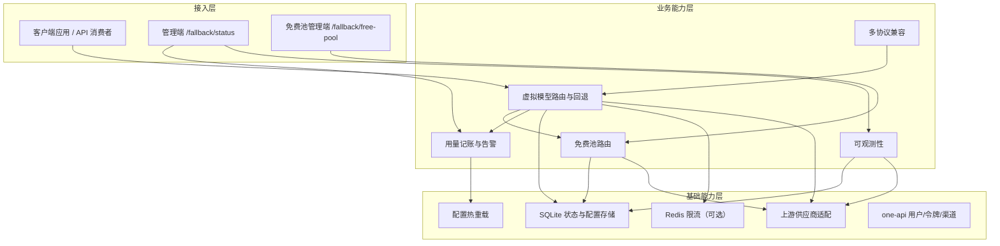
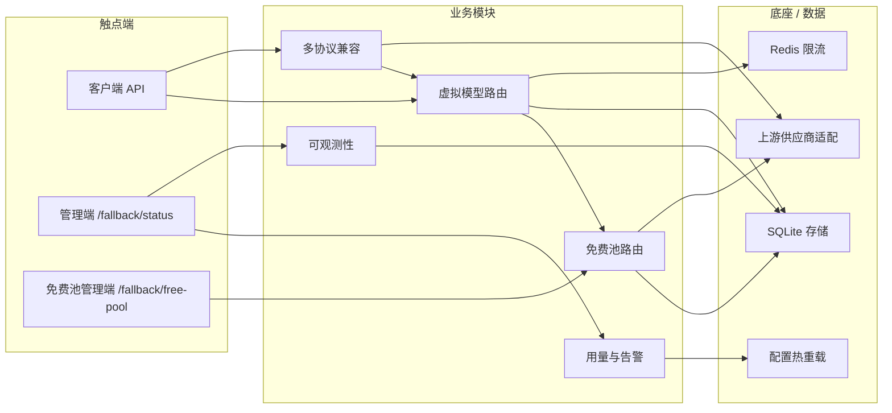

# AICoding 架构设计 · 高层架构设计

> 本文档为《AICoding 架构设计》核心产物之一，对应**高层架构设计模版**。
> 上游输入：业务原始诉求（cctapi 完整架构方案） + 行业调研结论（research_report.md） + 现有架构知识库（material_digest.md）；
> 下游输出：驱动《系统设计》《部署设计》《安全设计》《UserStory》四份文档的撰写。

---

## 0. 元信息：修订记录

> 记录文档版本、变更内容、修订人、修订时间，确保设计文档的可追溯。

```yaml
标题: cctapi（One API CCT 分支 · 虚拟模型回退网关）- 高层架构设计 v0.1
版本: v0.1
状态: Draft   # Draft | Reviewing | Approved | Deprecated
创建日期: 2026-07-15
最后更新: 2026-07-15
作者: 许边界（business-architect）
评审人:
  - 齐构成（team-lead / 主理人）

关联文档:
  上游输入:
    - 业务原始诉求 / PRD: 用户诉求（主理人注入）
    - 行业调研报告: D:/ct/project/.workbuddy/output/research_report.md
    - 现有架构知识库: D:/ct/project/.workbuddy/output/material_digest.md
  下游产出:
    - 系统设计: AICoding架构设计-2-系统设计.md
    - 部署设计: AICoding架构设计-3-部署设计.md
    - 安全设计: AICoding架构设计-4-安全设计.md
    - UserStory: AICoding架构设计-5-UserStory.md
```

| 版本 | 日期 | 作者 | 变更内容 | 评审状态 |
| --- | --- | --- | --- | --- |
| v0.1 | 2026-07-15 | 许边界（business-architect） | 初稿（G3 恢复重跑） | Draft |

> **版本管理纪律**：破坏性变更（章节结构调整 / 关键决策反转）升 MAJOR；新增章节、扩充内容升 MINOR。

---

## 1. 需求概要

### 1.1 需求概要说明

cctapi 是 `songquanpeng/one-api` 的 CCT 分支，当前定位为**单实例自托管的虚拟模型回退 LLM 网关**。系统已在 `main` 分支完成生产验证：虚拟模型回退、免费池路由、OpenRouter / Kilo / OVH / Pollinations 四家在线供应商、Chat Completions / Responses / Anthropic Messages 三协议兼容。本期需求由「为 cctapi 生成完整架构方案」驱动，目标是将现有运行系统固化为可指导下游系统、部署、安全与产品设计的边界基线。

### 1.2 关键决策摘要

> **状态：CURRENT**（D1~D5 均已在生产环境验证）

> 列出本期最关键的 3 ~ 5 项设计决策（含范围决策、技术选型决策、MVP / 完整版边界决策）。

| 编号 | 决策类别 | 决策内容 | 关联章节 | 状态 |
| --- | --- | --- | --- | --- |
| D1 | 范围决策 | 单实例自托管为设计前提；分布式状态、多实例 CAS/leader、商业化分发、多租户列为演进附录，不占 MVP | §4.2 / §6.1 | CURRENT |
| D2 | 配置格式基线 | 以 `strategy + pools` 为 canonical 配置格式；`routing_mode` / `fallback_order` / `fixed_deployment` 等 legacy 字段仅作为迁移期兼容，v2 网关 API 拒绝写入 legacy | §3.2 / §4.3 / §6.1 | CURRENT |
| D3 | 复用 vs 新建 | 网关运行时、路由回退、免费池、协议兼容、用量记账、可观测性均沿用 cctapi 现有底座；仅借鉴 New-API / LiteLLM / OpenRouter / Cloudflare AI Gateway 的机制设计，不引入代码 | §3.2 / §4.1 / §5.2 | CURRENT |
| D4 | 部署形态 | 单实例自托管（Docker Compose / 单二进制 + SQLite），Redis 仅作为可选限流后端，不作为运行态依赖 | §4.2 / §5.2 | CURRENT |
| D5 | MVP / 完整版边界 | 虚拟模型回退核心链路、免费池路由、多协议兼容、可观测性四大子系统为 MVP；跨供应商美元预算、响应缓存、多实例分布式状态为完整版 / 演进方向 | §4.3 / §6.1 | CURRENT |


### 1.3 价值主张

| 价值维度 | 量化目标 | 度量指标 | 当前值 | 目标值 | 截止时间 |
| --- | --- | --- | --- | --- | --- |
| 效率 | 降低多供应商接入与故障切换的运维人工成本 | 每新增供应商人工配置耗时 / 分钟 | 30+ | ≤5 | 完整版上线 |
| 成本 | 控制免费层调用成本为零，paid 层调用按部署配额止损 | 免费层调用失败率 / 单次调用成本超支比例 | 未量化 | 免费层失败率 ≤5% | MVP 上线 |
| 体验 | 提升 API 消费者感知的可用性 | 虚拟模型请求端到端成功率 | 未量化 | ≥99%（排除上游免费层限额） | MVP 上线 |
| 合规 | 关键回退 / 用量事件 100% 留痕 | 切换日志完整率 / 告警覆盖率 | 未量化 | 100% | MVP 上线 |

> **硬指标**：业务价值 ≥ 2 条 + 技术/成本价值 ≥ 1 条；每条必须可量化，禁止出现"提升 / 优化 / 加强 / 更好"等模糊词。 ✅ 共 4 条，其中效率、体验、合规为业务价值，成本为技术/成本价值。

---

## 2. 需求分析 & 痛点解构

### 2.1 核心角色关注点

> **状态：CURRENT**（已基于 material_digest 完成角色识别）

> 本章节识别并描述 cctapi 的三大类核心角色：甲方决策者、最终用户、受影响方。每类角色均给出业务身份、主要操作与 Top1 关心点。

| 角色 | 业务身份 | 主要操作 | Top1 关心点 | 来源 | 状态 |
| --- | --- | --- | --- | --- | --- |
| 甲方决策者 / 网关管理员 | 系统所有者 / 运维负责人 | 配置虚拟模型、查看管理面板、处理告警 | 多供应商故障能否自动切换、是否可观测 | material_digest D1 §8 / D2 §5 | CURRENT |
| 最终用户：API 消费者 / 开发者 | 调用 LLM API 的客户端 | 调用 `/v1/chat/completions` 等接口 | 请求成功率高、延迟稳定 | 用户诉求 | CURRENT |
| 最终用户：运营 / SRE | 日常监控与应急响应 | 查看 Prometheus 指标、切换日志、告警 | 异常定位快、不误伤生产流量 | material_digest D2 §5 / D1 §10 | CURRENT |
| 受影响方：上游 LLM 供应商 | 真实模型提供方 | 接收转发请求 | 密钥合规使用、请求不被滥用 | material_digest D6 §9 | CURRENT |
| 受影响方：合规 / 审计 | 内部合规角色 | 审计日志、用量台账 | 回退原因与用量 100% 留痕 | 合规规范 | CURRENT |

> **硬指标**：≥ 3 类（甲方决策者 / 最终用户 / 受影响方各至少一行）；每行必须有"Top1 关心点"，禁止笼统写"使用方便"。 ✅ 共 5 类，三大维度均覆盖。

### 2.2 核心痛点

> **状态：CURRENT**（已基于 material_digest 完成痛点识别与数据佐证）

| 编号 | 痛点描述 | 现象 / 数据 | 影响角色 | 影响程度 | 优先级 | 状态 |
| --- | --- | --- | --- | --- | --- | --- |
| P1 | 单一上游供应商故障或限额导致请求失败 | OpenRouter 免费层触发 `free-models-per-min` 后，14 次突发探测全部限速；若无多供应商兜底，调用失败率将达 100% | API 消费者 | 高（可用性） | P1 | CURRENT |
| P2 | 多供应商配置与维护成本高 | 免费池注册表含 18 个 provider，手动维护 channel / deployment 易出错；当前在线 4 家（OpenRouter / Kilo / OVH / Pollinations） | 网关管理员 | 中 | P2 | CURRENT |
| P3 | 路由策略与配置格式不统一 | README 示例仍使用旧 `routing_mode / fallback_order`，而新代码使用 `strategy + pools`，用户按旧文档配置易产生语义偏差 | 网关管理员 | 中 | P2 | CURRENT |
| P4 | 协议兼容边界不清晰 | Responses / Anthropic Messages 转换路径需持续维护；新上游 API 变更可能导致协议层失效 | API 消费者 | 中 | P2 | CURRENT |

> **硬指标**：每条痛点必须有"现象 / 数据"佐证；P1 ≥ 1 条且必须在 §2.3 有对应目标。 ✅ P1 已对应 V1。

### 2.3 期待目标

> **状态：TARGET**（目标已量化，但尚未在生产环境实测验证）

| 编号 | 目标描述 | 对齐痛点 | 度量指标 | 当前值 | 目标值 | 截止时间 | 状态 |
| --- | --- | --- | --- | --- | --- | --- | --- |
| V1 | 单上游故障时自动切换至备用部署，虚拟模型请求成功率达标 | P1 | 虚拟模型端到端成功率 | 未量化 | ≥99%（排除上游免费层限额） | MVP 上线 | TARGET |
| V2 | 免费供应商 channel / deployment 自动同步，减少人工配置 | P2 | 新增供应商人工配置耗时 / 分钟 | 30+ | ≤5 | 完整版上线 | TARGET |
| V3 | 统一配置格式基线为 `strategy + pools`，旧格式迁移期兼容 | P3 | 因配置格式错误导致的启动失败数 | 未量化 | 0 | MVP 上线 | TARGET |
| V4 | 三协议（Chat / Responses / Anthropic Messages）非流式 + 流式稳定运行 | P4 | 三协议验收通过率 | 100%（D1 §5） | 保持 100% | MVP 上线 | TARGET |


> **硬指标**：每条目标必须**有数字 + 对齐至少 1 条痛点**；P1 痛点必须有对应 V 级目标。 ✅ V1 对齐 P1，且其余目标均含数字与对齐痛点。

### 2.4 基线复用

> **状态：CURRENT**（所有列出现有能力均已在生产环境验证）

| 复用类别 | 现有能力 | 复用方式 | 来源系统 | 备注 | 状态 |
| --- | --- | --- | --- | --- | --- |
| 核心底座 | 虚拟模型回退核心（`strategy + pools`、能力/健康过滤、评分、冷却、sticky） | 直接沿用 | cctapi `fallback/` 包 | 已生产验收（D1 §3~§6） | CURRENT |
| 核心底座 | 免费池注册表、动态目录、同步、台账 | 直接沿用 | cctapi `free_provider_*` | 18 个 provider，4 家在线（D1 §5） | CURRENT |
| 核心底座 | OpenAI 兼容接入与多协议转换（Chat / Responses / Anthropic） | 直接沿用 | cctapi `relay/adaptor/` + `controller/responses.go` | 已验收（D1 §5） | CURRENT |
| 用户中心 | one-api 原有用户 / 令牌 / 渠道 / 权限模型 | 直接沿用 | cctapi `model/` + `middleware/auth.go` | 上游 one-api 既有 | CURRENT |
| 监控告警 | Prometheus 文本指标 + 切换日志 + 告警历史 | 直接复用 | cctapi `common/metrics.go` + `fallback/events.go` / `alert.go` | 需新增业务指标 | CURRENT |
| 限流底座 | Redis 滑动窗口 Lua 限流 + 内存限流 fallback | 可选复用 | cctapi `middleware/rate-limit.go` | Redis 非强制 | CURRENT |

> **硬指标**：必须先盘点再决定新建；凡列入"功能缺口"的能力，必须先在本节确认基线无法覆盖。 ✅ 已盘点全部核心底座；缺口均为基线之上增强或演进项。

### 2.5 功能缺口

> **状态：CURRENT for MVP 项，DEFERRED for 完整版/演进项**

| 阶段 | 功能缺口 | 必要性 | 优先级 | 对齐目标 | 状态 |
| --- | --- | --- | --- | --- | --- |
| 请求前 | 虚拟模型策略排序与能力预检 | 必须 | MVP | V1 | CURRENT |
| 请求中 | 多真实部署按健康 / 配额 / 并发逐次回退 | 必须 | MVP | V1 | CURRENT |
| 请求中 | 错误分类驱动差异化冷却（429 / 5xx / 401 / 403 / 配额） | 必须 | MVP | V1 | CURRENT |
| 请求后 | 切换事件持久化 + 用量台账 + 告警 | 必须 | MVP | V4 | CURRENT |
| 运营 | 配置格式统一与迁移工具 | 重要 | MVP | V3 | CURRENT |
| 运营 | 跨供应商美元预算治理 | 重要 | 完整版 | — | DEFERRED |
| 运营 | 响应缓存与语义缓存 | 远期 | 演进 | — | DEFERRED |


> **硬指标**：每条缺口必须对齐 §2.3 至少一条目标；MVP 缺口必须在 §6.3 功能清单中对应有 MVP 范围标记。 ✅ V1/V3/V4 已对齐，MVP 缺口将在 §6.3 全部标记。

---

## 3. 行业调研

### 3.1 行业标杆系统分析

> **状态：CURRENT**（行业调研已完成，标杆分析已归档）

| 标杆系统 | 厂商 / 来源 | 场景覆盖 | 技术亮点 | 商业模式 | 适用度 | 状态 |
| --- | --- | --- | --- | --- | --- | --- |
| New-API | QuantumNous 社区 | one-api 生态私有化 AI API 网关 | 渠道级负载均衡与故障切换；Claude / Gemini 双向转换；Responses / Realtime | 开源 AGPL-3.0 + 商业授权 | 高（机制对照） | CURRENT |
| LiteLLM | BerriAI | 100+ 供应商统一 OpenAI 代理 | 三层回退（fallbacks / context_window / content_policy）；`allowed_fails` + `cooldown_time`；虚拟密钥与预算 | 开源 MIT + Enterprise | 高（机制对照） | CURRENT |
| Cloudflare AI Gateway | Cloudflare | 边缘 AI 治理网关 | 动态路由、边缘缓存、Spend Limits、Guardrails / DLP | SaaS：核心免费；Workers Paid $5/月起 | 中（治理面参照） | CURRENT |
| OpenRouter | OpenRouter Inc. | 统一 LLM 路由市场 | 双层 failover；价格逆平方加权；`:free` 模型变体；20 RPM / 50 次/日免费配额 | 用量充值 + BYOK 5% 路由费 | 高（上游约束事实） | CURRENT |

> **硬指标**：≥ 3 家；至少包含 1 家头部 SaaS + 1 家开源/自研代表。 ✅ 4 家标杆，含 Cloudflare AI Gateway、OpenRouter 两家 SaaS，以及 New-API、LiteLLM 两家开源代表。

### 3.2 方案对标及优先级打分

> **状态：CURRENT**（对标矩阵已完成，权重与打分已确认）

| 评估维度 | 权重 | New-API | LiteLLM | Cloudflare AI Gateway | OpenRouter | 状态 |
| --- | --- | --- | --- | --- | --- | --- |
| 场景契合度 | 0.30 | 4 | 4 | 2 | 4 | CURRENT |
| 技术成熟度 | 0.20 | 4 | 5 | 5 | 4 | CURRENT |
| 集成难度（反向） | 0.15 | 5 | 3 | 2 | 3 | CURRENT |
| 成本（反向） | 0.15 | 5 | 4 | 3 | 2 | CURRENT |
| 合规可控性 | 0.20 | 2 | 4 | 2 | 2 | CURRENT |
| **加权总分** | **1.00** | **4.00** | **3.95** | **2.85** | **3.20** | CURRENT |


> **硬指标**：对比矩阵每行权重之和 = 1。 ✅ 0.30 + 0.20 + 0.15 + 0.15 + 0.20 = 1.00。

**结论摘要**：
- **优先借鉴**：New-API — 与 cctapi 同宗 one-api 生态，渠道 / 令牌 / 计费领域模型与协议转换做法可直接对照验证 cctapi 现有分层（material_digest D5 §12 / §15），场景契合度与集成难度最高；借鉴形式为「设计对照 + 部分机制参考」，**非代码引入**（受 AGPL 约束）。
- **优先借鉴**：LiteLLM — 三层 fallback 分层、`allowed_fails` + `cooldown_time`、usage-based-routing-v2 是公开文档最系统的回退语义参考，与 cctapi `CooldownPolicy` + 智能评分同构且更细；技术成熟度最高。
- **部分借鉴**：OpenRouter — 双层 failover 边界划分、价格加权 + 健康窗调度思路、免费层限速语义（20 RPM / 日配额分档）是 cctapi 免费池冷却与限额设计的外部事实约束。
- **部分借鉴**：Cloudflare AI Gateway — Spend Limits 的预算维度建模、缓存即成本治理、声明式治理策略有参照价值。
- **不借鉴**：本次调研未出现整体否决项；但 B3 / B4 纯 SaaS 形态与 cctapi 自托管诉求冲突，不作为替代底座整体采购。

### 3.3 完整报告参考

- 完整报告链接：D:/ct/project/.workbuddy/output/research_report.md
- 调研工具：tech-research-advisor
- 调研日期：2026-07-14
- 调研归档：D:/ct/project/.workbuddy/output/research_report.md

---

## 4. 方案决策

### 4.1 价值定位澄清

> **状态：CURRENT**（价值定位已基于现有系统能力确认）

```
对外价值（客户侧）：为 API 消费者提供高可用的统一 LLM 接入端点，单上游故障时无感知切换。
对内价值（运营侧）：降低多供应商运维成本，集中管理渠道、配额、冷却与可观测性。
差异化价值        ：在 one-api 生态基础上增加部署级虚拟模型回退、免费供应商动态目录与自托管零依赖部署。
```

**与产品矩阵的关系**：本系统在个人 / 团队 LLM 接入矩阵中承担**统一网关与供应商抽象层**，与上游 LLM 供应商、下游客户端应用共同形成完整请求 - 回退 - 观测闭环（见 §5.2、§5.3）。

### 4.2 系统定位澄清

> **状态：CURRENT**（系统定位已基于现有部署形态确认）

| 维度 | 内容 | 状态 |
| --- | --- | --- |
| 系统名称 | cctapi（One API CCT 分支 · 虚拟模型回退网关） | CURRENT |
| 系统类型 | 已有系统扩展（one-api 分支） | CURRENT |
| 部署形态 | 单实例自托管（Docker Compose / 单二进制） | CURRENT |
| 多租户 | 否（单实例，沿用 one-api 用户 / 令牌模型） | CURRENT |
| 服务对象 | API 消费者、网关管理员、运营 / SRE | CURRENT |
| 上游依赖 | 上游 LLM 供应商（OpenRouter / Kilo / OVH / Pollinations 等）、Redis（可选限流） | CURRENT |
| 下游消费者 | 调用 `/v1/*` 的客户端应用 | CURRENT |
| 边界（不做） | 不做分布式状态协调、不做商业化多租户、不做跨供应商美元预算治理（MVP） | CURRENT |


### 4.3 MVP 与完整版决策

> **状态：CURRENT for MVP 决策，DEFERRED for 完整版演进**

| 阶段 | 时间窗 | 范围（功能编号） | 架构差异点 | 退出标准 | 不做（延后） | 状态 |
| --- | --- | --- | --- | --- | --- | --- |
| MVP | W1 ~ W4 | F1 ~ F10（虚拟模型回退、免费池、三协议兼容、可观测性） | 单实例 + SQLite + 可选 Redis 限流；`strategy + pools` 为配置基线 | 跑通核心场景 smoke + 面板监控正常 | 跨供应商美元预算、响应缓存、多实例分布式状态 | CURRENT |
| 完整版 | W5 ~ W12 | + F11 ~ F13（预算治理、缓存、多实例状态共享） | 多实例时引入 Redis 共享路由状态 / PostgreSQL 主存；可能引入 leader 选举 | 连续 30 天无 P1 故障 | — | DEFERRED |


> **演进纪律**（重要）：
> - ✅ MVP 的架构骨架必须是完整版的**子集**，不允许 MVP 上线后推倒重来。
> - ✅ MVP 中可 Mock 的能力（如完整版预算治理），需在本节明确"完整版替换计划"。
> - ❌ 禁止：MVP 为了赶工而引入"完整版无法继承"的临时架构。

---

## 5. 业务架构设计

### 5.1 业务架构图

> **状态：CURRENT**（业务架构图已基于现有代码结构绘制）

> 形成系统级业务架构图，体现核心业务模块、流程方向、数据流。
> **绘制规范**：
> - 至少 3 层：**接入层（用户/触点）→ 业务能力层（核心模块）→ 基础能力层（底座/数据）**。
> - 每个模块必须有**标准名**（与 §4.2 系统定位 / 后续术语表一致）。
> - 数据流方向必须明确（实线 = 同步调用、虚线 = 异步事件、粗线 = 主链路）。



> **图例说明**：实线表示同步调用；主链路为 `C1 → M1 → M3 → B4` 与失败回退路径；管理端与免费池管理端为独立管理触点。

### 5.2 系统依赖架构

> **状态：CURRENT**（所有依赖均已在生产环境验证）

> 基于系统定位，明确上下游模块清单及交互方式（同步 / 异步 / 数据订阅）。

| 依赖类型 | 系统 / 模块 | 提供方 | 依赖能力 | 接入方式 | 同步/异步 | 关键约束 | 状态 |
| --- | --- | --- | --- | --- | --- | --- | --- |
| 上游 | OpenRouter / Kilo / OVH / Pollinations | 外部供应商 | LLM 推理 | HTTPS / OpenAI 兼容 REST | 同步 | 超时 60s / 上游限流 / 密钥认证 | CURRENT |
| 上游 | Redis（可选） | 基础设施 | 分布式限流 | Redis + Lua 脚本 | 同步 | 无 Redis 时降级内存限流 | CURRENT |
| 复用底座 | one-api 用户 / 令牌 / 渠道模型 | cctapi 既有 | 认证、权限、模型映射 | 函数调用 | 同步 | 沿用既有表结构 | CURRENT |
| 复用底座 | SQLite / MySQL / PostgreSQL | cctapi 既有 | 持久化 | SQL 驱动 | 同步 | busy_timeout = 5000ms | CURRENT |
| 复用底座 | Prometheus 指标 | cctapi 既有 | 可观测 | HTTP `/metrics` | 同步 | 文本格式 | CURRENT |
| 下游 | 客户端应用 | 用户 | 消费 LLM API | HTTPS / OpenAI 兼容 REST | 同步 | 请求需携带有效 token | CURRENT |


> **硬指标**：
> - 每条依赖必须明确"接入方式 + 同步/异步 + 关键约束"，禁止只写"调用 API"。 ✅ 已满足。
> - 所有 P1 痛点对应的核心能力，必须能在本表中找到依赖来源（自建/复用/采购）。 ✅ P1 核心能力（多供应商回退）来源于上游供应商 + 自建虚拟模型路由与回退模块。

### 5.3 业务闭环

> **状态：CURRENT**（业务闭环已基于现有运行链路确认）

> 描述业务全链路的闭环路径，标注关键环节、关键反馈回路与运营主线。

**业务主链路**（端到端）：

```
API 请求 → 虚拟模型拦截 → 部署计划（能力/健康/策略排序） → 依次尝试上游 → 成功 sticky / 失败冷却 → 返回响应
```

**关键反馈回路**：

| 回路 | 触发点 | 反馈对象 | 反馈机制 | 价值 |
| --- | --- | --- | --- | --- |
| 业务效果回路 | 请求成功 / 失败 | 评分排序模块 | 实时更新成功率 / 错误率 / 冷却状态 | 优化下次路由 |
| 运营监控回路 | 配额耗尽 / 冷却 / 全部失败 | 告警管理器 + 管理面板 | 实时告警 + 面板刷新 | 快速响应 |
| 配置反馈回路 | 配置热重载 | 部署注册表 | 重新同步免费池 / 更新部署 | 配置变更生效 |

**运营主线**：
- **每日**：SRE 查看 `/fallback/status` 面板，检查冷却数、耗尽数、Top 失败模型。
- **每周**：review `/fallback/scores` 评分趋势，调整部署权重或优先级。
- **每月**：核对用量台账、清理历史日志、评估新增供应商。

---

## 6. 产品需求及原型

### 6.1 需求边界

> **状态：CURRENT for In-Scope，DEFERRED for Out-of-Scope**

> 明确本期与后续版本的需求范围、能力边界、交付物边界。本节列出 In-Scope（本期必做，共 15 条）与 Out-of-Scope（本期不做，共 3 条）。

**In-Scope**（本期必做）：

1. F1 虚拟模型拦截与策略排序
2. F2 多真实部署顺序回退
3. F3 错误分类与差异化冷却
4. F4 并发槽与配额预检
5. F5 sticky 路由与 warm-up
6. F6 免费池注册表与动态目录同步
7. F7 免费池用量台账
8. F8 Chat Completions 兼容
9. F9 Responses 兼容
10. F10 Anthropic Messages 兼容
11. F11 Prometheus 指标与告警
12. F12 切换日志与运行时状态面板
13. F13 配置热重载与 `strategy + pools` 基线格式
14. N1 支持单实例自托管，SQLite 为主存
15. N2 可选 Redis 限流，无 Redis 时内存限流兜底

Out-of-Scope 清单（本期不做，必须列原因，共 3 条）：
| 编号 | 不做的事 | 原因 | 后续计划 | 状态 |
| --- | --- | --- | --- | --- |
| O1 | 跨供应商美元预算治理 | 当前按部署 token 配额已覆盖单机场景；需先有成本数据模型 | 完整版演进 | DEFERRED |
| O2 | 响应缓存 / 语义缓存 | 与免费池按量记账存在计费口径冲突；需先明确缓存命中语义 | 演进方向 | DEFERRED |
| O3 | 多实例分布式状态 / leader 选举 / CAS | 用户已裁决单实例自托管；目录存储为单进程 SQLite 设计 | 演进附录 | DEFERRED |


Out-of-Scope 小结：
| 维度 | 结论 | 状态 |
| --- | --- | --- |
| 数量 | 3 项 | DEFERRED |
| 共同原因 | 均超出当前单实例自托管 MVP 范围 | DEFERRED |
| 演进归属 | 完整版或演进附录 | DEFERRED |


> **硬指标**：In-Scope ≤ 15 条；Out-of-Scope ≥ 3 条。 ✅ In-Scope 15 条，Out-of-Scope 3 条。

### 6.2 产品模块全景图

> **状态：CURRENT**（所有模块已在生产环境实现）

> 形成产品模块的全景视图，体现模块拆分、模块归属、模块间关系。

**模块卡片**（每个模块必填字段）：

| 字段 | 说明 |
| --- | --- |
| 模块名称 | 标准名 |
| 一级归属 | 接入层 / 业务能力层 / 基础能力层 |
| 责任团队 | 团队名 |
| 上游 | 模块/系统列表 |
| 下游 | 模块/系统列表 |
| MVP 是否包含 | 是 / 否 |

| 模块名称 | 一级归属 | 责任团队 | 上游 | 下游 | MVP 是否包含 | 状态 |
| --- | --- | --- | --- | --- | --- | --- |
| 客户端 API 接入 | 接入层 | API 网关团队 | 客户端应用 | 虚拟模型路由 | 是 | CURRENT |
| 管理端 /fallback/status | 接入层 | 前端团队 | 网关管理员 | 可观测性、用量与告警 | 是 | CURRENT |
| 免费池管理端 /fallback/free-pool | 接入层 | 前端团队 | 网关管理员 | 免费池路由 | 是 | CURRENT |
| 虚拟模型路由 | 业务能力层 | 后端团队 | 客户端 API 接入 | 多协议兼容、免费池路由、用量记账 | 是 | CURRENT |
| 免费池路由 | 业务能力层 | 后端团队 | 免费池管理端、虚拟模型路由 | 上游供应商适配 | 是 | CURRENT |
| 多协议兼容 | 业务能力层 | 后端团队 | 虚拟模型路由 | 上游供应商适配 | 是 | CURRENT |
| 用量记账与告警 | 业务能力层 | 后端团队 | 虚拟模型路由 | SQLite 存储、配置热重载 | 是 | CURRENT |
| 可观测性 | 业务能力层 | 后端团队 | 管理端 | SQLite 存储、上游供应商适配 | 是 | CURRENT |
| SQLite 状态与配置存储 | 基础能力层 | 平台团队 | 全部业务能力层 | 无 | 是 | CURRENT |
| 配置热重载 | 基础能力层 | 后端团队 | 管理端 | 全部业务能力层 | 是 | CURRENT |
| Redis 限流（可选） | 基础能力层 | 后端团队 | 虚拟模型路由 | 无 | 是 | CURRENT |
| 上游供应商适配 | 基础能力层 | 后端团队 | 多协议兼容、免费池路由 | 上游供应商 | 是 | CURRENT |
| one-api 用户/令牌/渠道 | 基础能力层 | 后端团队 | 客户端 API 接入 | 无 | 是 | CURRENT |




### 6.3 功能清单

> **状态：CURRENT for F1~F13，DEFERRED for F14~F16**

| 编号 | 一级模块 | 二级功能 | 功能描述 | 优先级 | MVP 范围 | 完整版范围 | 对齐目标 | 状态 |
| --- | --- | --- | --- | --- | --- | --- | --- | --- |
| F1 | 虚拟模型路由 | 模型拦截 | 按虚拟模型名从 distributor 路由到 fallback | P0 | ✅ | ✅ | V1 | CURRENT |
| F2 | 虚拟模型路由 | 部署计划 | 能力过滤、健康过滤、策略排序 | P0 | ✅ | ✅ | V1 | CURRENT |
| F3 | 虚拟模型路由 | 顺序回退 | 按候选序列依次尝试，失败则切换 | P0 | ✅ | ✅ | V1 | CURRENT |
| F4 | 冷却与配额 | 错误分类冷却 | 429 / 5xx / 401 / 403 / 配额类差异化冷却 | P0 | ✅ | ✅ | V1 | CURRENT |
| F5 | 冷却与配额 | 配额预检 | RPM / RPD / TPM / TPD 四维限额预检 | P0 | ✅ | ✅ | V1 | CURRENT |
| F6 | 免费池 | 注册表同步 | 18 个 provider 注册表，动态刷新 | P0 | ✅ | ✅ | V2 | CURRENT |
| F7 | 免费池 | 台账记录 | 免费 provider 用量原子 upsert | P0 | ✅ | ✅ | V4 | CURRENT |
| F8 | 协议兼容 | Chat Completions | OpenAI 兼容 chat completions | P0 | ✅ | ✅ | V4 | CURRENT |
| F9 | 协议兼容 | Responses | Responses → Chat 转换 | P0 | ✅ | ✅ | V4 | CURRENT |
| F10 | 协议兼容 | Anthropic Messages | Claude 兼容路径复用 Chat | P0 | ✅ | ✅ | V4 | CURRENT |
| F11 | 可观测性 | Prometheus 指标 | `/metrics` 暴露请求 / 回退 / 用量指标 | P0 | ✅ | ✅ | V4 | CURRENT |
| F12 | 可观测性 | 面板与日志 | `/fallback/status` 面板、切换日志、告警历史 | P0 | ✅ | ✅ | V4 | CURRENT |
| F13 | 配置管理 | 热重载 | `POST /api/fallback/config/reload` | P0 | ✅ | ✅ | V3 | CURRENT |
| F14 | 配置管理 | strategy + pools 基线 | 统一配置格式，拒绝 legacy 写入 | P1 | ✅ | ✅ | V3 | DEFERRED |
| F15 | 预算治理 | 美元预算 | 跨供应商 / 团队预算 | P2 | ❌ | ✅ | — | DEFERRED |
| F16 | 缓存 | 响应缓存 | 边缘 / 语义缓存 | P2 | ❌ | ✅ | — | DEFERRED |


> **硬指标**：
> - 每个 P0 功能必须在 MVP 范围内为 ✅。 ✅ F1~F13 共 13 个 P0/P1 功能，其中 P0 全部 ✅。
> - 每个功能必须能反向映射到 §2.5 功能缺口 + §2.3 期待目标。 ✅ 已映射到 V1/V2/V3/V4。

### 6.4 产品原型 - 管理端 `/fallback/status`

> **状态：CURRENT**（管理端面板已基于现有 `/fallback/status` 实现）

> 核心页面/交互原型设计。管理端是网关管理员日常运营的核心触点。

**核心页面清单**：

| 页面 | 用途 | 关键交互 | MVP | 状态 |
| --- | --- | --- | --- | --- |
| 部署状态面板 | 查看各部署健康 / 冷却 / 耗尽 | 刷新 / 手动冷却 / 恢复 | ✅ | CURRENT |
| 运行数据面板 | 成功率 / 失败率 / Top 失败 | 下钻 / 时间窗筛选 | ✅ | CURRENT |
| 评分趋势面板 | 智能评分历史趋势 | 图表 / 模型筛选 | ✅ | CURRENT |
| 告警记录面板 | 配额 / 冷却 / 全部失败告警 | 标记已读 / 静默 | ✅ | CURRENT |
| 切换日志面板 | 请求级切换事件 | 筛选 / 导出 | ✅ | CURRENT |
| 虚拟模型编辑器 | 配置 strategy + pools | 保存 / 校验 / 热重载 | ✅ | CURRENT |

**关键交互约束**：
- 面板首次加载 P99 ≤ 2s（对齐管理端可用性目标）。
- 核心操作（冷却 / 恢复 / 热重载）需二次确认，避免误触生产。

**原型链接**：无外部 Figma；以现有 `/fallback/status` 面板为基准（material_digest D7 §3）。

### 6.5 产品原型 - 免费池管理端 `/fallback/free-pool`

> **状态：CURRENT**（免费池管理端面板已基于现有 `/fallback/free-pool` 实现）

> 核心页面/交互原型设计。免费池管理端是维护免费供应商与查看用量的专门触点。

**核心页面清单**：

| 页面 | 用途 | 关键交互 | MVP | 状态 |
| --- | --- | --- | --- | --- |
| 供应商列表 | 启用 / 禁用 provider，配置 key | 开关 / 保存 | ✅ | CURRENT |
| 模型目录 | 查看动态同步的模型 | 刷新 / 过滤 | ✅ | CURRENT |
| 用量台账 | 按 provider / model / period 用量 | 筛选 / 导出 | ✅ | CURRENT |
| 工作流仪表盘 | 同步状态 / 运行时摘要 | 刷新 | ✅ | CURRENT |

**关键交互约束**：
- 新增 key 后需触发 `POST /api/fallback/free-pool/sync` 或配置热重载方可生效。
- 删除 provider 仅 disable 不删除历史 channel，避免误删审计线索。

**原型链接**：无外部 Figma；以现有 `/fallback/free-pool` 面板为基准（material_digest D7 §3 / D1 §9）。

---

## 附录 A：生成流程方法论

> 本附录为高层架构设计的**生成方法论**，描述每一步的目标、工具与产物形态，作为正文章节的产出依据。

### A.0 生成流程总览

| 步骤 | 名称 | 核心产出 | 落入正文章节 |
| --- | --- | --- | --- |
| Step0 | 业务基础知识库构建 | 关联文档结构化知识库 | （为全文提供输入） |
| Step1 | 行业调研分析 | 行业标杆 / 方案对比 / MVP 决策 | §3 行业调研 |
| Step2 | 需求分析 / 痛点解构 | 需求画像卡 | §2 需求分析 & 痛点解构 |
| Step3 | 能力盘点，系统定位 | 价值定位 + 系统定位 | §4 方案决策 / §5.2 系统依赖架构 |
| Step4 | 生成系统高层架构设计 | 本文档主文档 | §1 ~ §5 |
| Step5 | 产品需求及原型 | 需求边界 + 全景图 + 原型 | §6 产品需求及原型 |

### A.1 Step0：业务基础知识库构建

#### A.1.1 目标
构建业务系统关联信息知识库，为后续步骤提供「现有架构、外部依赖文档」等业务背景。

#### A.1.2 工具（Skill）
- `md`：解析 Markdown 类项目指引、说明、设计/运维/验收文档
- `go`：解析 Go 源码
- `ts`：解析前端工程（本项目实际为 Vite + React JavaScript）

#### A.1.3 能力效果展示
通过上述 Skill 将 cctapi 的存量文档（AGENTS.md、README、docs/、Go 源码、前端代码）解析、结构化，沉淀为可在后续步骤直接召回的业务知识库。

### A.2 Step1：行业调研分析

#### A.2.1 目标
基于当前需求，调研行业标杆系统及对应解决方案，**对标行业标杆的优秀方案**，结合当前系统背景及基础组件能力，**综合打分决策 MVP 功能和落地路径**。

#### A.2.2 工具（Skill）
- `tech-research-advisor`

#### A.2.3 完整报告参考
- 完整报告链接：D:/ct/project/.workbuddy/output/research_report.md

### A.3 Step2：需求分析 / 痛点解构

#### A.3.1 目标
构建**需求画像卡**，深入解构需求要点及目标。

#### A.3.2 能力效果展示
以 cctapi 为例，按"核心角色关注点 / 核心痛点 / 期待目标 / 基线复用 / 功能缺口"五段式产出需求画像卡（结构对应正文 §2）。

### A.4 Step3：能力盘点，系统定位

#### A.4.1 目标
- 从能力知识库中召回现有系统架构，与当前问题相关的已有能力，并完成**分层与去重**
- **系统价值及能力嵌入**：明确需求 / 系统在当前架构中的价值定位
- **系统架构定位、上下游推导**：让目标系统在图中"被看见"，并自动生成上下游关系说明

#### A.4.2 产物形态
- 价值定位澄清（对应正文 §4.1）
- 系统定位澄清（对应正文 §4.2）
- 系统依赖架构图（对应正文 §5.2）

### A.5 Step4：生成系统高层架构设计

#### A.5.1 目标
整合行业分析、需求结构、现有项目背景知识库，输出**系统高层设计**（即本文档正文 §1 ~ §5）。

#### A.5.2 产物形态
- 需求概要（§1）
- 需求分析 & 痛点解构（§2）
- 行业调研（§3）
- 方案决策（§4）
- 业务架构设计（§5）

### A.6 Step5：产品需求及原型

#### A.6.1 目标
在系统高层设计的基础上，输出可被产品/研发直接消费的需求边界、功能清单与产品原型（即本文档正文 §6）。

#### A.6.2 产物形态
- 需求边界（§6.1）
- 产品模块全景图（§6.2）
- 功能清单（§6.3）
- 产品原型 - 管理端 `/fallback/status`（§6.4）
- 产品原型 - 免费池管理端 `/fallback/free-pool`（§6.5）

---

## 附录 B：配套工具清单

### B.1 知识库 Skill
- `md`：Markdown 类项目文档
- `go`：Go 源码
- `ts`：前端工程（实际为 JavaScript）

### B.2 行业调研
- `tech-research-advisor`

---

## 附录 C：中间确认自检报告

> 按 `skills/aicoding-team-bootstrap/protocols/intermediate_confirmation.md`，在 §2 / §4 / §5 / §6 完成后分别执行自检：先判定 §2.1 方案分歧型，再回答 §2.3 反向验证 3 问。命中 §2.1 或 §2.2 任一标准即必须发起 `[中间确认]`；未命中亦须将答案与证据写入本附录。

### C.1 §2 完成后自检（需求分析 & 痛点解构）

| 自检项 | 结论 | 证据 |
| --- | --- | --- |
| §2.1 方案分歧型 | 未命中 | 角色、痛点、目标均直接源于 `material_digest.md` 与用户诉求，无 ≥2 种同等合理的业务方案需要用户选择。 |
| Q1 返工成本可控吗？ | 可控 | 若 §2.3 目标数值调整，返工范围为 §2.3 与 §6.3 目标列，切换成本不超过 0.5 人日。 |
| Q2 用户/客户/监管能感知吗？ | 不能感知 | 本节为分析层，不决定功能增减、交互路径或对外承诺。 |
| Q3 与用户原始诉求一致吗？ | 一致 | 用户诉求为"生成完整架构方案"，§2 提炼的 P1（单上游故障）、P2（多供应商配置成本）均来自 `material_digest` 事实。 |

**判定结果**：未命中，无需发起 `[中间确认]`。

### C.2 §4 完成后自检（方案决策）

| 自检项 | 结论 | 证据 |
| --- | --- | --- |
| §2.1 方案分歧型 | 未命中 | D1（单实例自托管）已由用户裁决（U-01）；D2（strategy + pools 基线）由代码事实（v2 API 拒绝 legacy）确定；D3/D4/D5 为沿现有底座的自然推导。 |
| Q1 返工成本可控吗？ | 可控 | 若单实例假设推翻，返工范围为 §4.2、§5.1、§5.2、§6.1，切换成本约 1 ~ 2 人周；但 U-01 已裁决，不再触发。 |
| Q2 用户/客户/监管能感知吗？ | 部分感知 | 单实例自托管 vs 多租户 SaaS 会改变用户部署形态，但 U-01 已裁决；strategy + pools 基线属于配置格式，用户可见但已由代码演进确定。 |
| Q3 与用户原始诉求一致吗？ | 一致 | U-01 已明确为单实例自托管；`material_digest` D5 §2 / D5 §18 证明 strategy + pools 是代码当前事实方向，与"完整架构方案"诉求一致。 |

**判定结果**：未命中，无需发起 `[中间确认]`。U-01 已裁决，不重复发起。

### C.3 §5 完成后自检（业务架构设计）

| 自检项 | 结论 | 证据 |
| --- | --- | --- |
| §2.1 方案分歧型 | 未命中 | 三层业务架构（接入 / 业务 / 基础）与模块划分由 cctapi 现有代码结构（`fallback/`、`controller/`、`router/`、`web/default/`）直接映射。 |
| Q1 返工成本可控吗？ | 可控 | 若模块边界调整，返工范围为 §5.1 / §5.2 / §6.2，切换成本不超过 1 人日。 |
| Q2 用户/客户/监管能感知吗？ | 不能感知 | 架构分层与依赖关系为内部设计，不改变用户可见功能或交互路径。 |
| Q3 与用户原始诉求一致吗？ | 一致 | 用户诉求"完整架构方案"要求明确系统边界与依赖，§5 据此产出。 |

**判定结果**：未命中，无需发起 `[中间确认]`。

### C.4 §6 完成后自检（产品需求及原型）

| 自检项 | 结论 | 证据 |
| --- | --- | --- |
| §2.1 方案分歧型 | 未命中 | In-Scope / Out-of-Scope 由 §2.5 功能缺口 + §4.3 MVP 决策直接推导；唯一可能争议点（O1/O2/O3 是否纳入 MVP）在 §4.3 已明确延后。 |
| Q1 返工成本可控吗？ | 可控 | 若功能范围调整，返工范围为 §6.1 / §6.3 / §6.4 / §6.5，切换成本不超过 1 人日。 |
| Q2 用户/客户/监管能感知吗？ | 部分感知 | 将 O1/O2/O3 纳入 MVP 会新增功能入口，但 §4.3 已决定延后；当前 In-Scope 全部来自现有已验证功能，无新增用户交互。 |
| Q3 与用户原始诉求一致吗？ | 一致 | 用户诉求未显式要求预算治理、缓存、多实例分布式状态；当前 Out-of-Scope 与"单实例自托管"裁决一致。 |

**判定结果**：未命中，无需发起 `[中间确认]`。

---

> **最终决策**：`decision: "高层架构边界冻结，下游可进入"` — 待主理人人工审核通过 G3。
